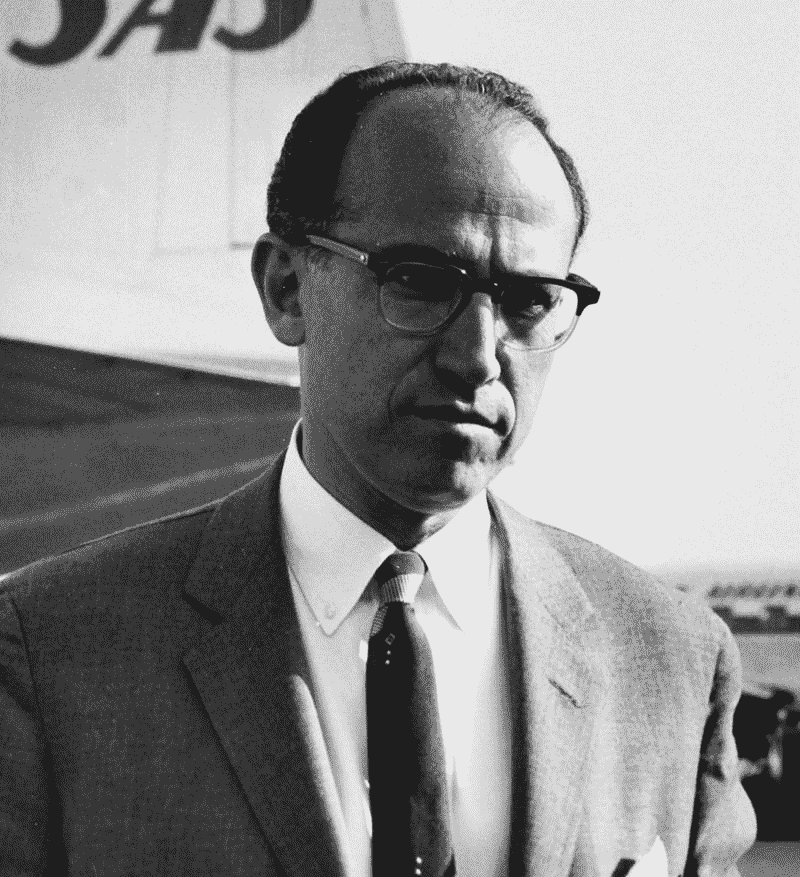
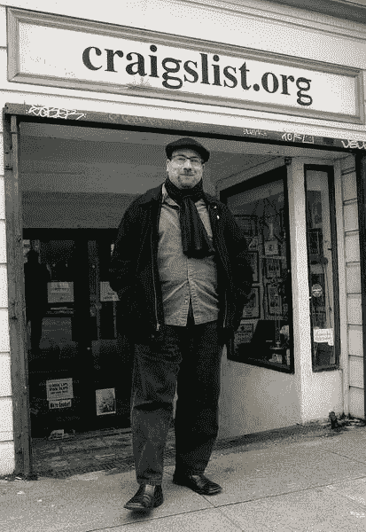
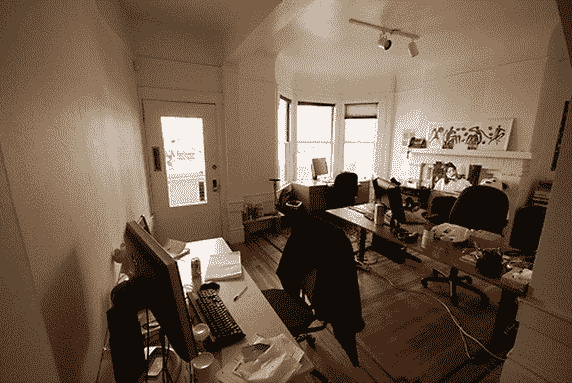
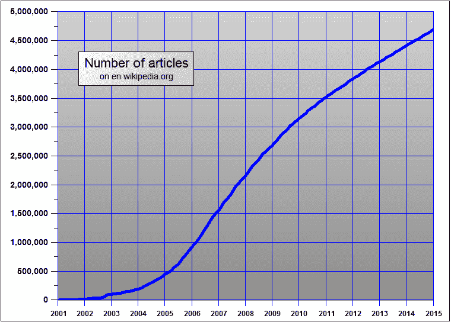
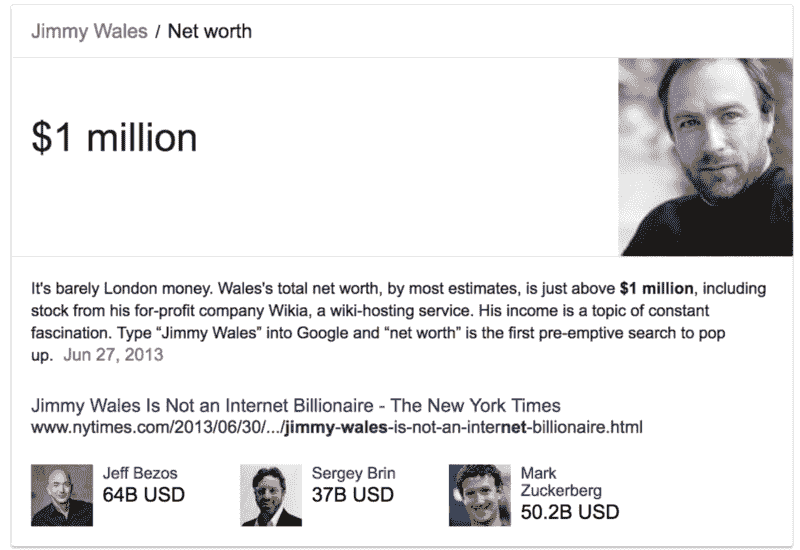

# 克雷格列表、维基百科和富足经济

> 原文：<https://www.freecodecamp.org/news/welcome-to-the-abundance-economy-there-are-free-lunches-all-over-the-place-b9d0a417fd1a/>

你以前听过。也许你已经说过了。“天下没有免费的午餐。”

“你不可能不劳而获。”

“总得有人付出代价。”

人们满怀信心地背诵这些谚语，仿佛在引用牛顿的运动定律。

但是历史已经表明:你经常可以不劳而获。

即使有人必须付钱，那个人也不一定是你，数目也不一定很大。

在某些情况下，收益远远超过成本，实际上，这是一顿免费的午餐。

### 我们是如何从地球上根除脊髓灰质炎的

20 世纪 50 年代初，美国正从有史以来最严重的脊髓灰质炎疫情中复苏。成千上万的儿童死于这种病毒，更多的儿童终身瘫痪。

没有人能幸免于这种可怕的疾病。就连美国总统富兰克林·罗斯福也在 39 岁时染上了这种病。他在轮椅上度过了余生。

医学研究人员乔纳斯·索尔克(Jonas Salk)在将研究重点转向脊髓灰质炎之前，主要研究流感病毒。

Jonas Salk in 1959

索尔克博士花了 7 年时间组建了一个研究团队，致力于开发脊髓灰质炎疫苗。

他进行了有史以来最广泛的实地测试，涉及历史学家比尔·奥尼尔所说的“20，000 名医生和公共卫生官员，64，000 名学校人员和 220，000 名志愿者。”

疫苗是成功的。因此，索尔克博士着手为地球上的每个人进行免疫接种。他通过放弃他的知识产权可能给他带来的任何经济利益，将脊髓灰质炎疫苗的边际成本压得尽可能低——仅是必要的原材料。

当被问到他的专利时，他说:“没有专利。你能给太阳申请专利吗？”

索尔克博士盯着一个巨大的问题，竭尽全力投入其中，没有任何个人利益的渴望。在这个过程中，他和他的同事们基本上消灭了有史以来最严重的疾病之一。

今天，每个人的生活都因为这一次大规模的免费午餐而变得更好。

> "对出色工作的奖励是做更多工作的机会。"-乔纳斯·索尔克博士

### 免费午餐很重要

在我介绍一些现代免费午餐的例子之前，让我给你们介绍一下我自己的背景，以及为什么免费午餐的概念对我如此重要。

我经营一个非盈利的开源社区，在那里你可以学习编码，通过为非盈利组织构建软件来练习，然后找一份开发人员的工作。到目前为止，成千上万的人已经获得了开发人员的工作。而且是免费的。

我对它的免费理念如此投入，以至于在名字中加入了“免费”一词。

免费既可以指自由言论中的自由，也可以指 T2 免费啤酒中的免费。就像“自由开源软件”(FOSS)中的“自由”一样，“自由代码营”(freeCodeCamp)中的“自由”是指这两者。

但是，每天我都会遇到持怀疑态度的人。他们告诉我他们不使用 freeCodeCamp，因为“这听起来好得难以置信。”

“不可能所有这些都是免费的，”他们说。“我去注册，把我的邮箱地址给你，然后我才发现我需要每月支付 20 美元，对吗？”或者:“你现在是免费的，但很快你就会像其他人一样，扔掉广告和付费墙。”

好吧，这话我已经公开说过一百遍了，我再公开说一遍: **freeCodeCamp 永远是免费的。**

我们在资本主义的边缘运作。边际成本趋近于零的边界，古典经济学的法则开始瓦解。一个叫做**丰裕经济**的地方。

我们并不孤单。

### lichess.org 的低开销工程

来见见蒂博·杜普莱西斯，lichess.org 的创始人——世界上第二大国际象棋网站。

Thibault Duplessis

截至一年前[，lichess 每天有 78，000 名独立访客，他们每天总共下 260，000 盘棋。](https://en.lichess.org/blog/VgwCfhwAAB8AbzkK/100000000-games-played)

蒂博没有员工。他甚至没有全职在 lichess 上工作。他仍在一家发展咨询公司工作。

Lichess 的主要竞争对手，[Chess.com](http://chess.com/)，是一家私营巨头，每年从横幅广告和高级会员向上销售中赚取数百万美元，然后用这些钱[收购他们的竞争对手](https://gigaom.com/2009/12/22/419-chess-com-buys-rival-site-chesspark/)。

相比之下，Thibault 拥有开源的 lichess 的服务器代码。他承诺 lichess 将永远免费，并且永远不会显示广告。

但是等等——他怎么能这样做？

这是因为现代 web 应用程序的性质，以及它们近乎零边际成本的经济性。

尽管 lichess 很复杂，运营规模也很大，但 Thibault 的服务器成本仅为每月 416 美元。

这笔费用由他的感恩用户的商品和捐款来支付，这些用户越来越多地包括一些世界上最好的棋手。

### Craigslist 如何通过只向 0.1%的用户收费来弥补成本

记得分类广告吗？

Classified ads in a newspaper

人们过去常常为出现在报纸封底、夹在其他广告中间的小广告支付每字一美元。

然后，20 年前，Craigslist 彻底颠覆了分类广告。他们免费提供在线广告目录。

它是可搜索的。你可以使用尽可能多的单词，包括图片。你可以在附近任意多的城市任意多次转发你的广告。

但是如果在 Craigslist 上投放广告是免费的，那么 Craigslist 是如何赚钱的呢？

好吧，如果你问一个随机的 Craigslist 用户，他们可能不会告诉你。大多数人只是认为 Craigslist 是一个非营利组织，由捐款或其他东西支持。

但是 Craigslist 去年赚了 4 亿美元。

他们通过在几个主要城市的几个主要类别中收费来做到这一点。如果你想列出纽约市的一套公寓，或者旧金山的一份工作，你必须向 Craigslist 支付一小笔费用。

这意味着只有不到千分之一的 Craigslist 用户会为此付费。纽约市的房地产经纪人和旧金山的招聘人员正在为其他人的免费午餐买单。

Craig Newmark in front of the original Craigslist HQ in San Francisco

Craigslist 没有投资者。它让事情变得简单。它有一个大约 40 人的小团队。

克雷格仍在克雷格列表网站工作。他把首席执行官的职位交给了他的老朋友，这样他就可以专注于他热爱的事情:为全球 Craigslist 用户提供支持。

像这篇文章中提到的其他人一样，他似乎不在乎钱。据我所知，他大部分的钱都是通过他的慈善机构 CraigConnects 捐赠的。他利用闲暇时间倡导他关心的事业，比如支持退伍军人，帮助更多女性在科技领域开始职业生涯。

Craigslist’s office up until a few years ago: Craig’s house.

### 维基百科的众包贡献

在维基百科出现之前，最受欢迎的百科全书是由付费专家编写的，并被印刷成大量书籍。大英百科全书太贵了，他们甚至不会在电视广告中告诉你它的价格。(花了 1400 美元。)

吉米·多纳尔·威尔士——维基百科富有远见的领导人——有一个更好的主意。他利用互联网的力量和志愿者贡献者的智慧。他让它自由了。

维基百科上志愿者贡献的文章数量激增。它的内容范围很快超过了传统的百科全书。

The number of Wikipedia articles has grown steadily since the site's founding.

维基百科的编辑可以立即发布文章的更新，而不是等待新的实体版本上市。维基百科是如此的及时更新，以至于许多人开始用它来获取时事新闻。

传统的百科全书很快被挤到了角落里。他们付钱给专业作家和编辑来创作他们的内容。毫无疑问，这比维基百科志愿者驱动的免费信息更准确。

但是在 2005 年，一家主要的学术期刊发表了一份分析报告，比较了维基百科和大英百科全书的事实准确性。它发现:

> 《自然》杂志的一项调查发现，吉米·多纳尔·威尔士的维基百科在科学词条的准确性方面接近大英百科全书。”—[从大自然的分析中抽象出](http://www.nature.com/nature/journal/v438/n7070/full/438900a.html)

在最后的努力中，大英百科全书进行了反击，但《自然》杂志支持它的发现。

这是对百科全书行业的最后一击，该行业几十年来一直通过挨家挨户向有罪的父母出售大量书籍而繁荣发展。

十年后，维基百科现在是世界上访问量第六大的网站。并通过每年来自心怀感激的顾客的 7000 多万美元的捐款来支付其运营成本。

但是尽管吉米取得了这么多成就，人们似乎更关注他的钱。或者说，他的缺乏。

以下是你在谷歌上输入“吉米·多纳尔·威尔士净资产”的结果:

在这个结果下面，谷歌向你展示了创办其他大型网站的人的照片。他们每个人的净资产都比吉米微不足道的 100 万美元高出五个数量级。

人们很难接受有人会着手建立像维基百科这样重要的东西，却懒得从中赚钱。

有人甚至在 Quora 上直截了当地问:“吉米·多纳尔·威尔士有钱吗？”

吉米回应道:

> “以任何合理的标准来衡量，是的，我当然富有。地球上将近一半的人每天生活费不到 2 美元。我花在手机账单上的钱比这还多。”

### 生活中有比金钱更多的东西。

为什么人们如此关注金钱和名人的净资产？因为他们在以一种**稀缺心态**运营。

他们如此专注于没有足够的风险，以至于看不到真正的风险:错过了获得更多的潜力。

传统的大规模创造价值的稀缺思维方式是这样的:

1.  想出一个你能为很多人解决的问题

2a。如果人们愿意购买你的产品，就卖给他们，然后将利润再投资到发展你的业务上

2b。如果你的解决方案没有人愿意付钱，那就筹集一些风险资本来资助开发。一旦它足够大，通过其他方式赚钱——通常是通过销售广告。

但是还有一个选择。富足的心态。

这种方法忽略了对基本需求的担忧(最坏的情况是，我不得不在快餐店找份工作)，而是关注上升的潜力。

当你运用富足的心态时，你会从不同的角度看待问题。你试图寻找免费午餐的机会。

你大规模创造价值的方法看起来更像这样:

1.  想出一个你能为很多人解决的问题
2.  保持低成本，自己投资开发，并寻求捐赠，销售商品，或找到几个财力雄厚的用户，他们可以补贴其他人。

这就是我在这里讨论的所有这些组织的运作方式。这就是他们永远自由的方式。