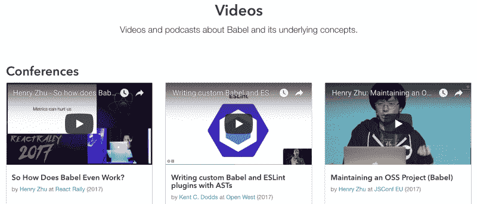
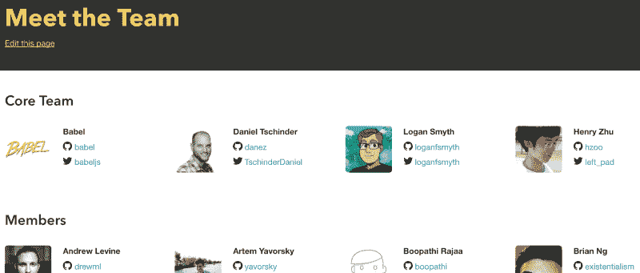

# 我们正在接近 7.0 巴别塔发布。这是我们做过的所有很酷的事情。

> 原文：<https://www.freecodecamp.org/news/were-nearing-the-7-0-babel-release-here-s-all-the-cool-stuff-we-ve-been-doing-8c1ade684039/>

作者亨利·朱

# 我们正在接近 7.0 巴别塔发布。这是我们一直在做的很酷的事情。

Photo by [“My Life Through A Lens”](https://unsplash.com/photos/bq31L0jQAjU?utm_source=unsplash&utm_medium=referral&utm_content=creditCopyText) on [Unsplash](https://unsplash.com/search/photos/change?utm_source=unsplash&utm_medium=referral&utm_content=creditCopyText)

> 6 个月后，实际上映[https://twitter.com/left_pad/status/1034204330352500736](https://twitter.com/left_pad/status/1034204330352500736)！

你好吗？！我是[亨利](http://twitter.com/left_pad)，[巴别塔](http://babeljs.io/)的维护者之一。

>编辑:我已经[离开了 Behance](https://www.henryzoo.com/blog/2018/02/15/leaving-behance.html) 并做了一个 [Patreon](https://www.patreon.com/henryzhu) 试图追求全职做开源的，请考虑捐赠(问你的公司)。

#### 巴别塔快速介绍

有些人喜欢把 Babel 看作是让你编写 ES6 代码的工具。更具体地说，是一个将 ES6 转换成 ES5 代码的 JavaScript 编译器。当它的名字是 6to5 的时候，这是非常合适的，但我认为巴别塔已经变得远远不止这些了。

现在让我们后退一点。首先，这是必要的，因为与服务器上的大多数语言(甚至 Node.js)不同，您可以运行的 JavaScript 版本取决于您的特定浏览器版本。所以，如果你的用户(你想保留的)还在使用 IE，那么你使用最新的浏览器也没关系。例如，如果你想写`class A {}`，那么你就没那么幸运了——你的一些用户会得到一个`SyntaxError`和一个白页。

所以这就是巴别塔被创造出来的原因。它允许你编写你想要的 JavaScript 版本，知道它能在你支持的所有(旧的)浏览器上正确运行。

但并不仅仅止于“ES6”(有些人喜欢说 ES2015)。Babel 当然扩展了它最初只编译 ES6 代码的目标，现在可以编译任何你想要的 ES20xx 版本(JavaScript 的最新版本)到 ES5。

#### 正在进行的过程

这个项目有趣的一点是，只要添加了新的 JavaScript 语法，Babel 就需要实现一个转换来转换它。

但是您可能会想，为什么我们还要向支持该语法的浏览器发送编译版本(更大的代码大小)？我们怎么知道每个浏览器支持什么语法呢？

嗯，我们制作了`[babel-preset-env](https://babeljs.io/docs/en/babel-preset-env)`来帮助解决这个问题，通过创建一个工具，让你指定你支持哪些浏览器。它将自动只转换那些浏览器本身不支持的东西。

除此之外，Babel(因为它在社区中的使用)在影响 JavaScript 语言本身的未来中占有一席之地！鉴于它是一个转换 JS 代码的工具，它也可以用于实现提交给 [TC39](http://2ality.com/2015/11/tc39-process.html) (Ecma 技术委员会 39，推动 JavaScript 向前成为标准的组织)的任何提议。

一个“提议”会经历一个完整的过程，从第 0 阶段到第 4 阶段。作为一种工具，Babel 正处于测试新想法的合适位置，并让开发人员在他们的应用程序中使用它，以便他们可以向委员会提供反馈。

这一点非常重要，原因如下:委员会希望确信他们所做的更改是社区所希望的(一致、直观、有效)。在浏览器中实现一个不确定的想法很慢(浏览器中的 C++与 Babel 中的 JavaScript)，成本很高，并且需要用户在浏览器中使用一个标志，而不是改变他们的 Babel 配置文件。

既然巴别塔如此无处不在，那么很有可能会出现真正的用法。这将使这个提议比没有经过开发人员团体的审查就被实施要好的多。

它不仅在生产中有用。我们的在线 [REPL](https://babeljs.io/repl) 对学习 JavaScript 本身的人很有用，并允许他们测试一些东西。

我认为 Babel 非常适合作为程序员的教育工具，这样他们可以继续学习 JavaScript 如何工作。通过对项目本身的贡献，他们将学习许多其他概念，如 ASTs、编译器、语言规范等等。

我真的对这个项目的未来感到兴奋，迫不及待地想看看这个团队能走向何方。请加入并帮助我们！

#### 我的故事

这些是我每天为这个项目工作感到兴奋的一些原因，尤其是作为一名维护者。大多数当前的维护者，包括我自己，并没有创建这个项目，而是在一年后加入的——想到我是从哪里开始的，仍然令人兴奋不已。

对我来说，我认识到了一种需求和一个有趣的项目。我慢慢地、持续地更多地参与其中，现在我已经能够让我的雇主 [Behance](https://www.behance.net/) 赞助我一半的时间在巴别塔上。

有时候“维护”只是意味着修复 bug，在我们的 Slack 或 [Twitter](https://twitter.com/babeljs/) 上回答问题，或者写一个 changelog(这真的取决于我们每个人)。但是最近，我减少了对 bug 修复和特性的关注。相反，我花了一些时间去思考更高层次的问题，比如:这个项目的未来是什么？相对于用户数量，我们如何发展我们的社区？就资金而言，我们如何维持这个项目？我们在整个 JavaScript 生态系统中处于什么位置(教育， [TC39](https://github.com/tc39/proposals) ，工具)？在帮助新人加入开源( [RGSoC](https://twitter.com/left_pad/status/959439119960215552) 和 [GSoC](https://summerofcode.withgoogle.com/) )的过程中，我们能发挥作用吗？

由于这些问题，我对这个版本最感兴趣的不一定是特性集中的细节(有很多:新提议的初始实现，如[管道操作符(a | > b)](https://github.com/babel/babel/tree/master/packages/babel-plugin-proposal-pipeline-operator) 、TS 团队帮助下的[新类型脚本预置](https://github.com/babel/babel/tree/master/packages/babel-preset-typescript)，以及. babelrc.js 文件)。

相反，我对所有这些特性所代表的东西感到兴奋:一年的努力工作试图不打破一切，平衡用户的期望(为什么构建如此缓慢/代码输出如此之大，为什么代码不够符合规范，为什么没有配置就无法工作，为什么没有 x 选项)，以及维持一个主要由志愿者组成的可靠团队。

我知道我们的行业非常关注“主要发布”，大肆宣传的功能和明星，但这只是一天褪色。我想建议我们继续思考如何持续推动生态系统健康发展。

这可能仅仅意味着思考维护者的精神和情感负担。这可能意味着考虑如何向希望参与的人提供指导、期望管理、工作/生活平衡建议和其他资源，而不仅仅是鼓励开发人员期待立即的免费帮助。

#### 潜入变更日志

好吧，我希望你喜欢这个长长的变更日志？。如果您有兴趣帮助我们，请让我们知道，我们很乐意与您详谈。

我们开始了一个新的[视频页面](https://babeljs.io/docs/community/videos/)，因为人们想了解更多关于巴别塔的工作方式，并做出贡献。该页面包含团队成员和社区成员关于巴别塔和相关概念的会议讨论视频。

我们还创建了一个新的[团队页面](https://babeljs.io/team)！我们将在未来更新这个页面，提供更多关于人们在做什么以及为什么参与的信息。对于这样一个大项目，有许多方法可以参与并提供帮助。

以下是一些亮点和快速事实:

*   巴贝尔 2017 年 9 月 28 日[年满 3 岁](https://babeljs.io/blog/2017/10/05/babel-turns-three)！
*   丹尼尔[将](https://twitter.com/left_pad/status/926096965565370369) `babel/babylon`和`babel/babel-preset-env`移到主巴别塔 monorepo，[巴别塔/巴别塔](https://github.com/babel/babel)。这包括所有 Git 历史、标签和问题。
*   我们收到了来自脸书开源的[$ 1k/月的捐赠](https://twitter.com/left_pad/status/923696620935421953)！
*   这是自开始以来我们得到的最高的月捐赠额(其次是 100 美元/月)。
*   与此同时，我们将使用我们的资金亲自会面，并派人参加 TC39 会议。这些会议每两个月在世界各地举行一次。
*   如果一家公司想具体赞助什么，我们可以创建单独的问题来跟踪。这在以前是很困难的，因为我们必须自掏腰包，或者在同一周内找到一个演讲的会议来帮助支付费用。

#### 你能提供什么帮助

如果你的公司想通过支持 JavaScript 开发的一个基本部分和它的未来来回馈(T1)，考虑捐赠给我们的[开放集体](https://opencollective.com/babel)。您也可以贡献开发人员的时间来帮助维护项目。

#### #1:帮助维护项目(开发人员工作时间)

> 工程师:SQL Server Enterprise 中有一个东西阻止了我们
> 公司:让我们下周与他们建立一个电话会议，正在进行讨论，以便在下个季度解决它
> 
> 工程师:babel 中有一个我们需要的东西，我可以花两天时间为它做公关吗
> 公司:哈哈，不行，这是他们的工作【https://t.co/icgaoJ0dTe】T4
> 
> — Shiya (@ShiyaLuo) [November 16, 2017](https://twitter.com/ShiyaLuo/status/931230821976907776?ref_src=twsrc%5Etfw)