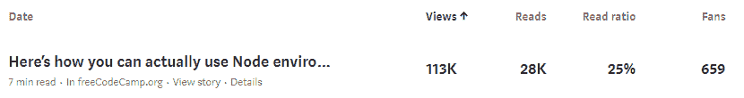
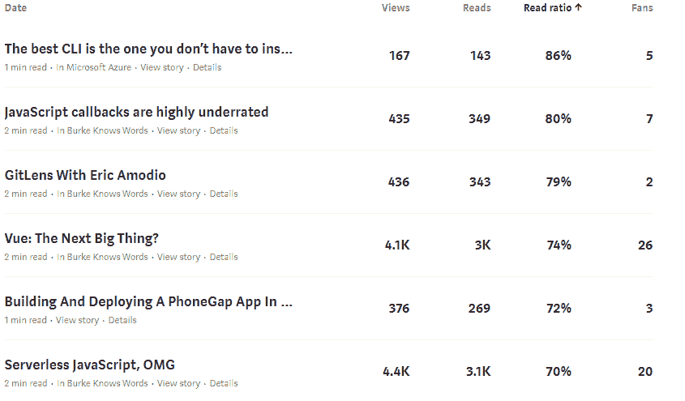
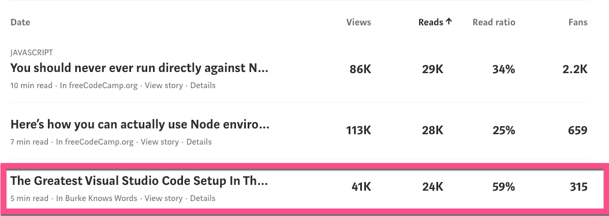
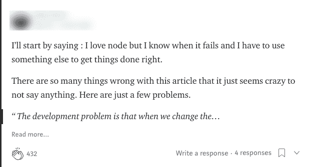
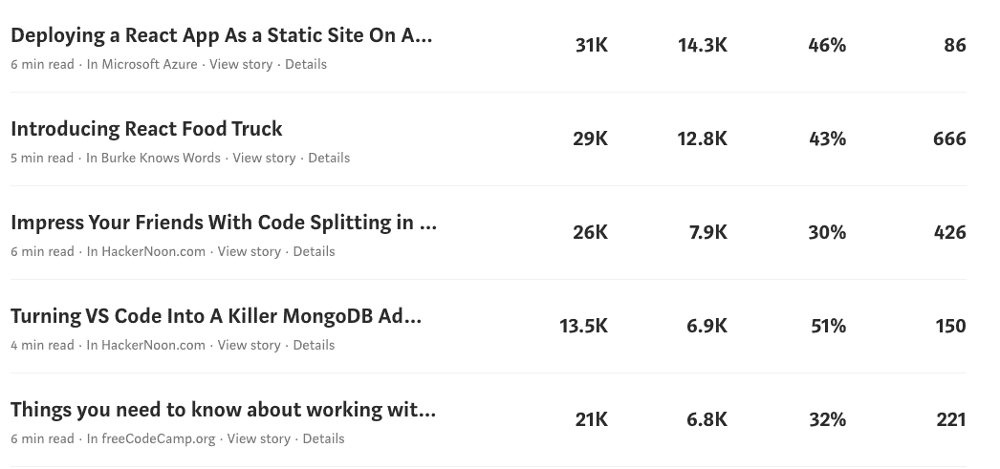
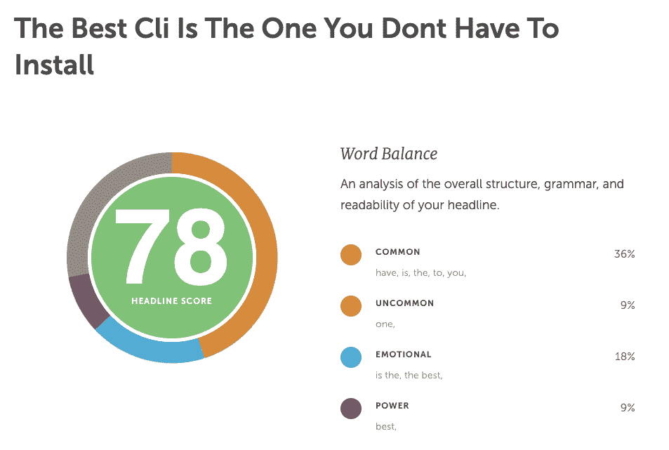
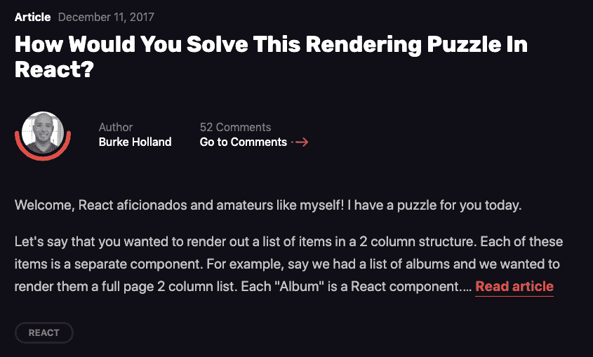

# 关于写好文章，500 多篇博文教会了我什么

> 原文：<https://www.freecodecamp.org/news/what-500-blog-posts-taught-me-about-writing-great-articles/>

我写过很多博文。准确的说是 500 英里以上。所有的都是技术性的。

其中大约两打实际上是好的。

剩下的只是一堆杂乱无章的语法错误、不起作用的代码片段，以及永无止境的“it's”和“its”的误用。为什么我做不到呢？！没那么复杂。

酪我不是来谈论我的失败的。这就是治疗的目的。我在这里说的是在一个粪便的文学领域里盛开的十几朵玫瑰。这些是你写最好的技术文章所需要的技巧。

### 为初学者写作

到目前为止，我在 Medium(按视图)上最受欢迎的文章是“下面是如何实际使用节点环境变量”。

当我写这篇文章时，我想知道我是否是活着的最后一个不完全理解环境变量的人。很明显我不是。由此得出的结论是**如果你认为某件事太简单而不能写，你也许应该写一下它**。

写技术文章时，高估读者是你最容易犯的错误。你不需要剖析一个编译器或者发明一个框架来谈论一些东西。Lea Verou 做了一整个关于 CSS 属性的演讲。一个。这是我见过的最好的演示之一。

[https://www.youtube.com/embed/b9HGzJIcfDE?feature=oembed](https://www.youtube.com/embed/b9HGzJIcfDE?feature=oembed)

选择简单的话题，然后深入其中。对学习如何修剪琴弦感兴趣的人远远多于对如何解决[用餐哲学家问题](https://en.wikipedia.org/wiki/Dining_philosophers_problem)的结构性论证感兴趣的人。

注意，我是根据浏览量来判断文章的受欢迎程度的。有人猜测这是否是衡量成功的好方法。毕竟，好的点击诱饵会给你带来浏览量。有些网站的整个商业模式都基于此，我们并不特别看重它们。

我们可以考虑的另一个衡量标准是“读取率”。上述文章的“阅读率”为 25%。访问这篇文章的人中有四分之一真的读过它。百分比越高越好。事实证明，提高这一比例最简单的方法就是写更短的帖子。看看...

这些是只有 2 到 3 段的一次性帖子。懒惰的写作。我只是把大便扔向空中，这样我就可以说我那周写了些东西。

我们似乎处在一种痴迷于这个目标的文化中。制作更短的内容！人家会看的！是的，他们会看的，但就像他们看路标一样。在互联网的 10 亿车道高速公路上飞驰，用连击填满他们的脸，几乎不保留他们看到的任何东西。

读取%不是一个好的目标。它鼓励每个人都去扔大便，什么上去了，就必须下来。

我认为，一个更好的衡量标准是“阅读”指标。有多少人真正读过这篇文章？现在我们不知道 Medium 是如何计算的，但是[他们证明](https://help.medium.com/hc/en-us/articles/215108608-Your-stats)这是“有多少观众阅读了整个故事”。根据这一标准，一个新的职位脱颖而出。

“您永远不应该在生产中直接运行节点。可能吧。”

这让我想到了撰写成功的技术文章的第二个要点...

### 质疑现状

在和一个朋友一起做演示的时候，他不经意地向我提到，你永远不应该在生产中直接运行 Node。我不知道。我以前从未听说过。所以我决定研究一下，看看他是否正确。事实证明，他是对的。但他也错了。答案就像生活中的一切一样，是“视情况而定”。

编程思想充斥着绝对性。永远不要使用三元语句。不要在同一个窗口中打开超链接。永远不要在周五下午 5 点进行生产。永远不要建立一个不能在移动设备上运行的网站。不要从数据库中“选择*”。永远不要强行推进 Github 回购。你永远都不应该相信这些事情的表面价值。

编程是黑白的。现实不是。当你听到有人发表绝对的言论时，这是写博客的好时机。你可能会发现绝对是绝对错误的。我曾经听说，你永远不应该把 JavaScript 放在 HTML 中。然后一个叫[乔丹](https://twitter.com/jordwalke?lang=en)的家伙说，“是的，但是你可以把 HTML 放在 JavaScript 里”，今天我们有了 [React](https://reactjs.org/) 。

摇起来。读者想要原创的观点，每个人都喜欢叛逆者。

绝对的悖论在于，尽管人们喜欢你质疑现有的观点，但他们也喜欢你提出自己的观点。

### 绝对地说

如果我们继续往下看最受欢迎的帖子，我们会看到“世界上最棒的 Visual Studio 代码设置”。

这篇文章的浏览量要低得多，因为它发表在我的个人出版物上。顺便说一下，不要尝试创建自己的博客或出版物。这就像试图创建自己的杂志或电视频道。你可以这样做，但是去读者已经在的地方会更容易。

还要注意，尽管这篇文章的浏览量远低于第二高的文章(41K 对 113K)，但它的 4K 阅读量却比第一低(24K 对 28K)。

这篇文章提出了一个奇怪的指控——我个人的 VS 代码设置是世界上最好的。这是一个非常主观的说法，甚至可能不太准确。但是这对于一篇博客文章来说是很棒的，因为它让读者想到，“哦，是的！？我会判断，伙计！”。

任何时候你做一个绝对的陈述，你都是在邀请人们来看看它是否经得起推敲。开发商真的是身不由己。看看事情是否经得起审查是我们的工作。

这些人中的许多人会不同意你的观点。没关系。事实上，这是健康的。让人喜欢的东西，也要让他们**不**喜欢的东西。会有人不喜欢我说的使用绝对数。他们会说你不应该使用绝对，这本身就是一个绝对的陈述。看到了吗？你赢不了，所以当至少有一半的读者留下这样的评论时，不要害怕...

感受燃烧。它获得了 432 次掌声——是迄今为止对那篇文章最多的评论。那很好。让那些人不同意或者不喜欢你的写作风格。有时你可以取悦一些人。

我在黑客新闻上看到的唯一一篇排名第一的文章使用了类似的策略...

一切？一切都毁了？！当然不是。每个人都知道 DC 在拍《潜水侠》的时候毁了一切。现在，看，你想反驳这种说法。明白这是怎么回事了吗？

我们可以收集到的前三篇帖子的另一件事是，它们都涵盖了非常流行的技术——节点和 VS 代码。这是一个持续的趋势。

### 写一些流行的技术

如果我继续浏览这个列表，接下来的几篇文章要么是关于 React，要么是关于 VS 代码。

写一些流行的技术会让你获得读者。这是一个显而易见的问题，但它值得重复:**写一些流行的技术会让你拥有读者**。写一个没人听说过的不知名的产品或技术会让人觉得你开了一个派对却没人来。我从来没遇到过这种事。两次。

对我来说，写任何“热门”的东西总是感觉像在六英尺的球门上扣篮。这太容易了，当你推倒你四岁孩子的费雪牌篮球玩具时，没有人会被打动。但事实是，谈论人们感兴趣的话题比谈论他们不感兴趣的话题要好。这不应该是一个惊天动地的发现。

诀窍是弄清楚如何使用这些东西来影响你在文章中真正想说的内容。

例如，我在微软从事 Azure 工作。如果我想写一篇关于在 Azure 上运行 Node 应用程序的最佳实践的文章，我可以这样做，然后把它叫做“在 Azure 上运行 Node 的最佳实践”。这样的文章有一个名字。它叫做“文档”。

相反，我写了一篇文章，题为“你永远不应该在生产中运行节点应用。可能吧。”这篇文章有益于所有的节点开发者，同时也传达了如何在 Azure 上最好地运行节点应用的想法。由于我不再局限于“Azure ”,我可以写所有的节点开发人员，你不必使用 Azure 来从内容中获益。

### 所有点击诱饵并不都是一样的

好的标题吸引人。他们必须这么做。我们每天消耗的信息量要求你说些什么来引起人们的注意。

不幸的是，人们通过优化“浏览”或“阅读百分比”指标滥用了这个概念；把屎放在标题后面只是为了吸引你的点击。

我们称之为“点击诱饵”。

Clickbait 不好。它很糟糕，因为标题是淫秽的，但内容是薄弱的。这是纯粹的欺骗，我们对此深恶痛绝。没有人喜欢被欺骗。由于人们滥用标题来获取点击，我们已经到了这样一个地步，任何引起你兴趣的标题都被认为是“点击诱饵”。但事实并非如此。

你的内容和它后面的标题一样好。如果标题不能让人们停下来注意，你的内容再好也没用，不是吗？只要你在内容中加入了内容，就不要害怕用强有力的标题吸引人们。在我想到的所有书名中，这里有一些是我最喜欢的...

*   乌斯毁了一切
*   [通过改用普通 JavaScript 节省 15%或更多的汽车保险费用](https://css-tricks.com/save-15-car-insurance-switching-plain-javascript/)
*   [如何使用 Vue 和 Webpack 将页面大小增加 1500%](https://css-tricks.com/how-to-increase-your-page-size-by-1500-with-webpack-and-vue/)
*   你不应该在生产中运行 Node.js。也许吧。
*   [最好的 CLI 是你不必安装的 CLI](https://www.infoq.com/articles/azure-cloud-shell/)

那么如何写出更好的标题呢？在 freeCodeCamp 风格指南的第一次迭代中，昆西推荐了[协同日程标题分析器](https://coschedule.com/headline-analyzer)工具。我已经使用这个网站很多很多次了。给标题一个“分数”有助于你写出更好的标题。

这个工具使用起来可能有点令人沮丧。它会告诉你，你需要更多的“常用”词汇或“情感”短语，但它不会告诉你那些东西是什么。这有点像练习，但我发现这个工具非常有用，因为它迫使我对一个标题进行几十次迭代，并且我总是以一个比我开始时更好的标题结束。

对于我的最后一个技巧，我没有数据。我没有图表给你看，也没有数据支持我。我的最后一个建议是从生活的艰难中得来的。

### 脆弱

心理学家罗伯特·格洛弗曾经说过，“人类会被彼此粗糙的边缘所吸引”。

你能为你的读者做的最吸引人的事情之一就是做你自己。如果你不明白什么，就说出来。如果一个概念令人困惑，指出来。如果你害怕写某事，因为你认为你可能做错了，那就写吧。你的诚实最终会成就一篇精彩的博文。

把你自己放出去。向人们展示你是如何解决问题的，并询问他们会怎么做。你会错的。一直都是。这就是生活。问题是，人们喜欢这样。

我为 CSS 技巧撰写的第一批文章中，有一篇是关于 React 中一个非常简单的问题，我需要动态呈现一些内容。我是新来的，所以我不知道其他人是怎么做的。

于是[我问人家](https://css-tricks.com/solve-rendering-puzzle-react/)。

这篇文章的评论比我写过的任何一篇文章都多。这篇文章不长。它没有提供任何启示。也暴露了我作为 React 开发者的幼稚。但更重要的是，**它与人**联系在一起。为什么？因为每个人都有自己不知道的事情，以为别人都已经知道了。他们只是在等待有人站出来说出来。一旦你这么做了，他们也会的。

是的，你会得到“每个人都知道这个”的评论。但那是假的。大家都不知道。毕竟你不知道。你脑海中的那个声音告诉你你是唯一？那是你的自我。简而言之，骄傲让你变得不真实，最终让你无法与读者交流。

### 有趣和无礼之间的细微差别

提醒一句:写有趣的内容和做一个混蛋是有区别的。从见解深刻到变得刻薄是很容易的。我应该知道。我已经做到了。

如果我说“OAuth 毁了一切”，我是在抨击创建这个规范的人。在你使用的每项技术的另一端，都有一种思考和人类的感觉。在 OAuth 的例子中，创作者自己已经做出了更糟糕的声明，所以我感到很舒服，我不是简单地在公共场合诽谤他的作品。

尽管如此，我还是冒了很大的风险。这是意料之中的。为了写出好的内容，你必须承担一定的风险，要么是因为你脆弱，要么是因为你质疑现状，要么是因为你只是实话实说。但是你不需要成为一个混蛋。这部分是可选的，互联网并不缺乏负面内容。

### 写

最重要的是写作。如果你什么都不写，这些建议都没用。对很多人来说，这是最难的部分。只要知道你做得越多，就越容易。有点像弹吉他。

我把这个灵感留给你。这是亚历山大·巴甫洛夫·米斯科。我猜他不是某天拿起吉他就这样弹的。这需要大量的练习。写作也不例外。如果你做得足够多，你可能会成为博客界的亚历山大·巴甫洛夫·米斯科。

[https://www.youtube.com/embed/EMxiuq_tMq0?feature=oembed](https://www.youtube.com/embed/EMxiuq_tMq0?feature=oembed)