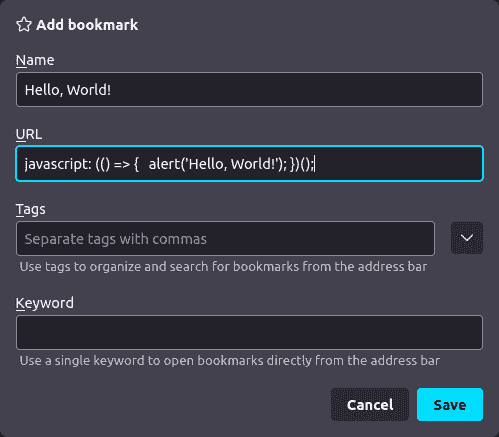
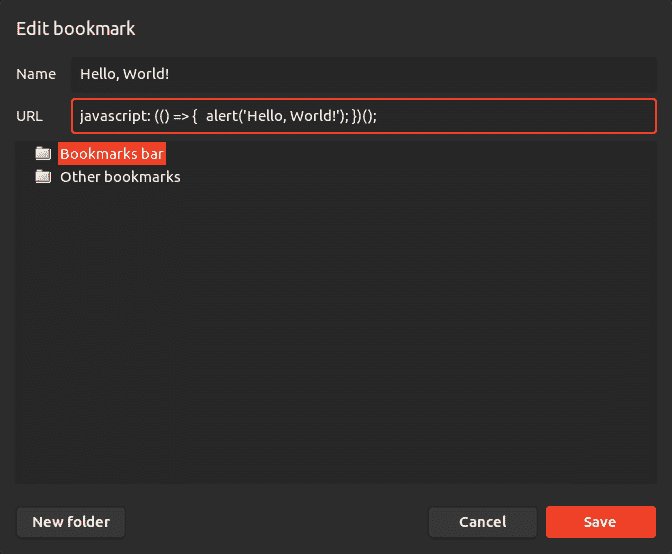
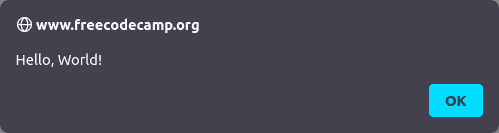
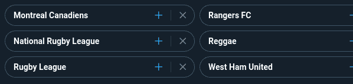

# 什么是书签？如何使用 JavaScript 在 Chromium 和 Firefox 中制作一个 Bookmarklet

> 原文：<https://www.freecodecamp.org/news/what-are-bookmarklets/>

[Bookmarklets](https://en.wikipedia.org/wiki/Bookmarklet) 是执行 JavaScript 而不是打开网页的浏览器书签。它们也被称为书签小程序、收藏夹或 JavaScript 书签。

Bookmarklets 在所有主流浏览器中都有，包括 Mozilla Firefox 和基于 Chrome 的浏览器，如 Chrome 或 Brave。

## 使用 JavaScript 编写脚本

学习如何编写脚本有很多好处，即自动化重复或乏味的任务可以节省大量时间。

如果你不是开发人员，学习编码的想法可能会令人生畏，但是脚本不需要软件工程知识或设计模式。目标不是制造可扩展的软件，而是自动化专门的或琐碎的任务。

不考虑职业，即使你以前从来没有写过代码，也要考虑你在浏览器里做什么。如果你觉得你所做的是重复的或者机器人化的，考虑一下把任务委派给一个真正的机器人的可能性。

## Bookmarklets 的用例

使用 bookmarklets，您可以操作当前页面，因为该函数将具有当前选项卡的上下文。这意味着您可以:

*   虚拟点击按钮
*   修改内容
*   使用页面内容打开新页面
*   从页面中移除元素

您也可以制作完全不利用上下文的书签，比如有条件地打开一个 URL，或者为一个新标签页生成 HTML。

你会在[示例书签](#example-bookmarklets)中找到我为本文制作的一些书签。它们只是为了演示，但是应该使功能和实现变得明显。

## 如何创建书签

创建 bookmarklet 与创建常规书签几乎是一样的。唯一的区别是您将在 URL 字段中编写 JavaScript，而不是 HTTP/HTTPS URL。

### 导航到书签菜单

#### Mozilla Firefox

无论是在你的书签栏，还是在书签侧边栏(`CTRL` + `B`)，你都可以右击，然后点击“添加书签...”：



#### 铬

您可以右键单击您的书签栏，然后单击“添加页面...”。或者，您可以转到书签管理器，然后右键单击并单击“添加新书签”:



## 如何写一个书签

在书签模式的 URL 字段中，按照以下格式编写一个 JavaScript 函数。

```
javascript: (() => {
  // Your code here!
})();
```

`javascript:`是 URL 的协议。这表明浏览器应该以 JavaScript 的形式执行书签。

`(() => { })`定义一个匿名函数(lambda)。你应该把你想执行的代码写在花括号之间。

`();`将执行您刚刚创建的匿名函数。

```
javascript: (() => {
  alert('Hello, World!');
})();
```

"Hello, World!" as a browser bookmarklet.



您也可以让它生成 HTML 并将其作为 HTML 文档打开:

```
javascript: (() => {
  return '<h1 style="color: white; background-color: black;">Hello, World!</h1>';
})();
```

### 书签的间距

大多数浏览器不允许在书签 URL 中使用多行输入字段，所以在编写 bookmarklets 时，通常必须严格使用花括号(`{`和`}`)和分号(`;`)。这在限定条件结构(`if` / `for` / `while`)的范围时尤其重要。

除此之外，间距并不重要。不要害怕在一行中包含大量代码，因为这是您所拥有的全部:

```
javascript: (() => {   const documentHTML = document.documentElement.outerHTML;   const matches = documentHTML.matchAll(/[\w.+=~-]+@[a-zA-Z0-9-]+(?:\.[a-zA-Z0-9-]+)*/g);   const flatMatches = Array.from(matches).map((item) => item[0]);   const uniqueMatches = Array.from(new Set(flatMatches));      if (uniqueMatches.length > 0) {     const result = uniqueMatches.join('\n');     alert(result);   } else {     alert('No emails found!');   } })();
```

Example of a JavaScript function written in one line.

如果你的脚本很复杂，在像 [Visual Studio Code](https://code.visualstudio.com/) 这样的代码编辑器中维护你的 bookmarklet 会更容易。当它准备好了，你可以复制并粘贴到你的浏览器上。

### 如何与网站互动

你用书签做的最常见的事情是操作你打开的网站或与之交互。

#### 全局文档对象

因为 bookmarklet 拥有您所在页面的上下文，所以您可以访问`[document](https://developer.mozilla.org/en-US/docs/Web/API/Document)`对象。

为我们的用例选择元素的理想函数是:

*   [`querySelector`](https://developer.mozilla.org/en-US/docs/Web/API/Document/querySelector) 通过 CSS 选择器选择单个元素。
*   [`querySelectorAll`](https://developer.mozilla.org/en-US/docs/Web/API/Document/querySelectorAll) 通过 CSS 选择器选择所有匹配的元素。
*   `[evaluate](https://developer.mozilla.org/en-US/docs/Web/API/Document/evaluate)`通过 XPath 选择所有匹配的元素。

还有其他类似于`[getElementById](https://developer.mozilla.org/en-US/docs/Web/API/Document/getElementById)`和`[getElementsByClassName](https://developer.mozilla.org/en-US/docs/Web/API/Document/getElementsByClassName)`的函数，但是我们想避免误报，所以我们总是使用多个元素属性进行严格的选择。

#### CSS 选择器和 XPath

如果您只是基于元素名称、id、类和其他属性来选择元素，那么使用 CSS 选择器将会简单而高效。

CSS 选择器用于选择 HTML 文档中的元素来应用样式。如果你熟悉 web 开发或 CSS，那么你已经知道如何使用 CSS 选择器。(更多信息: [MDN](https://developer.mozilla.org/en-US/docs/Web/CSS/CSS_Selectors) ， [freeCodeCamp](https://www.freecodecamp.org/news/css-selectors-cheat-sheet/) )

如果还需要匹配元素的文本内容，那么就必须使用 XPath。

XPath 用于遍历 XML 文档，它提供 CSS 选择器的所有功能以及更多功能，包括比较元素的内容或使用正则表达式进行匹配。(更多信息: [MDN](https://developer.mozilla.org/en-US/docs/Web/XPath) ，[维基百科](https://en.wikipedia.org/wiki/XPath))

#### 如何从网页中选择元素

bookmarklets 最常见的用途之一是操作网页。要与页面交互、操作或删除页面中的元素，您必须首先选择元素。

1.  首先通过按`F12`或`CTRL` + `SHIFT` + `I`打开浏览器开发工具。
2.  点击[检查器](https://developer.mozilla.org/en-US/docs/Tools/Page_Inspector) / [元素](https://developer.chrome.com/docs/devtools/dom/)标签，显示您打开的页面的完整 HTML 文档。
3.  使用元素选择器工具(`CTRL` + `SHIFT` + `C`)点击你想要交互的元素。文档查看器将滚动到您在 HTML 文档中单击的元素。您将看到元素 ID、类和属性。
4.  检查你是否在正确的元素上。元素可以嵌套在 HTML 中更容易手动导航到的位置。例如，你可能点击了一个`svg`元素，但实际上需要它所在的`button`或`div`。
5.  定义一个 CSS 选择器或 XPath 来匹配您想要的一切，您可能希望使它比必要的更严格，以避免潜在的误报。

例如，假设我想拒绝 Twitter 上的所有话题建议，因为它们很烦人。下面是一个可点击的元素来消除一个话题的样子。



Twitter topic suggestions, with an X button to mark it as "Not interested".

```
<div aria-label="Dismiss" role="button" tabindex="0" class="...">
  <!-- The parent div element has the click listener. -->
  <div class="...">
    <svg viewBox="0 0 24 24" aria-hidden="true" class="...">
      <!-- The actual X icon. -->
    </svg>
  </div>
</div>
```

合适的选择器是`div[aria-label=Dismiss][role=button]`。

我们需要从全局文档对象的[中使用`querySelectorAll`函数，然后调用](#the-global-document-object)`[click](https://developer.mozilla.org/en-US/docs/Web/API/HTMLElement/click)`方法来模拟一次点击。

可以实现一个 bookmarklet 来选择每个解散按钮，并以 250 毫秒的时间间隔触发所有按钮的点击事件。

```
javascript: (() => {
  const selector = 'div[aria-label=Dismiss][role=button]';
  const topics = document.querySelectorAll(selector);

  for (let i = 0; i < topics.length; i++) {
    let topic = topics[i];
    setTimeout(() => topic.click(), i * 250);
  }
})();
```

Mark all suggested topics on Twitter as "Not interested".

## 如何重新发布书签

为了“安装”一个 bookmarklet，用户在他们的浏览器上创建一个书签，并将代码复制并粘贴到其中。

这可能不太方便，所以在共享时链接书签是很常见的。这就像把它放入链接锚的`href`属性一样简单。

```
<a href="javascript: (() => {   alert('Hello, World!'); })();">
  Hello, World!
</a>
```

现在用户可以右击并“书签链接”，或者将其拖动到书签栏以便于访问。

单击网页上的链接将立即执行脚本。如果用户不小心点击了你的网站，确保它不会妨碍他们想要实现的目标。

例如，下面的链接将显示一个带有“ [Hello，World！](javascript: (() => {   alert('Hello, World!'); })();)”。

### 绕过用户内容和内容安全策略

如果您运行的服务允许用户生成的内容包含自定义 HTML，那么净化链接锚(`a`)是非常重要的。

bookmarklet 像开发者工具控制台中的代码一样执行，并绕过配置的[内容安全策略](https://developer.mozilla.org/en-US/docs/Web/HTTP/CSP) (CSP)。

“你好，世界！”link 可以轻松地将数据发送到另一台服务器，包括表单域的输入或 cookies。

作为服务提供商，重要的是要警惕用户可能利用这一点在您的平台上共享恶意代码。如果他们的链接锚运行在你的域名下的页面上，它可以访问页面上的敏感信息和`[document.cookies](https://developer.mozilla.org/en-US/docs/web/api/document/cookie)`。

您可以在沙盒环境中亲自尝试:

```
<a href="javascript: (() => {   alert(document.cookie); })();">
  EvilScript
</a>
```

### 仅运行您信任的代码

作为用户，需要注意的是，任何代码都可能是恶意的，只有在至少满足以下条件之一的情况下，才可以点击或添加书签:

*   它来自一个可靠的来源。
*   您已经了解了 JavaScript，并且回顾了它的作用。
*   你信任的人懂 JavaScript，他们帮你复习了。

## 隐私和安全

书签可以很方便，但是我们也有[网络扩展](https://en.wikipedia.org/wiki/Browser_extension)和[用户脚本](https://en.wikipedia.org/wiki/Userscript)。他们有什么不同？

Web 扩展非常用户友好和灵活。Bookmarklets 不能阻止网络请求，不能在页面改变时更新内容，也不能管理标签。

然而，使用 bookmarklets 比使用其他任何东西都有一些好处，也就是为了隐私和安全。

修改所有网页上字体的扩展必须获得访问所有网页上所有数据的权限。在 Firefox 和 Chrome 上，这包括所有的输入和密码字段。(更多信息: [Mozilla](https://support.mozilla.org/kb/permission-request-messages-firefox-extensions#w_access-your-data-for-all-websites) ，[谷歌](https://developer.chrome.com/docs/extensions/mv3/permission_warnings/#permissions_with_warnings))

相比之下，bookmarklet 只能在它执行的那一刻访问页面，并且只能在用户手动触发时访问。

这降低了恶意软件的风险，恶意员工无法推送恶意更新，数据也不会悄无声息地发送到其他服务器。

Chrome 网上商店之前有几个恶意扩展，不得不被移除。其中一些在被移除之前已经安装了数百万次。([更多信息](https://en.wikipedia.org/wiki/Chrome_Web_Store#Malware))

## 示例书签

这里有一个 bookmarklet 想法的列表，以及实现它的代码。您可以将它们复制并粘贴到新的书签中进行尝试。

```
javascript: (() => {
  const documentHTML = document.documentElement.outerHTML;
  const matches = documentHTML.matchAll(/[\w.+=~-]+@[a-zA-Z0-9-]+(?:\.[a-zA-Z0-9-]+)*/g);
  const flatMatches = Array.from(matches).map((item) => item[0]);
  const uniqueMatches = Array.from(new Set(flatMatches));

  if (uniqueMatches.length > 0) {
    const result = uniqueMatches.join('\n');
    alert(result);
  } else {
    alert('No emails found!');
  }
})();
```

Collect all email addresses on the current page, and display them in an alert.

```
javascript: (() => {
  const xpath = "//a [contains(., 'Jobs') or contains(., 'Careers') or contains(., 'Hiring')]";
  const elements = document.evaluate(xpath, document);
  const element = elements.iterateNext();

  if (element) {
    element.click();
  } else {
    alert('No links for jobs found!');
  }
})();
```

Find a "Jobs", "Careers" or "Hiring" link in the page, and click it.

```
javascript: (() => {
  const allElements = document.querySelectorAll('*');

  for (let element of allElements) {
    element.style.fontFamily = 'Comic Sans MS';
  }
})();
```

Set the font of all text on the current page to "Comic Sans MS".

```
javascript: (() => {
  const destination = "https://www.freecodecamp.org/";
  const alternate = "https://tenor.com/Y6jj.gif";

  const date = new Date();
  const hours = date.getHours();

  if (hours < 3 || hours >= 6) {
    window.open(destination);
  } else {
    window.open(alternate);
  }
})();
```

Open freeCodeCamp, but open a GIF instead if it's between 03:00 and 06:00.

感谢您的阅读！现在开始创建你自己的书签。