# 什么是环境变量，我如何在 Gatsby 和 Netlify 中使用它们？

> 原文：<https://www.freecodecamp.org/news/what-are-environment-variables-and-how-can-i-use-them-with-gatsby-and-netlify/>

当开始将第三方服务集成到您的应用程序或网站中时，您会发现拥有不同的环境非常有用，例如开发和生产环境。

我们如何配置它，这样我们就不必直接编辑我们的代码来改变我们的环境？

*   什么是环境变量？
*   环境变量如何发挥作用？
*   我如何保护这些文件的安全？
*   [盖茨比和环境变量](#gatsby-and-environment-variables)
*   [网络寿命和环境变量](#netlify-and-environment-variables)
*   [第一步:创建一个“你好，世界”网站](#step-1-creating-a-hello-world-website)
*   [第二步:用 Gatsby 创建一个本地环境变量](#step-2-creating-a-local-environment-variable-with-gatsby)
*   [第三步:将网站部署到网络上](#step-3-deploying-the-website-to-netlify)
*   在 Netlify 中哪里可以添加或更新更多的变量？

[https://www.youtube.com/embed/oq_RPOI0xsU?feature=oembed](https://www.youtube.com/embed/oq_RPOI0xsU?feature=oembed)

## 什么是环境变量？

环境变量是预先确定的值，通常用于提供从应用程序外部配置代码中的值的能力。

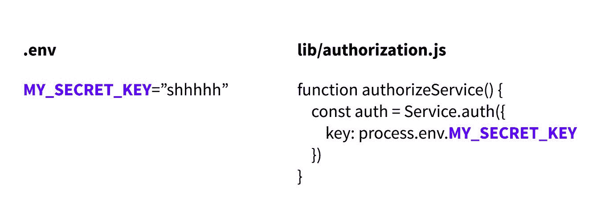

MY_SECRET_KEY environment variable used for authorization

当在本地开发时，或者有时甚至在部署管道中开发时，您经常会发现这些变量存储在一个文件中，该文件以某种形式的`.env`命名。

## 环境变量如何有用？

环境变量最常见的用例可能是能够为不同的环境设置不同的配置选项。通常，在开发第三方服务时，您希望有一个开发版本或沙箱来进行测试请求，这样就不会影响实际的生产数据。

环境变量很有用，因为它们允许您通过更改 API 键、端点或服务用来区分环境的任何东西来更改您的环境使用哪个第三方服务环境。

您部署的代码应该是可预测的，因此不必更改任何代码，只需更改代码外部的配置，就可以保持这种可预测性。

## 我如何保证这些文件的安全？

这可能是这里最重要的一点——您需要确保小心处理这些文件，而不是将它们签入 git 存储库。通过无意中将这些密钥上传到公共位置而暴露它们，因特网可以容易地找到这些密钥并滥用它们来为自己谋利。

例如， [AWS](https://aws.amazon.com/) 密钥是一个有价值的资源。人们运行机器人的唯一目的是试图扫描 Github 寻找密钥。如果有人发现了 AWS 密钥，他们可以使用该密钥访问资源，例如以您的费用运行比特币操作。这不是为了吓唬你，而是为了提醒你避免你的钥匙被泄露。

那么，我们如何保证这些信息的安全呢？最简单的方法是将保存这些密钥的环境文件添加到您的`.gitignore`文件中。

为此，只需打开现有的`.gitignore`文件或在存储库的根目录下创建一个新文件，并将文件名添加为新的一行:

```
# Inside .gitignore
.env 
```

如果你想变得更高级，并确保这种情况永远不会发生在存储库中，你可以查看一些工具，如 AWS 实验室的 [git-secrets](https://github.com/awslabs/git-secrets) 或 [GitLeaks](https://github.com/zricethezav/gitleaks) ，它们甚至有一个 [Github 动作](https://github.com/marketplace/actions/gitleaks)，以便于与 Github 集成。

## 盖茨比与环境变量

[默认情况下，Gatsby](https://www.gatsbyjs.org/) 使两个文件可用，作为其[环境变量工作流](https://www.gatsbyjs.org/docs/environment-variables/)的一部分，该工作流使这些值在客户端可用:`.env.development`和`.env.production`。这些与`gatsby develop`和`gatsby build`脚本相关联，用于开发或构建您的站点。

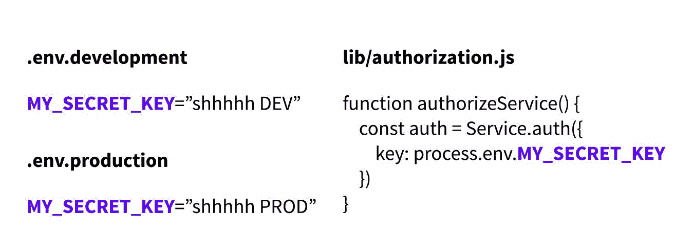

MY_SECRET_KEY environment variable for development and production

为了在 Gatsby 开发和构建过程中使用这些文件，Gatsby 要求您给这些变量加上前缀`GATSBY_`。如果您想让它们在操作系统进程级别可用，这也是可行的。

尽管如果你有更高级的需求或者不想使用`GATSBY_`前缀，你可以整合 [dotenv](https://github.com/motdotla/dotenv) ，但你最少阻力的路径可能是在《盖茨比》中工作时遵循盖茨比的方式。

## 网络寿命和环境变量

[Netlify](https://www.netlify.com/) 提供了添加环境变量的能力，作为其**构建&部署**设置的一部分，这是构建过程的一部分。

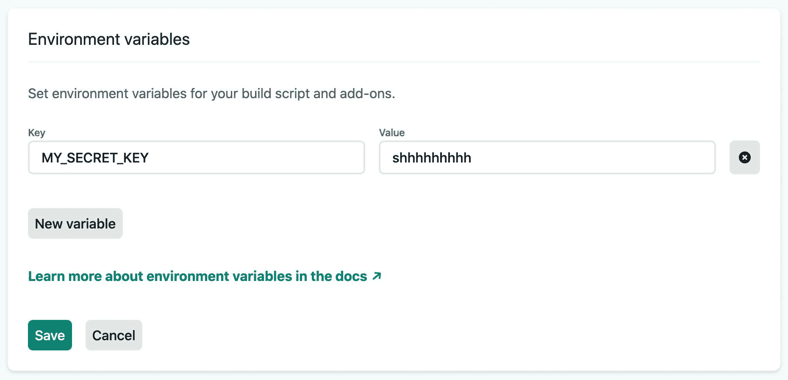

Adding an environment variable in Netlify

幸运的是，Netlify 使得向构建过程中添加任何您想要的环境变量变得很容易！要添加一个，您可以简单地导航到项目的**构建&部署**设置页面的**环境**部分，并在**环境变量下添加一个变量。**

稍后我们将带您完成这一过程。

## 步骤 1:创建一个“你好，世界”网站

在我们的演练中，我们将设置一个非常基本的 Gatsby 网站示例，目的只是为了测试这一点。

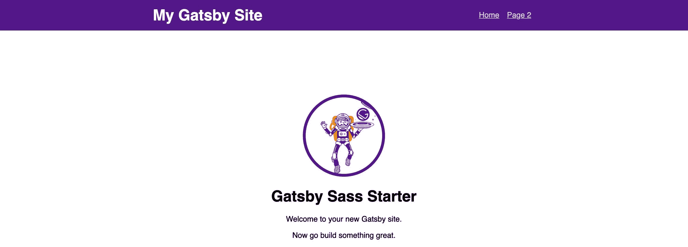

New website with Gatsby Sass Starter

虽然这并不是环境变量的一个常见用例，通常您会将它们用于 API 键和服务配置之类的东西，但这将让您对它的基本工作原理有一个很好的了解。

我们将使用我创建的这个 [Gatsby Sass Starter](https://github.com/colbyfayock/gatsby-starter-sass) ，它将为我们提供一个起点，并根据它的运行位置添加“Hello，[Environment]”。

首先，让我们使用 [Gatsby CLI](https://www.gatsbyjs.org/docs/gatsby-cli/) 创建我们的本地项目。导航到您要存储此项目的位置并运行:

```
gatsby new my-env-project https://github.com/colbyfayock/gatsby-starter-sass 
```

您可以将`my-env-project`更改到您想要创建这个项目的任何目录，但是一旦您运行这个命令，您现在将在这个新目录中有一个项目。

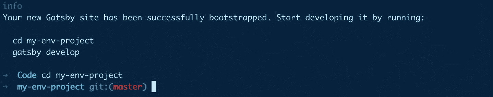

New Gatsby project in the terminal

首先，一旦进入该目录，运行`yarn develop`在本地进行更改，或者运行`yarn build`编译您的新站点。

一旦你准备好了，你会想把这个项目添加到 Github。如果你不熟悉如何做到这一点，你可以在这里学习如何添加一个现有的项目到 Github。

## 步骤 2:用 Gatsby 创建一个本地环境变量

我们的下一步是创建一个本地环境，并添加一个变化，让我们看到它的工作。

首先，让我们在项目的根目录下创建一个名为`.env.development`的新文件。它可能会问你是否真的想使用`.`前缀，确保你说是！

在该文件中，让我们添加:

```
# Inside .env.development
GATSBY_MY_ENVIRONMENT="Development" 
```

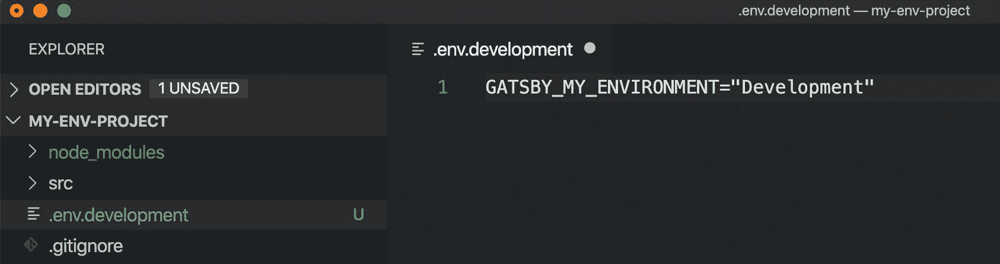

Creating an .env.development file

接下来，为了确保我们不会忘记这样做，让我们也将这个`.env.development`文件添加到我们的`.gitignore`中，这样我们就不会意外地将它提交到我们的 git 历史中。如果你还没有一个`.gitignore`文件，确保在你的项目的根目录下创建它。

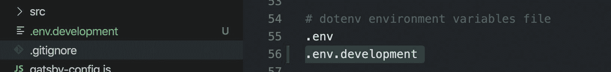

Adding .env.development to your .gitignore

最后，为了检查这是否有效，让我们打开`pages/index.js`，用“Hello，world！”替换`<h1>`标签的内容变化:

```
<h1>Hello, {process.env.GATSBY_MY_ENVIRONMENT}</h1> 
```

如果我们保存更改并在浏览器中打开它，我们应该会看到“Hello，Development”！

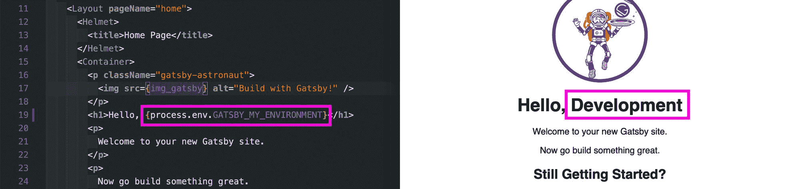

Using an environment variable for your Gatsby site

[跟随提交！](https://github.com/colbyfayock/my-env-project/commit/e3e7000fbfab4cecac7739458034e70958e52211)

## 步骤 3:将网站部署到 Netlify

所以我们用一个简单的环境变量创建了我们的网站。接下来，我们要将该站点实际部署到 Netlify。如果你还没有，我们需要[将我们的网站添加到 Github](https://help.github.com/en/github/importing-your-projects-to-github/adding-an-existing-project-to-github-using-the-command-line) 或另一个 Git 提供商。请确保在继续之前进行设置。

创建帐户并登录 Netlify 后，让我们单击主仪表板上的 Git 按钮的 **New site，按照说明将 Github 或其他 Git 提供者连接到 Netlify，然后找到新的存储库。**

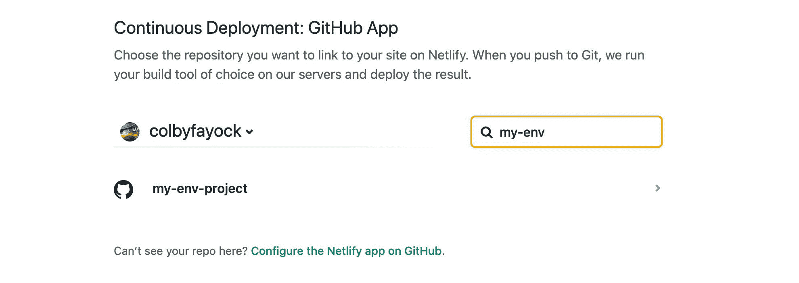

Adding a new Github repository to Netlify

一旦您选择了您的存储库，您将被要求配置您的构建过程。幸运的是，Netlify 可以检测到我们正在使用 Gatsby 站点，并为我们预先填充了这个站点。除非您添加了一些特殊的东西，否则保留基本配置，使用`gatsby build`来构建您的项目，使用`public/`进行输出。

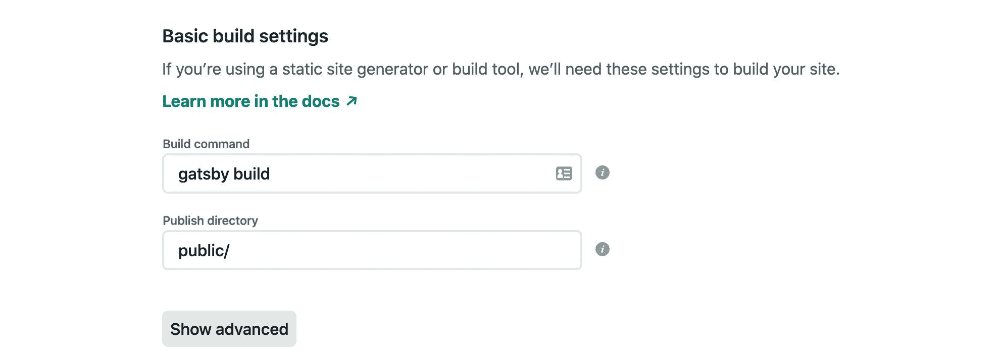

Configuring Netlify build settings

现在，在我们点击 **Deploy** 之前，我们要添加一个东西，那就是我们的环境变量！

在**部署地点**按钮的正上方有一个**高级**按钮。点击它，你会看到一个新的下拉菜单，还有一个额外的**新变量**按钮。

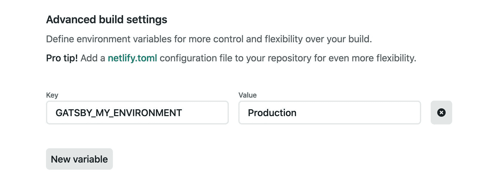

Configuring an environment variable in the Netlify setup

点击**新变量**按钮，添加我们的`GATSBY_MY_ENVIRONMENT`作为新变量，添加`Production`作为值。最后，点击**部署地点**！

从这里，你应该能够看到你的网站部署，一旦完成，你会看到你的新网站与“你好，生产”！

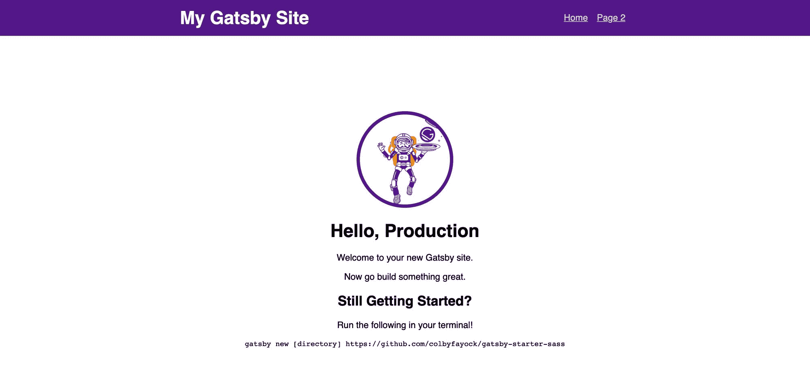

Deployed Gatsby site using Netlify environment variable

## 在 Netlify 中哪里可以添加或更新更多的变量？

在我们的例子中，我们在设置过程中只添加了一个变量。但是 Netlify 允许你添加或更新任何你喜欢的变量。

如果您想要更改该变量或添加更多，您可以导航到**构建&部署**设置的**环境**部分，在这里您可以编辑和添加**环境变量**部分中的任何其他变量。

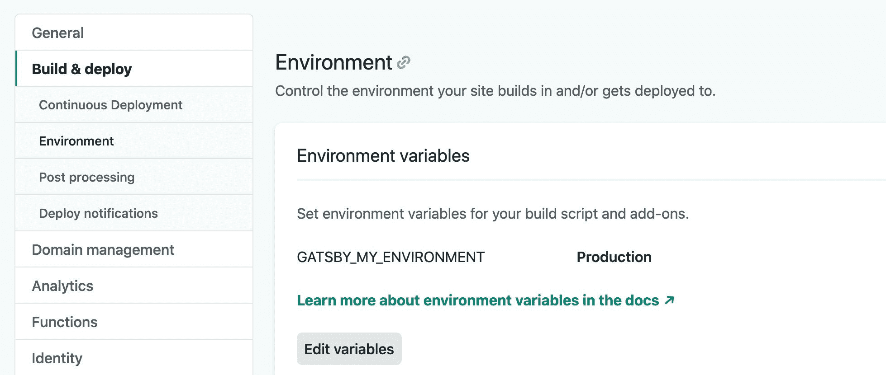

Environment variables settings in Netlify

## 想了解更多信息吗？

这里还有一些其他的东西可以帮助你开始学习开发基础知识！

*   盖茨比是什么，为什么是时候登上炒作列车了？
*   [什么是 JAMstack，我该如何开始？](https://www.colbyfayock.com/2020/02/what-is-the-jamstack-and-how-do-i-get-started)
*   [如何在 2020 年成为全栈 Web 开发者](https://www.colbyfayock.com/2020/02/how-to-become-a-full-stack-web-developer-in-2020)
*   [放下 Javascript -学习 HTML & CSS](https://www.colbyfayock.com/2019/08/put-down-the-javascript-learn-html-css)
*   [用良好的编码习惯为未来的成功做好准备](https://www.colbyfayock.com/2020/04/set-future-you-up-for-success-with-good-coding-habits)

[](https://twitter.com/colbyfayock)

*   [？在 Twitter 上关注我](https://twitter.com/colbyfayock)
*   [？️订阅我的 Youtube](https://youtube.com/colbyfayock)
*   [✉️注册我的简讯](https://www.colbyfayock.com/newsletter/)