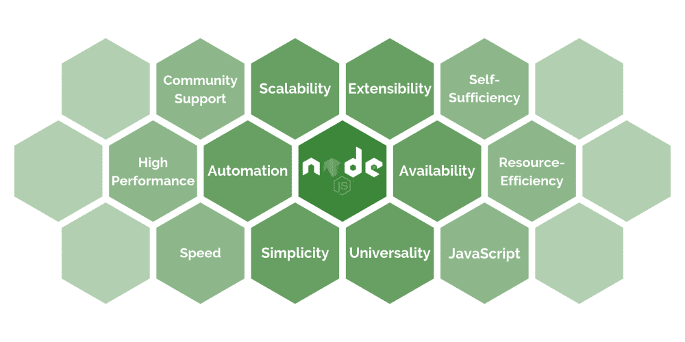

# Node.js 是一个很好的运行时环境——这就是为什么您应该使用它

> 原文：<https://www.freecodecamp.org/news/what-are-the-advantages-of-node-js/>

### 介绍可伸缩、可扩展、易于使用、自给自足且高效的运行时环境

Node.js 是一个跨平台的 JavaScript 运行时环境，它是免费和开源的。它是全栈的，因此可以用于开发应用程序的客户端和服务器端。

谁用 Node.js？对于开发在线游戏、即时通讯、社交媒体平台或视频会议工具的公司来说，Node.js 是一个受欢迎的技术堆栈选择。它非常适合需要不断更新应用数据的实时应用。

在我开始列举 Node.js 的优点之前，我需要解释一些事情。有一些术语需要澄清，这样我们才能达成共识。如果你知道这些概念，请随意向下滚动。

**Google 的 V8 引擎**就是 Node.js 实现用的引擎。最初，它是由谷歌开发并为谷歌服务的。V8 是用 C++编写的，目的是将 JS 函数编译成机器代码。谷歌 Chrome 使用的是同样的引擎。它以令人印象深刻的高速和不断改进的性能而闻名。

**基于事件的模型**代表一旦事件发生就检测并分别处理它们的过程。您可以使用承诺、异步/等待和回调来处理事件。例如，这个片段展示了使用 Promise 事件模型处理 csv 文件的编写。

```
const createCsvWriter = require('csv-writer').createObjectCsvWriter;
const path = ‘logs.csv”;
const header = [ 
	{
		id: 'id',
		 title: 'id’
	}, 
	{
		id: 'message', 
		title: 'message'
	}, 
	{
		id: 'timestamp',
		title: 'timestamp'
	}
 ];
const data = [
	{ 'id': 0, 'message': 'message1', 'timestamp': 'localtime1' },
	 { 'id': 1, 'message': 'message2', 'timestamp': 'localtime2'  }, 
	{ 'id': 2, 'message': 'message3', 'timestamp': 'localtime3'  }
];
const csvWriter = createCsvWriter({ path, header }); 
csvWriter .writeRecords(data) .then(
	()=> console.log('The CSV file was written successfully!')
) .catch(
	err => console.error("Error: ", err)
);
```

**非阻塞输入/输出请求处理**是 Node.js 处理请求的方式。通常，代码是顺序执行的。在前一个请求完成之前，无法处理该请求。在非阻塞模型中，请求不必排队等候。这样，Node.js 中的单线程是最有效的，请求处理是并发的，并且响应时间很短。

[**npm**](https://www.npmjs.com/) 是 Node.js 包管理器，是各种 js 工具的开放市场。它是世界上最大的软件注册中心。目前，它拥有超过 836，000 个图书馆。

那么，为什么要开发 Node.js 呢？我们来看看 Node.js 有什么好处。



## Java Script 语言

Node.js 是基于 JavaScript 的。JavaScript 是 IT 界最流行和最简单的编码语言之一。对于刚入门的开发者来说很容易学会。即使没有 JavaScript 知识但有一些基本技术背景的人也能阅读和理解代码。

不仅如此，JavaScript 人才库很大，所以作为一个企业主，你有充分的自由来选择合作团队。

## 可量测性

Node.js 应用程序在水平方向和垂直方向上都很容易扩展。横向来看，新节点很容易添加到现有系统中。纵向而言，可以很容易地向现有节点添加额外的资源。

当使用 Node.js 开发应用程序时，您不必创建一个大型的整体核心。相反，您可以开发一组模块和微服务，每个模块和微服务都在自己的进程中运行。所有这些小服务都通过轻量级机制进行通信，组成了您的应用程序。添加额外的微服务非常简单。这样，开发过程变得更加灵活。

## 展开性

Node.js 的其他优势之一是有机会将其与各种有用的工具集成在一起。 Node.js 可以轻松定制和扩展。

它可以用内置的 API 进行扩展，用于开发 HTTP 或 DNS 服务器。为了方便用老版本的 Node 或者浏览器进行前端开发，Node.js 可以集成一个 js 编译器 [Babel](https://babeljs.io/) 。

对于单元测试来说，它与 Jasmine 配合得非常好。出于部署监控和故障排除的目的，它与 [Log.io](http://logio.org/) 配合使用效果很好。

[迁移](https://github.com/naturalatlas/migrat)[](http://pm2.keymetrics.io/)[web pack](https://webpack.github.io/)等工具可以分别用于数据迁移、流程管理和模块捆绑。此外，Node.js 还扩展了诸如 [Express](https://keenethics.com/tech-back-end-express) 、哈比神、流星、Koa、Fastify、Nest、Restify 等框架。

## 有效性

Node.js 是开源的。创造者已经授予每个人为了任何目的学习、开发和分发技术的权利。node . js 环境是百分之百免费的。现成的模块、库和代码示例都是开源的，因此您可以轻松地免费配置您的应用程序。愿意学习 Node.js 的每个人都可以学习使用这项技术。

## 自给自足

有很多方便的存储库，里面有各种现成的模块。默认的软件包管理器 npm 也提供了各种附加的库和工具。这些极大地促进了开发过程。

还有 Node.js 技术可以用来用同一种语言开发前端和后端。您可以与同一个团队一起工作，直到最终产品实现。它简化了沟通，让你免去了大量的组织任务。

你甚至可以把 Node.js 作为机器学习和人工智能训练的平台。

```
`const tf = require('@tensorflow/tfjs-node');
const trainData = [ 
	{ input: [-120, -100, -60, -40, -60, -80, -80, -60, -40, -60, -80, -100].map(value => Math.abs(value)), output: [1]},
	 { input: [-82, -63, -45, -55, -77, -98, -122, -90, -55, -44, -61, -78].map(value => Math.abs(value)), output: [0]}, 
.
.
.
	{ input: [-80, -60, -40, -60, -80, -100, -120, -100, -60, -40, -60, -80].map(value => Math.abs(value)), output: [0]}, 
];
const model = tf.sequential(); 
model.add(tf.layers.dense({inputShape: [12], units: 12, activation: 'sigmoid'})); model.add(tf.layers.dense({units: 1, activation: 'sigmoid'}));
const preparedData =  tf.tidy(() => { 
	tf.util.shuffle(arr); 
	const inputs = arr.map(d => d.input) 
	const outputs = arr.map(d => d.output); 
	const inputTensor = tf.tensor2d(inputs, [arr.length, arr[0].input.length]); 
	const labelTensor = tf.tensor2d(outputs, [arr.length, 1]); 
	const inputMax = inputTensor.max(); 
	const inputMin = inputTensor.min(); 
	const labelMax = labelTensor.max(); 
	const labelMin = labelTensor.min();
	 const normalizedInputs = inputTensor.sub(inputMin).div(inputMax.sub(inputMin)); 
const normalizedOutputs = labelTensor
return { 
	inputs: normalizedInputs, 
	outputs: normalizedOutputs, 
	inputMax, 
	inputMin, 
	labelMax, 
	labelMin, } 
});
model.compile({ 
	optimizer: tf.train.adam(), 
	loss: tf.losses.meanSquaredError, 
	metrics: ['mse'], 
});
 const batchSize = 32; 
const epochs = 50; 
const trainedModel = model.fit(inputs, outputs, { batchSize, epochs, shuffle: true, });`
```

## 一般性

**Node.js 是跨平台的。**例如，Node.js 开发人员可以为 Windows、Linux 和 Mac 创建跨平台的桌面应用程序。此外，Node.js 不仅适用于移动、桌面和 web 开发。Node.js 的优势在云或物联网解决方案的开发中被积极应用。

## 简单

**Node.js 入门门槛低。**对于懂 JavaScript 的人来说，很容易掌握。还有必要指出的是，低准入门槛直接转化为数量过多的低质量专家。

## 自动化

Node.js 提供了自动化重复操作、计划行动或共享修改记录的机会。Node.js 自动对函数进行分组，并保持代码有序。此外，还有一个广泛的内置 UI 模板库或现成的功能。

## 高性能、速度和资源效率

**在 Node.js 中，借助 Google 的 V8 JS 引擎来解释 JavaScript 代码。**谷歌对其引擎投入巨大，因此性能不断提升。

Node.js 在 web 浏览器之外执行代码，这极大地提高了应用程序的性能和资源效率。此外，它允许使用浏览器不可用的功能，如直接文件系统 API、TCP 套接字等。

由于 Node.js 运行时环境支持非阻塞事件驱动的输入/输出操作，因此代码执行速度很快，并且可以同时处理几个请求。Node.js 还提供了单模块缓存的特性，这使得应用程序可以更快地加载和响应。

## 社区支持

在使用 Node.js 的优势中，开发者提到了全球开发者社区。有大量活跃的开发人员致力于开源、开发和支持框架，并与他人分享他们的学习见解或编码经验。

Node.js 在 GitHub 上得到了很好的支持，它比 React 等更受欢迎。此外，像 IBM、PayPal、易贝、微软、网飞、雅虎、LinkedIn 或者 NASA 支持并积极使用 Node.js。

## 然而…

只列出 Node.js 的优点而不提 Node.js 的缺点是不公平的，提出片面的观点不是一种健康的做法。我想让你明白，没有完美的解决方案，Node.js 也不例外。

> 存储库是扩展的，但有时，它们类似于垃圾填埋场。有很多不必要的，过于复杂的，或者难以理解的模块。这种语言有一些令人困惑的特点，很难理解。一些现代的库和框架超载了。我的观点如下:度量是一个宝藏。如果你很清楚你在做什么，如何做得最好，Node，js 就是你需要的工具。我们为什么要用 Node js？因为有很多有用的特性，代码很容易理解，解决方案也可以很有效。否则——好吧。


Anton Trofimov, Full Stack Software Developer 

## 你对 Node.js 项目有什么想法吗？

我的公司 KeenEthics 是一家经验丰富的 [Node.js 开发公司](https://keenethics.com/services-web-development-node)。如果您需要类似项目的免费评估，请随时与**联系。**

如果你喜欢这篇文章，你应该继续阅读 [Node.js Inject:如何进行](https://keenethics.com/blog/1559196000000-node-js-inject)和 [Why to Use or Express.js 安全提示](https://www.freecodecamp.org/news/express-js-security-tips/)。

## 附言

非常感谢 Volodia Andrushchak 和 T2 Anton Trofimov 帮助我完成这篇文章。

发布在 KeenEthics 博客上的文章原文可以在这里找到:[Node 有什么优点。JS？](https://keenethics.com/blog/what-are-the-advantages-of-node-js)