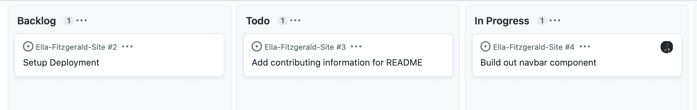

# 做初级开发人员是一种怎样的体验？

> 原文：<https://www.freecodecamp.org/news/what-does-a-junior-developer-do-on-the-job/>

如果你正在学习成为一名专业开发人员，你可能想知道初级开发人员在工作中做什么。

在这篇文章中，我将谈论初级开发人员的典型的一天，以及在工作中的期望。

## 入职流程

当你开始进入一家新公司时，你将经历入职流程。这个术语指的是被介绍到公司的过程。

你将首先经历一段为公司填写重要文件的时间。这包括人力资源部门需要的工资信息。

你也将开始接触到公司的一些项目代码库、员工日历、会议和员工聊天室。

在你开始第一天的工作之前，你可能会收到大量的电子邮件。这是非常重要的，你得到你的公司的电子邮件设置，并在一天中定期检查，以设置你需要的一切。

在工作的最初几天，你会有几次会议，让你被介绍给你的经理、你的团队，以及公司的概况和期望。

被大量的新信息淹没是完全正常的。试着在会议中做笔记并提问。

## 设置项目的提示

当您第一次尝试设置代码库时，您可能会不知所措，或者您可能不理解其中的所有代码。重要的是要记住，你的公司并不期望在第一周就了解代码库的一切。

他们明白，你需要一段时间才能习惯所有东西的摆放位置和运作方式。花点时间研究代码库，对不明白的事情提问。

此外，如果你在启动项目时遇到困难，一定要联系团队成员。如果设置过程没有被很好地记录，这可能是一个很好的机会，让你更新文档，这样将来的开发人员将有一个更顺利的入职过程。

## 什么是门票和项目板？

使用项目板是为了让团队知道项目的当前状态，并了解哪些工作仍然需要完成。这些板有所谓的标签，代表项目完成的不同阶段的任务。

这是一个项目板的例子。这是我个人项目中的一个例子。

开发人员将自己分配到板上列出的标签上，并通读需求。

其中一些票可能是对现有项目的小错误修复。或者您可能被要求为站点构建一个新的页面或组件。

当您完成工作单时，您将提交一个 PR (pull request ),并要求进行代码审查。一旦你的代码被审查和批准，那么它将被推向生产。

如果您对票证的要求有任何疑问，请联系您的项目经理。

## 什么是代码审查？

代码审查过程包括另一个开发人员检查您的代码并提交他们的改进意见。这些代码审查将有助于发现小的错误、代码不一致，并提高代码质量。

重要的是不要把代码审查当成个人行为。请记住，你的团队会帮助你并提出建设性的批评。

作为第一份工作中的初级开发人员，您可能不习惯让其他人查看您的代码。你也可能不知道当前构建大规模生产级应用的最佳实践。

代码评审对你来说是一个很好的学习机会，可以帮助你成为一个更成熟的开发者。

## 管理者的角色是什么？

工程经理承担多项职责，包括参与项目的规划和协调，以及监督工程团队。

这些人有多年的软件经验，必须平衡项目管理和人员管理。

以下是工程经理的一些核心日常活动:

*   参与每日站立会议
*   与其他经理、客户和利益相关者的会议
*   与工程师的一对一会议
*   可能会参与一些代码评审或编码

我相信一个好的经理能够有效地与团队沟通，并且在出现问题时能够很好地解决问题。他们还负责向工程师反馈他们做得好的地方和需要改进的地方。

## 什么是站立会议？

站立会议是指整个团队聚在一起，每个成员分享他们已经完成的工作，仍然需要完成的工作，以及阻碍他们前进的任何事情。

非常重要的一点是，如果你遇到了什么事情或者遇到了阻碍，你应该向团队提出来。作为团队的新成员，尤其是大三学生，如果无法继续进行项目，一定要寻求帮助。

记住你的团队是来帮助你的，你不应该羞于寻求帮助。

## 对公司的群聊有什么期待

很多公司会有一个指定的聊天服务器或群组，在那里队友们可以全天相互联系。我的公司使用 [Slack](https://slack.com/) ,并且有多种渠道用于特定项目、软件主题和各种非技术对话。

我相信一个健康的公司文化不会期望你在群聊的每一秒钟都有空。如果有人给你发信息，但你没有马上回复，因为你在忙别的事情，这没关系。

但是在没有人能抓住你的情况下，一整天都完全沉默是不太好的。如果你实际上是一名初级开发人员，交流是非常重要的。

你想在公司聊天中参与到什么程度取决于你自己。但是我建议一天中偶尔检查一下，这样你就能及时了解你的团队和项目的最新进展。

## 结论

作为一名大三学生，你最初几周的工作可能会让人不知所措。重要的是要记住，你的公司明白你仍然是这个行业的新手，有很多东西需要学习。

试着过一天算一天，尽可能多的学习。就你不明白的地方提出问题，如果你在某个问题上遇到困难，寻求帮助。

在寻求帮助之前，请务必先阅读文档和其他文章，尝试自己解决问题。另外，尽你所能详细地交流到底是什么问题，这样别人才能最好地帮助你。

试着向你的同事学习，因为他们有不同水平的专业知识和经验。

最重要的是，对自己宽容一点。你需要一段时间才能适应代码库和工作流需求。

我希望这篇文章能帮助你理解作为一名初级开发人员应该做些什么！祝您的开发者之旅好运。