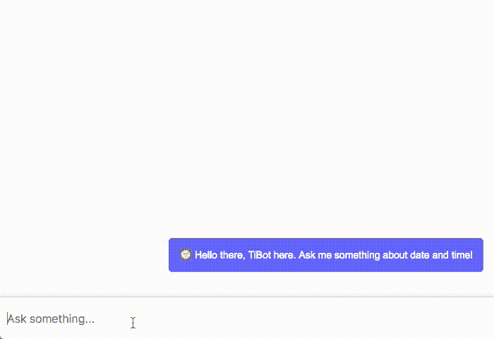

# 创建一个聊天机器人需要什么？让我们找出答案。

> 原文：<https://www.freecodecamp.org/news/what-does-it-take-to-build-a-chatbot-lets-find-out-b4d009ea8cfd/>

凡科·斯托伊科夫

# 创建一个聊天机器人需要什么？让我们找出答案。


Image by [Scott Lynch](https://www.flickr.com/photos/scottlynchnyc/ "Go to Scott Lynch's photostream")

没有任何延迟，下图显示了我们正在构建的内容:



An image of nothing.

为了回答题目中的问题，“构建一个聊天机器人需要什么？”答案是不多。

我是一名网页开发人员。长期以来，我一直渴望深入这一激动人心的领域。不幸的是，在没有帮助的情况下，我不能说我拥有构建聊天机器人所需的自然语言理解(NLU)方面的知识。好消息是，这样的帮助现在已经可以得到了。

谷歌的[云自然语言 API](https://cloud.google.com/natural-language/) ，微软的[认知服务 API](https://azure.microsoft.com/en-us/services/cognitive-services/language-understanding-intelligent-service/)，IBM 的[沃森对话](https://www.ibm.com/watson/developercloud/conversation.html)都提供商业 NLU 服务，免费层级丰厚。也有完全免费的，至少目前是这样。这包括 [API。最近被谷歌收购的 AI](https://api.ai/) 和脸书拥有的 [Wit.ai](https://wit.ai/) 。

从 web 开发人员的角度来看，这就是我们需要的所有帮助——一个将为我们消除复杂性的 API。

### 让我们从有趣的部分开始

如果你渴望看到这个例子，这里有 Heroku 上的[演示。这个例子](https://ti-bot.herokuapp.com/)[的完整代码可以在 GitHub](https://github.com/van100j/tibot) 上获得。

出于本文的目的，我们将创建一个名为 TiBot 的聊天机器人来回答我们关于日期和时间的问题。我们将使用 [API。一个处理这些问题的 API。我相信 API。AP 比](https://api.ai/) [Wit.ai](https://wit.ai/) 更直观，更容易操作。

在后端，一个简单的 Node.js 服务器将通过 WebSockets 处理前端应用程序发送的请求。然后，我们将从语言处理 API 获取响应。最后，我们将通过 WebSockets 发回答案。

在前端，我们有一个建立在单个 [Angular](https://angular.io/) 组件上的类似信使的应用程序。 [Angular](https://angular.io/) 内置[TypeScript](https://www.typescriptlang.org/)(JavaScript 的一个类型化超集)。如果您不熟悉其中任何一个，您仍然应该能够理解代码。

我选择了 [Angular](https://angular.io/) ，因为它固有地使用了[RxJS](http://reactivex.io/rxjs/)(JavaScript 的 ReactiveX 库)。RxJS 以一种非常强大而简单的方式处理异步数据流。

### API。人工智能设置

API。AI 有一个整洁的文档区。首先，我们需要熟悉一些与 API 相关的基本术语和概念，并大致了解 NLU。

一旦我们[在 API 创建了一个账户](https://console.api.ai/api-client/#/login)。AI，我们需要创建一个[代理](https://api.ai/docs/agents)来启动我们的项目。对于每个代理，我们获得 API 密钥——客户端和开发人员访问令牌。我们使用客户端访问令牌来访问 API。

代理就像项目或 NLU 模块。代理的重要部分是[意图](https://api.ai/docs/intents)、[实体](https://api.ai/docs/entities)和[动作和参数](https://api.ai/docs/actions-and-parameters)。

[Intents](https://api.ai/docs/intents) 是 API 返回的响应，或者根据 API。AI，“用户所说的和你的软件应该采取的行动之间的映射。”例如，如果用户说，“我想预订航班”，我们收到的结果应该如下所示:

`{ ... "action": "book_flight" ... }`

[实体](https://api.ai/docs/entities)帮助从用户所说的话中提取数据。如果一个用户说，“我想预订一张去巴黎的机票”，我们想在。我们需要将这些数据传递给我们的逻辑，以便为我们的用户预订飞往巴黎的航班。结果应该是这样的:

```
{  ...  "action": "book_flight",   "parameters": {    "destination": "Paris"  }  ...}
```

实体是参数值，就像数据类型一样。API 有[系统定义的实体](https://api.ai/docs/reference/system-entities)。AI 平台。这些例子包括`@sys.date`、`@sys.color`、`@sys.number`。比较复杂的有`@sys.phone-number`、`@sys.date-period`、`@sys.unit-length-name`。

我们还可以定义自己的实体，或者在每个请求中即时传递它们。动态传递实体的一个很好的例子是用户收听他们的播放列表。用户在其请求中有一个播放列表实体，或者有一个播放列表中所有歌曲的用户会话。如果用户正在听电台司令的*一个月亮形状的游泳池*播放列表，我们将能够响应“播放白日梦”。

动作和参数向 API 发送请求，以便它们产生动作。但它们也可能导致我们的聊天机器人无法理解的事情。在这种情况下，我们可以选择退回到默认响应。

参数是动作的伴侣。它们补充并完成动作。在某些情况下，我们不需要参数。但是在有些情况下，动作只有通过参数才有意义。一个例子是在不知道目的地的情况下预订航班。这是我们在开始创建意图之前需要考虑的事情。

最后，以下代码显示了 API 对已解析意图的响应:

JSON 最重要的部分是上面讨论过的具有`“action”`和`“parameters”`属性的`“result”`对象。已解析查询的置信度(在 0 到 1 的范围内)用`“score”`表示。如果`“score”`是零，我们的查询没有被理解。

值得注意的是,`“context”`数组包含关于可能需要后续响应的未解决意图的信息。例如，如果用户说，“我想预订航班”，我们将处理`book_flight”`动作(上下文)。但是为了得到所需的`“destination”`，我们可能会回答:“好的，你想去哪里？”并在下面的请求中处理`“destination”`。

### 后端

我们正在建立一个聊天应用程序。客户端和服务器之间的通信将通过 WebSockets 进行。为此，我们将在服务器上使用 Node.js WebSocket 库。我们的 WebSockets 模块如下所示:

WebSockets 消息的格式是带有`“type”`和`“msg”`属性的字符串编码的 JSON。

字符串`“type”`指以下之一:

`“bot”`，回答用户。

`“user”`，用户问机器人。

`“sessionId”`，发布唯一的会话 ID。

我们聊天机器人的答案就在`“msg”`里。它被发送回用户、用户的问题或 sessionId。

`processRequest(msg)`代表我们服务器功能的核心。它首先向 API 发出请求:

然后，它根据来自 API 的响应，执行`doIntent()`——用户意图的特定动作:

`doIntent()`检查响应中是否有处理动作的函数。然后，它用响应的参数调用该函数。如果没有用于该动作的函数，或者响应没有被解析，它将从 API 中检查一个回退。或者它调用`handleUnknownAnswer()`。

动作处理程序在我们的 intents 模块中:

对于每个处理函数，我们传递来自 API 响应的参数。我们还传递从客户端接收到的用户时区。因为我们处理的是日期和时间，所以时区在我们的逻辑中起着重要的作用。这与 API 或一般的 NLU 无关，只与我们特定的业务逻辑有关。

例如，如果一个在伦敦的用户在星期五晚上 8:50 问我们的机器人，“今天是星期几？”答案应该是，“今天是星期五。”

但是如果同一个用户问，“悉尼今天是什么日子？”答案应该是，“今天是悉尼的周六。”

位置对我们的商业逻辑也很重要。我们想检测问题来自哪里(在悉尼的例子中)，这样我们就可以得到它所在位置的时区。为此，我们将结合谷歌地图[地理编码 API](https://developers.google.com/maps/documentation/geocoding/start) 和[时区 API](https://developers.google.com/maps/documentation/timezone/start) 。

#### 前端

我们的应用程序是一个单一的角度组件。最重要的功能在组件的`ngOnInit()`方法中:

我们首先使用 WS Observable 创建 WebSocket (WS)到服务器的连接。然后，我们为它订阅了几个观察者。

第一个观察者在连接到 WebSocket 服务器时获得`sessionId`。立即取消订阅`take(1)`操作符:

第二个订阅很有趣:

```
this.ws$.takeUntil(this.ngUnsubscribe$)  .filter(r => r.type === 'bot')  .retryWhen(err$ =>    Observable.zip(err$, Observable.range(1, 3), (e, n) => n)      .mergeMap(retryCount => Observable.timer(1000 * retryCount))  )  .delayWhen(inp => Observable.interval(100 + inp.msg.length * 10))  .subscribe(    (msg) => this.pushMsg(msg)  );
```

在这里，我们希望只从机器人中取出消息，因此使用了`filter(r => r.type === ‘bo`t’)操作符。t`he retryWhen(err$ =&`gt；…)操作员在 WebSocket 断开连接后会自动重新连接到它。

操作符的目的是实现信使使用的“机器人正在打字”的效果。为此，我们将数据延迟了`100 + MSG_CHARACTERS_LENGTH * 10`毫秒。

当消息通过所有操作符时，我们将它推入我们的消息数组`(msg) => this.pushMsg(m` sg。

我们使用组件的私有`pushMsg()`方法来添加消息并在聊天中显示它:

如果消息来自用户(`clearUserMsg`标志)，我们清除输入框。我们用`this.botIsTyping`来控制“机器人正在打字”的效果。所以这里我们把它设置为`false`。

当用户点击 Enter 时，我们用`onSubmit()`方法处理用户输入:

除了用户的消息，我们还发送用户的 sessionId 和时区。这些显示在`this.ws$.next(JSON.stringify(input))`中。为了展示机器人正在打字的效果，我们还将`this.botIsTyping`设置为`true`。

我们用作应用程序 UI 的 Angular 组件模板由以下代码组成:

这就是我们在前端的应用程序所需要的一切。

看到这些代码变得如此优雅和干净，真是令人惊讶。感谢 RxJS。当使用 WebSockets 时，事情往往会变得复杂。这里我们只用了一行代码就完成了。

还有像自动重新连接这样的功能——嗯，这是一个独立的故事。但是使用 RxJS，我们以简单的方式处理了这个问题。

最后，我希望你能理解为什么我说“不需要太多”来回答这个问题，“构建一个聊天机器人需要什么？”

这并不意味着构建聊天机器人是一件容易的事情。这些 NLU 服务，尽管很聪明，也不能解决我们所有的问题。我们仍然需要关注自己的业务逻辑。

几年前，我不可能造出类似的东西。但是像 API 这样的服务。人工智能现在让每个人都可以使用这种能力。

API。AI 还提供了与 Facebook Messenger、Twitter、Viber 和 Slack 的集成。但是对于本文，我认为最好使用他们的 API 来更好地理解一切是如何工作的。

我希望你喜欢这篇文章，并发现它有助于建立自己的聊天机器人。