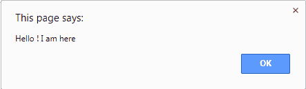

# JavaScript:Void(0)是什么意思？

> 原文：<https://www.freecodecamp.org/news/what-does-javascript-void-operator-do/>

JavaScript 的 void 运算符计算一个表达式并返回 undefined。

您可以使用控制台来验证这一点:


****注**** : ****void** ，**不管传递了什么值，*总是返回 ****undefined**** 如上图*。但是， ****与**无效，则**操作数 0 优先于**** 。

使用操作数 0 有两种方法:void(0)或 void 0。他们中的任何一个都可以。

## 何时使用 Javascript void(0)

如果在单击链接时，您不希望浏览器加载新页面或刷新同一页面(取决于指定的 URL ),请使用 javascript:void(0)。

相反，它将只执行附加到该链接的 JavaScript。

### 使用 Javascript void(0)的示例 1:

```
<html>
<body>
<a href="javascript:void(0);alert('Hello ! I am here')">Click Me</a>
</body>
</html>
```

#### **输出:**

当有人点击 ClickMe 链接时，会弹出如下警告:



### 使用 Javascript void(0)的示例 2:

```
<html>
<body>
<a href="javascript:void(0)" ondblclick="alert('Hi,i didnt refresh the page')" )>Click Me</a>
</body>
</html>
```

#### **输出:**

双击该链接时，会弹出一个警告，无需刷新任何页面。

### 使用 Javascript void(0)的示例 3:

```
<html>
<body>
<a href="javascript:void(0);https://www.google.co.in/" 
ondblclick="alert('Hello !! You will see me and not get redirected to google.com ')">Click Me</a>
</body>
</html>
```

#### **输出:**

双击该链接时，将弹出一个警告。关闭它也不会重定向到 google.com。

### 没有 Javascript void(0)的示例:

```
<html>
<body>
<a href="https://www.google.co.in/" ondblclick="alert('Hello !! You will see me and then get redirected to google.com even if not needed')">Click Me</a>
</body>
</html>
```

#### **输出:**

当你双击链接，会弹出一个警告，但关闭它将重定向到 google.com。

## 结论

当您需要防止任何不必要的页面刷新或重定向时， ****void**** 操作符非常有用。相反，它执行一些 JavaScript 操作。

#### **更多信息:**

1.  [Mozilla 文档](https://developer.mozilla.org/en-US/docs/Web/JavaScript/Reference/Operators/void)