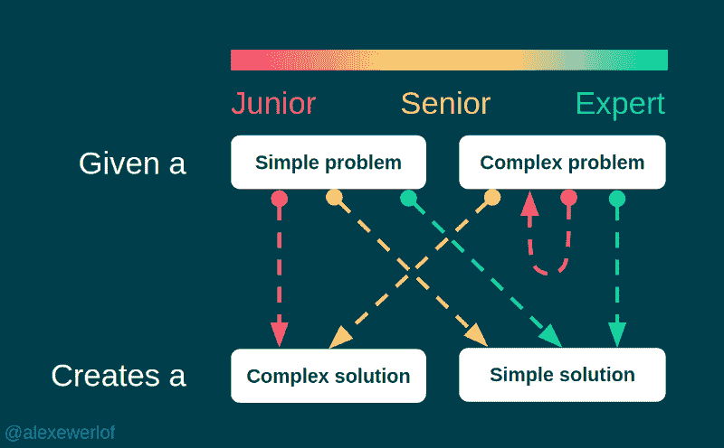
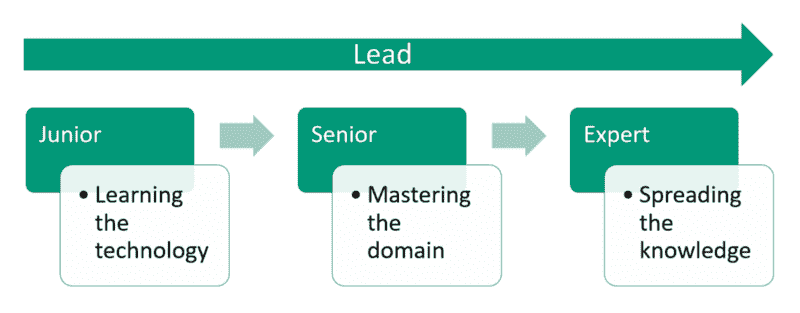
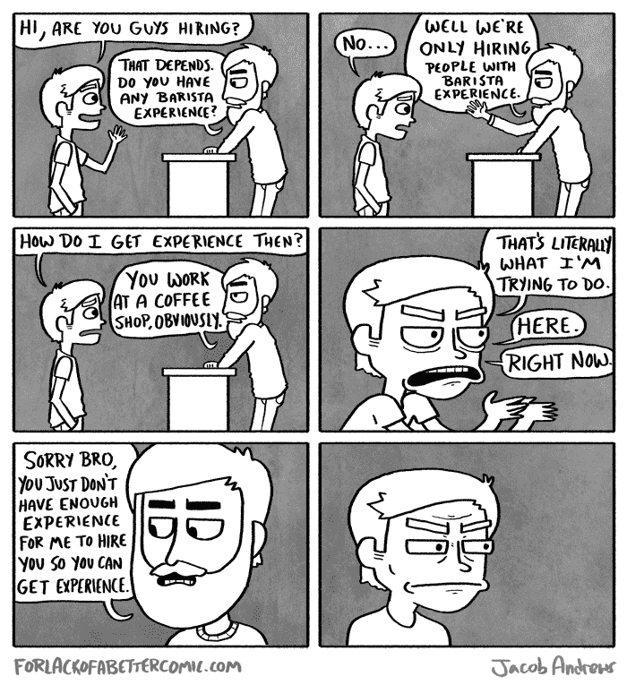
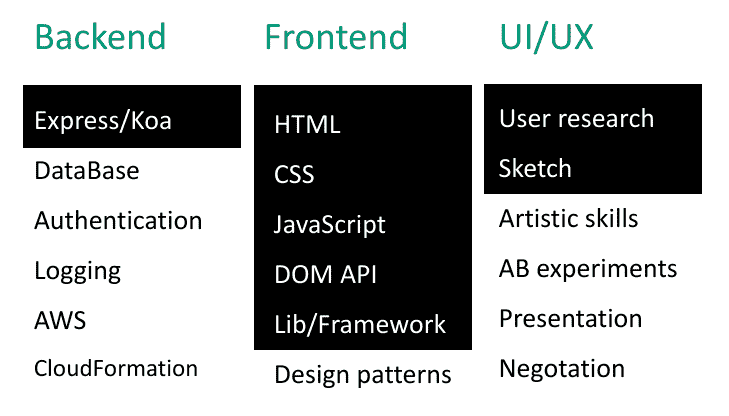
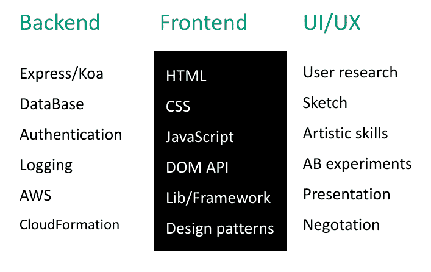

# 在软件行业中，初级、高级和专家这样的头衔实际上意味着什么

> 原文：<https://www.freecodecamp.org/news/what-does-junior-senior-expert-lead-experienced-professional-and-specialist-software-c36563e946e2/>

我从事软件行业已经 20 年了。我和许多来自不同国家的程序员一起工作过，他们来自不同的商业领域，从电信、保险到网上银行和医疗保健。

20 年前，当我还是一名初学者时，对我来说，“专家”和“高级”或“领导者”或多或少意味着同样的事情。随着我职业生涯的发展和与不同技能的人一起工作，我开始给描述人们技能不同方面的每一个术语赋予特定的含义。

### 初级、高级、专家

有许多方法可以设置这些标题。我特别感兴趣的一点是他们解决问题的技巧:

我想出的定义这些头衔的最好方法是看他们面临的挑战。

我们可以通过查看每个级别的挑战来获得更好的定义，而不是专注于某个角色的要求。

大三学生的主要挑战是学习技术。你是这家公司的新员工，他们使用 Node、React、Python……你必须了解他们的技术体系，这是提高工作效率的第一步。这不一定要花那么长时间。如果你以前有过类似的经验或者电脑经验，你会学得更快。为了充分吸收新事物，你可能还得忘掉一些东西。

大四学生的主要挑战是学习领域。你懂的。你受雇于一家写作公司。NET 代码。你可以阅读他们的代码，但是你不知道它解决了什么问题。你的挑战是学习领域知识来理解代码的上下文，以及为什么它以某种方式构造来解决某一组问题。

专家的主要挑战是帮助高年级学生和低年级学生设计解决特定领域问题的解决方案。专家通过在领域和技术堆栈中传播他们的知识来释放团队的真正力量。他们对整个业务有着一致的理解。

当一个人刚加入团队的时候，无论他有多少年的经验，都默认是初级水平。但是如果他们了解技术，他们可以被认为是资深的。

**需要注意的是，这些头衔并不是永久的**。人们是不同的:他们以不同的速度学习不同的东西，每个人都有独特的知识。

一个有经验的开发人员可能会在几天内学会该技术并成为资深人员。对资历的一个快速测试是询问他们不喜欢技术堆栈的哪些方面。当一个人非常了解一项技术时，他对这项技术的局限和优势有很好的认识。

**还有，年龄与资历无关**。这只是工作描述中的一句双关语，让年长的晚辈兴奋不已。

当有人被竞争对手公司挖走时，很有可能他们已经了解这个领域，因此他们可以被认为是专家。

学长和专家的界限不是那么明显。专家可以流利地使用该领域的技术术语，但他们与前辈的区别在于他们对软件如何用于解决业务问题的整体理解。

当你向专家问一个一般性的问题时，你通常不会得到一个简单的“是”/“否”的答案，而是“是和否”或“视情况而定”。这是因为专家们能从正反两面和不可避免的权衡中深入了解问题。他们通常需要更多的信息来将简单的问题提炼为更具体的问题，然后给出“是”/“否”。

### 铅

**领导者的主要挑战是确保团队中的每个人都朝着正确的方向前进**:

*   专家与高年级学生和低年级学生分享他们的领域和技术知识
*   高年级学生学习领域知识，并与低年级学生分享他们的技术知识
*   低年级学生保持好奇心和学习的动力

现实要比这复杂得多，但就这篇简短的文章而言，可以说领导者决定团队的节奏，正如哈佛商学院的一位工商管理教授所说，最好的领导者是幕后领导:

> 领导者可以鼓励突破性的想法，不是通过培养能执行的追随者，而是建立能创新的社区。琳达·希尔

### 有经验的

大多数招聘广告都要求有经验的候选人。不幸的是，这在第 22 条的[中阻止了大多数下级:](https://en.wikipedia.org/wiki/Catch-22_(logic))

source: [http://forlackofabettercomic.com/?id=107](http://forlackofabettercomic.com/?id=107)

但是雇佣一个有经验的开发者并不总是成功的公式。你要确保团队有不同层次的良好组合。团队中有初级成员可以让高级成员和专家解释概念，并在工作中做得更好。

> 知道的，做。懂的人，教。——亚里士多德

当你雇佣有经验的人(根据我们的定义是高级和专家级)时，你应该小心，因为他们往往对事情应该如何做更有主见。根据团队的人口统计，他们可能会导致团队失衡，扼杀其他人的动力。

你可能想在工作要求和一个人的技能之间留一点差距。这种差距让他们继续工作，因为这给了他们成长和进步的感觉。否则，他们实际上可能会感到厌倦，比你希望的更早离开。

> 你不是为了技能而雇佣，而是为了态度。你可以随时教授技能——西蒙·西内克

### 专业的

有时“专业”一词会与“资深”、“专家”、“有经验”或“领导”混淆。与业余爱好者相对，专业人士是为了钱而从事某项活动的人。

在家里为家人做饭的人不是专业厨师。在餐馆做饭的人。

当我们谈论“专业人士”时，我们通常指的是这样的人:

*   具有服务意识，尽最大努力提供优质服务以换取金钱。
*   将他们的个人生活排除在工作之外，努力争取最好的服务(尽管这在不同的工作文化和世代之间有所不同)。
*   建立获得和留住客户所必需的信任。

“下级”可以揭露职业行为，而处于“领导”位置的人可能会表现出非职业行为。

### 专家与通才

专家对特定的技术堆栈或领域有深入的了解，但不一定了解全局。

例如，一名多面手 [UX 工程师](https://medium.com/@alexewerlof/what-is-a-ux-engineer-1286d4b6d0e8)，可能拥有广泛的技能，但不一定像专业前端开发人员那样深入:

An extremely simplified and binary way of representing the skills of a UX engineer

> 花絮:挤挤眼睛就能看到技能图的 [T 形](https://en.wikipedia.org/wiki/T-shaped_skills)。

另一方面，专业的前端开发人员可能对实现网站有非常深入的了解，但不一定了解其他相关领域:

An extremely simplified and binary way of representing the skills of a front-end specialist

[丹·阿布拉莫夫](https://www.freecodecamp.org/news/what-does-junior-senior-expert-lead-experienced-professional-and-specialist-software-c36563e946e2/undefined)是前端编程场景中的一个图标。他是脸书[反应](https://reactjs.org/)团队中最著名的成员。有一次他说:

最近他继续谦虚地阐述他不知道的事情:

[**截至 2018 年我不知道的事情**](https://overreacted.io/things-i-dont-know-as-of-2018/)
[*2018 年 12 月 28 日* ☕️ 6 敏读人们常常以为我知道的远比我实际知道的多。这不是一个坏问题…* 反应过度。io](https://overreacted.io/things-i-dont-know-as-of-2018/)

这是一个很好的例子，为了成为一个好的问题解决者，你不需要什么都知道。专注于手头的问题才是关键。

现在你有了:对软件行业中初级、高级、专家、领导、专业、专家和通才头衔的解释。

⚡ ️ *喜欢你读的书吗？请**关注**我，当我写了新的东西时会得到通知。我也在 [Twitter](https://twitter.com/alexewerlof) 和 [Linkedin](https://www.linkedin.com/in/alexewerlof/) 上。*