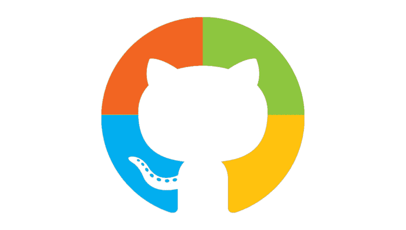

# 让我们来解开微软收购 GitHub 的谜团

> 原文：<https://www.freecodecamp.org/news/what-does-microsofts-acquisition-of-github-means-5197001ffaea/>

由 samuele dassatti

# 让我们来解开微软收购 GitHub 的谜团

如果你参与开源开发，你可能听说过微软最近收购了 GitHub。然而，如果你没有，这里有一个快速回顾发生了什么。

### 背景故事

先从 2014 年说起。今年 2 月，微软宣布新任首席执行官将是塞特亚·纳德拉，一位专注于云计算的开发人员，他将领导公司…