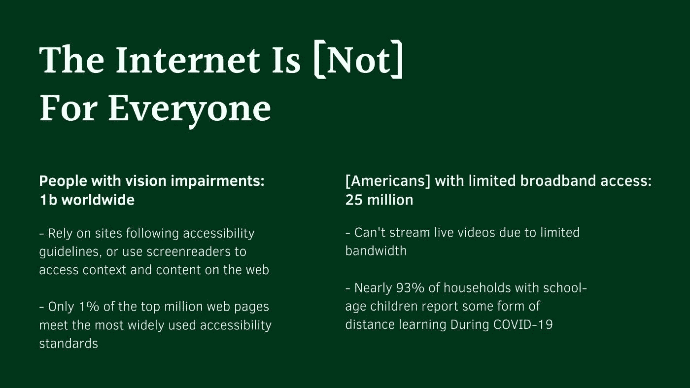
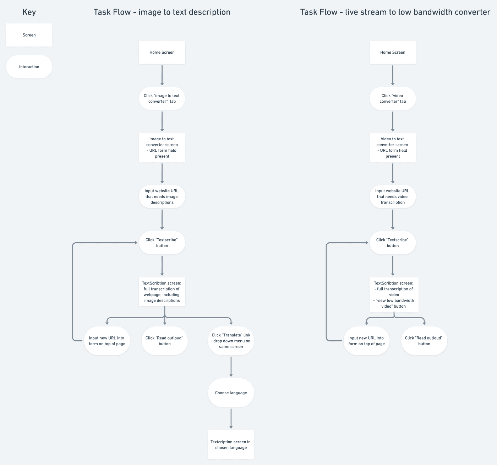
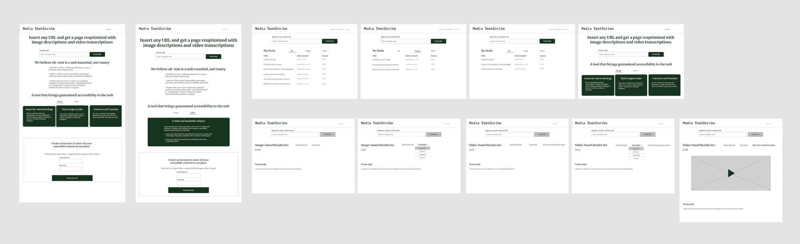

# 每个设计师在他们的第一次黑客马拉松之前需要知道的

> 原文：<https://www.freecodecamp.org/news/what-every-designer-needs-to-know-before-their-first-hackathon/>

在这篇文章中，我将分享我参加(并赢得)我的第一次黑客马拉松的经验和教训(剧透一下:你实际上并没有黑任何东西...😁).

我如此热爱设计世界的原因之一是，它的不断发展需要你保持一种成长的心态。你必须总是渴望提高技能或探索一门新的手艺。作为一个在有意义的挑战中找到巨大满足感的人，这对我特别有用。

所以我对它进行了测试:我谦虚地报名参加了我的第一次黑客马拉松，只是对这样一个活动需要什么有一定的了解。我甚至不确定作为一名(非常)初级的 UX 设计师，我能做出什么有价值的贡献。接受挑战。

第一个障碍是首先要找到一个可以参与的黑客马拉松。我被那里的众多选择所淹没，并且发现大部分的黑客马拉松只面向学生。这让大学毕业生和像我一样的新兵训练营的学生处于灰色地带。

尽管如此，我还是把目光放在了我能找到的更具包容性和社会公益活动上，并在申请后联系了组织者以确认我的资格。

几次交流后，我被 DubHacks 接纳，这是太平洋西北部最大的 24 小时黑客马拉松。

在把我的冒名顶替综合症放在一边，组建了一个团队，并度过了一个疲惫的 24 小时后，我团队的项目继续赢得了“社会公益最佳用途”类别。以下是我从这次经历中学到的一些东西。

[https://giphy.com/embed/WUfNuPqnC3Acn2H573](https://giphy.com/embed/WUfNuPqnC3Acn2H573)

[通过 GIPHY](https://giphy.com/gifs/hackathon-ethdenver-bufficorn-WUfNuPqnC3Acn2H573)

## 为什么每个黑客马拉松团队都需要一个设计师

我很高兴地告诉你，你在设计学校或教程中多次听到的是真的:不是每个人都像设计师一样思考。

我的团队由优秀的开发人员组成，他们能够很快推断出如何使用他们的知识来构建一个软件工具，但是对于如何构建一个可行的 **产品** 却不太精通。

一个优秀的设计师知道，一个产品不仅仅是其各个部分的总和，而是一种连贯和有凝聚力的体验——这正是设计师在黑客马拉松上带来的独特视角。

作为团队中的一名设计师，你的工作是超越你在机械层面上构建的东西，并不断引导团队走向你所创造的更伟大、更人性化的层面。

是的，框架和技术栈是至关重要的，但是如果最需要的人无法使用(或者不清楚)最伟大的技术，那它还有什么用呢？

每当我们的产品定位开始变得过于宽泛或不集中时，我会尽力控制它，提醒团队我们在为谁构建，我们的主要用例是什么，以及我们试图解决什么问题。

## 设计师在黑客马拉松团队中做什么

如果你是一个想要参加黑客马拉松的设计师，并且你不确定在整个过程中你应该采取什么样的可交付成果或可操作的步骤(像我一样)，这里有一个我参与的大概情况。

### 景观分析

这是你的黑客马拉松项目的一个重要方面，不应该被忽视。你的项目不仅要根据其执行情况来判断，还要根据其可行性来判断——它解决了什么问题？它帮助了哪些用户？你怎么知道的？

这是一个很好的机会来挖掘你的设计思维过程，并找到你正在为之构建解决方案的问题的根源。

对我来说，这包括对围绕我们所选问题领域的问题以及市场上旨在解决类似(或不同)问题的现有工具进行广泛的研究。

我还偷偷做了一些用户研究，通过与相关熟人进行简短、非正式的用户访谈来更好地了解他们在这一领域的体验和痛点。

这是我们过程中非常宝贵的一步。当要展示我们的项目时，我们不仅要展示一个最小的可行产品，还要首先进行研究来验证对我们产品的需求。

I took a deep dive into the world of web inequity for those with vision impairments and limited broadband

### 任务流程和草图

由于黑客马拉松的仓促和好斗性质，你完成的项目将不会完全充实。这意味着至少包含最基本的特性是很重要的。

创建产品的主要任务流有助于开发人员直接开始最重要的功能。如果您的团队最终无法在提交截止日期前完成其他任务流的开发，这将特别有帮助。

界面外观的草图有助于开发者从一开始就将他们正在构建的东西放在上下文中，并提供重要的约束，无论多么松散。

当黑客马拉松开始时，这些是我发给我的团队的第一批可交付成果。我向他们解释了我们应该开发的主要任务，并浏览了我的界面草图，记下了每个屏幕上最重要的组件(主要是我们的 CTA)。

The basic task flows that our product would need to include

### 线框和实体模型

线框让你的草图更进一步，给你的开发者更多重要的约束。使用像 Figma 或 Zepplin 这样的工具与您的开发人员共享您的设计可以充分利用您的时间，因为他们可以检查和使用相应的代码。

在你的演示中添加高保真的模型有助于展示你的工作，使它比你的 MVP 看起来更真实/更实用，MVP 看起来很可能像你的低保真度线框。

直到我给我的团队发了低保真度的线框，他们才正式开始编码我们产品的前端。在我分享了主要界面的设计后，我花了很多时间设计多个屏幕和高保真线框，我们从来没有时间去开发。

相反，我建议把重点放在你的开发人员将要构建的主界面上，然后为了你的模型和演示的目的，充实一个高保真的版本。

为了在我们的演示中展示设计，我在一个设备中放置了一个我们产品的登录页面的 PNG 模型(使用 Figma 社区文件模板)，以及一个我使用 Rotato 制作的额外的简短宣传视频。

My low-fi wireframes, most of which did not see the light of day outside my Figma file

### 项目管理和演示

作为一名设计师，你对你的团队试图在代码之外构建什么有一个整体的观点。再加上你进行的景观研究，这非常有助于主导你的团队的最终演示。

你的演示是你项目的“大卖点”——没有它，你的产品就没有背景，也不能被评审团评判。你的演示不需要设计得完美无缺，但应该包括几个要点，例如:

*   介绍你的黑客和团队成员
*   你想解决的问题
*   您的用户群和业务用例，以及您的产品如何解决这些问题
*   技术堆栈和产品特性
*   你的产品的长期影响
*   你遇到的困难和复杂情况，以及一路上你学到了什么

我在 Canva 中构建了我们的演示文稿，这允许轻松协作和嵌入媒体。

在黑客马拉松中，设计师有一个独特的优势，那就是不会被局限在一个单一的工作流程中，如果你的团队迷失在代码中，你可以让他们继续前进。

这建立了重要的时间限制和约束，有助于确保你有效地分配时间和任务。

在整个 24 小时的活动中，我提醒我的团队我们即将到来的截止日期:我们应该在什么时候完成我们的 MVP，什么时候开始练习我们的演示，以及我们的提交截止日期。我给每一个都留了足够的缓冲空间，以防出错或延迟(在黑客马拉松的世界里，这几乎是保证)。

[https://giphy.com/embed/QGZBpodY7Kdtw99y04](https://giphy.com/embed/QGZBpodY7Kdtw99y04)

[通过 GIPHY](https://giphy.com/gifs/kobe-bryant-jobs-finished-QGZBpodY7Kdtw99y04)

## 移情和策略的结合

我们的项目创意源于我对让残疾人和互联网接入受限者更容易访问网络的热情。

我坚信设计(和技术)是一种工具，我们可以用它来拆除排斥性系统，支持更具包容性的系统。这种为代表性不足的群体服务的承诺推动了我们在整个活动中的工作。

我很幸运和一个已经有一些黑客马拉松经验的成员在一个团队中，这让我们能够简化我们的过程。但是回过头来看，我们采取了其他一些明确的措施，这些措施帮助我们赢得了“最佳社会公益用途”的奖项。

作为一名设计师，以下是我要记住的一些小技巧，可以帮助你征服第一次(或任何一次)黑客马拉松体验:

### 1.早点开始

当然，我并不是说你应该在事件开始时间之前就开始任何实际的黑客攻击。但是我建议了解你的团队，综合一些项目想法，在黑客马拉松真正开始之前拿出一个行动计划。

在黑客马拉松前一周，我们的团队在谷歌文档上列出了我们的每一项核心技能，并提出了两个项目想法供我们稍后投票。

在黑客马拉松开始之前，我们已经对我们的团队成员有了很好的想法，我们擅长什么，我们将在 24 小时的时间框架内构建什么。

### 2.做你的研究

我不能夸大研究在你的过程中的重要性。它不仅能帮助你达成你的问题陈述，证实世界对你的项目的需求，还能在更令人生畏的时刻提醒你，你希望产生什么样的影响。

在不安全的时候，我会回顾我在这个问题空间所做的研究，提醒自己对解决方案的可量化需求，并以此作为继续推进的动力。

### 3.敏捷

我很快认识到，也许并不奇怪，在短时间内从零开始构建一个最小可行的产品是很麻烦的。并不是你在黑客马拉松开始时开始构建的所有东西都会进入最终的设计，这没关系。

这是一个非常好的环境，可以让你变得斗志昂扬，快速失败，迭代，尽可能地简化你的工作流程。

### 4.清晰、频繁地交流

我们的团队主要通过 Facebook Messenger 进行交流，开发人员可以在那里快速排除故障并相互交流想法。

我利用这个沟通渠道让团队了解我正在做的事情，做一些 UI 笔记，询问是否有人需要我做什么。

我还用它来提醒团队我需要从他们那里得到什么，可能是放入我们演示文稿的一些技术副本，或者是我们同意开始审查我们项目的最后期限的提醒。

### 5.充满激情

这种陈词滥调我也没有忘记，但这是真的。甚至你梦想中的设计工作也可能伴随着一些你不太感兴趣的项目。

另一方面，黑客马拉松提供了一个独一无二的机会来建造你唯一感兴趣的东西，除了你自己的意愿之外没有任何义务。

无论是社会事业还是创新技术，找到一个你深深热爱的项目将有助于从头到尾指导、维持和验证你的工作。

[https://giphy.com/embed/26xBxZdlxksm4oCje](https://giphy.com/embed/26xBxZdlxksm4oCje)

[通过 GIPHY](https://giphy.com/gifs/cbc-funny-comedy-26xBxZdlxksm4oCje)

## TL；大卫:走出去，成为伟大的人

我希望这份指南既能作为经验丰富的设计师在黑客马拉松期间帮助构建工作流程的框架，也能作为年轻设计师正面参与疯狂、混乱、激动人心和有益的黑客马拉松世界的灵感。

如果我让我的恐惧和恐吓战胜了我，我会错过一个巨大的学习机会。除了设计交付之外，我的第一次黑客马拉松经历让我练习了我的沟通技巧，与开发人员密切合作，找到我们之间的共同语言来帮助我们的工作取得进展，并在紧张的时间表和限制下变得舒适。

这些都是对任何水平的设计师都非常有价值的技能，但是对于这个领域的初级人员来说，这些技能尤其具有洞察力，他们可能还没有足够的机会通过实践来学习。

所以我鼓励每一个读到这篇文章的设计师勇敢一点，做一个伟大的人——我会为你加油的。