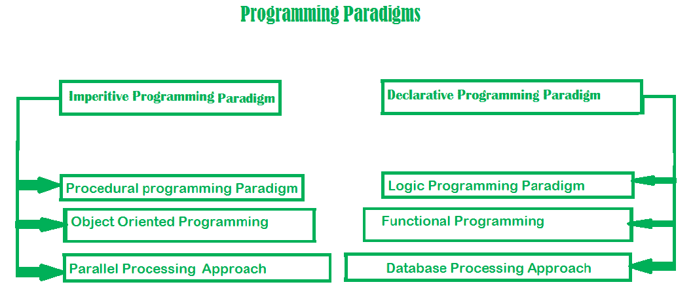
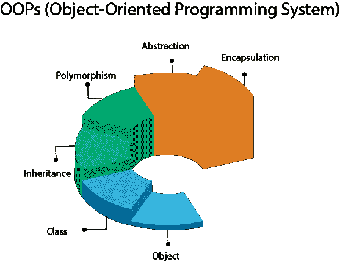
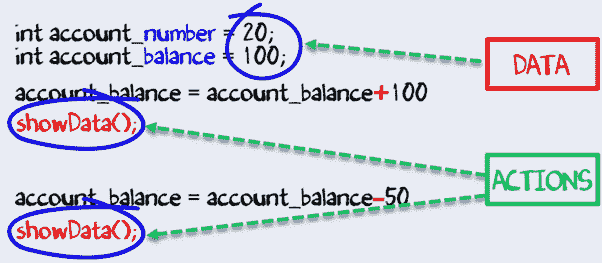

# 到底什么是编程范式？

> 原文：<https://www.freecodecamp.org/news/what-exactly-is-a-programming-paradigm/>

> 任何傻瓜都能写出计算机能理解的代码。优秀的程序员编写人类能够理解的代码。马丁·福勒

编程时，复杂性永远是敌人。非常复杂的程序，有许多活动的部分和相互依赖的组件，最初看起来令人印象深刻。然而，将现实世界的问题转化为简单或优雅的解决方案的能力需要更深入的理解。

在开发一个应用程序或解决一个简单的问题时，我们经常说“如果我有更多的时间，我会写一个更简单的程序”。原因是，我们做了一个更复杂的程序。我们的复杂度越低，就越容易调试和理解。程序变得越复杂，就越难开发。

管理复杂性是程序员主要关心的事情。那么程序员如何处理复杂性呢？有许多通用的方法可以降低程序的复杂性或使其更易于管理。主要方法之一是编程范式。让我们深入了解编程范例！

## 编程范例介绍

****编程范例一词**指的是**一种编程风格**** 。它不是指特定的语言，而是指你的编程方式。

有许多众所周知的编程语言，但它们在实现时都需要遵循某种策略。这个策略是一个范例。

## 编程范式的类型



Describes the different styles of programming (Source: geeksforgeeks.org)

## 命令式编程范式

“命令式”这个词来自拉丁语“impero”，意思是“我命令”。

“皇帝”也是这个词，这个词很贴切。你是皇帝。你给计算机下达一些指令，它一次执行一个指令，然后向你报告。

范式由几个语句组成，在执行完所有语句后，结果被存储起来。就是写一个指令列表，告诉电脑一步一步做什么。

在命令式编程范例中，步骤的顺序至关重要，因为给定的步骤在执行时会有不同的结果，这取决于变量的当前值。

为了说明，让我们在命令式范式方法中找到前十个自然数的和。

C 语言示例:

```
#include <stdio.h>

int main()
{
    int sum = 0;
    sum += 1;
    sum += 2;
    sum += 3;
    sum += 4;
    sum += 5;
    sum += 6;
    sum += 7;
    sum += 8;
    sum += 9;
    sum += 10;

    printf("The sum is: %d\n", sum); //prints-> The sum is 55

    return 0;
}
```

在上面的例子中，我们一行一行地命令计算机做什么。最后，我们存储值并打印它。

## 1.1 过程化编程范式

程序编程(也是命令性的) ****允许将那些指令拆分成程序**** 。

**注意:**过程不是函数。它们之间的区别是函数返回值，而过程不返回值。更具体地说，函数被设计成具有最小的副作用，并且当给定相同的输入时总是产生相同的输出。另一方面，过程没有任何返回值。它们的主要目的是完成给定的任务，并产生预期的副作用。

众所周知的 for 循环就是一个很好的例子。for 循环的主要目的是引起副作用，它不返回值。

为了说明，让我们在过程范式方法中找到前十个自然数的和。

C 语言示例:

```
#include <stdio.h>

int main()
{
    int sum = 0;
    int i =0;
    for(i=1;i<11;i++){
        sum += i;
    }

    printf("The sum is: %d\n", sum); //prints-> The sum is 55

    return 0;
}
```

在上面的例子中，我们使用了一个简单的 for 循环来计算前十个自然数的总和。

支持过程化编程范例的语言有:

*   C
*   C++
*   Java 语言(一种计算机语言，尤用于创建网站)
*   冷聚变
*   帕

### 在以下情况下，过程化编程通常是最佳选择:

*   存在复杂的操作，包括操作之间的依赖性，以及何时需要不同应用状态的清晰可见性(“SQL 加载”、“SQL 加载”、“网络在线”、“无音频硬件”等)。这通常适用于应用程序的启动和关闭(Holligan，2016)。
*   该计划非常独特，很少有元素被共享(Holligan，2016)。
*   该计划是静态的，预计不会随着时间的推移而发生太大变化(霍利甘，2016)。
*   随着时间的推移，预计没有或只有少数功能会添加到项目中(Holligan，2016)。

### 为什么应该考虑学习过程化编程范式？

*   很简单。
*   跟踪程序流程的简单方法。
*   它具有高度模块化或结构化的能力。
*   需要更少的内存:它是高效和有效的。

## 1.2 面向对象的编程范式

OOP 是最受欢迎的编程范例，因为它有独特的优势，如代码的模块化，以及能够直接用代码将现实世界的业务问题联系起来。

> 面向对象编程提供了一种可持续的方式来编写面条式代码。它让你把程序作为一系列补丁来授权。
> ――保罗·格拉厄姆

面向对象编程的关键特征包括类、抽象、封装、继承和多态。

一个**类**是一个创建对象的模板或蓝图。



Describes the key concepts of object-oriented programming (Source: javatpoint.com)

对象是类的实例。对象有属性/状态和方法/行为。属性是与对象相关联的数据，而方法是对象可以执行的动作/功能。



Explains the states and behaviors of an object (Source: guru99.es)

抽象将接口和实现分开。封装是隐藏对象内部实现的过程。

**继承**使层次关系得以表现和细化。多态允许不同类型的对象接收相同的消息并以不同的方式响应。

为了说明，让我们在面向对象的范例方法中找到前十个自然数的总和。

Java 中的示例:

```
public class Main
{
	public static void main(String[] args) {
		Addition obj = new Addition();
		obj.num = 10;
		int answer = obj.addValues();
		System.out.println("The sum is = "+answer); //prints-> The sum is 55
	}
}

class Addition {
    int sum =0;
    int num =0;
    int addValues(){
        for(int i=1; i<=num;i++){
            sum += i;
        }
        return sum;
    }
}
```

我们有一个类`Addition`，它有两个状态，`sum`和`num`，它们被初始化为零。我们还有一个方法`addValues()`，它返回`num`数的和。

在`Main`类中，我们创建了一个加法类的对象`obj`。然后，我们将`num`初始化为 10，并调用`addValues()`方法来获得总和。

支持面向对象范例的语言:

*   计算机编程语言
*   红宝石
*   Java 语言(一种计算机语言，尤用于创建网站)
*   C++
*   闲聊

### 面向对象编程最适用于以下情况:

*   你有多个程序员，他们不需要理解每个组件(Holligan，2016)。
*   有很多代码可以共享和重用(Holligan，2016)。
*   该项目预计会经常变化，并随着时间的推移而增加(Holligan，2016)。

### 为什么应该考虑学习面向对象编程范式？

*   通过继承重用代码。
*   多态性带来的灵活性。
*   使用数据隐藏(封装)和抽象机制的高安全性。
*   提高软件开发的生产率:面向对象的程序员可以拼接新的软件对象来制作全新的程序(Saylor 基金会，n.d .)。
*   更快的开发:重用支持更快的开发(Saylor 基金会，n.d .)。
*   降低开发成本:软件的重用也降低了开发成本。通常，更多的努力被投入到面向对象的分析和设计(OOAD)中，这降低了开发的总成本(Saylor Foundation，n.d .)。
*   更高质量的软件:更快的软件开发和更低的开发成本允许更多的时间和资源用于软件的验证。面向对象的编程倾向于产生更高质量的软件。

## 1.3 并行处理方法

并行处理是通过在多个处理器之间分配程序指令来处理程序指令。

并行处理系统通过将多个处理器分开，允许它们在更短的时间内运行一个程序。

支持并行处理方法的语言:

*   NESL(最古老的城市之一)
*   C
*   C++

### 在以下情况下，并行处理方法通常是最佳选择:

*   您的系统拥有一个以上的 CPU 或多核处理器，这在当今的计算机上很常见。
*   你需要解决一些计算问题，即使有更强大的微处理器，这些问题也需要几个小时甚至几天才能解决。
*   您使用需要更多动态模拟和建模的真实世界数据。

### 为什么您应该考虑学习并行处理方法？

*   提高性能。
*   常用于人工智能。在这里了解更多:[人工智能和并行处理](https://link.springer.com/chapter/10.1007%2F978-1-4612-1220-1_12)作者 Seyed H. Roosta。
*   这使得解决问题变得容易，因为这种方法看起来像是分而治之的方法。

以下是一些有用的资源，可以帮助您了解更多关于并行处理的知识:

1.  Paul Gribble 的 C 语言并行编程
2.  Charles Augustine 的《MPI 和 OpenMP 并行编程简介》
3.  Benedikt Steinbusch 的《MPI 和 OPENMP 并行编程简介》

## 2.声明式编程范例

声明式编程是一种构建程序的风格，它表达计算的逻辑，而不谈论它的控制流。

声明式编程是一种编程范例，其中程序员定义了程序需要完成什么，而没有定义它需要如何实现。换句话说，该方法关注于需要实现什么，而不是指导如何实现它。

想象一下，总统在国情咨文中宣布他们希望发生的事情的意图。另一方面，命令式编程就像麦当劳特许经营店的经理。他们是非常必要的，因此，这使得一切都很重要。因此，他们告诉每个人如何做每件事，甚至是最简单的行动。

所以主要的区别在于，祈使句告诉你如何做某事，而陈述句告诉你做什么。

## 2.1 逻辑编程范式

逻辑编程范式采用声明式方法来解决问题。它基于形式逻辑。

逻辑编程范例不是由指令组成的，而是由事实和子句组成的。它利用它所知道的一切，试图创造一个所有事实和条款都为真的世界。

例如，苏格拉底是一个人，所有的人都会死，因此苏格拉底也会死。

以下是解释上述实例的简单 Prolog 程序:

```
 man(Socrates).
	mortal(X) :- man(X). 
```

第一行可以读作，“苏格拉底是个男人。这是一个基本子句*，*，代表一个简单的事实。

第二行可以读作“X 是人则 X 是凡人；换句话说，“所有的人都会死。这是一个子句*、*或规则，用于确定其输入 X 何时是“致命的”。‘(符号“:-”,有时称为十字转门*，*读作“如果”。)我们可以通过问这个问题来测试程序:

```
 ?- mortal(Socrates). 
```

即“苏格拉底是凡人吗？’(“`?-`”是电脑对问题的提示)。Prolog 将响应“`yes`”。我们可能会问的另一个问题是:

```
?- mortal(X).
```

即“谁(X)是凡人？' ' Prolog 将响应“`X = Socrates`”。

给你一个主意，约翰是比尔和丽莎的父亲。玛丽是比尔和丽莎的母亲。现在，如果有人问这样的问题“谁是比尔和丽莎的父亲？”或者“谁是比尔和丽莎的母亲？”我们可以用逻辑编程来教计算机回答这些问题。

序言中的示例:

```
/*We're defining family tree facts*/
father(John, Bill).
father(John, Lisa).
mother(Mary, Bill).
mother(Mary, Lisa).

/*We'll ask questions to Prolog*/
?- mother(X, Bill).
X = Mary 
```

示例说明:

```
father(John, Bill).
```

上面的代码定义了约翰是比尔的父亲。

我们在问 Prolog 的值是多少使得这个陈述为真？x 应该是玛丽，这样陈述才是真的。它会回应`X = Mary`

```
?- mother(X, Bill).
X = Mary 
```

支持逻辑编程范例的语言:

*   序言
*   ansys
*   代数逻辑函数编程语言
*   爱丽丝
*   再见

### 逻辑编程范例通常在以下情况下最适用:

*   如果你计划从事像定理证明、专家系统、术语重写、类型系统和自动化规划这样的项目。

### 为什么要考虑学习逻辑编程范式？

*   易于实现的代码。
*   调试很容易。
*   因为它是使用真/假语句构建的，所以我们可以使用逻辑编程快速开发程序。
*   因为它基于思考、表达和实现，所以它也可以应用于非计算程序。
*   它支持特殊形式的知识，如元级或高阶知识，因为它可以被改变。

## 2.2 函数式编程范式

由于 JavaScript，函数式编程范式已经成为关注的焦点有一段时间了，JavaScript 是一种函数式编程语言，最近越来越受欢迎。

函数式编程范式植根于数学，并且是独立于语言的。这种范式的关键原理是执行一系列数学函数。

你用简短的函数组成你的程序。所有代码都在一个函数中。所有变量都限定在函数的范围内。

在函数式编程范例中，函数不修改该函数范围之外的任何值，函数本身也不受其范围之外的任何值的影响。

为了说明，让我们在函数式编程范例中确定给定的数字是否是质数。

JavaScript 中的示例:

```
function isPrime(number){
 for(let i=2; i<=Math.floor(Math.sqrt(number)); i++){
  if(number % i == 0 ){
   return false;
  }
 }
 return true;
}
isPrime(15); //returns false
```

在上面的例子中，我们已经使用了`Math.floor()`和`Math.sqrt()`数学函数来有效地解决我们的问题。我们可以不使用内置的 JavaScript 数学函数来解决这个问题，但是为了高效地运行代码，建议使用内置的 JS 函数。

`number`的作用域是函数`isPrime()`，它不会受到其作用域之外的任何值的影响。`isPrime()`给定相同的输入，函数总是产生相同的输出。

**注意:**函数式编程中没有 for 和 while 循环。相反，函数式编程语言依靠**递归进行迭代** (Bhadwal，2019)。

支持函数式编程范式的语言:

*   哈斯克尔
*   OCaml
*   斯卡拉
*   Clojure
*   球拍
*   Java Script 语言

### 函数式编程范式通常在以下情况下最适用:

*   从事数学计算。
*   使用以并发或并行为目标的应用程序。

### 为什么应该考虑学习函数式编程范式？

*   函数可以快速简单地编码。
*   通用功能可以重用，这导致了快速的软件开发。
*   单元测试更容易。
*   调试更容易。
*   整个应用程序不太复杂，因为函数非常简单。

## 2.3 数据库处理方法

这种编程方法基于数据及其移动。程序语句是由数据定义的，而不是硬编码的一系列步骤。

数据库是结构化信息或数据的有组织的集合，通常以电子方式存储在计算机系统中。数据库通常由数据库管理系统(DBMS)控制(《什么是数据库》，Oracle，2019)。

为了处理和查询数据，数据库使用**表**。然后可以轻松地访问、管理、修改、更新、控制和组织数据。

好的数据库处理方法对任何公司或组织都是至关重要的。这是因为数据库存储了公司的所有相关细节，如员工记录、交易记录和工资细节。

大多数数据库使用结构化查询语言(SQL)来编写和查询数据。

这里有一个数据库处理方法(SQL)的例子:

```
CREATE DATABASE personalDetails;
CREATE TABLE Persons (
    PersonID int,
    LastName varchar(255),
    FirstName varchar(255),
    Address varchar(255),
    City varchar(255)
);
```

`PersonID`列的类型是 int，将保存一个整数。`LastName`、`FirstName`、`Address`和`City`列属于 varchar 类型，将保存字符，这些字段的最大长度为 255 个字符。

空的`Persons`表现在看起来像这样:


Describes how the Persons table will look after the execution

### 数据库处理方法通常最适用于以下情况:

*   使用数据库来组织它们。
*   访问、修改、更新数据库中的数据。
*   与服务器通信。

### 为什么数据库很重要，为什么您应该考虑学习数据库处理方法？

*   数据库处理大量数据:与电子表格或其他工具不同，数据库每天都用来存储大量数据。
*   准确:借助数据库的内置功能，我们可以轻松验证。
*   易于更新数据:SQL 等数据操作语言(DML)用于轻松更新数据库中的数据。
*   数据完整性:借助内置的有效性检查，我们可以确保数据的一致性。

## 结论

编程范例降低了程序的复杂性。每个程序员在实现他们的代码时都必须遵循范例方法。各有利弊 **。**

如果你是初学者，我建议你先学习面向对象编程和函数式编程。理解它们的概念，并尝试在你的项目中应用它们。

例如，如果你正在学习面向对象编程，面向对象编程的支柱是封装、抽象、继承和多态。边做边学。它将帮助你在更深的层次上理解它们的概念，你的代码将变得不那么复杂，更加高效和有效。

我强烈建议您阅读更多关于编程范式的相关文章。希望这篇文章对你有帮助。

如果你有任何问题，请随时告诉我。

可以在 Twitter [@ThanoshanMV](https://twitter.com/ThanoshanMV) 和我联系联系。

感谢您的阅读。

****快乐编码！****

## 参考

*   阿克希尔·巴德瓦尔。(2019).函数式编程:概念、优点、缺点和应用
*   阿莱娜·霍利甘。(2016).[何时在程序编码上使用 OOP](https://teamtreehouse.com/community/when-to-use-oop-over-procedural-coding)
*   塞勒基金会。(未注明)。[面向对象编程的优缺点](https://resources.saylor.org/wwwresources/archived/site/wp-content/uploads/2013/02/CS101-2.1.2-AdvantagesDisadvantagesOfOOP-FINAL.pdf)
*   [什么是数据库| Oracle。](https://www.oracle.com/database/what-is-database.html) (2019)。