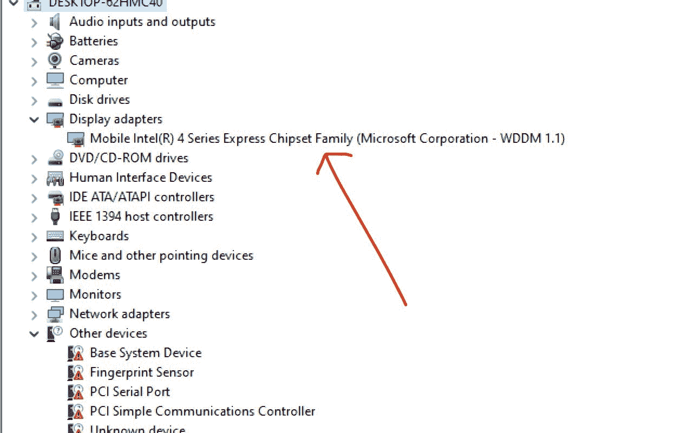
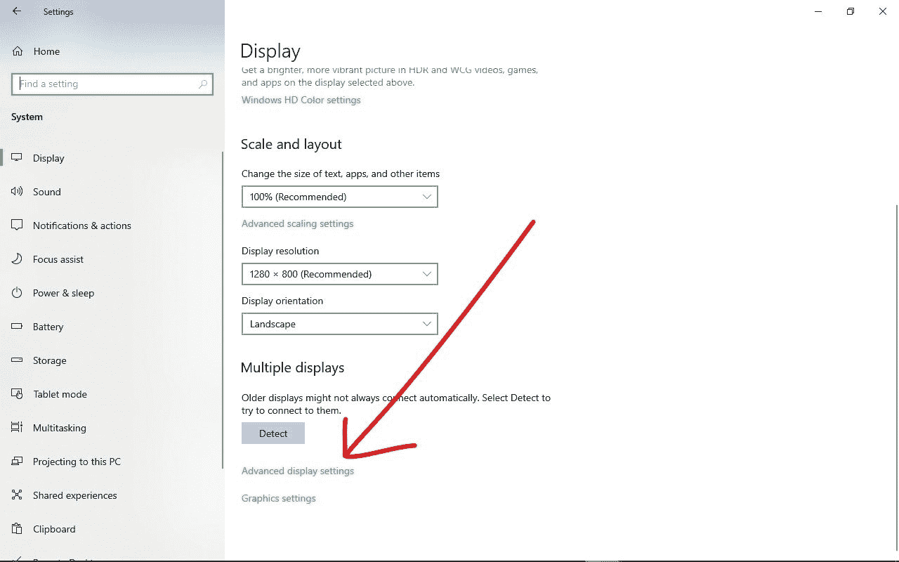
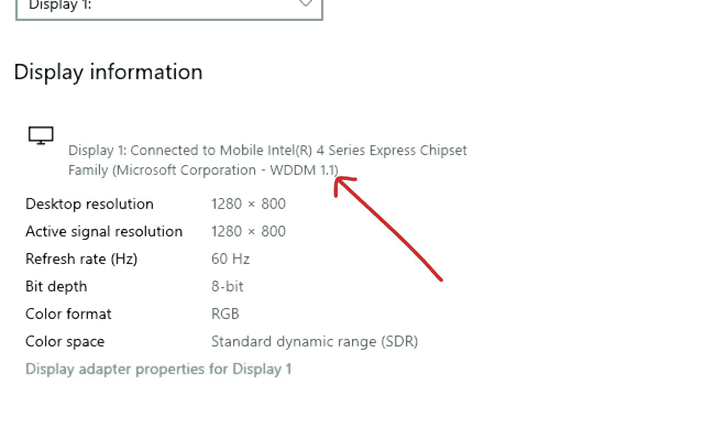

# 我有什么显卡？如何在 Windows 10 中检查您的 GPU[PC 指南]

> 原文：<https://www.freecodecamp.org/news/what-graphics-card-do-i-have-how-to-check-your-gpu-in-windows-10-pc-guide/>

每台计算机都有一个图形卡来处理你在显示器上看到的每个像素的渲染。这种显卡在显示视频、运行应用程序，尤其是处理视频游戏图形方面也起着至关重要的作用。

计算机也有一个图形处理单元(GPU)，用于渲染图像和视频。您的计算机具有来自英特尔、AMD 或 NVIDIA 的 GPU。

如果您的电脑没有带强大 GPU 的显卡，您可能无法玩最新的游戏、运行信息图表和使用视频密集型应用程序。某些应用程序可能无法正确渲染。

在这篇指南中，我将向你展示在 Windows 10 中检查你的 GPU 的 3 种方法，这样你就可以知道你有什么，你是否需要升级它。

## 如何使用 DirectX 诊断工具检查 GPU

**第一步**:点击开始菜单，搜索“dxdiag”，打开。

**第二步**:可能会提示您选择“是”。确保选择“是”继续。

**第三步**:点击显示标签，你会看到你的 GPU 厂商、型号等信息:

## 如何通过设备管理器检查 GPU

**步骤 1** :要在设备管理器下检查你的 Windows 10 电脑的 GPU，点击开始或搜索图标，搜索“设备管理器”。然后点击设备管理器或按回车键。

**第二步**:展开显示卡分支，查看您电脑的 GPU 型号和厂商:

## 如何通过设置检查 GPU

**第一步**:要在设置中查看电脑的 GPU，点击开始，点击齿轮图标打开设置。

**第二步**:从您看到的列表中选择“系统:

**第三步**:确认选择了“显示”。尽管它总是在列表的第一位。

**第四步**:在“多重显示”下，点击“高级显示设置”:

**第五步**:你应该马上看到默认显示器的 GPU 信息，包括型号和厂商(Intel，AMD，NVIDIA)。

如果您安装了多个显示器，请选择您想要查看其 GPU 信息的显示器。

## 结论

在本指南中，您了解了检查 Windows 10 电脑的图形处理单元的 3 种不同方法。这将帮助你更多地了解你的设备，也知道如果 GPU 不够强大，你需要做什么。

感谢您的阅读。如果你觉得这篇文章有帮助，请分享给你的朋友和家人。