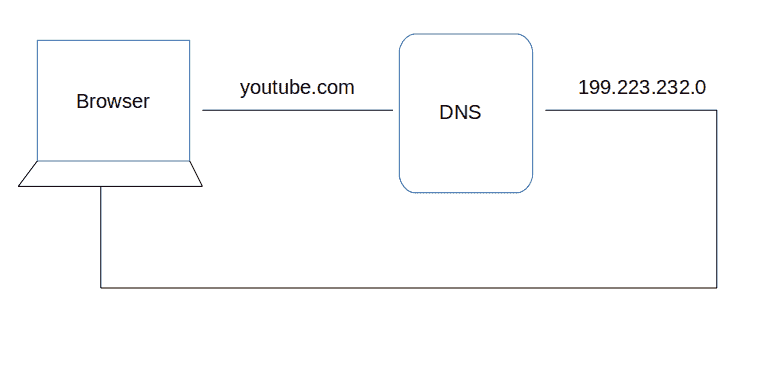
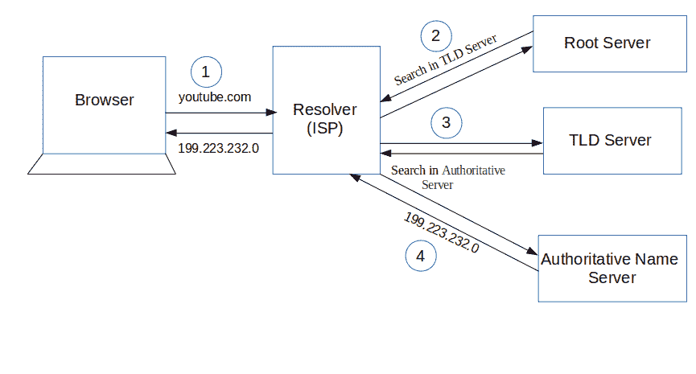
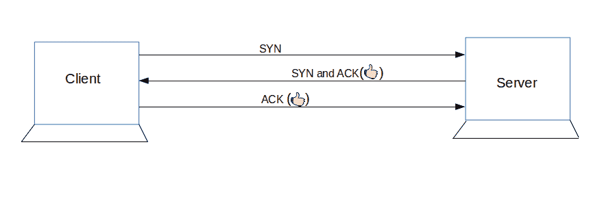

# 当你点击浏览器中的一个网址时会发生什么

> 原文：<https://www.freecodecamp.org/news/what-happens-when-you-hit-url-in-your-browser/>

在这篇文章中，我想让我的读者了解网络世界的一个非常基本的概念。以前，我写过一些关于当今市场的花哨东西的文章，如[《角之旅》](https://www.freecodecamp.org/news/angular-a-journey-into-one-of-the-most-popular-front-end-tools-in-todays-job-market/)、[、【react 基础知识】、](https://www.freecodecamp.org/news/start-your-journey-into-the-world-of-react-by-learning-these-basics-d6e05d3655e3/)等。但是，今天，我想让我的读者进入他们点击任何 URL 时最初遇到的旅程。

因为这个主题是不言自明的- **当我们点击任何 URL 时，会发生什么？**——开始吧！

在讨论**点击 URL** 后会发生什么之前，我们必须了解 URL 实际上是什么，以及 URL 的不同部分意味着什么，对吗？不浪费任何时间，让我们了解更多关于网址。

## URL 统一资源定位器

如果你查看它的完整形式，那么它是不言自明的:它有我们想要访问的资源的位置。它是一个我们想去的地方的**地址，在那里我们可以进行交互或查找信息。**

让我们看看你的日常生活。如果你想去你朋友家做些工作或获取信息，你需要他们的地址。在这个巨大的网络世界里也是一样:我们必须给出我们想要访问的网站的地址。网站就像房子，URL 就是地址。

### URL 的剖析

现在，我们知道什么是 URL，但是我们仍然不知道 URL 的组成部分。我们走吧！

让我们举个例子:

[https://www.example.com/page1](https://www.example.com/page1)

这里，第一部分是**‘https’**。这基本上是告诉浏览器应该使用哪个协议。可以是 **http，https，ftp，**等。一个**协议**是一组**规则**，浏览器使用它们在网络上进行通信。**‘https’**基本上是一个**安全版本**，即以安全的方式交换信息。

第二部分**www.example.com**是一个**域名**。可以联系到朋友家。这是一个网址。我们使用它来访问负责为该网站提供信息的服务器(经过训练的计算机)。等等！你可能会想，一秒钟前我提到的网址是地址，而我也提到域名也是地址。你可能被搞糊涂了。不要迷茫！

### URL 和域名的区别

两者之间的主要区别在于 **URL 是一个完整的地址**。URL 告诉我们信息交换的方法，即到达网站后的路径。而**域名是 URL** 的一部分。

让我们以前面的例子来更好地理解。你可以说你朋友的住宅地址是一个域名，而 URL 不仅告诉你朋友的住宅地址(域名)，还告诉你如何交流，比如在一个单独的房间里谈话(安全)或在所有人面前谈话(信息可能会泄露)。它还告诉路径，即进入房子后，你会去房子的哪一部分。因此，域名是 URL 的一部分。包含更多信息的域名是 URL。

我希望现在你清楚网址。让我们进入下一部分。

## 域名

在前面的部分，我解释了关于域名，但并不深入。我希望你能更深入地了解它。我说过了，域名就是网站的地址。在如此庞大的网络世界中，它给你的**网站**一个**独特的身份**。没有两个域名可以相同，但-是的！有‘但是’。这不是域名的唯一定义。背后还有一个故事。让我们进入那个故事。

众所周知，当我们点击任何 URL 或者你可以说是域名，那么这个网站就会打开并显示其内容。一台服务器(一台训练有素的计算机)为它服务。我们还知道，每台计算机都有一个 IP 地址，用于通过互联网进行通信。它是一个不言自明的“IP 地址”。当我们**点击**任何**网址，**那么我们实际上是**点击**负责提供网站内容(托管)的电脑的 **IP 地址**。

但是，现在，你可能会想管它呢...所有东西都是地址吗？如果 IP 地址在，为什么这个域名会存在？为什么不能用 IP 地址获取网站内容？

是啊！你可以**使用 IP 地址**到**获取网站的内容**但是真的！..你能记住每个网站的相关 IP 地址吗？显然不是！记住每个网站的 IP 地址很难**到**。这就是域名进入市场的原因。****

你可以把它和你的联系人列表联系起来。你不可能记住每个人的号码，但你可以记住他们的名字。同样的概念也适用于此。你**记不住**那些吓人的 **IP 地址**，但你**却能轻松记住** **域名**。

这些大量的数据保存在一个数据库中，其中存储了域名及其 IP 地址。一个存储域名及其对应 IP 地址的系统被称为 **DNS(域名系统)**(相信你一定听说过)。

我想我已经讨论了足够多的基础知识。现在，深入了解我们点击任何 URL 的过程。

## DNS 查找以查找 IP 地址

找到 URL 后，首先要做的是解析与域名相关的 IP 地址。DNS 有助于解决这个问题。 **DNS 就像一本电话簿**，**帮助我们提供与域名相关的 IP 地址**，就像我们的电话簿给出一个与人名相关的手机号码一样。

这是概述，但是这个域名查询经过了**四层**。让我们来了解一下步骤:

1.命中 URL 后，检查**浏览器缓存**。因为浏览器会在一段时间内保存您之前访问过的网站的 DNS 记录。因此，首先，DNS 查询在这里运行，以找到与域名相关联的 IP 地址。

2.DNS 查询在**操作系统缓存**中运行的第二个位置，随后是**路由器缓存**。

3.如果在上面的步骤中，DNS 查询没有得到解决，那么它需要解析服务器的帮助。解析服务器只不过是你的 ISP(互联网服务提供商)。查询被发送到 ISP，在 ISP 处，DNS 查询在 **ISP 缓存中运行。**

4.如果在第 3 步中也没有找到结果，则请求发送到 DNS 层次结构的**顶层或根服务器**。它不会说没有找到结果，但实际上它会告诉你，从哪里可以得到这些信息。如果您正在搜索顶级域名的 IP 地址(。com，。网，。Gov，。org)。它告诉解析服务器搜索 **TLD 服务器**(顶级域名)。

5.现在，解析器要求 TLD 服务器给出我们域名的 IP 地址。TLD 存储域名的地址信息。它告诉解析器让它去**权威的名称服务器。**

6.权威域名服务器负责了解域名的所有信息。最后，解析器(ISP)获取与域名相关联的 IP 地址，并将其发送回浏览器。

获得 IP 地址后，resolver 将其存储在缓存中，这样下次如果出现相同的查询，它就不必再次执行所有这些步骤。它现在可以从缓存中提供 IP 地址。

这是关于解析与域名相关联的 IP 地址的所有步骤。请看下面的内容，以便更好地理解:

## TCP 通过浏览器与服务器建立连接

一旦**找到**电脑的 **IP 地址**(你的网址信息就在那里)，它**就发起与它的连接**。为了通过网络进行通信，遵循**互联网协议**。TCP/IP 是最常见的协议。两者之间通过一个叫做**‘TCP 三次握手’**的过程建立连接。让我们简单了解一下这个过程:

1.客户端计算机发送一条 **SYN 消息**表示第二台计算机是否对新连接开放。

2.然后**另一台计算机**，如果对新连接开放，它也发送带有 SYN 消息的**确认消息**。

3.此后，**第一台计算机**接收其信息，并通过**发送**一个**确认信息进行确认。**

为了更好地理解，请看下图。

## 通信开始(请求响应过程)

最后，在客户机和服务器之间建立连接。现在，他们可以互相交流和分享信息。连接成功后，**浏览器(客户端)**向**服务器**发送一个**请求**我想要这个内容。服务器知道它应该为每个请求发送什么样的响应。因此，**服务器会回应。**该响应包含您请求的所有信息，如网页、状态代码、缓存控制等。现在，浏览器呈现所请求的内容。

就是这样！当我们点击任何 URL 时，上述所有过程都会发生。尽管这个漫长的过程不到几秒钟就能完成。这是你的问题**“当我们点击浏览器中的任何网址时会发生什么？”**

感谢阅读！