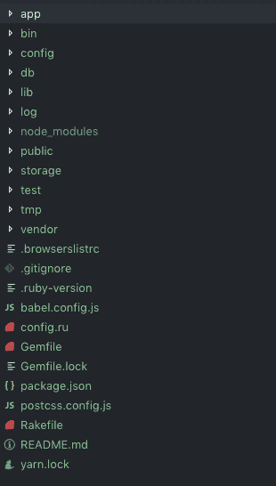

# 当您创建一个新的 Rails 项目时会发生什么

> 原文：<https://www.freecodecamp.org/news/what-happens-when-you-run-rails-new/>

当你第一次打开你的终端并写下`rails new`的时候，创建的文件和文件夹的数量会让人不知所措。您甚至可能在许多 Rails 项目上工作，而从来没有打开过这些文件夹——那么它们到底是什么呢？他们在幕后做什么？

事实上，你并不需要很多这样的标志，Rails 在`new`命令中内置了几个标志，这将允许你创建一个没有 Rails 内置默认标志的新项目(要了解更多信息，只需键入`rails new —help`)。也就是说，对于大多数项目，你将运行`rails new`并创建一个糟糕的项目文件夹。

在这篇文章中，我将浏览一个新的 Rails 6 项目中的每一个文件和文件夹。当您在新的 Rails 项目中工作以理解一些更难理解的文件夹时，请随意使用它作为参考。将这篇文章加入书签，当你发现自己在一个新的 Rails 项目中无所事事时，可以随时返回。

让我们开始吧:

`rails new example-project`

哇，太多了！

首先，Rails 正在创建一个新的 Rails 应用程序所需的所有文件和文件夹。
然后是取宝石捆绑；这些是 Rails 需要的依赖项，以便以最简单的方式运行您的网站。好像很多？在某种程度上是这样，但是这些宝石增加了功能，使得 Rails 项目很容易启动。本质上，你现在需要做的就是运行`rails server`,这样你就有了一个本地运行的 webapp:这是非常强大的，不是你可以这么容易/不用/不用那些样板文件就能得到的。

让我们进入所有这些文件夹:

```
 create README.md
   create Rakefile
   create .ruby-version
   create config.ru
   create .gitignore
   create Gemfile
     run git init from "."
Initialized empty Git repository in /Users/tfantina/Documents/Code/FileStructure/.git/
   create package.json
   create app
   create app/assets/config/manifest.js
   create app/assets/stylesheets/application.css
   create app/channels/application_cable/channel.rb
   create app/channels/application_cable/connection.rb
   create app/controllers/application_controller.rb
   create app/helpers/application_helper.rb
   create app/javascript/channels/consumer.js
   create app/javascript/channels/index.js
   create app/javascript/packs/application.js
   create app/jobs/application_job.rb
   create app/mailers/application_mailer.rb
   create app/models/application_record.rb
   create app/views/layouts/application.html.erb
   create app/views/layouts/mailer.html.erb
   create app/views/layouts/mailer.text.erb
   create app/assets/images/.keep
   create app/controllers/concerns/.keep
   create app/models/concerns/.keep
   create bin
   create bin/rails
   create bin/rake
   create bin/setup
   create bin/yarn
   create config
   create config/routes.rb
   create config/application.rb
   create config/environment.rb
   create config/cable.yml
   create config/puma.rb
   create config/spring.rb
   create config/storage.yml
   create config/environments
   create config/environments/development.rb
   create config/environments/production.rb
   create config/environments/test.rb
   create config/initializers
   create config/initializers/application_controller_renderer.rb
   create config/initializers/assets.rb
   create config/initializers/backtrace_silencers.rb
   create config/initializers/content_security_policy.rb
   create config/initializers/cookies_serializer.rb
   create config/initializers/cors.rb
   create config/initializers/filter_parameter_logging.rb
   create config/initializers/inflections.rb
   create config/initializers/mime_types.rb
   create config/initializers/new_framework_defaults_6_0.rb
   create config/initializers/wrap_parameters.rb
   create config/locales
   create config/locales/en.yml
   create config/master.key
   append .gitignore
   create config/boot.rb
   create config/database.yml
   create db
   create db/seeds.rb
   create lib
   create lib/tasks
   create lib/tasks/.keep
   create lib/assets
   create lib/assets/.keep
   create log
   create log/.keep
   create public
   create public/404.html
   create public/422.html
   create public/500.html
   create public/apple-touch-icon-precomposed.png
   create public/apple-touch-icon.png
   create public/favicon.ico
   create public/robots.txt
   create tmp
   create tmp/.keep
   create tmp/cache
   create tmp/cache/assets
   create vendor
   create vendor/.keep
   create test/fixtures
   create test/fixtures/.keep
   create test/fixtures/files
   create test/fixtures/files/.keep
   create test/controllers
   create test/controllers/.keep
   create test/mailers
   create test/mailers/.keep
   create test/models
   create test/models/.keep
   create test/helpers
   create test/helpers/.keep
   create test/integration
   create test/integration/.keep
   create test/channels/application_cable/connection_test.rb
   create test/test_helper.rb
   create test/system
   create test/system/.keep
   create test/application_system_test_case.rb
   create storage
   create storage/.keep
   create tmp/storage
   create tmp/storage/.keep 
```

让我们开始吧:

```
cd example-project
code . 
```



In VSCode this is what we have

我们将按照 Rails 组织它们的顺序进行，在大多数情况下，我将讨论每一个文件夹和文件，对于重复的文件(例如。保持)我只提一次。你会注意到 Rails 中有很多约定，比如“应用程序 _[框架]s”(`application_controller.rb`、`application_helper.rb`、`application_job.rb`等)。在这种情况下，我将详细介绍这个文件夹，这样您就知道里面有什么，只需要知道现有的文件“application_[...].rb”是一个父类，您在该文件夹中创建的其他类将继承它。

# 应用程序文件夹

是您的大部分开发工作将发生的地方/应用程序包含模型、视图和控制器，当浏览器请求时，它们将提供给用户。

### 应用/资产

为 Rails 资产管道存储资产。资产管道将项目中的资产(JavaScript、CSS 和图像)集合在一起，并以最有效的方式提供给客户端。它通过连接和缩小资产来实现这一点。它还预编译用 Sass 和 CoffeeScript 编写的资产。
更多信息:[资产管道— Ruby on Rails 指南](https://guides.rubyonrails.org/asset_pipeline.html)

### 应用程序/资产/配置

见下文

#### app/assets/config/manifest.js

前面提到的资产管道由一个名为“链轮-轨道”的 Ruby gem 管理，它可以完成上述所有工作。“链轮-轨道”有一些相关的辅助宝石，如“萨斯-轨道”，“丑角”和“咖啡-轨道”。Coffee-rails 和 Sass-rails 将您的 Sass 和 CoffeeScript 预编译成 CSS 和 JavaScript，而 Uglifier 缩小了这些资产。Manifest.js 让您专门设置什么将被预编译。关于这个特定文件的更多信息，请参见: [eileen.codes | Rails 5:链轮 4 清单](https://eileencodes.com/posts/the-sprockets-4-manifest/)

### 应用程序/资产/图像

图像资产，如资产管道的图标和 SVG 可以放在这里。

#### 。保持

这是第一个。保存您将在整个新 Rails 项目中看到的文件。这些不是 Rails 文件，而是 Git 文件，Git 通常不会跟踪空文件夹。要塞。文件上只写着“有人在这里”。任何带有. keep 文件的东西都会被 Git 跟踪。你不需要。如果你在文件夹里放了别的东西，就留着吧。

### 应用程序/资产/样式表

样式表文件夹是放置与应用程序关联的样式的地方。您可以用 CSS 或 SASS 编写现成的样式表。，资产管道将为您预编译任何和所有样式表。

#### app/assets/样式表/application.css

包含将包含在资产管道中的所有样式。全局样式可以在 Application.css 中编写，但是您也可以编写特定于控制器的样式表(当您运行命令`rails g`来创建一个新的控制器时，它将创建一个关联的样式表。`=require_tree .` 是 Rails 在一个目录中包含所有相关文件夹的方式，所以这个项目中的任何其他 css 文件在编译时都将被包含在内`=require_self`将包含您在 Application.css 文件本身中编写的任何 CSS，这是位置特定的，所以 Application.css 中的 CSS 将在其他文件夹之后运行`require_tree .`

## 。应用程序/频道

Rails 有许多更小的内部框架。ActionCable 是一个框架，允许您使用 WebSockets 在应用程序中创建实时功能，如聊天和自动更新通知和新内容的“订阅”。如果你不打算实现任何实时功能，你不需要担心任何 ActionCable 文件夹。channels 文件夹包含用于创建这些连接的服务器端 Ruby 文件。
你可以在这里阅读所有关于 ActionCable 的内容: [Action Cable 概述——Ruby on Rails 指南](https://guides.rubyonrails.org/action_cable_overview.html)

### 应用/频道/应用 _ 有线电视

Application_cable 保存频道和连接文件，用于在应用程序中创建新的实时功能。

#### app/channels/application _ cable/channel . Rb

你的应用程序的每个单独的实时功能将被封装到一个单独的渠道渠道。例如，聊天功能聊天可以是一个频道。新发布内容的通知系统将是一个单独的通道。该文件夹包含应用程序的所有通道。

#### app/channel/application _ cable/connection . Rb

连接是用户和服务器之间的身份验证。它们不处理任何逻辑(通道就是这样做的)，而是检查以确保当前用户被授权订阅应用程序中的各种通道。在大多数情况下，这将是一个简单的用户登录验证。

## 应用程序/控制器

模型视图控制器中“MVC”模式的“C”部分。控制器就像模型和视图之间的中间人。基于用户的请求，控制器将从模型中获取任何相关的数据，并将其传递给向用户显示的视图。例如，如果用户正在导航到 localhost:3000/posts 页面，控制器将决定向他们显示什么视图以及模型中的任何相关记录。

### 应用程序/控制器/问题

关注点是一种缩小模型的方法，而不是在一个模型中编写大量可重用的方法，你可以将这些方法放到关注点中，这样它们就可以在你的控制器中被轻松重用。

### app/controller/application _ controller . Rb

控制器只是继承自 ActionController 类的 ruby 类。随着您向项目中添加更多的模型，您将需要处理更多的控制器。application_controller.rb 对于任何 Rails 项目都是必需的，因为它继承自`ActionController::Base`，并且所有未来的控制器 intern 都继承自它，从而赋予它们控制器的功能。
你会看到很多“应用 _【此处插入相对标题】。rb”文件:application_controller.rb，application_helper.rb，application_record.rb .在大多数情况下，这些代表了与应用程序交互的全局方式，是从基类继承然后被未来的类继承的中介，或者两者都是。我不会讨论所有情况下这些文件的功能。

## 应用程序/助手

助手是保持视图整洁的一种方式。视图应该简单地将信息以 html 的形式显示给用户。如果你发现你的 html.erb 文件因为大量的小计算或逻辑而停滞不前，你应该将这些代码转移到帮助器方法中。

### app/helper/application _ helper . Rb

提供了一个编写全局助手的地方，当您创建更多的控制器时，您将有更多的助手来处理特定的控制器和视图。

## 应用程序/javascript

这个文件夹是放置您在应用程序中使用的所有 javascript 的便利位置，Rails 资产管道会将它们从这个文件夹包含到它们应用的任何页面中(资产管道知道脚本属于哪里，因为文件通常也遵循它们应用的控制器的命名约定)。

### 应用程序/JavaScript/频道

我们已经在上面看了 ActionCable 的通道，但是这个文件夹包含了用于创建实时 WebSocket 连接的客户端特定的 javascript。

#### app/JavaScript/channel/consumer . js

消费者是 WebSocket 连接的客户端；订阅该频道的最终用户。这个脚本将把这些消费者连接到客户端的通道。

#### app/JavaScript/channel/index . js

一个应用程序可以有多个频道(聊天、提醒、新帖子等)。index.js 是应用程序中所有通道的客户端目录。

#### app/JavaScript/packs/application . js

Webpacker 是一个 ruby gem，它允许您在 Rails 项目中使用 JavaScript bundler web pack。它与资产管道协同工作，用于大型 Javascript 框架，而不是小型脚本或其他资产，如 CSS 或图像(Webpack 通常会在 JavaScript 项目中处理)。然而，Webpacker 是灵活的，这只是默认设置。如果你愿意，你可以让 Webpack 处理图像和更小的 JavaScripts，完全绕过资产管道。您可以通过要求不同的资产在该文件夹中指定。打包的默认资产包括:

```
*require("@rails/ujs").start()*
*require("turbolinks").start()*
*require("@rails/activestorage").start()*
*require("channels")* 
```

### 应用程序/作业

作业是在用户继续使用您的应用程序时运行的后台任务。每当您的操作涉及大量处理，足以显著降低用户体验并导致您的应用程序“挂起”时，您应该创建一个后台作业，在后台运行该任务，以允许用户继续不间断地使用您的站点。关于作业的更多信息，请参见: [Rails 活动作业教程:如何使用 Active Job | code ship | via @ code ship](https://blog.codeship.com/how-to-use-rails-active-job/)

#### 应用程序/资产/作业/应用程序 _ 作业. rb

见上文。

## 应用程序/邮件程序

你可以把邮寄者想象成电子邮件的控制者。您可以使用`Rails generate mailer`创建新的邮件程序。这将给你一个相当于模型和控制器的东西，用来给你的用户发送电子邮件。

### app/mailers/application _ mailer . Rb

见上文。

## 应用程序/型号

MVC 的“M”；模型是存储在数据库中的数据的模板。一般来说，任何表都被认为是一个“模型”。常见的型号可能是`User`、`Post`或`Comment`。请注意，这些东西是单数而不是复数，这是指模型的原型性质。这与控制器是复数形成对比，因为控制器引用多个记录。

### 应用程序/模型/问题

关注的是模块——当模型变得过于庞大时，通常从模型中提取的可重用代码的小块。关注点文件夹是内部 Rails 框架 ActiveSupport 的一部分，它使模块更容易管理。

欲了解更多信息，请参阅 Rails [指南中的关注点](https://api.rubyonrails.org/classes/ActiveSupport/Concern.html)。

### app/models/application _ record . Rb

Application_record.rb 继承自`ActiveRecord::Base`，你的应用中所有后续的模型都将继承自`ApplicationRecord`，类似于 Application_controller 如何使`ActionController`的功能对所有其他控制器可用。

## 应用程序/视图

MVC 模式的最后一部分是视图。Views 文件夹包含用户将在浏览器中看到的所有内容，大部分是嵌入了 Ruby (ERB)或。Haml 是 Ruby 的模板语言。新的控制器很可能有一个同名的关联视图文件夹(除非您正在创建一个 API)。一般来说，控制器中的每个方法都有一个关联的视图。

### 应用程序/视图/布局

你的新 Rails 应用将会有一个 Layouts 文件夹，里面有 **application.html.erb** 、 **mailer.html.erb** 和 **mailer.text.erb** 这些为 Rails 应用在浏览器和收件箱等不同领域设置了全局布局。您可能希望将布局的其他组件添加到该文件夹中，例如一个 **_header.html.erb** ，但是您的大多数视图将被组织到特定于其控制器的视图文件夹中。 **Application.html.erb** 是你的应用程序的主模板，这个文件为你的应用程序创建主 HTML `<head>`和`<body>`标签，视图本身显示在`<%= yield %>`中。Yield 只是一小段 Ruby 代码，为用户正在查看的页面添加适当的视图。拥有一个 **Application.html.erb** 文件可以让您的代码保持干爽，因为您不必为视图中的每个页面重复声明 doctype、head 元素或包含脚本和样式表。Rails 和资产管道会为您处理这些。如上所述，该文件夹中的三个文件是:

*   app/views/layouts/application . html . erb
*   app/views/layouts/mailer . html . erb
*   app/views/layouts/mailer . text . erb

# bin 文件夹

bin 文件夹有助于设置 Rails 应用程序，以便它和相关的命令可以正常运行。

## 箱/捆

确保 Gem 捆扎机正常工作。

## 箱子/横杆

Spring 是一个预加载器，它在您工作时保持 Rails 在后台运行(在某些情况下，您需要重启服务器，但大多数情况下，对视图或控制器的更改会自动并立即加载到您在开发环境中运行的应用程序中)。当您启动 Rails 应用程序时，这个文件会加载 spring。

## 料仓/耙子

Rake 代表 Ruby Make，用于运行几个命令来设置和更新服务器。

## 箱/设置

允许您编写首次启动应用程序时运行的命令。

## 箱子/弹簧

允许 spring 运行而不使用 Bundler 来捆绑你所有的 gem，这让 Spring 可以在你做任何改变的时候快速地重新加载你的开发页面。

## bin/webpack

如上所述，Rails 使用 Webpack 捆绑一些 JavaScripts，而不是 AssetPipeline，这个文件需要必要的设置，然后运行 Webpack。

## bin/web pack-开发-服务器

允许您定制 Webpack 的开发服务器，如果您不希望将您的部分或全部资产捆绑在您的开发环境中，您可能希望这样做。

## 箱柜/纱线

Yarn 是一个类似于 NPM 的 JavaScript 包管理器。您可以在 Rails 项目中使用这两种方法。

# 配置

Config，顾名思义，包含用于在不同环境中设置 Rails 应用程序的文件；开发和测试。

## 配置/环境

此文件夹允许您配置应用程序在开发、生产和测试环境中的工作方式。例如，您可能希望确保您的 action_mail 配置为通过生产中的邮件服务发送电子邮件，而不是开发中的邮件服务。

## 配置/初始化器

这个文件夹允许你设置粒度初始化器来定义你的 Rails 应用程序将如何执行。你很有可能不会在这里花太多时间，尤其是在你的第一批 Rails 应用程序上。

### config/initializer/application _ controller _ renderer . Rb

允许控制器在其范围之外呈现。更多信息请参见:[从 Rails 4.2 升级到 Ruby on Rails 5.0 应用用例——使用 Ruby 运行](https://mensfeld.pl/2015/12/upgrading-to-ruby-on-rails-5-0-from-rails-4-2-application-use-case/)

### config/initializer/assets . Rb

与资产管道相关；您应该记得，它为您的 Rails 应用程序中的页面提供它们需要的特定资产(CSS、JS 等)。在这里，您可以向加载路径添加资产，比如 node_modules。

### config/initializer/back trace _ silencers . Rb

回溯是一个调试工具，可以让你看到你的 Rails 应用程序中发生了什么，特别是当事情发生时，你可以精确定位故障的具体区域。通过确定允许在该文件中显示回溯来配置回溯显示的内容。

### config/initializer/content _ security _ policy . Rb

来自 Mozilla:“HTTP*Content-Security-Policy*response header 允许网站管理员控制允许用户代理为给定页面加载的资源。除了少数例外，策略大多涉及指定服务器来源和脚本端点。”[内容-安全-策略- HTTP | MDN](https://developer.mozilla.org/en-US/docs/Web/HTTP/Headers/Content-Security-Policy) 。本质上，这控制了允许流入你的应用程序的数据，以及来自什么外部来源的数据。例如，链接到应用程序外部的外部脚本、字体或图像。

### config/initializer/cookies _ serializer . Rb

确定 cookies 的格式，默认为`:json`

### config/initializer/filter _ parameter _ logging . Rb

我们将在下面讨论日志记录，但是有一些参数(接受的用户输入)如密码或敏感的用户数据，你不想在你的日志中显示，你可以在这里添加它们。filter_paramiter_logging 有点像。参数 gitignore。

### config/initializer/inflections . Rb

正如在模型解释中所讨论的，Rails 有单数和复数的命名约定。基于语言环境(你的应用程序的语言设置见下面的语言环境文件夹),你可以在这个初始化器中更新这些变化，尽管除非绝对必要，否则这可能不是一个好主意。

### config/initializer/mime _ types . Rb

MIME 类型-多用途互联网邮件扩展指定了电子邮件附件的格式。
[哑剧-维基百科](https://en.wikipedia.org/wiki/MIME)

### config/initializer/wrap _ parameters . Rb

默认情况下，Rails 将所有参数包装到 JSON 中，但是您可以使用`wrap_parameters`散列指定其他格式。[action controller::params wrapper](https://api.rubyonrails.org/classes/ActionController/ParamsWrapper.html)

## 配置/区域设置

通常会将 en.yml 作为唯一的文件加载。如果您的应用程序将有多种语言选项，您可以在这里将所有翻译作为 YML 文件包含进来。

## 配置/网络包

```
Allows you to configure Webpack settings based on the environment. 
```

### config/web pack/开发. js

### config/webpack/environment.js

### config/webpack/production.js

### config/webpack/test.js

### 配置/应用程序. rb

如果您使用的是 Passenger，将运行 boot.rb 文件。它将 gem 文件中您需要的所有 gem 都拉到您的项目中，并创建一个继承自`Rails::Application`的类`Application`

## config/boot.rb

创建一个环境变量`BUNDLE_GEMFILE`设置到你的项目的 gem 文件的位置，这是 Rails 知道从哪里获取依赖项或 gem 的方法，在一个现成的 Rails 安装中有大约 24 个。

## 配置/电缆. yml

类似于 database.yml(见下文)cable.yml 为 ActionCable 设置了开发、测试和生产适配器，您会记得这是 Rails 在应用程序中实现实时功能的方式。

## config/credentials.yml.enc

credentials.yml 替换 secrets.yml 作为密钥的位置。这个文件是加密的，所以没有人能读取你的密钥，只能用主密钥解密(见下文)。

## config/database.yml

您可以为开发、测试和生产设置一个默认的数据库(使您的代码更简洁)以及特定的数据库。

## 配置/环境. rb

在服务器上初始化 Rails 应用程序需要很多步骤，这取决于您使用的是`rails server`还是 Passenger，这些步骤可能略有不同，但是一旦 environment.rb 加载，应用程序就被初始化并开始运行。

## config/master.key

把这个扔进你的。gitignore 文件(见下文)，这是 Rails 中解密 credentials.yml.enc 的主密钥，任何人都不应该拥有它。要了解更多信息，你可以阅读这篇精彩的文章: [Rails 5.2 凭证-cedar code-Medium](https://medium.com/cedarcode/rails-5-2-credentials-9b3324851336)

## config/puma.rb

Puma 是 Ruby 的 web 服务器，也是 Rails 开发环境的默认 web 服务器。您可以通过这个文件夹配置 puma，改变诸如线程数和 Puma 监听传入请求的默认端口(默认为 3000)。

## config/routes.rb

路线是控制器周围的路线图。路由将传入的请求传送到服务器，并将它们定向到正确的控制器。与 config 文件夹中的大多数其他文件不同，在构建应用程序时，您将花费大量时间在这里设置路径。

## config/spring.rb

正如在 bin 文件夹中讨论的，Spring 是一个预加载器，这个文件实际上告诉 Spring 哪些文件和文件夹应该触发重启。

## 配置/存储. yml

ActiveStorage 是 Rails 5.2 中引入的一个框架，用于上传和存储图像等资产。您需要一个地方来放置这些东西，比如 AWS 实例，您可以在这个文件中指定这个位置。

## config/webpacker.yml

允许你添加额外的环境。

# 

## 数据库/种子

种子允许您用数据填充数据库。假设您希望看到分页功能的运行情况；你可以手动创建 11 个帖子，或者你可以使用 Faker 这样的工具为你随机创建 11 个帖子，并直接将它们插入你的数据库。

## 解放运动

Rails 指南将 Lib 定义为“应用程序的扩展模块”如果这听起来含糊不清，你不是唯一有这种感觉的人。lib 文件夹中具体放了什么有些争议:参见[Rails lib/-Extreme Programming-Medium](https://medium.com/extreme-programming/what-goes-in-rails-lib-92c74dfd955e)和[lib/目录中放了什么代码？](https://codeclimate.com/blog/what-code-goes-in-the-lib-directory/)但普遍的共识是，lib 应该为不适合 app 文件夹的代码保留，这些代码可以很容易地提取出来用于其他应用程序。它有两个子文件夹“资产”和“任务”

## 图书馆/资产

来自 Ruby on Rails 指南:

> “lib/assets 用于您自己的库代码，这些代码并不真正适合应用程序的范围，也不适合那些跨应用程序共享的库。"

## 库/任务

你可以写自定义的`rake`任务，放在这个文件夹里。这不是一个很常用的位置。

# 原木

日志记录是查看应用程序执行情况以及发现和解决问题的一种重要方式。默认情况下，该文件夹为空。您可以在 config/environments 文件夹中使用类似于:`config.log_level = :info`的命令初始化各种日志程序，在运行应用程序时，会在那里创建日志文件。更多详细信息，请参见 Datadog 的这篇精彩文章:[如何收集、定制和管理 Rails 应用程序日志](https://www.datadoghq.com/blog/managing-rails-application-logs/)

包括在日志文件夹中:

*   log/development.log

# 节点 _ 模块

您在项目中使用的任何节点包(如 Webpack 和 Babel)都依赖于几十个甚至几百个其他节点包。包管理器如 NPM 或纱将为您管理这些包。你不应该进入这个文件夹或编辑里面的任何东西。

# 公众的

public 文件夹包含外部资源，可以在应用程序的正常结构之外访问，比如 favicon、apple-touch-icons、robots.txt，当然还有错误页面。像 404，422 和 500 页。如果生产中的应用程序遇到某种错误，这些 HTML 页面将自动绕过路由、控制器或任何特定视图。这些页面不是 Rails 资产管道的一部分，因此您需要内联编写任何样式。

## 公共/机器人. txt

允许您指定搜索引擎如何抓取您的网站。

# 储存；储备

Rails 5.2 引入了 ActiveStorage，取代了回形针等 gem，并允许 Rails 直接与 AWS 或 Google 等云服务接口

# 试验

Rails 从一开始就内置了测试功能！Rails 中的默认测试套件是 MiniTest，因此您会发现所有这些文件夹都可以用于 MiniTest。有一些文件夹，您可以在其中测试特定的控制器、助手、模型、邮件程序以及编写集成测试，这些测试可以跨多个控制器工作，并重新创建类似于实际用户体验的东西。关于控制器测试和集成测试的更多内容，我推荐来自([杰森·斯威特](https://www.codewithjason.com/difference-integration-tests-controller-tests-rails/))的这篇文章

## 测试/通道

#### 测试/通道/应用程序 _ 电缆/连接 _ 测试. rb

测试 ActionCable 连接像所有 ActionCable 的东西一样，只有当你在应用程序中使用通道时才需要它。

## 测试/控制器

您可以在这里测试您的控制器，这些测试通常会查看您的控制器在模型和视图之间的表现，它们的范围比模型测试大，但比集成测试小。

## 测试/夹具

不是编写测试的地方，而是生成虚拟测试数据的地方。在 fixtures 文件夹中，您可以添加任意数量的带有预定义数据的 YML 文件。您可以将这些数据引入到您的测试中，以确保您的模型能够正常工作，并按照预期与应用程序进行交互。

### 测试/夹具/文件

既然 Rails 已经用 ActiveStorage 内置了文件处理功能，那么您不仅可以测试来自模型的数据，还可以测试文件。

## 测试/助手

您可以为 app/helpers 中的助手编写特定的测试。测试助手并不常见，但是如果助手过于复杂或者看起来脆弱，您可以这样做。

## 测试/集成

集成测试允许您测试控制器之间的交互，并提供更接近实际用户体验的测试选项。

## 测试/邮寄者

您甚至可以为您的邮件发送者编写测试，以确保电子邮件发送正确，格式正确。

## 测试/模型

最精细的测试之一；您可以确保记录被正确保存，数据库被更新，等等。

## 测试/系统

系统测试是在真实的浏览器中测试应用程序的一种方式，它会生成屏幕截图，向您展示运行中的一切。系统测试也会测试 JavaScript，并不是说你应该用 MiniTest 系统测试来代替 Jest 这样的好的 JavaScript 测试库。系统测试；但是，将允许您查看 JavaScript 在浏览器中的运行情况。

## 测试/应用 _ 系统 _ 测试 _ 案例. rb

这个文件保存了系统测试的默认设置，你可以改变浏览器，驱动或者屏幕分辨率。

## 测试/测试助手. rb

Test helper 引入测试所需的外部数据和库。您会注意到，很快`fixtures :all`就被导入了。这使得您的测试可以访问 fixtures。您可以从 test_helper.rb 设置许多其他测试套件和框架，以包含它们的功能和 DSL，如 Capybara、FactoryBot 和 Faker。

# 终端监督程式（Terminal Monitor Program 的缩写）

临时-此文件夹包含缓存和会话，有时可能会手动或在部署时清除(取决于您如何部署您的应用程序)。

# 小贩

供应商文件夹是存放第三方代码的地方，有点像 Gems。宝石；但是，更加独立，而 vendor 文件夹可能包含不作为 gem 捆绑的特定脚本。有关这方面的更多信息以及一些好处，请参见[如何出售宝石](http://fuzzyblog.io/blog/ruby/2014/08/22/how-to-vendor-gem-a-gem.html)。

# 。browserslistrc

Browserslist 是一款针对 NPM 工具(如 Babel)的特定浏览器版本的工具。默认设置为“默认值”,确保

# 。吉蒂尔

与任何其他项目一样，您的版本控制将忽略您在此处指定的任何文件或文件夹。

# 。ruby 版本

只包含了项目正在使用的 ruby 版本，RVM 可以读取这个文件并在你的电脑上设置正确的 Ruby 版本(如果你安装了多个版本的 Ruby)。

# babel.config.js

Babel 是一个 JavaScript 编译器，允许您使用 JavaScript 的最新和最强大的功能，并编译它们以兼容可能尚未采用这些功能的 web 浏览器。关于巴别塔配置的更多信息，请看他们的官方文档。

# config.ru

Rack(流行的 Ruby 服务器)使用这个文件来启动应用程序。

# gemfile

在 gemfile 中，您存储了应用程序的所有依赖项，正如您所看到的，Rails New 命令安装了许多 gem，但是当您向应用程序添加更多功能时，您将会频繁地进出这个文件。

# gemfile.lock

类似于节点项目的 package-lock.json，当您运行`bundle install`或`bundle update`时，这个文件被更新，并解析所有超出您手动包含在 gem 文件中的 gem 依赖项。不要弄乱这个文件，它是自动更新的。

# package.json

为 Javascript 模块建立 NPM 依赖关系，这些将与 Webpacker 打包在一起。

# postscss . config . js

PostCSS 为您提供了许多 CSS 的现代功能，从自动添加供应商前缀到包含 CSS 模块。关于这个酷工具的更多信息，请查看。

# makefile 先生

Rake 再次代表“红宝石制造”。Rails 内置了几个命令，这些命令需要 Rake，比如`rake routes`(显示应用程序的所有路线)`rake db:migrate`向 db 添加新的模型和列。其中，您可以在这里添加自定义 rake 命令。

# README.md

这是您项目的自述文件，它将显示在您的项目 Github 页面上，包括您认为对调查或使用您项目的其他人有用的任何信息。

# 纱线锁

与 package.json 非常相似，Yarn 是 Webpacker 默认的包管理器。这是一个锁文件，所以像 Gemfile.lock 一样，它会自动更新，您不应该手动更改它。

你成功了！恭喜你！

[https://giphy.com/embed/LVWQ9iBwkpLmU](https://giphy.com/embed/LVWQ9iBwkpLmU)

[通过 GIPHY](https://giphy.com/gifs/reactiongifs-LVWQ9iBwkpLmU)

* * *

# 额外资源

助手([Rails 助手初学者指南- Mix & Go](https://mixandgo.com/learn/the-beginners-guide-to-rails-helpers) )
关于 Keep 文件的信息( [StackOverflow keep 文件](https://stackoverflow.com/questions/29183372/rails-why-is-there-keep-file-in-every-directory) )
Rails 初始化([Rails 初始化过程— Ruby on Rails 指南](https://guides.rubyonrails.org/initialization.html) )
创建博客应用([Rails 入门— Ruby on Rails 指南](https://guides.rubyonrails.org/getting_started.html#creating-the-blog-application))

* * *

我知道这很难理解，但是让我简化一下。99%的 Rails 都可以让你定制你的项目，这就是为什么 Rails 对于大型企业和初创公司来说仍然工作得很好；你可以很容易地调整和调整你的应用程序的几乎任何部分。也就是说，对于大多数初学者来说，个人项目甚至是相当多的公司项目，你都很少会用到这个功能。

由于模型、视图和控制器代表了 Rails 应用程序的核心，您将在 app 文件夹中花费大部分开发时间。当您设置用户如何通过您的应用程序以及添加新的控制器动作时，您将在 config 文件夹中大量使用 routes.rb 文件。确保总是为你的应用程序编写合适的测试覆盖率。如果是，你会花很多时间在测试文件夹里。gemfile 是您经常访问的最后一个地方，可以根据需要添加和更新 gem。

虽然每一个新的`rails new`都会创建大量的文件和文件夹，但你不应该被它淹没；如果你迷路了，这个帖子会帮你的。