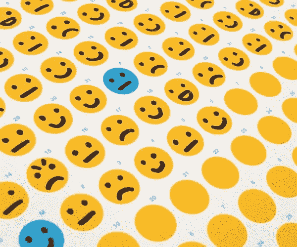
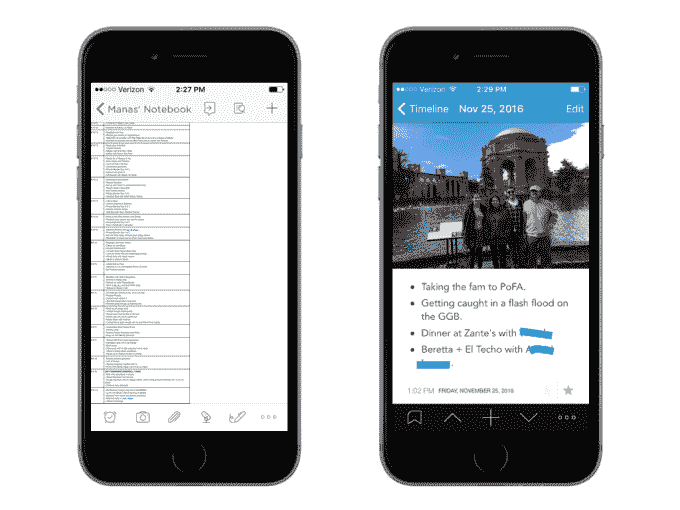
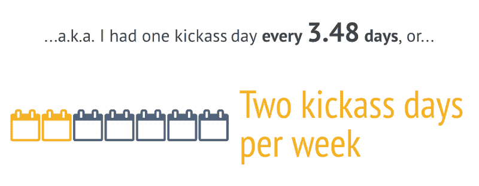
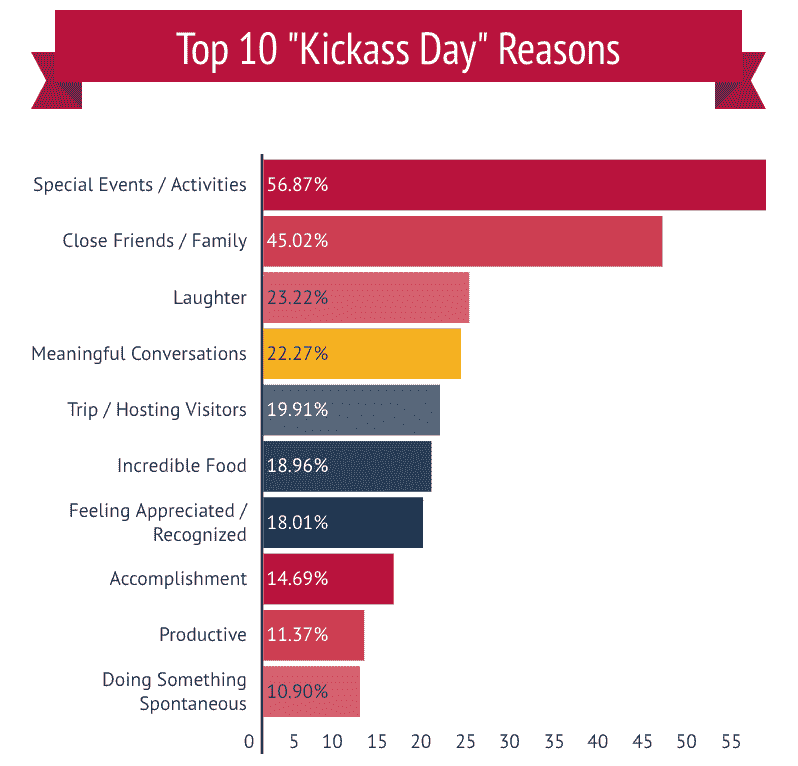
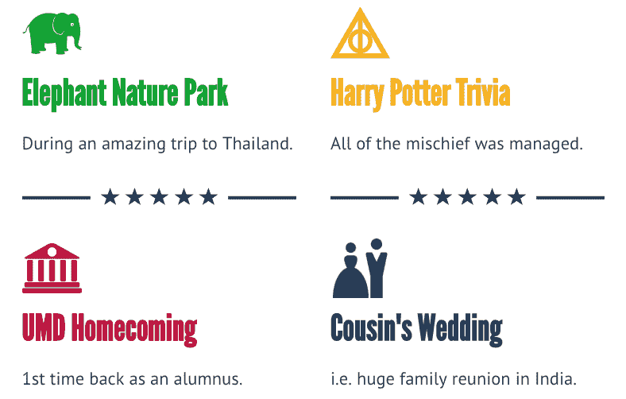

# 我分析了自己 736 天的快乐。以下是我学到的。

> 原文：<https://www.freecodecamp.org/news/what-i-learned-after-documenting-736-days-of-happiness-e23e406bde04/>

马纳斯·库尔卡尼

# 我分析了自己 736 天的快乐。以下是我学到的。

> “而且只需要一分钟，老兄。有时候我在用洗手间的时候会这样做。”

那是 2014 年 12 月，我和一个最好的朋友在圣克鲁斯吃饭。我不记得为什么了，但不知怎么的，我们聊到了“日常生活”这个话题，他告诉我他一直在写日记。

> 很简单——我只要写下至少一件每天发生的蠢事就行了

当他建议我尝试一下时，我立刻表示怀疑。我总是把写日志归类为“它可能对我有好处，但现实地说，我不会坚持下去”的想法之一(参见“用牙线清洁”、“冥想”和“一次只看一集《办公室》的**)。**

**但是在听到他是多么真诚地喜欢这样做——更重要的是，这样做是多么容易——之后，我想我应该试一试。我现在可以自豪地说，在两年多一点的时间里，我没有错过一天。**

**然而，我更想分享的是我通过挖掘所有条目发现的东西。(*注*我以前是统计学老师，上个月在印度有太多空闲时间。)**

**下面是我从这个过程和我的分析中学到的三件事。**

### **要点 1:这实际上很容易做到**

**我最初担心的是保持一致性，因为我保持习惯的记录糟糕得可笑。但我接受了朋友的建议，利用一天中的空闲时间来写日记:在上下班途中，从健身房回来的路上，或者在瓷器智囊团上。**

**最初，我把我的条目保存在 Evernote 文档中，但最终文件变得太大，拖慢了我的手机。我换成了 [**Day One**](http://dayoneapp.com/) ，这是一个漂亮的日常日志应用程序，允许你标记条目，添加照片，甚至设置每日提醒，这样你就不会忘记。**

**

(Left): Original two-column table in Evernote. (Right): Example entry in DayOne** 

**我不会撒谎，我经常会错过整整一周的条目，然后不得不回去补上，这很痛苦。但是当我忘记某一天发生的事情时，我会浏览那天的短信或邮件来唤起我的记忆。即使帖子很简单，就像“美味的意大利面和辣肉丸”，我也不介意——我只是想确认一下我有没有加入。**

### **要点 2:你拥有的好日子比你想象的要多**

**在糟糕的一天滚动浏览所有这些积极的条目并思考“酷，生活并不像今天看起来那么糟糕”不仅很棒，而且我还在第一天使用了一个功能来“标记”我认为特别棒的日子。这让我可以做两件事:**

#### **1.我计算了一下我有多长时间有一个“牛逼”的一天(又名“明星”条目)**

**在总共 736 条记录中，我有 **211 天“踢屁股”…****

****

**所以基本上我现在有了两年的证据，可以自信地说“这周至少有两天会很棒。”当然，这是主观的，因为它取决于我对“踢屁股”一天的定义(见下文)，但因为我是在预测我自己的生活，所以这种偏见不太相关。**

#### **b)我可以理解为什么这些天确实是“踢屁股”**

**我将所有条目导出到一个电子表格中，并手动标记每一天——是的，这非常累人——以及那天为什么“踢屁股”的具体原因**

**以下是 10 个最常见的原因:**

****

**对于那些想知道什么是“特殊活动”的人，这里有几个例子:**

****

### **要点 3:写日记不仅仅是“一个好习惯”**

**我之前提到过在雨天“滚动快乐”是很棒的，但是当我开始的时候我就已经预料到了这种好处。**

**没想到的是记忆力有了**的提升。凭借写下和重读细节，我可以很容易地回答类似“嘿，我们夏天去的那家餐馆是什么？”或者“我最近认识了一个人，他对 X，Y，z 非常了解。那个人是谁？”****

**我也没想到我的日志会给我**规定性的**信息。我已经知道“有意义的谈话”和“笑声”会让日子变得很好，但有具体的数据来提醒我应该做更多的事情(比如给印度的家人打电话或计划更多的周末旅行)也很好。**

**我们中的许多人已经花了几个小时在雇主的电子表格上，我们中的一些人一丝不苟地跟踪我们身体健康的数据。为什么我们不为自己的幸福做同样的事情呢？**

**我觉得就是那种没有得到足够重视的“数据驱动决策”。**

### **结论**

**回想起来，我认为我能够比其他任何习惯更持久地保持这个习惯的主要原因是，它在很短的时间内就有了**立竿见影的好处**，并且给了我一个**有形的进步记录**来分析。**

**也就是说，我想明确写日志的目的不是分析；我花了 10 个小时剖析所有这些数据，如果一开始就把作为最终目标，我一开始就不会这么做。(虽然制作这张信息图**——谢谢，[信息图](https://www.freecodecamp.org/news/what-i-learned-after-documenting-736-days-of-happiness-e23e406bde04/undefined))肯定很有趣。****

****真正的动机很简单:尽可能多地记录美好的回忆，因为坦率地说，时不时地阅读它们会很棒。这是真的:)****

****我想感谢你阅读这篇文章，并希望听到你的反馈，你的想法，以及你自己的发现，如果你正在做/将要做类似的事情。****