# 我从 Hacktoberfest 期间维护回购和合并 356 个 PRs 中学到了什么

> 原文：<https://www.freecodecamp.org/news/what-i-learned-as-a-hacktoberfest-repo-maintainer/>

Hacktoberfest 是为期一个月的开源庆典。今年，我作为维护者参与了 freeCodeCamp 的开发者问答网站 T1。

我合并了总共 356 个拉请求，并帮助许多新的贡献者开始使用开源。我们能够向[开发者测验网站](https://developerquiz.org/)添加总共 477 个新的测验问题。

以下是更多的统计数据:

### 2022 年 10 月 1 日统计

问题数量:694

福克斯:61

星星:42 颗

### 2022 年 11 月 1 日统计

问题数量:1171

福克斯:246

星星:109 颗

这一个月的漫长旅程是疯狂的，富有成效的，有趣的，有教育意义的。以下是我在 2022 年 Hacktoberfest 期间学到的所有东西。

## 目录

*   [这一切是如何开始的](#how-it-all-began)
*   [准备 Hacktoberfest](#preparing-for-hacktoberfest)
    *   [步骤 1:添加 Hacktoberfest 主题和标签](#step-1-adding-the-hacktoberfest-topic-and-labels)
    *   [第二步:创建问题模板](#step-2-creating-issue-templates)
    *   [步骤 3:更新贡献文档](#step-3-updating-the-contributing-documentation)
    *   [步骤 4:创建定义明确的问题](#step-4-creating-well-defined-issues)
    *   [第五步:添加已保存的回复](#step-5-adding-saved-replies)
    *   [第六步:开启 GitHub 讨论](#step-6-opening-up-github-discussions)
*   [我在 Hacktoberfest 期间学到的经验教训](#lessons-i-learned-during-hacktoberfest)
    *   [用耐心、同情心和善良来领导](#lead-with-patience-empathy-and-kindness)
    *   [不要因为垃圾邮件而激动](#dont-get-worked-up-over-spam)
    *   [如何得体地关闭不被接受的请购单](#how-to-gracefully-close-prs-that-will-not-be-accepted)
*   [结论](#conclusion)

## 这一切是如何开始的

2021 年 12 月，freeCodeCamp 发布了他们的[学习编码 RPG 游戏](https://www.freecodecamp.org/news/learn-to-code-rpg/)。这是一部交互式视觉小说，讲述了 Lydia 成为开发人员的梦想。

我参与了帮助创建关于 HTML、CSS、计算机科学、Python 等主题的测试问题。

大约在发布前一周，昆西找到我和其他几个人，想建一个开发者问答网站。这本来是一个[学习编码 RPG 游戏](https://www.freecodecamp.org/news/learn-to-code-rpg/)的伙伴网站，并为露营者提供一种在游戏之外练习更多测验问题的方式。

最初推出的[开发者问答网站](https://developerquiz.org/)有大约 600 多个问答问题。我们还在[资源库](https://github.com/freeCodeCamp/Developer_Quiz_Site)中创建了一些开放问题，供社区向网站添加更多问题。

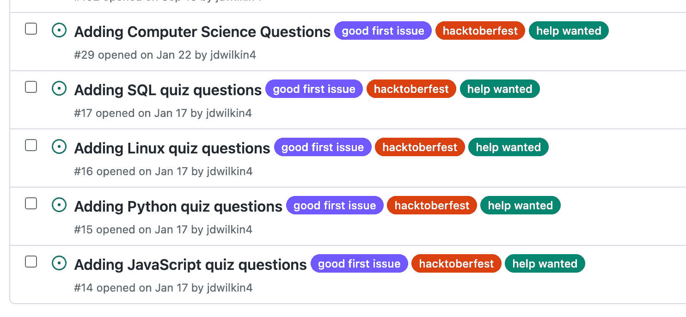

在 2022 年的部分时间里，存储库中有适度的活动，但大部分时间它仍然相当缓慢。但是当九月来临的时候，我考虑将[开发者问答网站](https://developerquiz.org/)加入 Hacktoberfest。

我联系了昆西，他认为这是一个好主意，因为我们可以利用这个机会从社区获得更多的测验问题。

## 为 Hacktoberfest 做准备

离 Hacktoberfest 开始还有大约 3 周。下面是我如何利用这段时间来准备存储库的。

### 步骤 1:添加 Hacktoberfest 主题和标签

第一步是将 Hacktoberfest 主题添加到存储库中，这样人们就知道我们将参加今年的活动。我整理了 About 部分，并添加了适当的标签来帮助邀请人们访问存储库。

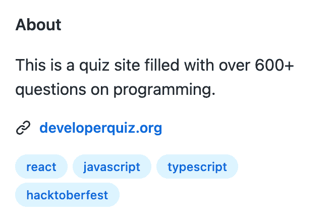

然后，我确保创建了`hacktoberfest-accepted`标签，这样我就可以将它应用到每个批准的 PR 上，帮助我们跟踪 Hacktoberfest PR 的总数。我还添加了`spam`、`hacktoberfest`和`first-timers-only`标签，因为我知道它们会派上用场。

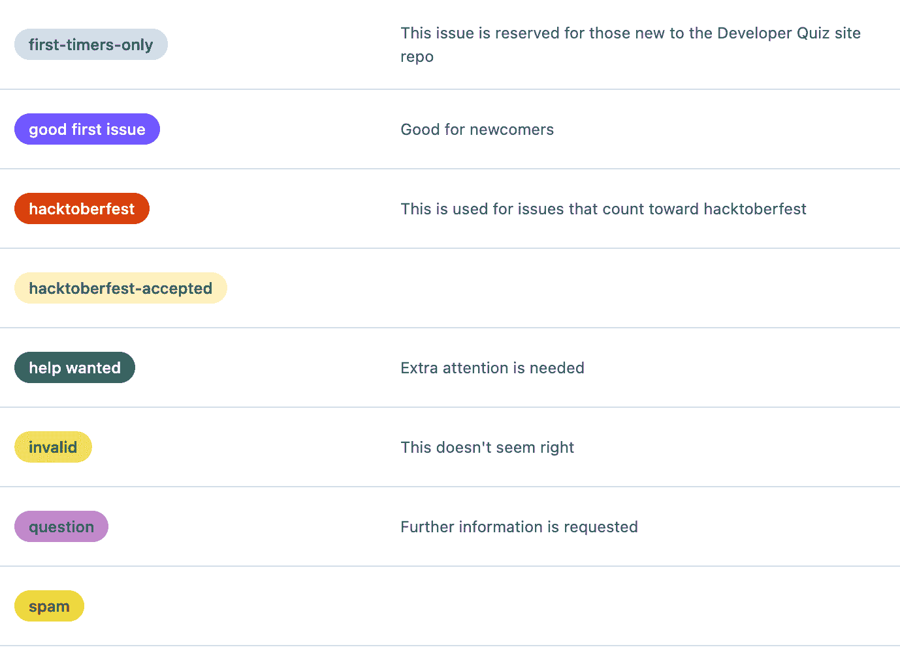

### 步骤 2:创建问题模板

GitHub 问题模板是一种很好的方式，可以确保贡献者提供所有必要的信息，用于错误修复、文档更改、功能请求或一般问题。

我决定设置 5 个问题类别，并设置一些必填字段，这样贡献者就可以对他们正在创建的问题提供一些详细信息。

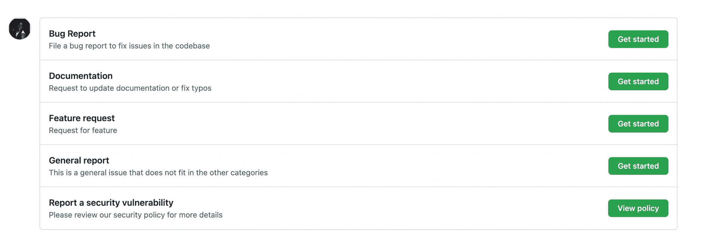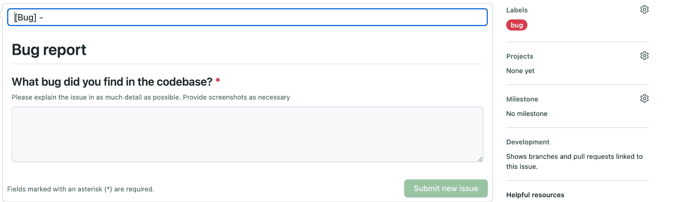

### 步骤 3:更新贡献文档

当存储库最初创建时，贡献文档指向[通用 freeCodeCamp 贡献指南](https://contribute.freecodecamp.org./#/)。虽然该文档非常全面，但对于人们如何最好地为[开发者问答网站知识库](https://github.com/freeCodeCamp/Developer_Quiz_Site)做出贡献，它却不够具体。

我决定彻底检查文档并为开发者测验站点创建一个新的深度文件。因为我预计会有很多 Git 和 GitHub 的初学者，所以我尽量让它变得容易上手，对初学者友好。

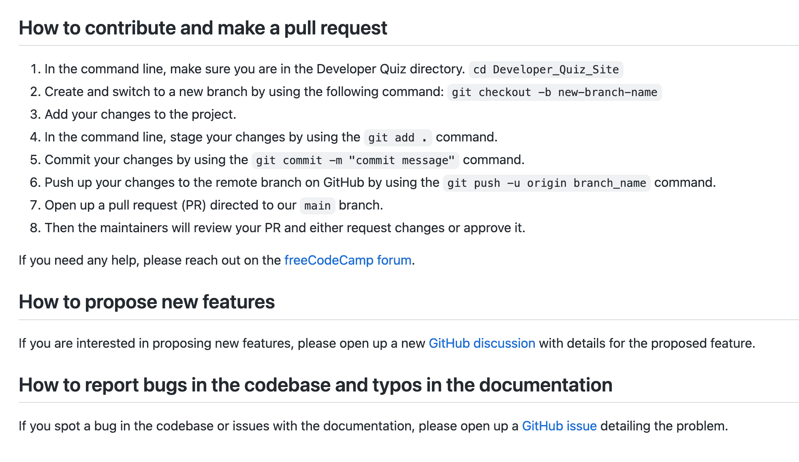

### 步骤 4:创建定义明确的问题

为了吸引贡献者加入我们的库，我知道我们需要一些明确定义的问题。如果问题太模糊，那么我知道人们会有成千上万的问题，或者可能没有兴趣投稿。

我确保包含了所有必要的提交指南，包括正确格式的代码片段、行为准则的链接、贡献文档以及他们需要更改的文件的链接。

这是我为了鼓励更多的 JavaScript 问题而创建的一个问题的例子。

#### 样本问题

developerquiz.org 目前有超过 600 道测试题。我们正在寻找 JavaScript 问题的扩展，我们鼓励其他开发人员将他们的测验问题添加到网站上。

请注意:我们只关注一般的 JavaScript 问题，而不是特定于库和框架的问题。

您可以在下面找到完整的问题列表。
[https://github . com/freeCodeCamp/Developer _ quick _ Site/blob/main/src/data/JavaScript-quick . ts](https://github.com/freeCodeCamp/Developer_Quiz_Site/blob/main/src/data/javascript-quiz.ts)

您可以将自己的问题添加到该文件的顶部。
**在创建 PR 之前，请首先检查以确保您的问题不存在于文件中。**

以下是问题的格式示例。

```
 {
    Question:
      "In JavaScript, what is the name of the method used to remove white space from the beginning and end of a string?",
    Answer: ".trim()",
    Distractor1: ".substring()",
    Distractor2: ".reduce()",
    Distractor3: ".slice()",
    Explanation:
      "The .trim() method removes white space (including space, tab, etc.) from both ends of a string and returns a new string without modifying the original.",
    Link: "https://developer.mozilla.org/en-US/docs/Web/JavaScript/Reference/Global_Objects/String/trim",
  }, 
```

对于`link`字段，请确保使用 freeCodeCamp 文章、freeCodeCamp YouTube 视频或官方文档。
如果您选择引用视频，请确保包含所涉及主题的时间戳。

你可以在这篇[有用的文章](https://www.lifewire.com/link-to-specific-part-of-youtube-video-1616414#)中了解更多关于如何创建时间戳的信息。

该问题不会分配给任何人，并将对多个贡献者开放。

请不要将您自己分配到此问题或关闭它。

快乐贡献！

对于我们的大多数问题，我希望多个贡献者能够参与。所以我在底部添加了一个免责声明，让人们知道它将保持开放，不会被分配给任何人。

我还确保添加了`good-first-issue`、`help-wanted`和`hacktoberfest`标签，以帮助吸引更多的贡献者。

### 步骤 5:添加保存的回复

[保存回复](https://docs.github.com/en/get-started/writing-on-github/working-with-saved-replies/creating-a-saved-reply)是 GitHub 上的一项功能，你可以创建并保存你自己的消息，以便在发布和拉取请求中重复使用。

我决定创建以下回复:

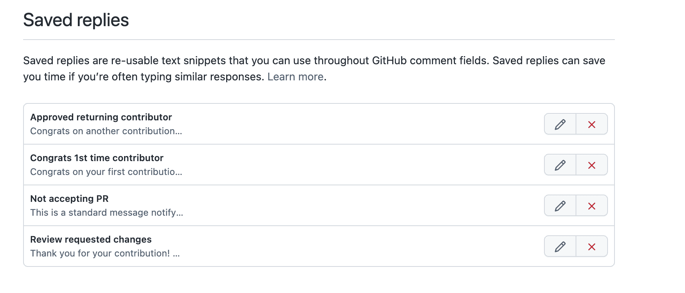

我希望回复祝贺第一次和返回的贡献者，因为他们花时间使我们的仓库变得更好。

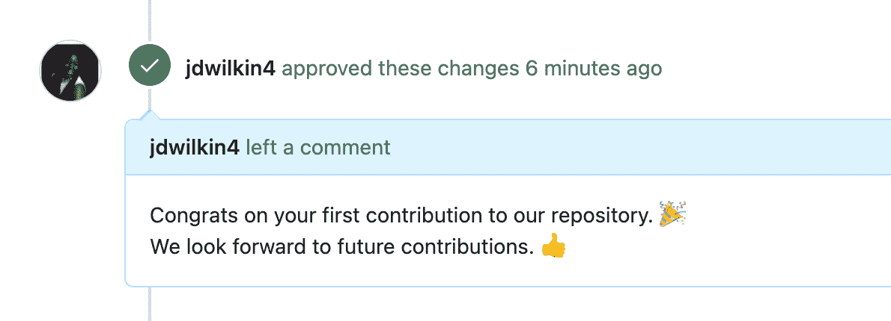

我还想创建一个回复，感谢贡献者的贡献，并请求对 pull 请求进行更改。

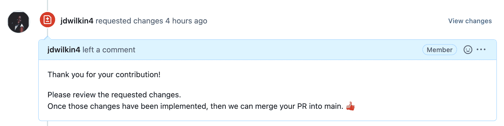

我创建的最后一个回复是为了让贡献者知道他们的 pull 请求已经过审核，但是不会被接受。我看到主 [freeCodeCamp 学习资源库](https://github.com/freeCodeCamp/freeCodeCamp)使用了类似的回复，所以我想把它包含在开发者测验网站资源库中。

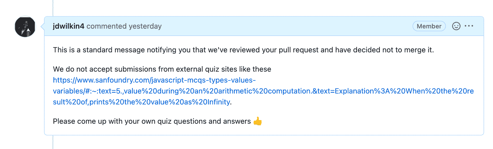

### 步骤 6:打开 GitHub 讨论

在 Hacktoberfest 开始的前几天，我想为贡献者开辟另一条渠道来提问和提出新功能。所以我决定开放 GitHub 讨论。

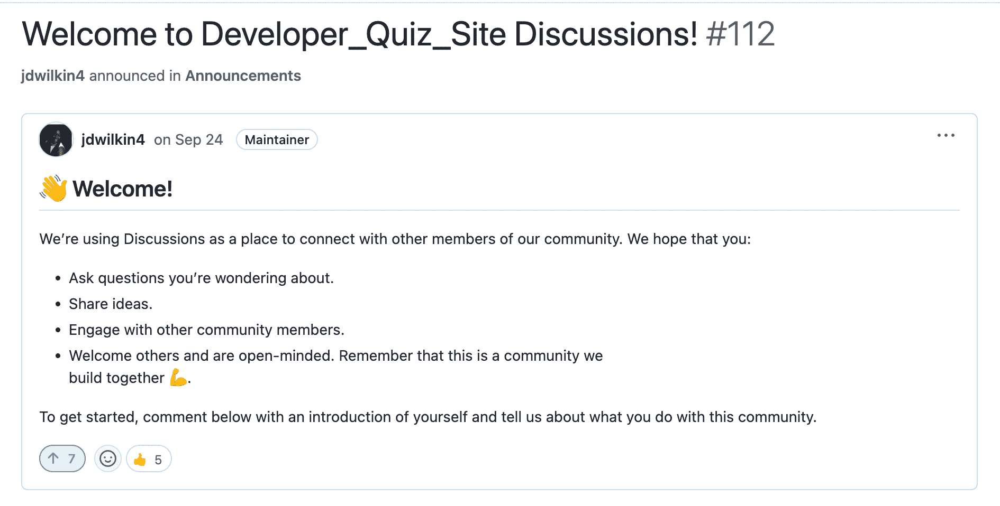

当我创建这个帖子的时候，我们有一些库的新成员感到很受欢迎，并且很高兴有一个地方可以与我和其他贡献者联系。

现在一切就绪，Hacktoberfest 的倒计时开始了。

## 我在 Hacktoberfest 中学到的经验

从第一天开始，我就忙于审查 pull 请求和帮助新的贡献者开始开源。但是整个经历很有教育意义，也很有收获。

以下是我在这段时间里学到的一些经验。

### 用耐心、同情心和善良来领导

我们都曾经是初学者，有时候学习新的东西是很可怕的。我确保以善良和同情开始，因为我记得刚开始做开源是什么样子。

每次有新问题进来，我都会确保回复，并尽我所能帮助他们解决问题。这导致了一个受欢迎和安全的学习环境。

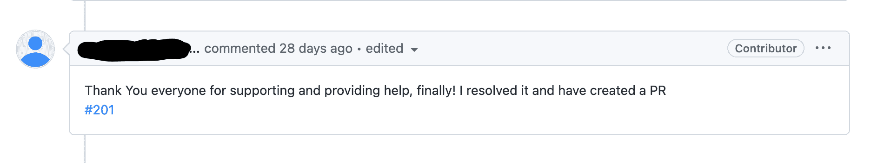

我们也有过一些时候，一些贡献者想增加测验问题，但因为英语不是他们的第一语言而感到紧张。我的工作是向他们保证我是来帮忙的，而不是对拼写或语法错误进行评判。

我相信这有助于我们最终得到更多的测验问题。

### 不要为垃圾邮件而激动

Hacktoberfest 的一个缺点是对开源维护者的垃圾邮件请求数量增加。虽然这很难处理，但我很快学会了关闭公关，将其标记为垃圾邮件，然后继续前进。

与他们争论或心烦意乱是没有意义的，因为那是浪费精力。大多数人确实想做出有意义的贡献，这也是我选择花费精力的地方。

### 如何得体地结束不被接受的公关

出现的一个令人惊讶的问题是，人们想从其他问答网站获取问答问题和解释，并将其添加到 [freeCodeCamp 的开发者问答网站](https://github.com/freeCodeCamp/Developer_Quiz_Site)。发生这种情况的前几次，我关闭了拉请求，并让他们知道这是抄袭，我们不能接受。

我收到了一个投稿人的回复，说他们没有意识到，他们想知道他们是否可以再试一次。我向他们保证，他们可以自由地创建一个新的公关，我可以帮助他们任何拼写或语法。

这让我修改了我的回答，让投稿人知道他们没有麻烦，以后可以带着他们自己的问题再次投稿。

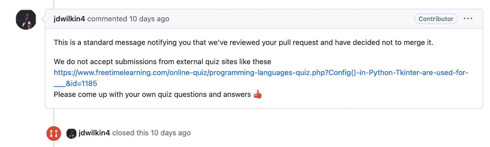

这有助于维护一个健康的开源环境，并且大多数案例在理解了规则之后都成为了多产的贡献者。

## 结论

我真的很高兴我作为维护者参加了今年的 Hacktoberfest。我学到了很多关于沟通、同理心、耐心和领导力的知识。

我希望我的帖子鼓励你在未来以维护者或贡献者的身份参与开源。