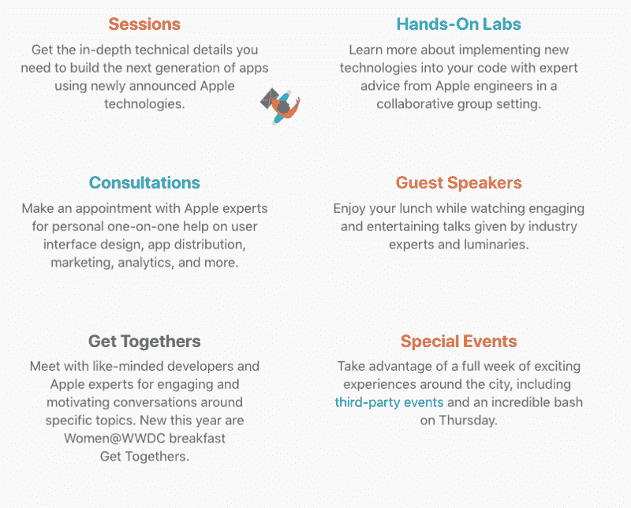
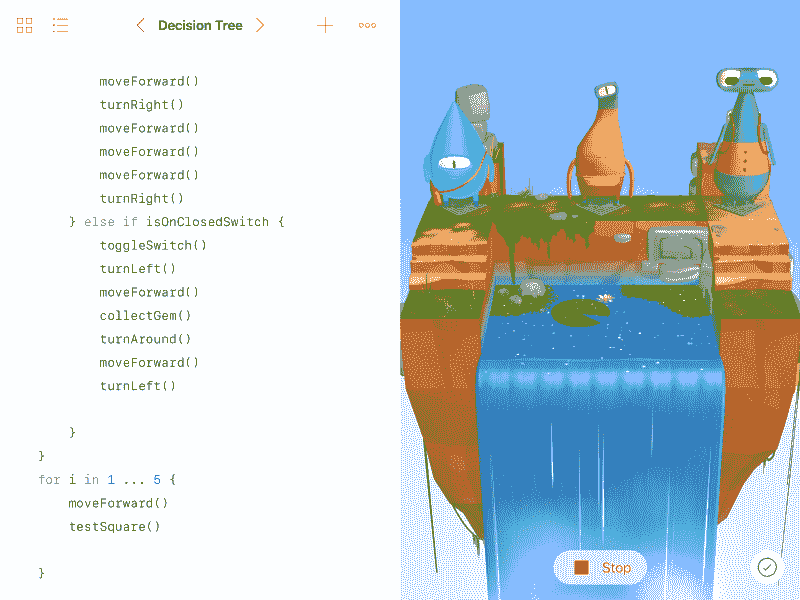
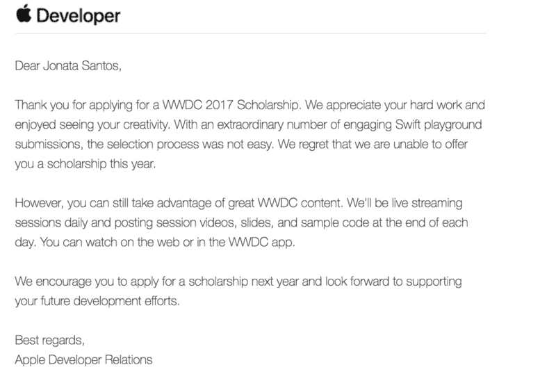

# 我从苹果拒绝给我 WWDC 奖学金中学到了什么

> 原文：<https://www.freecodecamp.org/news/what-i-learned-from-apple-rejecting-me-for-a-scholarship-to-the-wwdc-952e756ba586/>

约纳塔·科雷亚

# 我从苹果拒绝给我 WWDC 奖学金中学到了什么

> **“试过了。曾经失败过。没关系。再试一次。再次失败。失败得更好。”~** 塞缪尔·贝克特

每年，苹果全球开发者大会(WWDC)都会在加州圣何塞举行。这次会议是苹果新软件和技术的展示。

与会者能够与苹果公司的工程师们一起动手讨论。他们提供会议，你可以观看苹果开发者工具的创造者深入解释他们如何工作以及你如何使用他们。

WDDC 2017 website

有两种方法可以进入会议:

*   你可以为自己注册一个购买门票的机会，看看你是否被随机选中，如果你有幸中奖，你必须为门票支付 1599 美元。
*   或者你可以争取奖学金。在这种情况下，您可以免费参加会议，甚至可以获得差旅补助。

今年，为了获得奖学金，你必须使用 Swift Playgrounds 提交申请，这是苹果用来教授 Swift 的平台。

This is a Swift Playground

### 决定

为了更好地理解我的故事，这里有一点我的背景:我是一个 19 岁的巴西人，从今年年初开始参加 iOS 开发者项目。

三月初，当我在这个项目的第一周，我听到我的导师谈论 WWDC。我一听说这件事，就觉得必须参加比赛。

但我没有信心，我开始为自己无法获胜找借口，因为我不知道如何使用 Swift Playgrounds，或者如何构建一个合适的 iOS 应用程序。

我的大多数借口都是基于以下某种形式:

> “我从早上 9 点到下午 5 点半参加这个培训项目，在大学从晚上 7 点半到 10 点 45 分。我不会把剩下的时间都花在一些我没有机会赢的比赛上。”

每个人都知道追求自己想要的东西有多难，呆在原地有多舒服。你总是能找到借口，抱怨你没有时间或能力去做你一直想做的事情。但那正是人生一事无成的必经之路。

考虑到这一点，在花了很多天寻找借口后，我意识到我实际上是在关闭一扇机会之门，只是因为我害怕失败。我失去了一些东西，不是因为我没有准备好，而是因为我不愿意尝试。然后我决定尽我所能学习一切，用我所拥有的时间提交我最好的作品。

### **我的想法**

在决定建造一个游乐场之后，人们日复一日地犹豫不决，不知道该做什么，该讲哪个故事。我知道我想让它创造一个游戏，但我不知道怎么做。每天早上我都想出一个新主意，只是为了在一天结束时把它扔掉。

突然，一天晚上，我很难创造出一个好的行走动作(*因为我认为我会需要一个*)，我想:“*如果我的角色能飞来飞去，这件事会容易得多。*

从那时起，我开始想象一个游戏，在这个游戏中，你可以是一个带着喷气背包的太空探险家(这意味着没有行走动画)，并且必须在周围的星球上寻找物资，以在这个星球上创造一个适合生命的环境。这个想法是在一个游戏中教授一些生态学、生物学和化学方面的知识，同时让它变得有趣和令人愉快。

所以在这一刻，我决定打造一款太空游戏！

### **流程**

除了大学里的小项目之外，我从未开发过应用程序，甚至没有真正写过代码。所以我不得不从头开始学习几乎所有的东西。

一夜之间，这个项目成了我的困扰，我开始每天早起，只是为了多学一点，并且比前一天写得更好一点。我躺在床上想着第二天要做的事情。

幸运的是，我在旅途中并不孤单。一群朋友也决定加入这场冒险。有人陪伴是最好的部分，因为它对我继续工作帮助很大。有人在你身边一起工作是一个强大的动力。

我们一起进行了两次马拉松式的 24 小时(几乎)不间断的编码，以及许多其他更小的冲刺，以便及时完成所有事情。

在这段紧张的学习、工作和睡眠时间比我认为的人类应该得到的要少一些之后。

我的最终结果如下:

我的第一个游戏是 live，我为我所做的感到自豪，当然这不是一个杰作，但这是我花了很多努力并强迫自己学习很多很酷的东西的东西。

我在苹果提交结束前 7 个小时完成了游戏，所以我有足够的时间来回答提交的问题。于是我就这样做了，我把所有的事情都写了下来，然后把汇编发了出去。

### **结果**

等了 2-3 个星期后，我在浴室里，我的女朋友说:“我想你从苹果那里得到了你的回应。”

我跑到房间，查看我的收件箱:

Rejection letter

是的，我被拒绝了，一开始我的想法是:

> “哦操***！我做的一切都没用。我没有得到我想要的奖学金，因为我不配得到它。”

但是过了一会儿，所有的愤怒都消失了，我意识到:是的，这是真的。我不值得。从苹果的角度来看，我的项目不够好，可能有成千上万比我更好的应用程序也被拒绝。

但是在这种情况下(就像在任何你失败的情况下一样)，你有两个选择。要么你让失败打败你，要么你打败你的失败。

这是一个评估我犯了哪些错误以及我在这个过程中学到了什么的机会。我意识到我的项目并不完全符合苹果的指导方针。也没什么创意。

我也明白，在整个设计和开发过程中，我改变主意的次数太多了，这损害了我的工作。

但是说到底，这是一次很棒的经历。我学到了很多，并发展了一项新技能。

所以最后，即使失败了，我还是赢了。我现在是一个更好的人，一个更好的开发者，一个更好的学生。

我有足够的空间去成长，当然明年我会再试一次。即使我再次失败，我也会学习、进步并享受这个过程。

> “你永远不会失败，直到你停止尝试。”—艾伯特·爱因斯坦

这就是我给你们所有人的信息。永不放弃。永远不要停止尝试。

教训伪装成失败。如果你愿意给予足够的关注，失败是一位好老师。

感谢阅读！