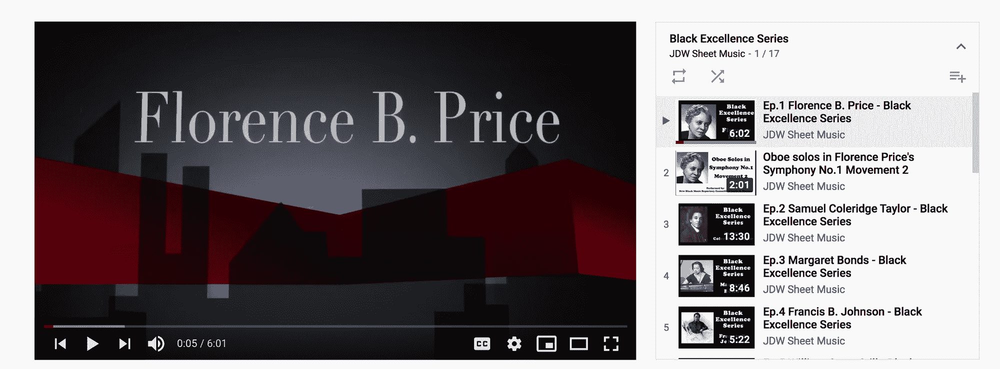
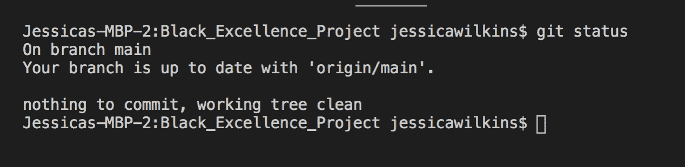
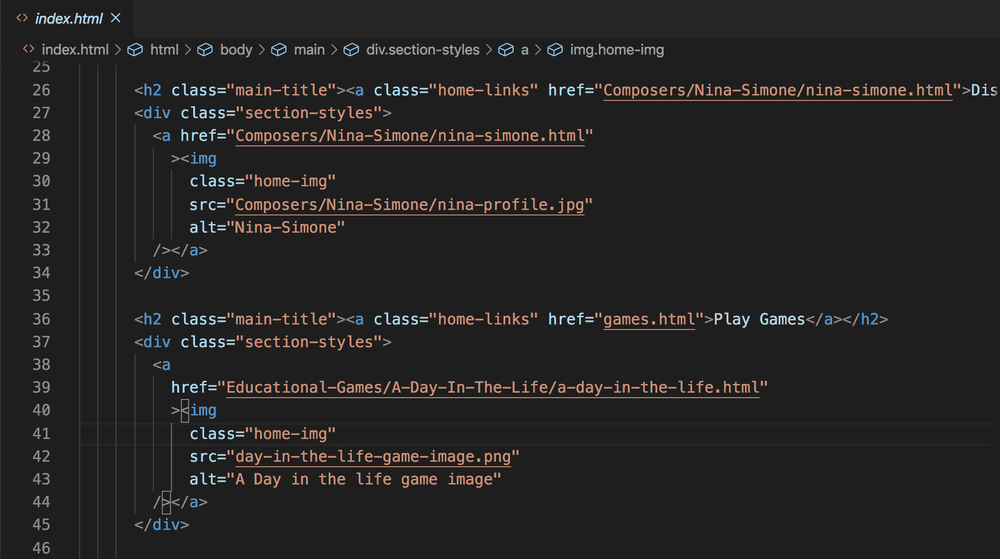
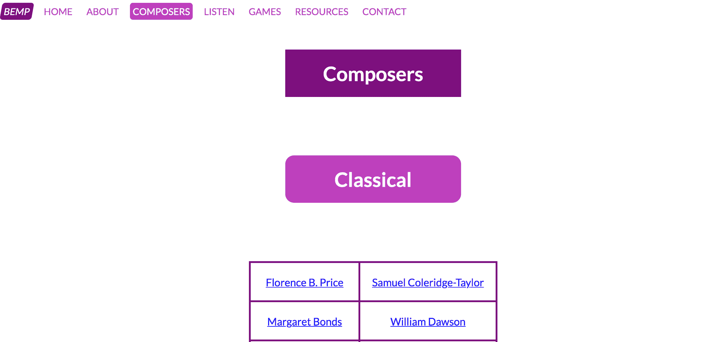
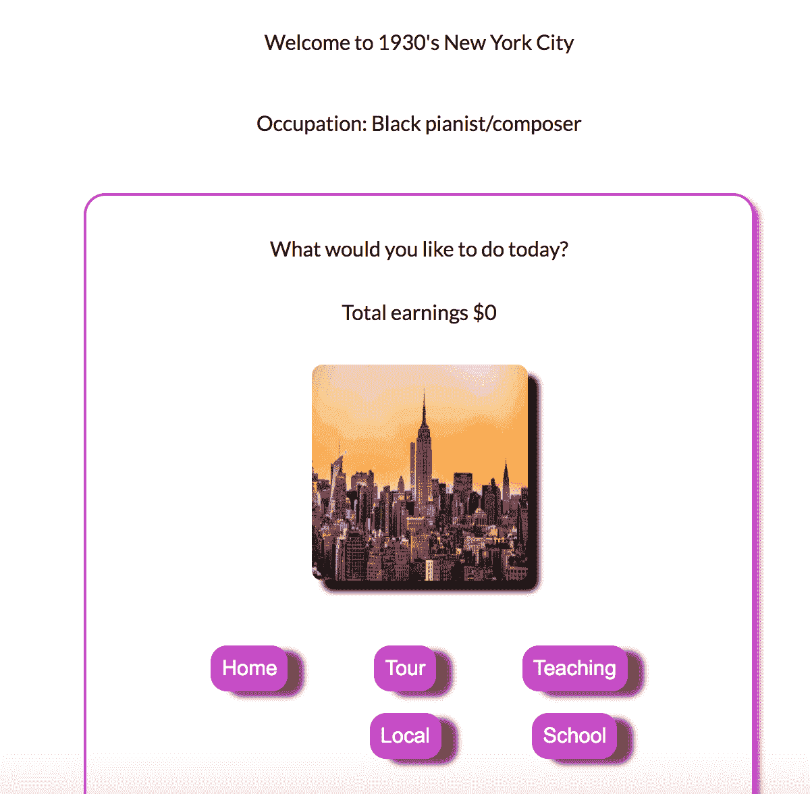
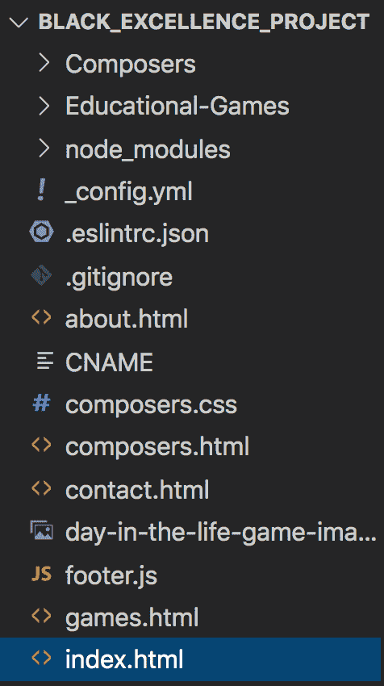
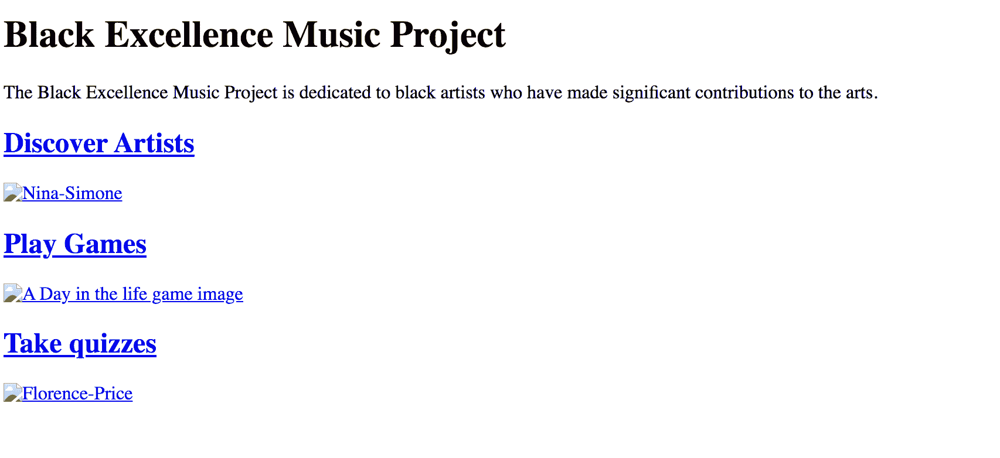
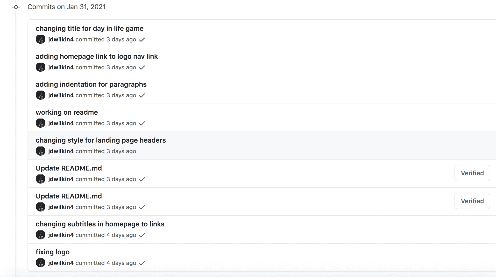

# 我从建立我的第一个个人项目中学到了什么

> 原文：<https://www.freecodecamp.org/news/what-i-learned-from-building-my-first-solo-project/>

经过四个月漫长的编码、研究、破坏，以及怀疑它是否能完成，我终于部署了我的第一个网站。

这不是一条容易的路，但最终是值得的。

这是我在搭建[黑卓越音乐项目](https://blackexcellencemusicproject.com/)中了解到的。

## 我能建那个吗？


Photo by [Tachina Lee](https://unsplash.com/@chne_?utm_source=ghost&utm_medium=referral&utm_campaign=api-credit) / [Unsplash](https://unsplash.com/?utm_source=ghost&utm_medium=referral&utm_campaign=api-credit)

2020 年 6 月，由于乔治·弗洛伊德之死引发的一系列事件，种族间的紧张关系空前高涨。因此，这引发了一场关于所有行业都缺乏多样性和少数群体代表性的讨论。

我有很多朋友联系我，询问过去和现在的黑人作曲家的信息，希望他们的音乐能更经常地被演奏。

为了回应这一点，我决定开始制作[优秀黑人 Youtube 系列](https://www.youtube.com/watch?v=FIWELCEBG0E&list=PLqHdMZJ08WM11cAx7YqdmvHb5YawvM0sq)，它描述了成功的黑人作曲家。



这个系列很受欢迎，一个新的想法诞生了。

如果有一个叫[黑卓越音乐项目](https://blackexcellencemusicproject.com/)的网站会怎么样？

它可以是一个教育网站，有个人资料、游戏、音乐等等。

但是有一个大问题:究竟是谁来创造这个？

我的编码之旅才开始了几个星期，我觉得我没有能力构建这样的东西。所以我决定把它放在一边，继续我的学习。

## 机不可失，时不再来


Photo by [Kekai AhSam](https://unsplash.com/@kekaiahsam?utm_source=ghost&utm_medium=referral&utm_campaign=api-credit) / [Unsplash](https://unsplash.com/?utm_source=ghost&utm_medium=referral&utm_campaign=api-credit)

几个月后，我开始越来越多地思考这个项目。我想到了可能的游戏，特色作曲家，以及其他很酷的功能。

但是我仍然犹豫要不要开始，因为我觉得我还没有准备好。我只知道 HTML，CSS 和一点点 JavaScript。

但我意识到机不可失，时不再来。

尽管害怕和犹豫，我还是决定开始。

## 你好 Git 和 Github


早在 2020 年 6 月，当我决定学习如何编码时，我第一次公开了我的 GitHub 个人资料。在这个项目之前的几个月里，我并没有真正用它做任何事情。

我对 GitHub 的模糊认识是，你可以保存你的代码，人们可以查看它。

所以我决定是时候真正了解 GitHub 并开始使用命令行了。



在看了几个教程后，我已经成功地创建了我的第一个 repo，并将我的第一个 commit 推送到 GitHub。

我为自己的起步感到自豪，但现在我面临着另一个困境。

下一步是什么？

## 只是 HTML



我有所有这些想法，但完全不知道从哪里开始。

我要从构建游戏开始吗？

我要建立一个设计模型吗？

事情很快变得势不可挡，我不知道下一步该去哪里。所以我决定从一个简单的 HTML 页面开始，从那里开始。

我想我可以为 composer 概要创建一些 HTML 页面，稍后再考虑它们的样式。

这种方法缓解了我的紧张情绪，使项目有了一个非常有成效的开端。

## 选择正确的配色方案



我想选择一个适合主题的配色方案。

我想要平静但有力量的东西。

经过一番研究，我选定了紫色。紫色通常与皇室和智慧联系在一起。

我认为这将是这些为艺术做出重大贡献的黑人作曲家的完美选择。

## 我怎样才能创造一个游戏？



此时，我已经有了几个 HTML 页面和一些简单的样式。但是现在是时候开始为一些游戏编码了。

我认为有几个孩子和大人都会喜欢的游戏会很好。

我首先从规划游戏应该如何运行开始。然后我开始一次处理一个功能。

我做了很多研究，犯了很多错误，但我最终让它们工作了。

```
// this is for the tour and local gig functions
function performanceOutcomes() {
  shuffle(gigResponses);
  if (randomMsg === 'You were late to the gig and not allowed to perform.' || randomMsg === 'You were mugged outside after the gig and they took all of your money.') {
    message.innerHTML = randomMsg;
    money += 0;
    earnings.innerHTML = `Total earnings: $ ${money}`;
  } else {
    message.innerHTML = randomMsg;
    money += 5;
    earnings.innerHTML = `Total earnings: $ ${money}`;
  }
}
```

一旦我结束了游戏，我决定照顾一些家务。

## 我该如何组织这一切？



网站上会有很多移动部分，所以我需要聪明地管理所有这些文件。

我非常注意选择简短的描述性文件名和文件夹名，这样我可以很容易地找到它们。

也有几次我不得不将一些文件重新组织到不同的文件夹中。

例如，我最初将作曲测验放在单独的作曲文件夹中。但后来我意识到，最好有一个名为测验的文件夹，把所有这些文件放在里面。

我还遇到了拥有多个样式表的问题。因为我重用了很多相同的样式，所以只有一个主样式表并将它链接到所有的 HTML 页面更有意义。

## 你能看看我的项目吗？


Photo by [heylagostechie](https://unsplash.com/@heylagostechie?utm_source=ghost&utm_medium=referral&utm_campaign=api-credit) / [Unsplash](https://unsplash.com/?utm_source=ghost&utm_medium=referral&utm_campaign=api-credit)

到 2021 年 1 月底，这个网站终于可以让其他人来看看了。

我决定联系 Nicholas Carrigan，他是一名自由代码营的开发者和主持人。他在他的网站上有一个代码审查会议的服务，我想让他看看我的代码。

代码审查会议非常有价值，我学到了很多关于如何让网站变得更好的知识。

## 部署噩梦


Photo by [Dev Asangbam](https://unsplash.com/@devasangbam?utm_source=ghost&utm_medium=referral&utm_campaign=api-credit) / [Unsplash](https://unsplash.com/?utm_source=ghost&utm_medium=referral&utm_campaign=api-credit)

我终于准备好冒险部署我的网站了。我已经用 [Bluehost](https://www.bluehost.com/) 注册了一个自定义域名，并阅读了关于如何用 GitHub 页面设置 live 站点的文档。

凌晨四点，我终于发布了网站。

当我点击直播链接时，我被眼前的景象吓坏了。



没有导航条。没有页脚。没有 CSS。

为什么会发生这种情况？

我在本地测试时一切正常。

经过几个小时的修补和研究，我终于寻求帮助。我给尼古拉斯发了信息，解释了这个问题。

他看了看我的代码，解释说我的文件路径有问题，并告诉我如何修复它。

听到问题的解决方案，我松了一口气，并能够做出所有必要的改变。

```
 <script src="landing-page-nav.js"></script>
    <script src="landing-page-footer.js"></script>
    <script src="index.js"></script>
```

我最终准备在 [freeCodeCamp 论坛](https://forum.freecodecamp.org/)上分享它以获得反馈。

## 这是一个好的开始，但要解决这个问题



在接下来的几天里，我收到了很多关于如何改进网站的评论。

起初，这是一个有点势不可挡，我把评论个人。

我想在一些幻想世界里，我希望每个人都会喜欢它，认为它是完美的。

但是很多人指出了一些错误，和一些设计问题，使得用户体验有点混乱。

我知道我的强项不是设计，所以这可能是我把它当成个人的原因。但我意识到人们只是想帮忙，他们的建议确实让网站看起来更好。

## 给初学者的建议


Photo by [Tudor Baciu](https://unsplash.com/@baciutudor?utm_source=ghost&utm_medium=referral&utm_campaign=api-credit) / [Unsplash](https://unsplash.com/?utm_source=ghost&utm_medium=referral&utm_campaign=api-credit)

通过建立这个项目，我学到了很多东西，肯定有相当多的起伏。但最后，我对结果很满意。

如果你有一个项目的想法，就开始吧。不要等到你准备好了。

以您知道的最佳方式构建并部署它。

完全没问题，不完美也不完美。

继续建设和学习。