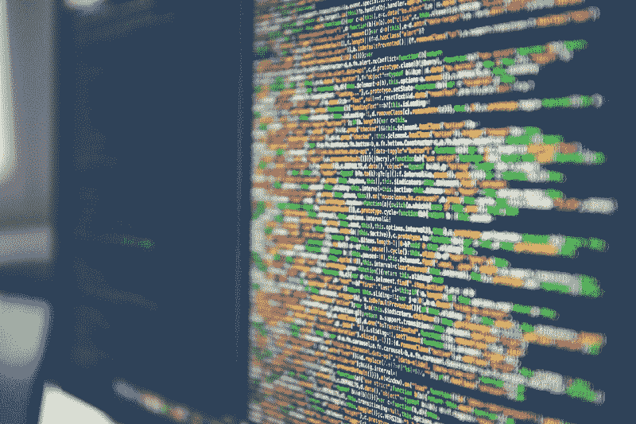
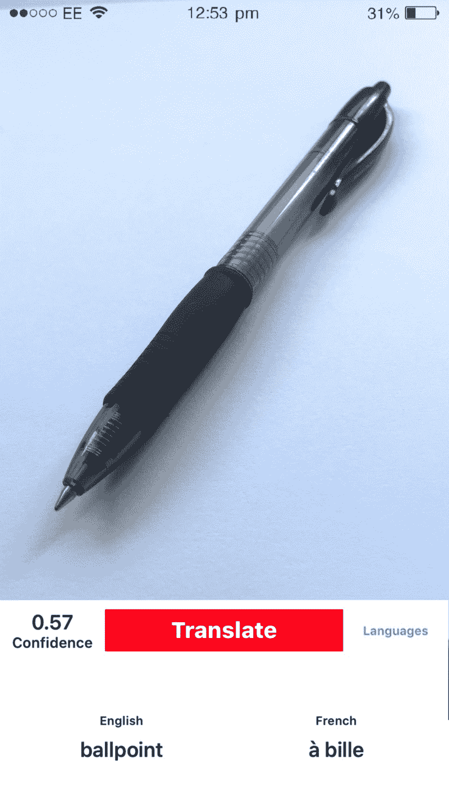
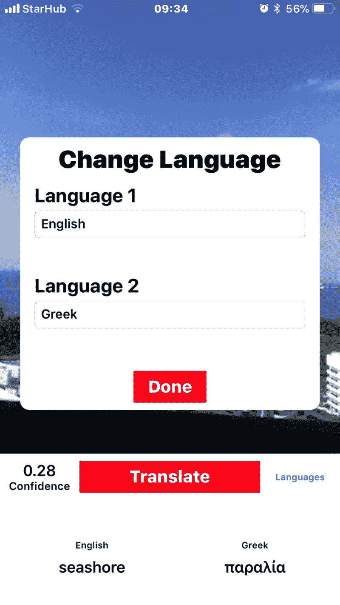

# 我从一天内创建和发布我的第一个应用程序中学到了什么

> 原文：<https://www.freecodecamp.org/news/what-i-learned-from-creating-and-shipping-my-first-app-in-a-day-9f79010765f0/>

萨尔瓦夫·库尔帕蒂

# 我从一天内创建和发布我的第一个应用程序中学到了什么

#### 一个摧毁完美主义和实现创造潜力的练习

我又累又恶心。

我学习编码已经快两年了，在这期间我做了不少项目。但有一件事我永远也不能说我做过，那就是在 app store 上放了一个应用程序。

然后有一天，我起床，我决定我受够了。那天晚上睡觉前，我打算创建一个应用程序并提交给应用商店。

### 为什么我以前没有这样做过？

> “工作室恐惧症”——害怕不够好

你以前没有过这种感觉吗？你做的没有别人做的好？别人比你强？看到你的作品，人们会笑吗？

这些感觉会让人崩溃。它们会阻止你移动，把你拖入一个深洞，把你困在里面。他们会阻止你采取行动，强迫你相信不真实的事情——你永远不可能像你想的那样优秀。

在互联网出现之前，你可以立志成为你所在的城镇，甚至是城市中的佼佼者，并且仍然取得成功。今天，有了互联网，你的竞争对手就是全世界。最重要的是，你不断地被提醒，世界上有人比你做得更好。

> 别管别人怎么做；做得比自己更好，日复一日地打破自己的记录，你就是一个成功者。威廉·j·h·博克

我不确定这种想比别人强的心态是从哪里来的。也许是因为学校教育系统，在这个系统中，要想“成功”，你必须比别人做得更好。也可能只是人类的本能。但不管是哪一种，都不是可持续的思维方式。

### 完美主义的治疗方法

> 无所作为会滋生怀疑和恐惧。行动孕育信心和勇气。如果你想征服恐惧，就不要坐在家里胡思乱想。走出去，让自己忙碌起来——戴尔·卡内基

在很多情况下，完美主义是恐惧的一种花哨说法。

行动战胜恐惧。

如果说有什么不同的话，那就是我害怕人们会对我做的东西有什么看法——害怕它不够好。但是我和自己进行了一番思考，得出了一个结论，那是一个不成功的可怕借口。

而且到了不够好的地步——绝对不够好。不过没关系。数量导致质量。莫扎特一生创作了 600 多首作品。毕加索创作了将近 50，000 幅画。一般人很难说出他们的两件作品。

我意识到，无论如何，你都需要坚持不懈地进行创作，才能达到任何程度的成功。每一个“一夜成名”的背后都是多年的实践和低于平均水平的工作。

正是那些年艰难的反馈把人们带到了某个地方。

所以我必须创造一些东西，不管产品有多差，我都要出货。

### 我如何制作应用程序

首先，我不知道该做什么。然后我突然想到。我(应该)在准备法语口语考试。如果我可以创建一个应用程序，允许我实时翻译事物的图像，帮助我修改，会怎么样？

我很快拼凑了一个 iOS 应用程序，它使用预先训练好的《盗梦空间》MLmodel 来检测对象，然后将其与谷歌的 translate API 配对。仅仅两个多小时，我就有了一个 app。

看看这个。

这款应用并不完美。见鬼，差远了。对象检测是低于标准的，它显然没有在足够的对象上进行训练，并且用户界面充其量也是有问题的。

但总比什么都没有好。最后，我可以说我运送了一些东西。

我可能没有那些把自己的应用程序卖到数百万美元的天才那么好，但我肯定比昨天的我要好。

最后，我想这才是最重要的。

### 行动呼吁

我只是一个随机的少年。你可能比我拥有更多的技能，而且我肯定有一些你已经拖延了很久的项目。及时行乐，我的朋友，你没有借口了。是你做这件事的时候了。

**感谢阅读，**

**Sarvasv**

**附:感谢 100 位粉丝**

**更新:400 名粉丝，感谢为此鼓掌的每一个人！**

**想聊天？在 [Twitter](https://twitter.com/SarvasvKulpati) 和[Linkedin](https://www.linkedin.com/in/sarvasvkulpati/)T5 上找到我**

**这是我写的其他一些帖子**

[**你需要节食**](https://hackernoon.com/you-need-to-go-on-an-information-diet-def2f5a3fd5b)
[*我们生活在一个吸毒者的社会里。你最好的朋友可能就是其中之一。你的家人也是。很有可能，你也是…*hackernoon.com](https://hackernoon.com/you-need-to-go-on-an-information-diet-def2f5a3fd5b)[**苹果的专长不是硬件或软件**](https://medium.com/swlh/apples-speciality-isn-t-hardware-or-software-af1e6337d5f2)
[*当批评苹果的时候，每个人都忽略了一个显而易见的观点*medium.com](https://medium.com/swlh/apples-speciality-isn-t-hardware-or-software-af1e6337d5f2)[**为什么我在我的学校教年轻学生如何编码**](https://medium.freecodecamp.org/why-im-teaching-younger-students-at-my-school-how-to-code-f74ba3f174e3)
[*为什么你也应该教别人如何编码*medium.freecodecamp.org](https://medium.freecodecamp.org/why-im-teaching-younger-students-at-my-school-how-to-code-f74ba3f174e3)