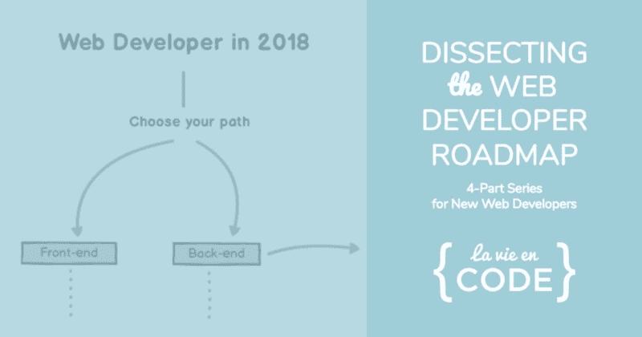
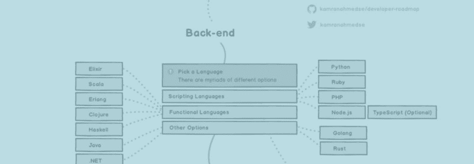
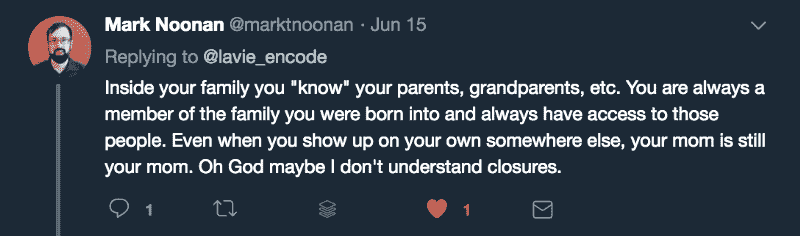

# 我从剖析 Web 开发者路线图中学到了什么

> 原文：<https://www.freecodecamp.org/news/what-i-learned-from-dissecting-the-web-developer-roadmap-1ccd0ecb5ae9/>

妮可·阿香博

# 我从剖析 Web 开发者路线图中学到了什么

#### 以教导他人为目标的学习的好处

#### 嘿，自由码营员和其他人！

我是妮可，你的一个新同事，网络开发新手。

我在 freeCodeCamp 社区很活跃，是 MetroWest MA freeCodeCamp Meetup 的组织者和 T2 La Vie en Code Podcast 的主持人。我最近刚刚被昆西授予 2018 年度最佳贡献者，这基本上是我一整年的成就。？

我喜欢回馈和分享我所能分享的……这也是这篇文章的主题！

### 我的一点故事

就像我上面说的，我像你一样是一个自学成才的 web 开发人员。我甚至不擅长编程什么的。我完全拥有它。我可能会永远是个新手，这完全没关系。

当我们第一次尝试的时候，我们都很糟糕。我们还不如享受学习编码的过程，因为强调它不会让它变得更容易——也不会让你受到伤害，对吗？

当我期待一件事，却得到一点帮助都没有的垃圾输出，或者整件事都搞砸了的时候，我肯定是又哭又笑的。

这是过程的一部分，而且很有趣。或者至少，我觉得应该是！

因此，从 2015 年开始，我就一直在这个行业摸爬滚打，当时我决定从客户服务转行，学习为网络构建。我在大学时是计算机科学专业的学生，但由于糟糕的表现，我被劝阻继续学习，最终改变了专业——也许是无意的，但伤害还是造成了。

当我在 2015 年开始学习编码时，我还开设了一个名为 [La Vie en Code](http://blog.lavieencode.net) 的博客。我写了一些这样那样的东西，我所学到的东西，以及我认为可以帮助他人的关于 web 开发的一些随想。

我在俄勒冈州的波特兰开始编码，然后在 2016 年初穿越全国，以便离家人更近。在那里，我在马萨诸塞州科德角的一家小店里找到了我的第一份网络开发工作，我在上面放了一整集播客,因为它…独一无二。？

今天，我仍然住在马萨诸塞州，我已经通过了一份工作，自由职业者，目前正开始开发自己的课程。这是一段疯狂的旅程，因为在成为业内知名人士的过程中，我不得不成长很多，但我现在还远未达到这一步。

事实上，我已经把“品牌生活”提升到了一个新的高度，尽管这只是我一个人的想法。我在 2016 年创办了 [La Vie en Code 播客](http://www.lavieencode.net/podcast)，专门面向自学的网络开发学生。

我的兴趣深深植根于技术、心理学、教育和游戏的交叉领域。我谈论各种话题，包括:

*   学习编码的体验
*   学习的科学——特别是，如何有效地学习你遇到的信息
*   游戏和游戏化
*   教育技术理论
*   如何开始自己的博客
*   像[树屋](http://www.teamtreehouse.com)和[自由代码营](https://www.freecodecamp.org/)这样的电子学习平台
*   采访其他自学网站开发的学生
*   精神疾病与健康(老实说，我其实有一个非常鼓舞人心的故事)
*   一些简化的概念，比如 [JavaScript 和 DOM](http://www.lavieencode.net/podcast/009-intro-to-js-document-object-model)

这个播客是我的心和灵魂。由于健康问题，我一直在努力坚持播出剧集——但我总是会回来，因为我喜欢它。当涉及到 web 开发时，您甚至会认同这种感觉。

那么，让我们来谈谈我在四月份给自己的这个挑战。

### 我所说的“挑战”是什么？

**简而言之:**我挑战自己，为自学成才的 web 开发人员构建一个扩展现有信息的项目。换句话说，我会拿起一个资源，“剖析”它，并构建每个部分来帮助学生更好地理解内容本身。

这样的工作方式减轻了我创造全新事物的压力，并在这个过程中学习。该项目将是一个资源的音频格式走查，我觉得可以在一个更“简化”的水平上解释。

能够交流我学到的想法对我来说很重要。我依赖别人能够向我传达想法，我在学习上有差异。

(这主要是因为——剧情转折！—我也属于自闭症谱系。学习对我来说是地狱，所以我决心帮助其他人变得更容易。当我录制我的第二集时，我还没有被确诊，[我如何学习我如何学习](http://www.lavieencode.net/podcast/002-how-i-learn)，从那以后，我对自己有了更多的了解*。)*

基本上，这既是学习和理解的练习，也是 web 开发的练习。我知道进入其中。这让我更想这么做。

那么，我要以什么为基础呢？作为参考，我选择了一个由开发伙伴 [Kamran Ahmed](http://www.twitter.com/kamranahmedse) 创建的流程图。这个资源被称为[网络开发者路线图](http://www.lavieencode.net/devroadmap) …它对我的项目来说绝对完美。在我受教育的过程中，我多次提到过它。

### 什么是 Web 开发者路线图？

Kamran Ahmed 基本上创建了这个流程图，设想了一个学习 web 开发的“理想”路径。

它包括:

*   **基础知识/“必经之路”**:无论你在 web 开发的哪个阶段结束，你都需要知道的概念
*   **前端:**构建前端(客户端)所需的概念和技术
*   **后端:**构建后端(服务器端)所需的概念和技术
*   还有 **Dev Ops，**我决定给自己一张通行证，试着掩饰自己——这是为了未来的嘉宾插曲，如果有人想上播客来教我们的话！刚刚[在推特](http://www.twitter.com/lavie_encode)上给我打电话。

(我用第四集**构建工具**结束了这个系列，而不是开发运营:任务运行器、包管理器和模块加载器。我将解释它们是做什么的，以及它们如何使我们的开发人员生活更轻松！)

#### 路线图上有哪些具体议题？

仅基础/“任何路径都需要”，前端和后端部分就有许多主题。所以，当我设法把每个部分缩短到一个小时时，我真的为自己感到骄傲！

以下是按路径分类的主题:

### **任何路径都需要的基础知识**

*   版本控制:Git & GitHub
*   SSH(安全外壳)
*   HTTP/HTTPS(以及一般的协议)
*   蜜蜂
*   基本终端使用
*   学会研究
    (对自考学生来说**至关重要**
*   数据结构和算法
*   字符编码
*   设计模式
*   测试
*   构建工具

#### **前端**

*   HTML 基础
*   CSS 基础
*   JavaScript 基础知识
*   jQuery
*   移动响应能力
*   包管理器和依赖项
*   CSS 预处理程序/框架/架构
*   渐进式网络应用
*   类型检查器
*   服务器端渲染

#### **后端**

*   服务器端语言
*   关系数据库
*   非关系(NoSQL)数据库
*   图形数据库
*   贮藏
*   RESTful APIs
*   身份验证和授权方法
*   消息代理
*   搜索引擎
*   集装箱/码头工人
*   网络服务器
*   websocket
*   GraphQL

这是一大堆东西。正如我所料，我必须做大量的研究。但老实说，我也很惊讶自己知道这么多。

我在演示笔记中加入了我使用的资源。我使用的一些视频在 YouTube 上的浏览量不到 5000 次，但我真的觉得他们真的很好地解释了这个概念。

### 我从经历中学到了什么？

#### **这么多！**

我强烈建议每个人挑战自己，尽可能简单地向他人解释话题。这比看起来要困难得多！

I Tweeted a challenge for someone to explain closures in the simplest manner possible. It’s harder than it sounds.

这里有一个特别重要的教训:

我**不是**100%确定，或者接近确定，我会正确地解释这些概念。它们都会被我自己的感知过滤掉，没有人的感知是一样的。我**确实**在 Twitter 上从开发者朋友那里反弹了我的许多解释和语境化，并在录制之前获得了大多数人的赞许。

但是除此之外，我只需要**相信**我通过我的研究已经知道了足够多的东西，能够就这个话题发言，并帮助他人。

我之前在播客上做过一个技术话题: [JavaScript 和 DOM](http://www.lavieencode.net/podcast/009-intro-to-js-document-object-model) 。但是与涵盖整个 web 开发主题的“路线图”相比，这根本不算什么。

我必须穿上我的大女孩裤子，接受批评和批评，尽我所能迎接我自己的挑战。

这对我来说是一件大事，因为我从来不觉得我在学校里“知道得足够多”。就像我说的，为了成为一名情商高的企业家，我必须不断成长。？

具体到各个部分，我了解到的情况如下:

#### 任何路径都需要的基础知识

发现这些“基础”中的一些对我来说并不那么基础，我并不感到惊讶。我很高兴我是带着这样的期望进去的，所以我没有气馁。我以前曾以某种身份处理过所有这些话题，所以我对研究和谈论它们很有信心。

我试图关注一些小细节和轶事，比如在讨论**字符编码**时的 [MacOS Roman](https://en.wikipedia.org/wiki/Mac_OS_Roman) 。当有小细节需要记忆并与主题相关联时，我学得最好。

我很高兴看到 Kamran Ahmed 在路线图中包括了学习研究。这是一项绝对重要的技能，它决定着新的 web 开发人员的成败——我们需要知道如何自信而有效地从资源中学习，以及从彼此身上学习。我可以整天谈论这个话题。

在路线图的这一部分，我学到的最令人惊讶的事情可能是**设计模式**——在更大的范围内，**标准和最佳实践**——在我们编写的代码中真正起到了*的重要作用。*

我们最初基本上是蹒跚而行，只是想让事情正常运转。但是我从来没有真正意识到，当你尽可能早地遵循这些设计模式时，在解决问题的过程中会有多少猜测。

你开始用模式来思考，而模式对我来说是个难题。模式是宇宙的粘合剂。

#### 前端

我是一名前端开发人员，但是不要认为这是一件轻而易举的事情。在我自己的教育过程中，我已经完全公开了我没有完成我想要的那么多项目的事实。

有鉴于此:在我还没有将这些我还没有使用过的主题和工具联系起来的情况下，它很快变得**非常** 明显**非常**。

在前端和后端部分，路线图开始将每个概念分解成一个“步骤”，我一个一个地完成了这个步骤。我把它看作是一次旅行。看到建议的学习流程对我很有帮助，因为每个主题都有机会建立在前一个主题的基础上。

也许路线图配置中最好的部分是项目时间的间隔，或“实践”，这是我一直在努力解决的问题。

你什么时候建立项目？在你试图用一个话题做点什么之前，你应该对这个话题了解多少？回顾(和展望)我自己的教育，我发现这些实习可以帮助我比我想象的更快地使用我所学的技能。

这是我自我教育中的一个常见主题:我总是认为我需要知道的比我知道的更多。它耽误了我很长时间。不要这样。

但是在讨论完这一部分之后，我真的觉得我对前端有了新的认识。我可以再一次看到它的重要性，并且为知道像语义 HTML 和模块化 CSS 这样的概念而感到自豪。

前端真的很美。❤️

#### 后端

我想我录这个的时候出了一身汗(LOL)。不，没那么糟糕，我学到了很多…但这绝对是一次自我教育的锻炼！

我学过 PHP 和一些 NodeJS，大部分是出于需要。我喜欢 WordPress，并在上面运行了一个名为 [La Vie en Code 的网站](http://www.lavieencode.net)，所以我无意中也成为了一名 PHP 开发新手。不管你怎么说，我认为 PHP 是一种很棒的脚本语言。

你会意识到每一种语言都有其沉闷之处。你真的避免不了。只要技术一直在改进，我更喜欢关注它做得好的地方，并为这些类型的项目使用一种语言。

我喜欢看到**在路线图的前端和后端部分测试**,因为测试的原则确实适用于任何地方。我们需要在每一步都知道我们的应用程序在客户端**和服务器端**按预期运行。我认为很多新的 web 开发人员认为测试只是为了后端开发，我希望教他们如何做。

对我来说，**数据库**是路线图中最有趣的部分。我只使用过**关系数据库、**，对关系和非关系(NoSQL)数据库之间的区别了解不多。我甚至不知道图形数据库的存在，所以如果我听起来像是这样，那是因为我学了它，所以我可以教你。？

### 好吧，你要分享这个项目还是什么？

是啊！语境很重要，我认为理解它背后的故事会增强你听播客的体验。

您可以按顺序[在这里](http://www.lavieencode.net/wdrm-series)收听剧集:

[**LVEC《剖析 Web 开发者路线图》系列| La Vie en Code 播客**](http://www.lavieencode.net/wdrm-series)
[*Kamran Ahmed 的《2018 Web 开发者路线图》是 Web 开发者新手的宝贵资源。在这个系列中，我剖析了…*www.lavieencode.net](http://www.lavieencode.net/wdrm-series)

我为播客剧集创建了这个登录页面，所以它们很容易按顺序浏览。不要介意它有多简单——它只是剧集的家。

你也可以在 [iTunes](http://www.lavieencode.net/itunes) 、 [Google Play](http://www.lavieencode.net/googleplay) 、 [SoundCloud](http://www.lavieencode.net/soundcloud) 和 [Stitcher](http://www.lavieencode.net/stitcher) 上订阅 La Vie en Code 播客。如果你对有用的资源、新闻和老掉牙的开发笑话感兴趣，我还有一份 dope weekly 时事通讯，名为 [Life in Code](https://mailchi.mp/3380e75dea0d/3) :

#### 希望这有帮助！

我很想在推特上听到你的想法！如果这对你有帮助，如果我错过了一个主题的标记，如果你有其他的想法…我想听听。