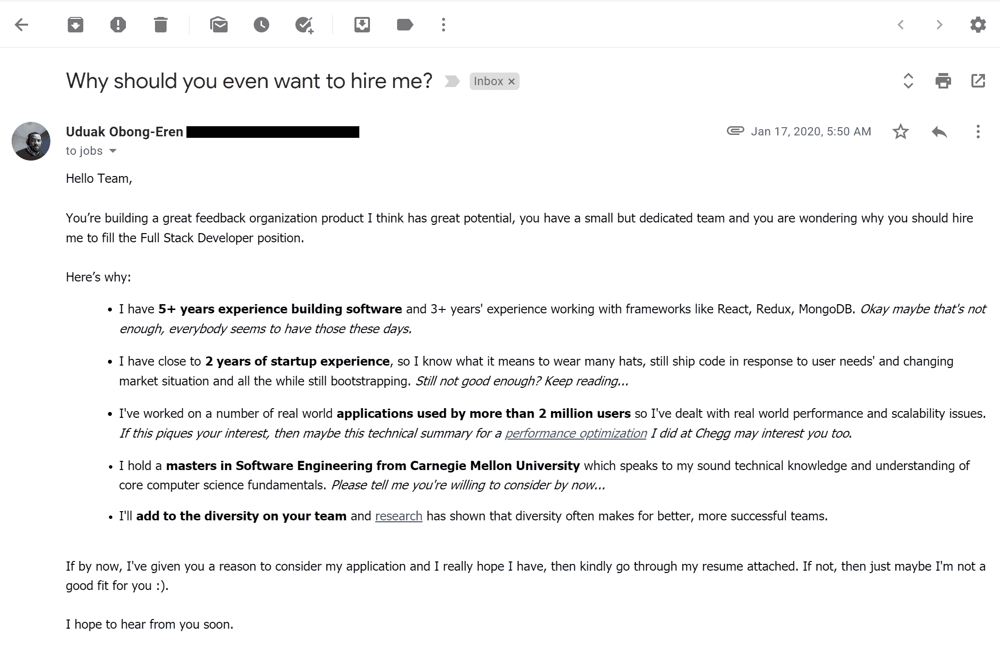

# 我从 30 天内做 60 多次技术访谈中学到了什么

> 原文：<https://www.freecodecamp.org/news/what-i-learned-from-doing-60-technical-interviews-in-30-days/>

在这篇文章中，我将分享我在 30 天内做 60+次技术面试的动机。更重要的是，我会分享从我的失败和成功中学到的教训。

我将这些课程分为三类，以符合典型招聘流程的各个阶段。

虽然大多数课程直接适用于软件工程师和技术专业人员，但这些课程背后的原则可以适用于所有职业。我希望你找到一些有用的东西，可以应用到你的职业生活中。

## 我是怎么开始的？

> "如果你要失败，那就快一点。"—未知

像任何其他软件工程师一样，我也参加过不同类型的技术面试——从可怕的白板编码面试到像 HackerRank 这样的平台上不真实的 45 分钟编码挑战。虽然我在这些面试中的一些经历很棒，但另一些却很糟糕。非常糟糕。

但我想真正擅长面试。我想学会克服面试恐惧症，在面试中表现出自信。像一个熟练的冲浪者一样，我想学会驾驭面试带来的高压波浪。当时我也在考虑换工作。

因此，从 2020 年 1 月到 3 月初，我向位于美国和欧洲的公司提出申请，并得到了这些公司的联系。从 Coda 这样的早期创业公司到 Crunchbase 这样的后期创业公司，从 Affirm 这样的中型公司到 Amazon 这样的大型公司，甚至是 Webflow 这样的远程公司。

109 多份申请之后，我参加了 60 多次面试。这些包括 60 多个介绍性电话面试、50 多个技术电话筛选面试、18 个带回家的编码项目、11 个编码挑战和 8 个现场面试，包括 3 个虚拟面试。

## 我学到了什么？

为了更好地理解，我将这些课程分为三类，以匹配典型招聘流程的不同阶段。

## 面试前阶段

这涵盖了从最初接触一家公司到第一次面试的所有内容。

### 我对应用程序的了解

当我开始申请公司时，我想象着我提交的申请越多，我获得面试的机会就越高。似乎合乎逻辑，是吧？所以我设定了一天 5 份申请的目标，目标是每 5 份申请面试 1 次。

但是我的策略并没有像我希望的那样奏效。我收到的面试请求数量经常低于我的目标。几乎是 1:12 的比例，每 12 份申请就有 1 份面试。

我面临着这样一个问题:我需要把我的每日目标增加到比如说 10 家公司吗？或者还有什么我需要改变的吗？

每一次不成功的申请，都让我意识到有些事情需要改变。

当我从每天的数字中解脱出来，开始用不同的方式思考我的应用程序时，这种变化就出现了。我开始把每一份申请看作是对招聘经理或任何将要阅读我的申请的人的推销，但在这里，被销售的产品是我。

如果一家公司需要填补人才缺口，而我说我有技能，我需要想办法让他们相信我有。

然后，我的新任务变成了找到一种方法，有效地展示我独特的技能、经验和个性，让招聘经理相信我是这份工作的合适人选。

下面是我想到的一个这样的*推介*的例子:

有我的简历做后盾，这封求职信有 95%的成功率。有一次这没有奏效，招聘经理仍然回复我说这个职位已经没有了，但他希望将来能联系上我。

这里的教训是，对你提出的申请要非常有意识——质量重于数量。最好两样都做。了解你独特的能力和经验，并以符合公司需求的方式展现出来，同时不牺牲你的个性。

了解你申请的公司的特殊性及其具体需求也很重要。初创公司或小公司的需求可能与大公司不同，因此需要不同的技能组合。

推销自己，并确保在面试中支持你的推销。

### 我从招聘邮件中了解到的

在此期间，我收到了许多招聘人员的电子邮件(大部分是不请自来的),其中大部分都是我不感兴趣的职位。

诚然，考虑到我繁忙的日程安排，这有时是很多的，但我学会了换位思考，理解这些招聘人员只是想做好自己的工作。

我不再把这些邮件视为收件箱里的噪音，开始努力回复所有招聘人员的邮件，甚至是我不感兴趣的职位。通过这样做，我成功地建立了一个招聘人员网络，如果我将来不得不转换角色，这个网络已经成为一个丰富的资源。

现在我不指望你会想要回复你收到的每一封邮件。但是你可能会感兴趣的是，我收到的一些面试请求来自我之前回复过的招聘人员，他们的职位是我不感兴趣的。回复无妨。

## 面试阶段

这涵盖了面试本身的一切，跨越了不同的面试类型。

### 如何处理介绍性电话

是的，我明白，你很忙，很多事情都在占用你的时间。但是，嘿，你也是一个优秀的专业人士，这意味着你永远不会在不知道以下两件事的情况下接电话:

*   面试官的名字，还有
*   至少有一件关于公司的具体事情——他们做什么，他们在哪里，任何最近的新闻，一些事情，任何事情！

我注意到，在我努力做出这些发现的面试中，我总是表现出对这家公司真正感兴趣。这是招聘人员通常在这类面试中寻找的东西。

### 如何处理技术电话屏幕

几乎可以单独决定你在技术电话面试中表现如何的一件事是你清晰表达自己想法的能力。

你可能以前听过这样的话:

面试官关心你的思维过程。是的，他们可以看到你的代码，但更重要的是，他们想知道**为什么**你在做你正在做的事情

面试官没有和你在一起，所以没有看到其他非语言线索的奢侈，比如你的手势或细微差别。面试官所拥有的只是你的声音，作为理解你思维过程的一种手段。

现在你知道你应该如何引导这个对话，下一个问题是你如何变得擅长这个？因为事实是，虽然表达你的想法对一些人来说可能很自然，但对其他人来说却不是，包括我。

所以——练习！练习！！练习！！！

练习做大量的模拟面试。和朋友一起做这些模拟面试让我在解释我的思维过程时更好更自信。但更有趣的是，它帮助我形成了一种新的面试心态。

我开始将面试视为与朋友或团队成员的对话。我把电话那头的面试官想象成我的一个朋友(我有时会在脑子里给面试官起一个名字)。因此，在我看来，原本会是一次高压的采访，现在却成了一次关于技术问题的友好“聊天”。

这种新的心态，在许多实践面试的帮助下，帮助我增长了信心，以至于我开始享受面试，抱歉，技术聊天。

### 如何着手解决一个问题

在没有完全理解问题陈述之前，不要开始解决问题。如果你从提出澄清性问题开始，你几乎永远不会错。当你问这些问题而不是带着你的假设时，这对你的面试官来说也是一个好的信号。

### 如何解决问题

好的候选人知道如何解决一个问题(例如，排序问题)，但最好的候选人知道一个问题的多个解决方案，并了解一个解决方案与另一个解决方案的权衡。

在我表现最好的面试中(我想到了克鲁斯)，我不仅解决了算法难题，还能够提供替代解决方案并讨论利弊。

致力于为一个问题提供多种解决方案，愿意讨论折衷方案，并且至少能够实现其中一个。

对于技术面试，写干净的代码。大多数面试官关心你的代码质量以及你的解决方案的正确性。以模块化代码为目标，把可重用的逻辑分离成效用函数，恰当地命名变量和方法，做个老板就行了！

### 当你被困在一个问题上时该怎么办

有时候你会陷入困境。这可能是由许多原因造成的:你没有必要的知识，不正确的假设，遗漏的细节，等等。

我曾经认为，在这种时候，人们会根据我能多快找到解决方案来评判我。所以我会很安静，思考，不和面试官交流，只是思考。

这也是我们很多人会犯错误的地方。我明白，你需要一些独处的时间来思考。但是很抱歉打破你的幻想，独处的时间不是你被一个人采访的时候。

是的，你的面试官希望看到你能想出一个解决方案，但是有一点你不能忘记，他们也希望看到你能**与其他队友**合作想出一个解决方案。虽然公司想要摇滚明星，但他们也想要团队成员。

因为你的面试官是你的朋友、伙伴、站在你这边的团队成员，对你很好(参考 4)，所以在你想明白的时候和他们谈谈。

分享你的思考过程，直到你陷入困境，并自信地去做，而不是像一些人一样呼救。这样做，你可能会发现解决方案，就像我在采访 Coda 时遇到的情况一样。

### 如何应对编码挑战

这里的经验适用于在 Hackerrank、Codility 等平台上以编码挑战形式出现的面试。通常这些都是有时间限制的挑战，比如 45 分钟或者更长时间。

我之前分享的一些经验在这里是有用的，而其他像问澄清性问题的经验并不适用，因为没有人可以问。所以我推荐以下步骤:

*   通读并完全理解问题。
*   编写首先工作的代码，即使它是一个[强力算法](https://www.freecodecamp.org/news/brute-force-algorithms-explained/)。它可能不会通过所有的测试用例，但是会首先得到一些工作代码，希望在最初的 15-20 分钟内。
*   用不同的输入类型测试你的代码，因为这有助于你处理边缘情况。
*   优化效率。
*   重复步骤 4 和 5，直到最后一刻。

很好地掌握计算机科学基础是这里的关键。我在下面的参考资料部分添加了一些有用资源的链接。

### 如何处理带回家的项目

带回家的项目是一个真正展示自己的机会，因为你有更多的时间。这也意味着它们可能很耗时。

我面试的一家公司提供时薪，大约 68 美元/小时，作为你在他们的带回家项目上工作的小时数——这很严重，所以你应该认真对待它。在把时间投入到可以带回家的项目中之前，确保你真的想成为公司的一员。

对于带回家的项目，永远不要在代码质量上妥协。对你的设计决策、命名约定、代码结构等等要非常慎重，并准备好为你的选择辩护。

### 你应该使用什么工具？

在我与 Course Hero 的访谈中，我使用了 [regex](https://en.wikipedia.org/wiki/Regular_expression) 来解决一个我本可以使用更简单的字符串解析算法解决的问题。结果证明这是一个糟糕的决定，因为我没有通过面试。

教训:只使用你非常熟悉并且 T2 有丰富经验的工具。

### 如何进行现场面试

前一天晚上睡个好觉。面试当天早点到，面带微笑(这有助于展现自信，但更重要的是有助于你保持放松和掌控)。

直面你的恐惧，接受这样的事实:即使没有成功，也不会是世界末日——毕竟你只是要进行另一次技术交流。那就进去好好聊聊。

**如何进行虚拟现场面试**

这可能与现场面试非常不同，因为每个人的目光都盯着你—**字面上的意思是—**这可能很伤脑筋。

我参加了三次虚拟现场面试，一次都没通过。抱歉，我不是你要找的人，但我分享了一些资源，我想你可能会在下面找到帮助。

## 面试后

### 如何处理失败

你没有通过面试有很多原因。我认识的一些最优秀的工程师在某些时候面试失败了，现在仍然如此。

所以把失败的面试和自己分开，从每一次失败的面试中寻找学习点，并利用这些来奋进。正如他们所说——我们行动！

### 成功呢？

庆祝你的成功，不管你认为它们有多小。我有一些庆祝的想法。

## 这样做了以后我好点了吗？

我不会告诉你，自从我踏上这个旅程以来，我已经通过了每一次面试。但可以肯定的是，我可以告诉你，我在面试方面变得更好了，我的自信水平也真的提高了。是的，我也收到了很多邀请？。

## 你下一步应该做什么？

*   和朋友一起练习做大量的模拟面试。虽然我不完全同意熟能生巧(因为完美对我来说听起来像一个移动的目标)，但实践可以帮助你**快速**识别面试问题中的模式，提高熟练程度，最终增强你的自信。
*   对于技术访谈，没有什么比对数据结构和算法的基础知识有很好的理解更好的了。我添加了一些链接，这些链接指向我认为你会发现有帮助的资源。
*   开始面试，一直面试。即使你有工作，也要时不时地去面试——也许是每隔一个月或一个季度一次。面试是一门技能，要不断磨练。

我真的希望这对你有帮助。希望这里分享的一些经验能让你更自信，更擅长面试——并最终帮助你得到你真正想要的工作。

如果你需要有人对你进行模拟面试，请随时在 Twitter[**@ meekg 33k**](https://twitter.com/meekg33k)上联系我。

*[E go be](https://peegin.com/e-go-be-2)* ✌️

## 有用的资源

*   [**应对技术面试的终极指南|跟我学编程**](https://learntocodewith.me/posts/technical-interview/)
*   [**如何在技术面试中胜出**](https://www.themuse.com/advice/how-to-ace-your-technical-interview)
*   **带回家编码挑战的基本指南**
*   **[**来自亚马逊前副总裁**的解剖完美技术访谈](https://firstround.com/review/The-anatomy-of-the-perfect-technical-interview-from-a-former-Amazon-VP/)**
*   **[**掌握下一次虚拟面试的 9 个技巧| HBS 在线**](https://online.hbs.edu/blog/post/virtual-interview-tips)**
*   **[**8 个 Skype 面试技巧:Ace Your Virtual Job 面试**](https://www.salary.com/passages/8-tips-for-acing-virtual-interviews/3/)**

**感谢 [Isaac Zara](https://twitter.com/isaaczara_) 为本文提供标题图片。**