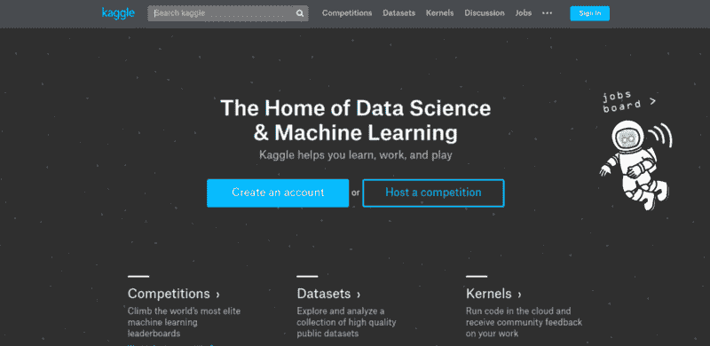
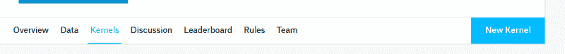
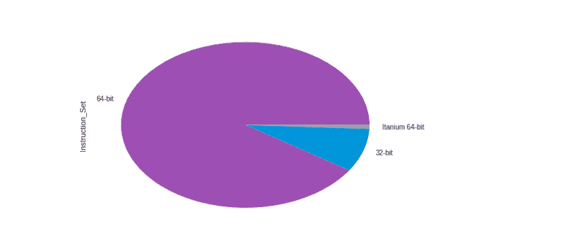
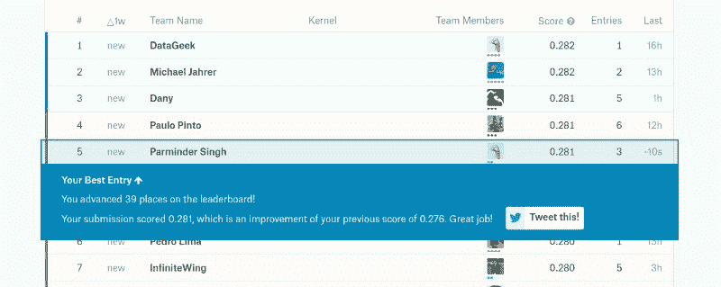
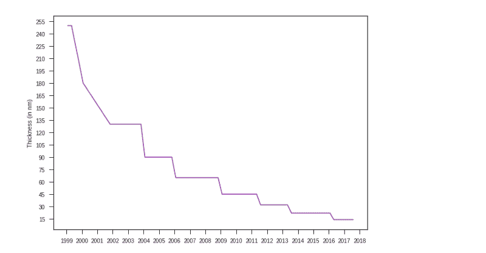
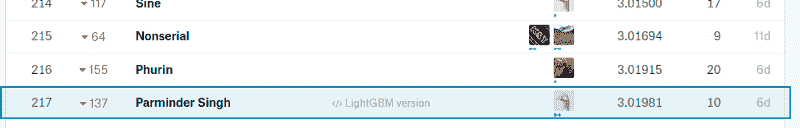

# 我从参加 Kaggle 上的机器学习竞赛中学到了什么

> 原文：<https://www.freecodecamp.org/news/what-i-learned-from-kaggle-contests-d3123e17a36b/>

帕明德·辛格

# 我从参加 Kaggle 上的机器学习竞赛中学到了什么

最近，我决定更加认真地对待我的数据科学技能。所以我决定练习我的技能，这让我有了 [Kaggle](http://kaggle.com) 。

这种经历非常积极。

当我到达 Kaggle 时，我对该做什么以及一切如何工作感到困惑。这篇文章将帮助你克服我所经历的困惑。

我参加了“重新定义癌症治疗”竞赛，因为这是一项崇高的事业。此外，数据更易于管理，因为它是基于文本的。

### 在哪里编码

Kaggle 的伟大之处在于，你不需要一个为你创造结果的云服务器。Kaggle 有一个功能，你可以在 Kaggle 内部免费运行脚本和笔记本，只要它们在一个小时内完成执行。我用 Kaggle 的笔记本写了很多提交的东西，并试验了很多变量。

总的来说，这是一次很棒的经历。

That new Kernels button is your friend!

对于竞赛，你需要使用图像或者有大量的文本。你需要一台快速的个人电脑或者一个云容器。我的电脑很烂，所以我用了亚马逊网络服务(AWS)的 c 4.2x 大型实例。这是足够强大的文本和成本只有 0.40 美元每小时。我还从 GitHub 学生开发者包获得了 150 美元的免费积分，所以我不需要担心费用。

后来当我参加[狗品种识别](https://www.kaggle.com/c/dog-breed-identification)游乐场比赛时，我做了大量的图像工作，所以我不得不将我的实例升级到 g2.2xlarge。它的成本为每小时 0.65 美元，但它有图形处理单元(GPU)的能力，因此它可以在几分钟内计算数千张图像。

实例 g2.2xlarge 仍然不够大，无法容纳我处理的所有数据，所以我将中间数据缓存为文件，并从 RAM 中删除数据。我是通过使用`del <variable na` me > to `avoid ResourceExhaustio` nErr `or or Memor` yError 来做到这一点的。两者都同样令人沮丧。

### 如何开始 Kaggle 竞赛

没有听起来那么可怕。每个竞赛的讨论和核心标签都是一个很好的开始方式。比赛开始几天后，你会在内核标签中看到几个初学者内核。你可以用这些来开始。

不用处理提交的加载和创建，只需处理数据的操作。我更喜欢 XGBoost 启动内核。他们的代码总是很短，在排行榜上排名很高。

[极限梯度提升](http://xgboost.readthedocs.io/en/latest/) (XGBoost)基于[决策树模型](https://en.wikipedia.org/wiki/Decision_tree_learning)。它非常快，而且惊人地准确，即使是在默认变量上。对于大数据，我更喜欢使用[光梯度推进机](http://lightgbm.readthedocs.io/en/latest/) (LightGBM)。它在概念上类似于 XGBoost，但是处理问题的方式略有不同。有一个问题，它不太准确。因此，您可以使用 LightGBM 进行试验，当您知道它运行良好时，就切换到 XGBoost(他们有类似的 API)。

每隔几天查看一下讨论，看看是否有人找到了新的方法。如果有人这样做了，在你的脚本中使用它，并测试你是否从中受益。

### **如何登上排行榜**

所以你有你的启动代码熟了，想升得更高？有许多可能的方法:

*   **交叉验证(CV):** 总是把训练数据分割成 80%和 20%。这样，当你使用 80%的数据进行训练时，你可以手动交叉检查 20%的数据，看看你是否有一个好的模型。引用 Kaggle 上的讨论板，“永远相信你的简历，而不是排行榜。”排行榜有 50%到 70%的实际测试集，因此您无法根据百分比确定您的解决方案的质量。有时候你的模型可能整体上很好，但是在数据上很差，特别是在公共测试集中。
*   **缓存你的中间数据:**这样做，下次你会做更少的工作。专注于一个特定的步骤，而不是从头开始。几乎所有的 python 对象都可以是`pickled`，但是为了提高效率，请始终使用你的代码所使用的库的`.save()`和`.load()`函数。
*   **使用 [GridSearchCV](http://scikit-learn.org/stable/modules/generated/sklearn.model_selection.GridSearchCV.html) :** 这是一个很棒的模块，允许你提供一组变量值。它将尝试所有可能的组合，直到找到最佳值集。这是一个伟大的优化自动化。一个微调过的 XGBoost 可以在许多问题上击败一般的神经网络。
*   使用适合问题的模型:在枪战中用刀不是一个好主意。我有一个简单的方法:对于文本数据，使用 XGBoost 或 Keras LSTM。对于图像数据，使用预训练的 Keras 模型(我大部分时间使用 [Inception](https://keras.io/applications/#inceptionv3) )和一些定制的瓶颈层。
*   **组合机型:**什么都用菜刀是不够的。你需要一把瑞士军刀。尝试结合各种模型来获得更准确的信息。例如，Inception 加上[exception](https://arxiv.org/abs/1610.02357)模型非常适合图像数据。组合模型占用大量 RAM，而 g2.2xlarge 可能无法提供。所以避免使用它们，除非你真的想提高精确度。
*   **特征提取:**通过从一个特征中提取多个更简单的特征，或者将几个特征组合成一个特征，使模型的工作更容易。例如，您可以从电话号码中提取国家和地区代码。模型并不是很智能，它们只是拟合数据的算法。因此，确保数据适合最佳拟合。

### 在 Kaggle 上还能做什么

除了作为数据科学的竞争平台，Kaggle 还是一个探索数据集和创建内核的平台，这些内核探索对数据的见解。

因此，您可以从出现在[数据集页面](https://www.kaggle.com/datasets)上的前五个数据集中选择任意一个数据集，并使用它。数据可能很奇怪，作为初学者，您可能会遇到困难。重要的是你分析数据并使之可视化，这有助于你的学习。

### 使用哪些库进行分析

对于**可视化**，浏览 [seaborn](https://seaborn.pydata.org/) 和 [matplotlib](https://matplotlib.org/) 库
进行**数据操作，**浏览 [NumPy](http://www.numpy.org/) 和 [*熊猫*](http://pandas.pydata.org/)
进行**数据预处理，**浏览 [sklearn .预处理](http://scikit-learn.org/stable/modules/generated/sklearn.preprocessing.StandardScaler.html)模块

熊猫图书馆也有一些基本的剧情功能，非常方便。
`intel_sorted[“Instruction_Set”].value_counts().plot(kind=’pie’)`

上面一行代码用“Instruction_Set”做了一个饼状图最棒的是它看起来仍然很漂亮。

This pie chart shows that Intel has a lot of 64-bit processors

### 为什么做这一切

机器学习是一个正在进行大量开发的美丽领域。参加这些竞赛将有助于你学习很多关于算法和各种数据方法的知识。我自己从 Kaggle 那里学到了很多这些东西。

此外，能够说“我的人工智能在<insert contest="" name="" here="">的前 15%”是相当有趣的。</insert>

### 我旅途中的一些额外收获

That time when I was in the top 5… at least for a few hours :P

下图展示了我的内核对 Kaggle 上的[英特尔 CPU 数据集](https://www.kaggle.com/trion129/intel-cpus-eda)的探索:

A graph showing the decreasing thickness of a chip

我对[重新定义癌症治疗](https://www.kaggle.com/trion129/lightgbm-version)竞赛的解决方案:

I ranked number 217 in the contest.

这是所有的乡亲。

感谢阅读。我希望我让你对参加 Kaggle 的比赛更有信心。

排行榜上见。