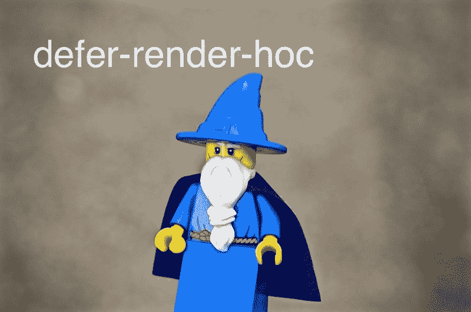
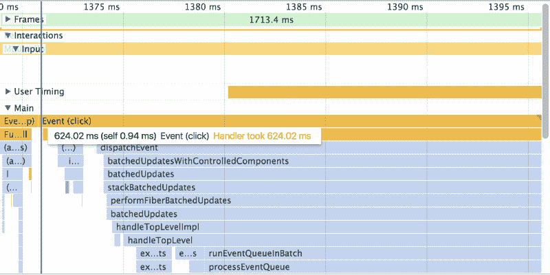
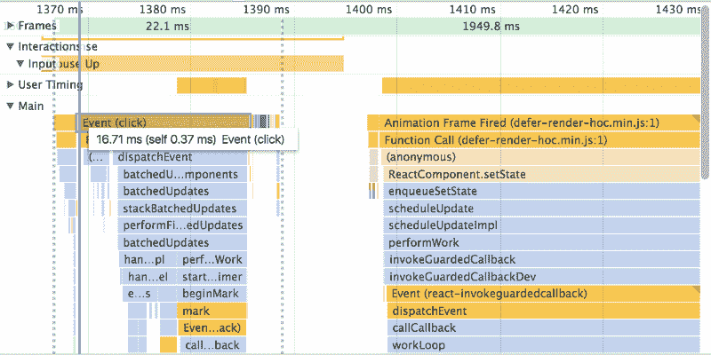

# 我从阅读 defer-render-hoc 中学到了什么以及它为什么有用。

> 原文：<https://www.freecodecamp.org/news/what-i-learned-from-reading-defer-render-hoc-8c2e9dc2b07a/>

作者安东尼·吴

# 我从阅读 defer-render-hoc 中学到了什么以及它为什么有用。

> 这是我刻意练习的另一篇文章。我为什么要这么做？[阅读本文了解更多](https://medium.freecodecamp.org/deliberate-practice-becoming-an-open-sourcerer-27a4f7640940)。

我正在阅读这篇关于 Twitter Lite (a React PWA)如何消除性能瓶颈的文章。

Image from [Twitter Lite article](https://medium.com/@paularmstrong/twitter-lite-and-high-performance-react-progressive-web-apps-at-scale-d28a00e780a3)

当用户点击`Home`按钮时，会有一段延迟，直到推文被显示。这种延迟是由大量组件的安装和卸载造成的。`defer-render-hoc`是一个开源项目，实现了文章中给出的解决方案。

### 让我们看看代码

`defer-render-hoc`是高阶分量(HOC)。要了解更多信息，请阅读这里的[文档](https://reactjs.org/docs/higher-order-components.html)。

我们用`defer-render-hoc`来包装你昂贵的组件。

`defer-render-hoc`在初始渲染时渲染`null`。

那么`defer-render-hoc`什么时候渲染你昂贵的组件呢？它使用`requestAnimationFrame`等待两帧。两帧过去后，它将渲染您的昂贵组件。

`requestAnimationFrame`通常用于创建流畅的动画([在本文中了解更多信息](https://developers.google.com/web/fundamentals/performance/rendering/optimize-javascript-execution))。

这里，我们使用`requestAnimationFrame`来允许其他组件更新并将控制权交还给用户。两帧之后，我们昂贵的组件接管。

### 演示

看看这个[代码沙盒，里面有一个`defer-render-hoc`的演示](https://codesandbox.io/s/pjxkjjxv8m)。

从`Cheap page`按钮点击到`Expensive page`按钮。注意当用户界面冻结时，按钮是如何保持蓝色的。

(without defer-render-hoc) 624.02 ms for the click event

我们的点击事件需要 620 毫秒。点击事件不会结束，直到我们昂贵的组件安装。因此，屏幕对用户来说是冻结的。

现在，从`Cheap page`按钮点击到`Deferred Expensive page`按钮。注意按钮没有保持蓝色，UI 也没有冻结。

(with defer-render-hoc) 16.71 ms for the click event

我们的点击事件需要 16 毫秒。点击事件不会等待我们昂贵的组件安装；工作延期了。屏幕不定格。

### 这有什么帮助？

同样的工作量仍然会发生。昂贵的组件仍然安装；它只是稍后安装。体验本身整体并没有更快。有了`defer-render-hoc`的开销，它甚至会更慢。但有时，更快的感知体验比实际更快的体验更重要。有关感知性能的更多信息，请参见以下链接。

*   [https://en.wikipedia.org/wiki/Perceived_performance](https://en.wikipedia.org/wiki/Perceived_performance)
*   [https://medium . com/@ Luke Jones/a-designers-guide-to-the-performance-feed B4 BD 102 b](https://medium.com/@lukejones/a-designers-guide-to-the-perception-of-performance-fedb4bd102b)

根据您的项目，`defer-render-hoc`可能适合您。