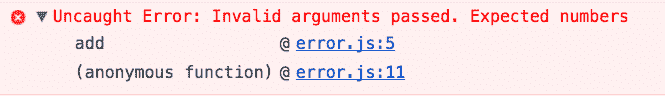

# 我从阅读 Redux 源代码中学到了什么

> 原文：<https://www.freecodecamp.org/news/what-i-learned-from-reading-the-redux-source-code-836793a48768/>

作者安东尼·吴

# 我从阅读 Redux 源代码中学到了什么


Redux’s official logo

我一直听说，作为一名开发人员，阅读代码是拓展视野的好方法。

所以我做了一个有意识的决定，真正深入挖掘一个写得很好的 JavaScript 库，尽可能多地学习。

我选择看 [Redux](https://github.com/reactjs/redux) 是因为它的代码库相对较小。

这篇文章不是 Redux 的教程，而是我通过查看它们的源代码而了解到的一些趣闻。如果你对学习 Redux 本身感兴趣，我强烈推荐观看 Redux 的创造者丹·阿布拉莫夫(Dan Abramov)本人的 Redux 系列[入门。](https://egghead.io/courses/getting-started-with-redux)

### 从开源中学习

当新开发人员问我最好的学习方法是什么时，我回答说他们应该从事项目工作。

当你遇到一个项目想法，而你真的会用上自己的时候，这是很神奇的。对产品的热情会让你度过那些数小时的调试会议，并防止你在遇到困难时放弃它。

但是只靠自己工作有一个缺点。你不会注意到你一路上养成的任何坏习惯。你不会学到任何最佳实践。你不会听说你周围涌现的所有新框架和工具。你会很快注意到，在你孤独的冒险中，你的技能停滞不前。

只要有可能，我建议你寻找其他的开发者来和你的程序配对。

坐在同事(或者如果你幸运的话，更有经验的人)旁边，你可以观察他们的思维过程。你可以看到他们的手指如何在键盘上滑动。你可以看到他们如何努力解决算法问题。您可以学习新的开发工具和键盘快捷键。你可以沉浸在所有你自己无法接触到的无形事物中。

置身于激烈的活动中是最理想的地方。


A Stradivarius violin

以斯特拉迪瓦里小提琴为例。斯特拉迪瓦里乐器以卓越的音质而闻名，这是无可匹敌的。人们提出了许多理论来解释斯特拉迪瓦里琴的优越性，从从旧教堂抢救的木材到过去使用的特殊木材防腐剂。人们试图复制它，但效果不佳，因为我们不知道安东尼奥·斯特拉迪瓦里是如何工作的。

但是想象一下，如果你和安东尼奥在同一个房间里，在他工作的时候坐在他旁边，你可以学到所有的秘密和技巧。

这就是你应该如何对待你的结对编程会议。当你看着你的同伴创造斯特拉迪瓦里风格的代码时，你应该带着健康的好奇心。没有比这更好的机会来看到一行代码中所有的血汗和泪水了。

对许多人来说，结对计划的机会是一种难得的奢侈。但是每个人都可以通过查看自己编写的代码向他人学习。

阅读写得好的代码就像阅读写得好的小说一样。这比你直接和作者对话需要更多的解释。但是您可以通过阅读注释和代码来收集大量信息。

对于那些怀疑通过阅读别人的代码能学到多少东西的人，请注意这个故事。一个名叫比尔·盖茨的高中生在一家公司的垃圾桶里翻垃圾，以获得他们的源代码并了解他们的秘密。

如果像比尔·盖茨这样的人费尽周折去读别人的代码，我认为我们值得打开 Github repo 并做同样的事情。


No source code here

通读代码并向他人学习并不是一个新概念。教程的结构是这样的，你可以跟随大师经历一段编码之旅。一个写得很好的教程会让你感觉你就坐在作者旁边。你有机会读到他们正在思考的问题。

超文本链接为你通读提供了资源，甚至可以在教程中间通读(你不会在对等编程会话中这样做)。评论区和社交媒体可以让你和大师们对话。

我也在 YouTube 上看人们编码。我推荐来自谷歌 Chrome 开发者的 YouTube 频道的[增压现场编码系列](https://www.youtube.com/watch?v=rBSY7BOYRo4)。你可以看到两个谷歌工程师现场编码一个项目。您将看到他们如何处理性能问题，像我们其他人一样努力解决拼写错误，然后陷入困境。

### 我一路走来学到的教训

#### 埃斯林特

林挺是检查代码中潜在错误的过程。它有助于加强代码风格，并保持您的代码一致和干净。您可以使用自己的自定义样式规则，或者使用遵循常规样式的预设规则(如 Airbnb 提供的规则)。

林挺在开发团队中工作时特别有效。这有助于代码看起来像是由一个人写的。它还迫使人们遵循公司风格指南(否则开发人员可能不会花时间去阅读)。

棉绒不仅仅是为了美观。他们强迫你遵循最佳实践。例如，它们可以告诉你什么时候对没有被重新赋值的变量使用“const”关键字。

如果您使用 React 插件，它们可以警告您哪些组件可以被重构为无状态功能组件。它们也是学习新的 ES6 语法的好方法，甚至告诉你在哪里可以用新特性更新你的代码。

以下是在项目中快速开始使用 ESlint 的说明:

1.  安装 ESlint 软件包。

```
$ npm install --save-dev eslint
```

2.配置 ESlint 选项。

```
./node_modules/.bin/eslint --init
```

3.在 package.json 文件中设置一个 npm 脚本来运行您的 linter(可选)。

```
"scripts": {  "lint": "./node_modules/.bin/eslint"}
```

4.运行棉绒机。

```
$ npm run lint
```

查看[他们的文档](http://eslint.org/docs/user-guide/getting-started)了解更多关于如何开始的细节。

许多编辑器也有插件，可以在你输入的时候过滤你的文件。

有时，linter 可能会抱怨您实际需要的代码，比如 console.log。您可以告诉您的 linter 在分析中忽略某些代码行。

要使用 ESlint 做到这一点，您可以包括以下注释:

```
 // Single line Ignore console.log(‘Hello World’); // eslint-disable-line no-console
```

```
// Multiline Ignore /* eslint-disable no-console */ console.log(‘Hello World’); console.log(‘Goodbye World’); /* eslint-enable no-console */
```

#### 检查缩小

我在源代码中发现了一个随机的“isCrushed()”函数，它没有主体。这很奇怪。

但是我发现它的唯一目的是看看代码是否被缩小了。在缩小过程中，函数名和变量被缩短。有一个 if 语句检查“isCrushed()”函数是否仍然存在。如果在开发中使用了精简代码，将会显示一个警告。

#### 不要害怕错误

除了学习之外，我很少在代码中使用错误。JavaScript 是一种松散类型的语言，所以我们应该对传递到函数中的内容保持警惕。我们应该抛出错误，像强类型语言那样尖叫。

最后使用带有这些错误的 try…catch…finally 语句。这样做将使您的代码在将来更容易调试和推理。

看看错误在控制台中产生漂亮的堆栈跟踪。



A helpful stack trace

错误让你的意图变得清晰。例如，如果您的“add()”函数只期望数字，那么让全世界都知道。

```
 function add(a, b) {   if(typeof a !== ‘number’ || typeof b !== ‘number’) {     throw new Error(‘Invalid arguments passed. Expected numbers’);   }
```

```
 return a + b; }
```

```
var sum = add(‘foo’, 2); // errors will prevent unintended consequences in your code 
```

#### 功能组成

有一个“compose()”函数可以在现有函数的基础上构建新函数:

```
 function compose(…funcs) {   if (funcs.length === 0) {     return arg => arg   }
```

```
 if (funcs.length === 1) {     return funcs[0]   }
```

```
 const last = funcs[funcs.length — 1]   const rest = funcs.slice(0, -1)   return (…args) => rest.reduceRight((composed, f) => f(composed),    last(…args)) } 
```

如果我有一个现有的平方数字的函数和另一个双倍数字的函数，我可以将它们组合成一个新的函数。

```
 function square(num) {   return num * num; }
```

```
function double(num) {   return num * 2;}
```

```
function squareThenDouble(num) {   return compose(double, square)(num);}
```

```
console.log(squareThenDouble(7)); // 98 
```

我不知道我是否会用到它，但是在我的工具中有它是很好的。

#### 本地方法

在查看“compose()”函数时，我遇到了一个我从未听说过的数组方法“reduceRight()”。这让我想知道还有多少其他的原生函数我还没有学会。

让我们看一个使用本机数组方法“filter()”的代码片段和一个不使用的代码片段，看看为什么知道存在哪些本机函数是值得的。

```
 function custom(array) {   let newArray = [];
```

```
 for(var i = 0; i < array.length; i++) {     if(array[i]) {       newArray.push(array[i]);     }   }
```

```
 return newArray; }
```

```
 function native(array) {   return array.filter((current) => current); }
```

```
 const myArray = [false, true, true, false, false]; console.log(custom(myArray)); console.log(native(myArray)); 
```

可以看到使用“filter()”的代码有多简洁。更重要的是，我们没有重新发明轮子。“filter()”函数已经被数百万其他用户使用，可能比您的实现问题更少。

在编写自己的解决方案之前，检查一下问题是否已经用你正在使用的语言解决了。你会惊讶于一门语言可以有多少实用方法。(例如，检查这个 Ruby [方法](https://ruby-doc.org/core-2.2.0/Array.html#method-i-repeated_permutation)在数组中的重复排列)。

#### 描述性函数名

在查看源代码时，我看到了一些很长的函数名。

1.  getUndefinedStateErrorMessage
2.  getUnexpectedStateShapeWarningMessage
3.  assertReducerSanity

虽然他们不会脱口而出，但他们所做的事情不会引起混淆。

在代码中使用描述性名称。你花在阅读代码上的时间要比写代码多，所以要让你和其他人更容易阅读。

使用长描述性名称的好处远远超过额外的击键所带来的烦恼。现代文本编辑器有自动完成功能，可以帮助你打字，所以你没有借口使用“x”或“y”作为变量。

#### console.error 与 console.log

不要什么都用 console.log。如果您想打印出一个错误，使用 console.error，您会得到一个漂亮的红色打印结果，并在控制台中显示一个堆栈跟踪。


console.error()

看一下控制台的[文档](https://developer.mozilla.org/en-US/docs/Web/API/Console),看看还有什么其他可用的方法。有一个内置的计时器(console.time())，你可以在一个表格布局中打印出你的信息(console.table())等等。

不要害怕钻研开源代码。你肯定会学到一些东西，甚至可能找到一些可以贡献的东西。

让我知道你通过看别人的代码学到了什么东西。