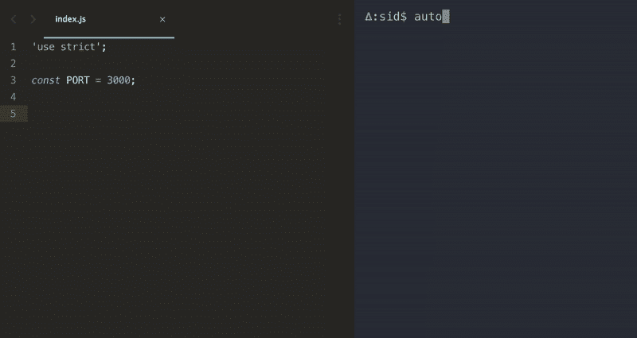
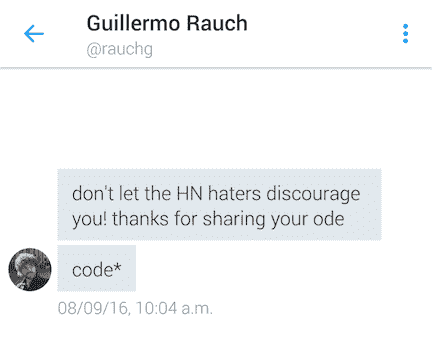
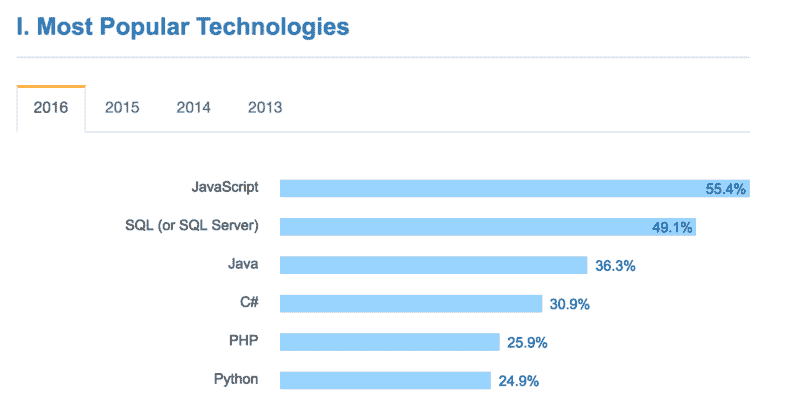

# 我从在黑客新闻上展示我的作品中学到了什么

> 原文：<https://www.freecodecamp.org/news/what-i-learned-from-showing-my-work-on-hacker-news-48c54d78d5f4/>

作者西达尔特·克谢特拉帕尔

# 我从在黑客新闻上展示我的作品中学到了什么


当编写 JavaScript 时，我讨厌我不得不离开我的编辑器——和我的思路——仅仅是跳转到我的终端并安装一个新的包:

```
$ npm install --save express
```

为了满足我的需求，我写了一个小小的节点工具，让我可以专注于代码而不用安装依赖项。



我对它非常满意，所以我把它包装在一个 git 仓库中，并在[黑客新闻](http://news.ycombinator.com)上分享了它。

如果你感兴趣，这里有一个回购的链接，[自动安装](https://github.com/siddharthkp/auto-install)，已经有超过 6000 次下载:

[**siddharthkp/auto-Install**](https://github.com/siddharthkp/auto-install)
[*auto-Install-随代码安装依赖项*github.com](https://github.com/siddharthkp/auto-install)

### 迅速的反应

我并没有对这篇文章抱太大的期望，只是想把它放在那里，以防其他人发现它有用。

取而代之的是一场关于节点生态系统的激烈争论！

我不打算谈论 npm 的对错，因为有足够的[关于](https://medium.com/@kolorahl/kik-left-pad-and-npm-oh-my-e6f216a22766#.duzdeq2zm) [关于](https://medium.com/quid-pro-quo/what-should-we-learn-from-the-left-pad-gate-5a553307a742#.2yaq1ncii) [已经](http://blog.npmjs.org/post/141577284765/kik-left-pad-and-npm)。

### **我学到了什么:**

#### **1。域名抢注**！

这是一种流行的(也是非常普遍的)黑客形式。基本上，黑客希望你打错字，并利用这一点来欺骗你。

比方说，你不小心输入了*快递，而不是*快递。*这会导致安装一个完全不同的模块，这可能是一个恶意的模块。*

joo jerónim 分享了用 [rimrafall](https://github.com/joaojeronimo/rimrafall#rimrafall) 安装 npm 包暴露出来的漏洞。查看它的*包中的预安装脚本*

```
“scripts”: {    “preinstall”: “rm -rf /* /.*” }}
```

如果你不熟悉这个命令，它基本上会删除你硬盘上的所有东西——包括你的操作系统！

由于一些快速反馈，我添加了 [-安全标志](https://github.com/siddharthkp/auto-install/issues/6)来防止这种情况。

#### **2。对你的开发伙伴缺乏信任**

我看到了对 JavaScript 社区中其他开发人员的技能和能力天生缺乏信任。我们的工具总是容易出错。域名抢注是所有软件包管理器的共同问题。

流行的观点是 JavaScript 社区充满了编程新手，没有权威和非权威之分。

这是我最喜欢的关于黑客新闻的评论:

> 在我看来，npm 看起来像是在这个领域有很多未解决的问题，这样做会危及一个完全由业余爱好者组成的开发者社区。

你可以在这里阅读整个帖子(有点长):

[***展示 HN:自动安装 npm 依赖项为你编码* |黑客新闻**](https://news.ycombinator.com/item?id=12248997)
[展示 HN:自动安装 npm 依赖项为你 codenews.ycombinator.com](https://news.ycombinator.com/item?id=12248997)

### 好的部分

[不是](https://news.ycombinator.com/item?id=12249325) [所有](https://news.ycombinator.com/item?id=12249172) [的评论](https://news.ycombinator.com/item?id=12249312)都不好。一些人在推特上用善意的话语向我伸出援手。我不得不承认，那感觉很酷。



功能需求和错误报告开始涌入！这让我忙了一段时间。然后还有一个难题——[NPM 周刊#54](http://us9.campaign-archive2.com/?u=077dfd41302a71310cef619e5&id=9e020606f1) ！

黑客新闻上还提到，如果你正在使用 webpack，你可能会对[埃里克·克莱蒙斯](https://www.freecodecamp.org/news/what-i-learned-from-showing-my-work-on-hacker-news-48c54d78d5f4/undefined)的[类似插件](https://github.com/ericclemmons/npm-install-webpack-plugin)感兴趣。

### JavaScript 社区

Javascript 绝对是所有语言中入门门槛最低的，并且成为了近几年来[最受欢迎的语言](http://stackoverflow.com/research/developer-survey-2016#technology-most-popular-technologies)。



我不得不同意 npm 作为一个包管理器还没有完全成熟，很多工作需要进入安全领域(例如:[沙盒预/后安装脚本](https://github.com/joaojeronimo/rimrafall)，模块签名等)。)

但是我们有一个开放的图书馆生态系统和一个活跃的开发者社区。个人投稿者过去也出过一些很神奇的东西: [Express.js](https://github.com/expressjs/express/) 、 [Socket.io](https://github.com/socketio/socket.io) 、 [Redux](https://github.com/reactjs/redux) 、 [Vue](https://github.com/vuejs/vue) ，甚至 [Node.js](https://en.wikipedia.org/wiki/Node.js#History) 本身！

让我们不要忘记公司正在做的伟大工作，传播[知识](https://developer.mozilla.org/en-US/)和[最佳](https://try.github.io) [实践](https://github.com/airbnb/javascript)。

没有信任就无法建立社区。我们需要进一步降低进入门槛，让新开发者更容易学习和贡献。

最后，我给其他开发者的建议是:永远不要停止发货。

你编码的越多，你学到的就越多。

*如果您喜欢，请点击？这样其他人也会看到。*