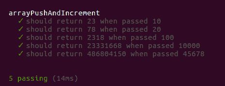

# 我从编写六个做同样事情的函数中学到了什么

> 原文：<https://www.freecodecamp.org/news/what-i-learned-from-writing-six-functions-that-all-did-the-same-thing-b38fd48f0d55/>

几周前，一名营员在[自由代码营的论坛](http://forum.freecodecamp.com/t/javascript-algorithm-challenge-october-9-through-16/44096?u=jacksonbates)上发起了一场非官方的算法竞赛。

挑战看起来很简单:返回所有小于 N 的 3 或 5 的倍数之和，其中 N 是函数的输入参数。

但是， [P1xt](https://www.freecodecamp.org/news/what-i-learned-from-writing-six-functions-that-all-did-the-same-thing-b38fd48f0d55/undefined) 的竞争要求你关注效率，而不仅仅是找到任何解决方案。它鼓励您编写自己的测试，并对您的解决方案的性能进行基准测试。

这是我尝试和测试的每个功能的细目分类，包括我的测试和基准测试脚本。最后，我将展示这个函数，它把我自己的所有东西都炸出了水面，给我上了宝贵的一课。

### 函数#1:数组、推送、增量

```
function arrayPushAndIncrement(n) {
	var array = [];
    var result = 0;
    for (var i = 1; i < n; i ++) {
        if (i % 3 == 0 || i % 5 == 0) {
            array.push(i);
        }
    }
    for (var num of array) {
        result += num;
    }
    return result;
}

module.exports = arrayPushAndIncrement; // this is necessary for testing
```

对于这样的问题，我的大脑默认为:建立一个数组，然后对那个数组做一些事情。

这个函数创建一个数组，并将满足我们条件的任何数字(可被 3 或 5 整除)推入数组。然后它遍历该数组，将所有的值加在一起。

### 设置测试

下面是这个函数的自动化测试，使用 Mocha 和 Chai，在 NodeJS 上运行。

如果你想知道更多关于安装 Mocha 和 Chai 的信息，我已经在自由代码营的论坛上写了一个详细的指南。

我使用提供的值 [P1xt](https://www.freecodecamp.org/news/what-i-learned-from-writing-six-functions-that-all-did-the-same-thing-b38fd48f0d55/undefined) 编写了一个简单的测试脚本。请注意，在下面的脚本中，该函数作为一个模块包含在内:

```
// testMult.js

var should = require( 'chai' ).should();
var arrayPushAndIncrement = require( './arrayPushAndIncrement' );

describe('arrayPushAndIncrement', function() {
    it('should return 23 when passed 10', function() {
    	arrayPushAndIncrement(10).should.equal(23);
    })
    it('should return 78 when passed 20', function() {
    	arrayPushAndIncrement(20).should.equal(78);
    })
    it('should return 2318 when passed 100', function() {
    	arrayPushAndIncrement(100).should.equal(2318);
    })
    it('should return 23331668 when passed 10000', function() {
    	arrayPushAndIncrement(10000).should.equal(23331668);
    })
    it('should return 486804150 when passed 45678', function() {
    	arrayPushAndIncrement(45678).should.equal(486804150);
    })
})
```

当我使用`mocha testMult.js`运行测试时，它返回如下内容:



对于本文中的所有未来函数，假设它们通过了所有测试。对于您自己的代码，为您尝试的每个新功能添加测试。

### 功能#2:排列、推送、减少

```
function arrayPushAndReduce(n) {
	var array = [];
    for (var i = 1; i < n; i ++) {
    	if (i % 3 == 0 || i % 5 == 0) {
        	array.push(i);
        }
	}  
    return array.reduce(function(prev, current) {
    	return prev + current;
    });
}

module.exports = arrayPushAndReduce;
```

所以这个函数使用了与我之前的函数相似的方法，但是它没有使用`for`循环来构造最终的和，而是使用了更好的`reduce`方法。

### 设置性能基准测试

现在我们有两个函数，我们可以比较它们的效率。再次感谢 [P1xt](https://www.freecodecamp.org/news/what-i-learned-from-writing-six-functions-that-all-did-the-same-thing-b38fd48f0d55/undefined) 在之前的论坛帖子中提供了这个脚本。

```
// performance.js

var Benchmark = require( 'benchmark' );
var suite = new Benchmark.Suite;

var arrayPushAndIncrement = require( './arrayPushAndIncrement' );
var arrayPushAndReduce = require( './arrayPushAndReduce' );

// add tests
suite.add( 'arrayPushAndIncrement', function() {
		arrayPushAndIncrement(45678)
    })
    .add( 'arrayPushAndReduce', function() {
    	arrayPushAndReduce(45678)
    })
    // add listeners
    .on( 'cycle', function( event ) {
    	console.log( String( event.target ));
    })
    .on( 'complete', function() {
    	console.log( `Fastest is ${this.filter( 'fastest' ).map( 'name' )}`);
    })
    // run async
    .run({ 'async': true });
```

如果您使用`node performance.js`运行此命令，您将看到以下终端输出:

```
arrayPushAndIncrement x 270 ops/sec ±1.18% (81 runs sampled)
arrayPushAndReduce x 1,524 ops/sec ±0.79% (89 runs sampled)
Fastest is arrayPushAndReduce
```

所以使用`reduce`方法给了我们一个比**快 5 倍**的函数！

如果这还不足以鼓励我们继续进行更多的功能和测试，我不知道还有什么可以鼓励我们！

### 函数#3: While，Array，Reduce

现在，由于我总是使用可靠的`for`循环，我想我应该测试一下`while`循环的替代方案:

```
function whileLoopArrayReduce(n) {
    var array = [];
    while (n >= 1) {
    	n--;
        if (n%3==0||n%5==0) {
        	array.push(n);
        }  
    }  
    return array.reduce(function(prev, current) { 
    	return prev + current;
    });
}

module.exports = whileLoopArrayReduce;
```

结果呢？稍微慢一点:

```
whileLoopArrayReduce x 1,504 ops/sec ±0.65% (88 runs sampled)
```

### 函数#4: While，sum，没有数组

因此，发现循环的类型不会产生很大的差异，我想知道如果我使用一种完全避免数组的方法会发生什么:

```
function whileSum(n) {
    var sum = 0;
    while (n >= 1) {
        n--;
        if (n%3==0||n%5==0) {
            sum += n;
        }
    }  
    return sum;
}

module.exports = whileSum;
```

当我开始思考这个问题时，我意识到我总是*首先到达数组是多么的错误…*

```
whileSum x 7,311 ops/sec ±1.26% (91 runs sampled)
```

另一个巨大的改进:比我原来的函数快了将近 5 倍，快了 27 倍**！**

### **函数#5: For，sum**

当然，我们已经知道 for 循环应该更快一些:

```
function forSum(n) {
    n = n-1;
    var sum = 0;
    for (n; n >= 1 ;n--) {
        (n%3==0||n%5==0) ? sum += n : null;
    }  
    return sum;
}
```

它使用三元运算符来进行条件检查，但是我的测试表明，它的非三元版本在性能方面是相同的。

```
forSum x 8,256 ops/sec ±0.24% (91 runs sampled)
```

所以，再快一点。

我的最终函数比最初的函数快了 28 倍。

我觉得自己像个冠军。

我欣喜若狂。

我安于现状。

### 输入数学

一周过去了，每个人的最终解决方案都被发布、测试和整理。执行速度最快的函数完全避免了循环，并使用一个代数公式来处理数字:

```
function multSilgarth(N) {
    var threes = Math.floor(--N / 3);  
    var fives = Math.floor(N / 5);
    var fifteen = Math.floor(N / 15);
    return (3 * threes * (threes + 1) + 5 * fives * (fives + 1) - 15 * fifteen * (fifteen + 1)) / 2;
}

module.exports = multSilgarth;
```

等着吧…

```
arrayPushAndIncrement x 279 ops/sec ±0.80% (83 runs sampled)
forSum x 8,256 ops/sec ±0.24% (91 runs sampled)
maths x 79,998,859 ops/sec ±0.81% (88 runs sampled)
Fastest is maths
```

### 最快的是数学

所以获胜函数大约比我的最大努力快了 9690 倍，比我最初的努力快了 275858 倍。

如果你需要我，我会在可汗学院学习数学。

感谢每一位本着帮助其他营员学习新方法的精神参与并分享他们的解决方案的人。

如果你有兴趣，这里有 [P1xt](https://www.freecodecamp.org/news/what-i-learned-from-writing-six-functions-that-all-did-the-same-thing-b38fd48f0d55/undefined) 的比赛报道，以及所有的测试和基准数据:

[**P1xt/algo-oct-17**](https://github.com/P1xt/algo-oct-17)
[*algo-oct-17-JavaScript 算法挑战赛-10 月 9 日至 16 日*github.com](https://github.com/P1xt/algo-oct-17)