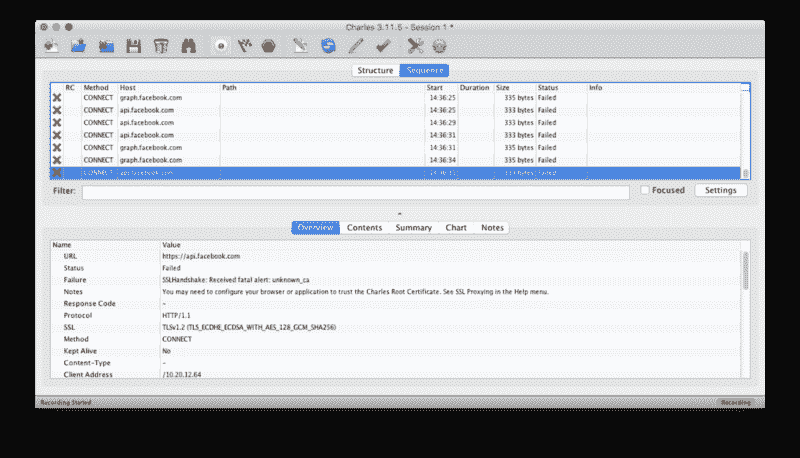
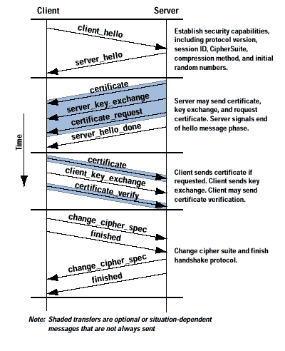
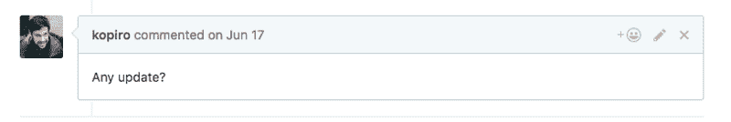
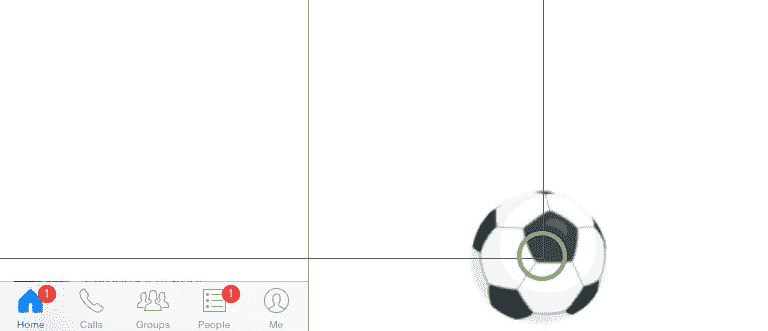
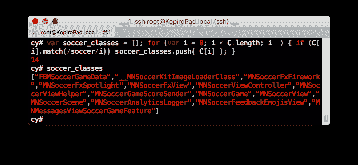
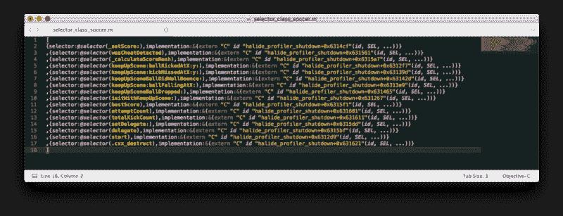

# 我在黑 Facebook Messenger 足球游戏中学到了什么

> 原文：<https://www.freecodecamp.org/news/what-i-learned-hacking-facebook-messenger-soccer-game-3c882ea8537d/>

弗拉维奥·德·斯特凡诺

# 我在黑 Facebook Messenger 足球游戏中学到了什么


Summer soccer - [Franck Michel](https://www.flickr.com/photos/franckmichel/ "Go to Franck Michel's photostream") - [https://www.flickr.com/photos/franckmichel/6384558985](https://www.flickr.com/photos/franckmichel/6384558985)

最近，在去年的欧洲足球锦标赛期间，脸书在 Messenger 应用程序中引入了一个小游戏，尽管它很简单，但却让你损失了很多时间。

如果你没有注意到，可以在 Mashable 上阅读[这篇文章](https://mashable.com/2016/06/15/facebook-messenger-soccer-game-how-to/#fmGutFmQ3Oqx)。

我不得不承认…我完全不擅长这个游戏，所以我的最好成绩是 **9** *。*

但是，作为一名开发者，我能做的最好的事情就是通过入侵游戏来击败我的朋友。

我真的以为这很简单。

#### 第一种方式:监听 HTTP(s)请求

在开发应用程序时，您立即意识到需要一个 HTTP 调试器工具来分析 API 的传入/传出流量。

[**查尔斯**](https://www.charlesproxy.com/) 是我发现的完成这项任务的最佳工具。它有一个非常直观的界面，你可以很容易地使用它进行调试和逆向工程的目的。

它应该在这一点上结束:我必须分析脸书应用程序使用的 API，并在编辑发送到服务器的数据和分数时用 CURL 重放它。

当然，API 调用在 HTTPS，所以它们是加密的..但是 *Charles 可以被用作中间人 HTTPS 代理，*使你能够以纯文本方式查看网络浏览器和 SSL 网络服务器*之间的通信。*



Charles acting as a proxy — with failed requests

完美！所以我在 iPhone 上安装了根查尔斯证书，我试着检查流量。但是在 SSL 握手阶段，所有对脸书服务器的 HTTP 调用都被拒绝。



SSL - image courtesy of cisco.com

在做一些研究时，我发现一些公司应用程序，如脸书和谷歌，使用额外的安全层来确保远程服务器提供的证书是预期的。这种技术被称为**证书锁定。**

通过在应用程序中包含远程服务器证书的公钥，可以很容易地做到这一点，这样就可以很容易地为每个 HTTPS 请求验证客户端的身份。

这种技术使[中间人(MITM)](https://en.wikipedia.org/wiki/Man-in-the-middle_attack) 攻击失效。

干得好，脸书！但是……(记住，总是有但是)有一种方法可以使用一些系统调整来禁用 **SSL 证书锁定**,这种方法只适用于 jail broken 设备。

#### 第一种方式(增强):越狱一个设备，安装 iOS SSL Kill Switch

我的 iPhone 目前运行的是 iOS 9.x，所以在我写这篇文章的时候还不可能越狱。所以我拿了一台运行 iOS 8.3.x 的旧 iPad mini，用 [TaiG](http://www.taig.com/en/) 工具**轻松越狱。**

在网上搜索，我发现了 [SSL Kill Switch 2](https://github.com/nabla-c0d3/ssl-kill-switch2) ，这是一个在 iOS 和 OS X 应用中禁用 SSL 证书验证的黑盒工具。

一旦加载到 iOS 或 OS X 应用程序中，SSL Kill Switch 2 会在安全传输 API 中修补特定的低级 SSL 函数，以便*覆盖并禁用系统的默认证书验证以及任何类型的自定义证书验证*(如证书锁定)。

SSL Kill Switch 使用 [MobileSubstrate](http://iphonedevwiki.net/index.php/MobileSubstrate) 来修补系统功能，如[安全传输 API](https://developer.apple.com/library/ios/DOCUMENTATION/Security/Reference/secureTransportRef/Reference/reference.html) 。它们是 iOS 上最底层的 TLS 实现。

这意味着在安全传输 API 中禁用 SSL 证书验证会影响 iOS 框架中可用的大多数(如果不是全部)网络 API。

请帮你自己一个忙，关注一下这个涵盖所有这些概念的博客。

因此，我使用 SSH 连接到 iPad 并安装了这个包:

```
wget https://github.com/nabla-c0d3/ssl-kill-switch2/releases/download/0.10/com.nablac0d3.SSLKillSwitch2_0.10.deb --no-check-certificatedpkg -i com.nablac0d3.SSLKillSwitch2_0.10.debkillall -HUP SpringBoard
```

一旦重新启动，我希望看到普通的流量，但这是一个乐观的愿景:*我得到了同样的错误。*

我又这样试了一个小时。我在某处读到脸书和 Twitter 使用 SPDY 协议进行 API 调用，这对 Charles 来说可能是个问题。所以我安装了另一个(理论上)禁用 SPDY 协议的调整，但它不起作用。

*挨饿。*

在查看项目问题时，我注意到其他人也有同样的问题([https://github.com/nabla-c0d3/ssl-kill-switch2/issues/13](https://github.com/nabla-c0d3/ssl-kill-switch2/issues/13))，但没有解决方案。



*停顿。*

#### 第二种方式:在应用程序中模拟触摸事件

我意识到有许多游戏作弊使用了“人类”的方法:*模拟触摸事件*(许多游戏作弊使用这种策略的最受欢迎的游戏之一是《部落冲突》)。

在网上浏览自动化这些操作的工具时，我发现了这个很棒的调整- [自动触摸](https://autotouch.net/)。它可以记录人类触摸事件，并将数据存储在 LUA 脚本中。然后，您可以编辑这个生成的脚本，并在您的设备上模拟您想要的任何内容。

一旦安装了 [Cydia](https://cydia.saurik.com/) ，我就保存了一个 Messenger 应用程序的 BMP 截图，球是可见的，并获得了点击位置的坐标。



Screenshot made to obtain the coordinate

我想到的是，通过在球的 X 轴中心准确地点击*，我只需要在相同的坐标中模拟重复的触摸事件，然后在我有一个满意的分数时停止脚本。*

*以下是我为实现这个目标而写的内容:*

```
*`adaptResolution(768, 1024);adaptOrientation(ORIENTATION_TYPE.PORTRAIT);`*
```

```
*`for i=1,2000 do`*
```

```
 *`touchDown(1, 544, 954);  usleep(66000);  touchUp(1, 544, 954);`*
```

```
 *`usleep(10000);`*
```

```
*`end`*
```

*不，它不起作用。*

*很可能，脸书开发者在触摸坐标上引入了一个随机错误，以更好地模拟游戏，或者防止这种类型的脚本。*

*或者，也许我只是点击了错误的像素。*

*所以，为了第二次机会，我尝试在更大的区域模拟多次点击，但没有运气。有时候，我模拟了太多的触摸事件，以至于跳板*因为记忆错误*而刚刚撞毁*。**

*我尝试了一种更好的方法，而不是每次都点击相同的坐标。*

*阅读自动触摸[文档](https://autotouch.net/server/doc/en.html)，我发现以下两种方法:*

*   *findColor (color，count，region) -在当前屏幕上搜索与指定颜色匹配的像素点的坐标。*
*   *getColor (x，y) -获取当前屏幕上指定坐标的像素点的颜色值。*

*想法是在球内找到一种独特的颜色，并使用 *findColor* 方法获得球在那一刻的坐标，以模拟触摸事件。*

```
*`adaptResolution(768, 1024);adaptOrientation(ORIENTATION_TYPE.PORTRAIT);`*
```

```
*`local c = getColor(544, 954);`*
```

```
*`for i=1,2000 do  local r = findColor(c, 0, {400, 500, 768, 1024});`*
```

```
 *`for i, v in pairs(r) do    touchDown(1, v[1], v[2]);    usleep(66000);    touchUp(1, v[1], v[2]);    usleep(10000);  end`*
```

```
*`end`*
```

*不知道为什么，就是不行。也许 *findColor* 拦截球的速度太慢，这使得脚本没有用。*

#### *第三种方式:对应用程序进行逆向工程*

*我在 Objective C 中没有很好的原生技能，但是我记得(4 年前玩越狱的时候~4 年前)有一个 [Saurik](https://twitter.com/saurik?lang=en) 的工具可以把自己注入到 iOS 进程中。*

*它和 Cydia 一起发布，被称为[cyscript](http://www.cycript.org/)。*它允许开发者通过在运行时注入代码来探索和修改在 iOS 上运行的应用。**

*看了一些如何使用的基础教程，几经挣扎，决定走这条(另一条)路。*

*一旦您通过 SSH 登录到您的 iOS 设备，您只需输入:*

```
*`cycript -p Messenger`*
```

*我试着考察了一些像 *UIApp* 这样的基础 UI 类，但是没有发现什么有趣的东西。然后我创建了一个完整的**类转储**，过滤掉关键词**足球。***

```
*`var C = Object.keys(ObjectiveC.classes);var soccer_classes = []; for (var i = 0; i < C.length; i++)  C[i].match(/soccer/i) && soccer_classes.push( C[i] );`*
```

*这是一个缓慢的过程。*

*我[发现【Facebook Messenger 有非常多的类。](https://www.reddit.com/r/programming/comments/3h52yk/someone_discovered_that_the_facebook_ios/)*

*但是，最后，我得到了一个小名单。*

*

Output of the script* 

*一旦获得了类名，我就使用脚本打印该类的所有方法，并且通过检查 ***MNSoccerGame*** 类，得到的方法是:*

*

The methods dump of the MNSoccerGame class* 

> *注:我还是不明白 *wasCheatDetected 是什么方法。**

*现在我有了一个完整的类方法列表，我决定覆盖 *_setScore* 方法，希望其他方法不会注意到这一点。*

*为此，我使用了 **MobileSubstrate** 及其 **MS.hookMessage** 方法。*

```
*`@import com.saurik.substrate.MS;`* 
```

```
*`var _setScore_pointer = {}; MS.hookMessage(MNSoccerGame, @selector(_setScore:), function(arg0) {  return _setScore_pointer->call(this, 9999); }, _setScore_pointer);`*
```

*现在你可以继续玩下去，**输了**，而**无论如何都会创造一个新纪录。***

#### *我学到了什么*

*永远不要停止自己。总是尝试和发现新的方法来完成同样的事情。我知道，这只是一个游戏，但如果你把你试图解决的问题当成一个挑战，你将获得比击败朋友更多的满足感。*