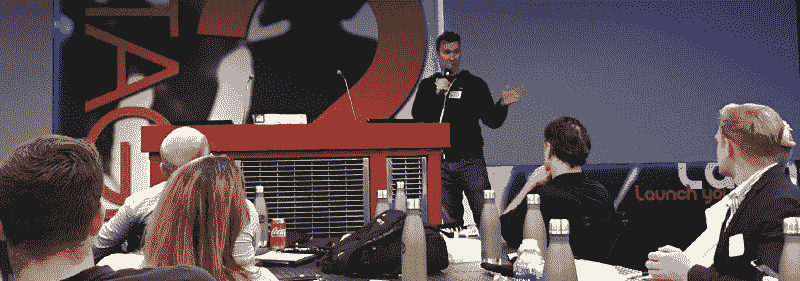
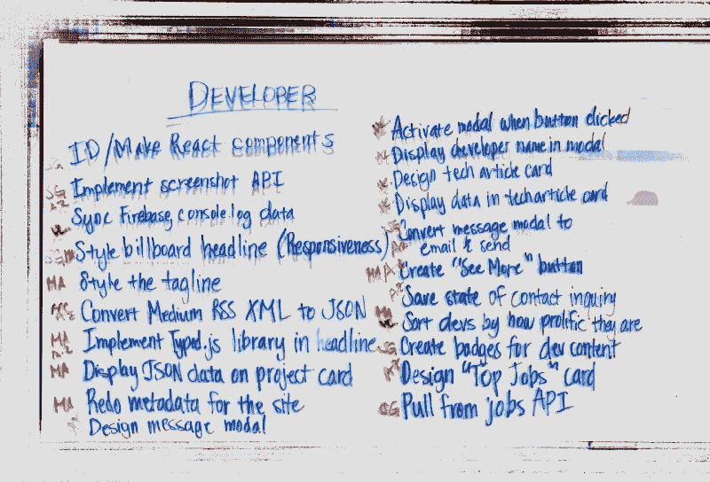
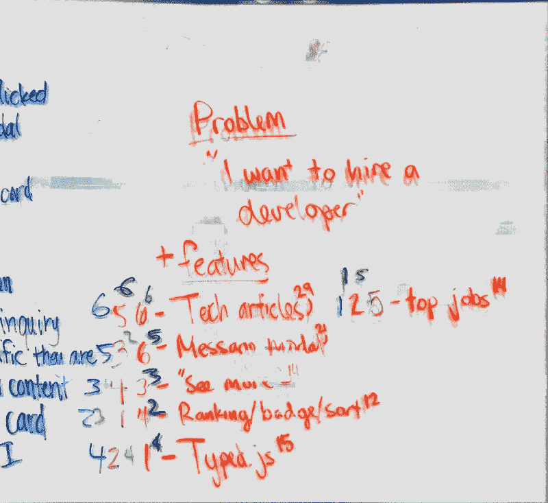

# 我领导我的第一个团队并在创业周末获胜所学到的

> 原文：<https://www.freecodecamp.org/news/what-i-learned-leading-my-first-team-and-winning-at-startup-weekend-e84a6db077b6/>

作者:迈克·泽特洛

# 我领导我的第一个团队并在创业周末获胜所学到的

白天，我是 CHSI 科技公司的 UX 建筑师，这是一家位于拉斯韦加斯的保险科技公司。下班后，我组织[拉斯维加斯开发者](https://www.meetup.com/Las-Vegas-Developers/)，这是我们城市最大的程序员聚会。

我今年报名参加了[创业周末](https://startupweekend.org/)，打算亲自开发一个简单的网络应用程序:一个自我更新的拉斯维加斯开发者目录。

在“创业周末”之前，除了我们的 Meetup 页面，拉斯维加斯的开发者几乎没有其他网站。我想通过制作一个应用程序来改变这种情况，在我们的成员在我们的每月活动[演示日](http://demoday.vegas/)上展示他们的项目后，该应用程序会在线显示他们的项目。

我决定在第一个晚上征集想法，看看是否有人想在接下来的两天里帮助建立这个。当我让六名出色的团队成员自愿发挥他们不同的能力时，我意识到需要有人来领导。再加上我在 CHSI 技术公司的首席技术官要求我在本季度承担更多的管理角色，我知道我必须离开编码，并站出来领导团队。但是怎么做呢？

### 文化推介

“我在寻找冷酷无情的杀手，他们愿意踢我的屁股，完成任务！”我宣布。我想在我的[号令](https://medium.com/swlh/the-most-important-thing-i-learned-about-culture-after-hosting-300-open-mic-nights-b8f0a9420a76)中成为**分裂** 。我想让一些人离开。我想要一个**选择几个**来团结在事业周围——在这种情况下，是那些认为自己是混蛋的人。

我从另一位拉斯维加斯居民、Zappo 的首席执行官谢家华那里了解到这一点，他会付钱让你辞职，淘汰那些对事业不太忠诚的人。

### 雇佣前先解雇

领导黑客马拉松是一项有趣的挑战。人们自愿在周末接受你的想法。拒绝自愿的帮助会很尴尬。

> “不幸的是，我们所有的位置都满了，我们的团队已经建立起来了，”我看着新来的人说。我的其他 6 名队员都愣住了。

> “好的，”新来的人说，然后去加入另一个小组。

> “可恶。”

> “那是冷的。”

> “我为他感到难过。”

当我立即拒绝了一个接近我们日益壮大的团队的人时，我的团队成员震惊了。我也很难过！但是我看到了这个新来者的破坏性。我整晚都在房间里搜寻，这个声音特别大、令人讨厌的与会者让我感觉不好。

当他训练破坏了他最终加入的球队，把最后一场比赛变成了一场大喊大叫的比赛和对麦克风的争夺时，我们都对这个决定感觉更好。

我们都冻僵了。我在我的推销中说过，并且用行动支持它。

### 设定期望值

紧接着，我对团队设定了期望。我们不是来假装我们是史蒂夫·乔布斯，我们是来发布 iPhone 的。我们来这里是为了找乐子和建造一些很酷的东西。为了竞争，我们将像这样做一个可行的产品和一个真正的公司，但在我们内心深处，我们真的会在那里享受乐趣，做一些很酷的东西。

“大家都同意吗？”我问。“如果没有，你可以把我拉到一边，加入另一个团队，或者一言不发地离开，不要难过。”

我们开诚布公地讨论了我们想从《创业周末》中得到什么。没有人说他们期望从这家公司开始独角兽业务。大多数人谈到获得经验或玩得开心。我很高兴看到我们的目标是现实的、一致的，这让我们感觉很好。

### 打破坚冰，潜入深海

经过紧张的第一个晚上，我想团结团队。那天晚上剩下的时间我都在家计划我们该怎么做。然后我们花了第二天早上的头几个小时互相了解。

我认为破冰问题应该有其背后的意图，而不仅仅是一个愚蠢的浪费时间的问题。

其中一个问题是，“在创业周末，你有什么不为人知的地方？”

我这样做是为了让团队有一种同室操戈的感觉——就像我们都在互相分享秘密，我们有这些东西把我们团结在一起。

然后我问:“你要花多少钱才能‘快进’到下一周，所有事情都按照你的‘时间线’发生，只是你错过了而已？”

大多数人说他们的时间是无价的，无法用数字来衡量。

这才是重点。我们的时间是无价的，所以让我们彼此充分利用这个周末。让我们把时间当作我们所拥有的一切。

具有讽刺意味的是，这项活动占用了黑客攻击第一天的整个上午。但我相信这是一项可以立即获得回报的投资。

[我们的一名团队成员](https://medium.freecodecamp.org/i-entered-a-hackathon-with-13-days-of-coding-experience-here-is-what-i-learnt-5538d73ee7ce)说得好:

> 这是一项值得的投资。我认为这真的将我们作为一个团队聚集在一起，并使我们团结起来创造一个工作产品。

### 提供发言权和选择

“声音和选择”是一种授予团队成员自主权的方式，同时仍然关注团队的目标。这个想法来自教育界的思想领袖。

花 2 分钟时间观看由高中科学教师 Jeff Robin 制作的视频，并思考商业领袖如何将其应用到他们的团队中:

给予团队成员发言权和选择权可以增加认同度，提升成员的动力[马斯洛需求层次](https://en.wikipedia.org/wiki/Maslow%27s_hierarchy_of_needs)走向自我实现和纯粹的快乐。

我们的 hackathon 团队通过集思广益我们的应用程序可能拥有的所有特性来做到这一点。然后每个开发人员都签下他们想开发的特性，允许多个开发人员签下同样的东西。

他们要么在这样的事情上配对，要么一个开发者在另一个被占用的时候抢走一些东西。

我们一起决定了我们必须发布的最小功能集，真正的最小可行产品。然后，我们对剩下的好的特性分别进行排名，从 6 到 1，并把它们的分数加起来。

现在我们有了一个路线图:我们必须执行的最低要求，以及如果我们有时间的话，我们将得到的很酷的东西。它是根据每个开发者想要做什么，他们的声音和选择来划分的。

### 戴着镣铐跳舞

如果你看了上面的视频，你会听到一个借用尼采的美丽短语。

> 艺术家是戴着镣铐跳舞的人。

杰夫·罗宾解释说，通过给他的学生施加约束，他激发了他们的创造力。

> 声音和选择受到…经验和预设参数的调节。每个人都有参数。流行歌手有三分钟，会计师有税法，物理学家有牛顿，艺术家有画布。

因此，我必须利用我的经验，并考虑团队的技能组合来做出“画布”决策——设计一个让每个人都感到成功的环境。

我会更喜欢使用 Github Projects、Waffle 或 Moo.do 等强大的任务管理软件吗？没错。但是我们的一个团队成员只编写了 13 天的代码！

我们有两个团队成员不是程序员，而是业务分析师或营销人员。所以我决定，我们将使用 [Trello](https://trello.com/) 进行任务优先级和工作流程，使用 [Slack](https://slack.com/) 进行沟通——每个人都可以很快采用的工具。

我还做出了“画布”决定，我们将使用我制作的 React / Firebase / Bootstrap 4 框架——它简单且模块化。我们最资深的开发人员写了一份严格的分支/拉取请求清单，放在自述文件中，并帮助每个人登上代码库。

有了这些预设的参数，我们允许开发人员在限制范围内工作，实际上更有创造性，并享受他们对项目的贡献。

### “领导”已经过时，促进才是时尚

每个人都认为其他人需要被管理，但是没有人认为 T2 他们自己需要被管理。

每个人都认为自己是个积极主动的人。但是他们相信他们的员工需要被分配工作，或者被引导一个方向，或者被“追究责任”

如果你雇佣了优秀的员工，领导者的工作就是确保团队能够完成他们的工作——不再领导他们、手把手地管理、微观管理、指导，或者其他任何让我在打字时感到不快的事情。我喜欢用“促进者”这个词来形容这个角色。

科技领袖教练马库斯·布兰肯希普(Marcus Blankenship)将领导力重新定义为类似的意思:

> 领导力是创造一种环境的过程，在这种环境中，每个人都可以参与解决手头的问题。

在简历中称自己为领导者，但在战场上要表现得像一个推动者。

当人们向你寻求快速建议，并愉快地离开时，你会知道你做得对。

领导不是说得最多的人，而是每个人都与之交谈的人。

### 快乐的团队=结果

同样，许多糟糕的经理认为他们的报告整天偷懒是最快乐的。这表明了对马斯洛需求层次的明显无知，以及“自我只有在把自己交给更高的外部目标时才能实现”的事实人们最快乐的是有所成就。启用它们！

Awww, lookit these smiling stone-cold killers. :)

最后，我们作为一个团体走到了一起，为了一个共同的目标努力工作，并且玩得非常开心。开发一些有用的东西并赢得创业周末只是这个过程的副产品。