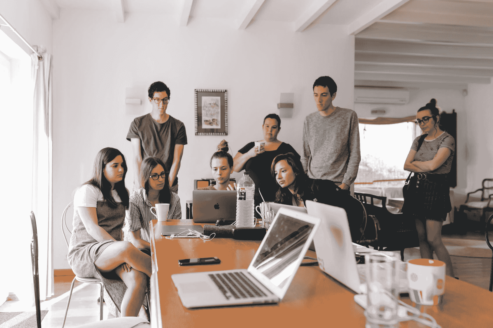
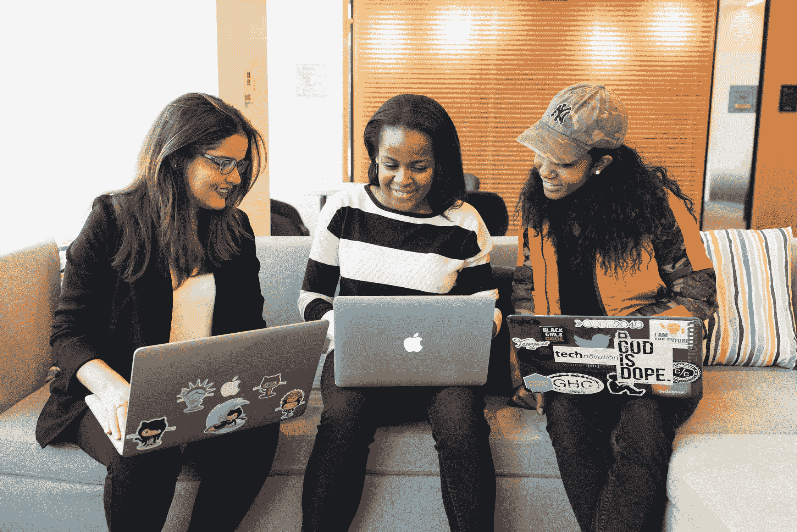

# 我在教 20 个高中女生如何编程中学到了什么

> 原文：<https://www.freecodecamp.org/news/what-i-learned-teaching-20-hs-girls-to-code/>

第一天，他们几乎不知道什么是浮动。在第 14 天，他们编写了一个扫雷游戏，一个密码解码器，或者一个僵尸启示录模拟。我帮助教他们如何去做。

每年夏天，麻省理工学院都会举办一个名为“WTP”的项目，即女性科技项目。

用程序自己的话说，它的目标是:

> “激发高中高年级学生对未来工程和计算机科学研究的兴趣”。

该计划为那些没有机会探索工程和技术的人培养了一个以女性为中心的协作社区。

今年，我有幸成为 WTP EECS(电子工程和计算机科学)竞赛的计算机科学讲师。这意味着我要教 20 名高中女生如何编程——她们中没有一个人之前接触过编程。

在短短的两周内，我和四位来自麻省理工学院的优秀导师将会教他们 Python 编程的基础:数据类型、变量、条件、循环、函数、类，甚至继承。项目的最后一周将留给他们自己选择的编程项目，测试他们的新技能。

作为讲师，我花了一个多月的时间准备课程材料。在上课期间(没有双关语的意思)，我每天花三个小时讲课，一个小时为学生管理办公室。以下是我一路走来学到的东西:

## 1)任何人都可以学习编码

是的，任何人。

第一天，我给每个人发了一份 Python 小抄。他们带着恐惧和恐吓看着它(我承认，格式有点吓人)。但是到了第八天，我们讨论了小抄，普遍的共识是他们几乎理解了所有的东西！

我教的女孩来自全国各地，她们都有不同的背景和资源。到课程结束时，所有的学生都觉得他们理解了基础知识，只是需要更多的重复。

也许一些有更多机会接触数学和科学资源的学生更快地掌握了概念，但是那些没有相同背景的学生最终仍然能够理解那些主题。T2 做了额外的工作。

这些学生经常在作业上寻求额外的帮助，或者自愿花时间复习额外的问题。尽管如此，在一天结束的时候，他们能够完成与加速同龄人相同的任务和项目。

## 2)社区事务

当你和其他人一起学习时，一切都会不同。一个支持性的、有吸引力的社区可以帮助你回答问题，从不同的角度解释一个概念，并提醒你前面的路很艰难，但你们都在一起。

我的学生经常组建自己的问题解决小组，讨论处理不同作业的方法。事实上，麻省理工学院的政策鼓励这种合作。

在这些小组中，当您讨论不同的解决方案并权衡每个解决方案的利弊时，您会接触到新的想法和新概念。

最终，这些将建立解决问题的技能。编程的核心是解决问题。

WTP 创建了一个由 STEM 女性领导的独特的支持女性社区。我注意到建立一个支持和欢迎的社区的关键是耐心、理解和开放的对话——确保没有人感到被疏远、被嘲笑或被轻视。

## 3)编码需要练习

在课程开始时，我问我的学生是否有人知道或正在学习另一种语言。十只手举了起来。然后，我问我的学生他们能否用那种语言写一本书。没有人举手。

学习编程语言很像学习任何其他语言。虽然理解语法、词汇和句法很重要，但通过练习，这些会变得很直观。

但是编写脚本很像写一本书(或者一篇论文)。想法和结构和语言本身一样重要。

光靠文字写不出一本书。想法写了这本书，语言只是表达这些想法。类似地，条件和循环本身并不能构成一个脚本。逻辑写主干，条件/循环告诉计算机如何执行。

如何在 hangman 中跟踪用过的字母？如何找到列表中最小数字的索引？我应该如何表示这个多项式？

对于一个初学编程的人来说，这些都是令人望而生畏的问题。对于有经验的人来说，这些来自直觉。初学者和专家之间的唯一区别是花在练习技能上的时间。

## 教学是有回报的

我本可以在加利福尼亚海岸度过一个轻松的夏天。相反，我选择了教书。我不后悔。

教书很难。有句话大意是这样的:*教不会，不知道*。教学迫使你完全理解一个概念，这样你就可以用多种方式向他人解释它。一遍又一遍地重复自己是令人疲惫的，希望也许这个概念最终会成功。

然而，当一个学生有了那种*啊哈！*事情终于有了意义的时刻，是世界上最美好的感觉。知道你把你的知识传授给了渴望学习它的人，意味着你给了一份无价的礼物。

我非常荣幸能够通过一个重视学习的教育系统，并能够进入美国最著名的大学之一。我把这在很大程度上归功于我成长过程中的老师。这证明了教师可以产生巨大的影响。

在课程结束时，一些学生兴奋地向他们的朋友展示他们学到的东西，并帮助他们学习编码。

教学行为是指数级的。

## 沉思中

最初，我很犹豫要不要当导师。这意味着我毕业后的三个星期的暑假被教学所占据。二十个高中女生通过我接触编程，她们对 STEM 的想法受到了我授课方式的影响。我很紧张。

然而，回想这个夏天，我非常感激有这个千载难逢的机会与这些学生互动和教学。我帮助他们不仅学会了如何用 Python 编程，还学会了如何像计算机科学家一样思考。它激励我继续教学，特别是在互动环境中，我可以问实时问题。

在项目的最后，学生们制作了一个月簿，并互相写了可爱的便条给其他人和工作人员。在阅读了写给我的信息后，我很荣幸成为他们计算机科学入门的一部分。他们对我来说就像我对他们一样鼓舞人心。