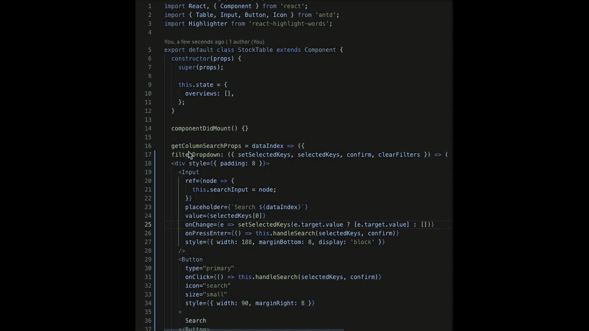
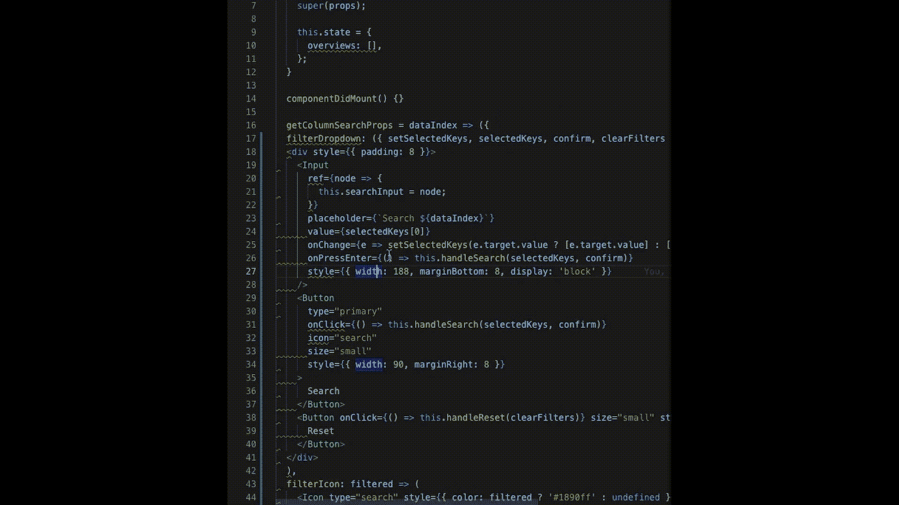
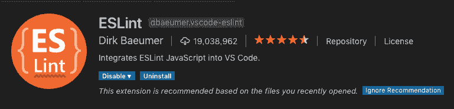
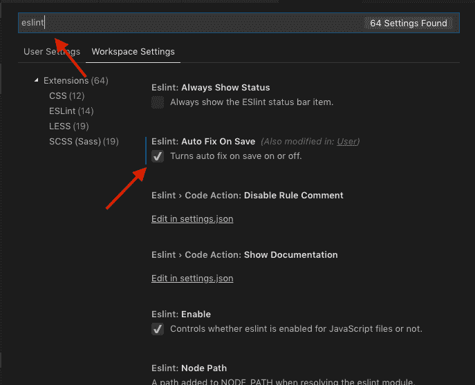

# 当我开始使用 React.js 时，我希望我知道什么

> 原文：<https://www.freecodecamp.org/news/what-i-wish-i-knew-when-i-started-to-work-with-react-js-3ba36107fd13/>

作者:余伟

# 当我开始使用 React.js 时，我希望我知道什么


Photo by [Ben White](https://unsplash.com/@benwhitephotography?utm_source=medium&utm_medium=referral) on [Unsplash](https://unsplash.com?utm_source=medium&utm_medium=referral)

在 2013 年 5 月 29 日首次发布后，React.js 已经接管了互联网。众所周知，我和许多其他开发人员将他们的成功归功于这个令人惊叹的框架。

有了这么多的 React.js 教程，我希望在我开始的时候，他们中的一个能告诉我这些技巧。

### 不需要。使用箭头函数时绑定(this)

通常，当您有一个受控组件时，您会看到这样的内容:

```
class Foo extends React.Component{  constructor( props ){    super( props );    this.handleClick = this.handleClick.bind(this);  }
```

```
 handleClick(event){    // your event handling logic  }
```

```
 render(){    return (      <button type="button"       onClick={this.handleClick}>      Click Me      </button>    );  }}
```

你要为每一个存在的方法编写`.bind(this)`，因为大多数教程都告诉你这样做。如果您有几个受控制的组件，那么在您的`constructor(){}`中将会有一大堆代码。

#### 相反，您可以:

```
class Foo extends React.Component{
```

```
 handleClick = (event) =>; {    // your event handling logic  }
```

```
 render(){    return (      <button type="button"       onClick={this.handleClick}>        Click Me      </button>    );  }}
```

怎么会？

ES6 的 arrow 函数使用了[词法作用域](https://whatis.techtarget.com/definition/lexical-scoping-static-scoping)，这使得方法可以访问它被触发的地方的`this`。

### 当服务人员与你作对时

服务人员非常适合使用[渐进式网络应用](https://developers.google.com/web/progressive-web-apps/)，它允许离线访问，并为网络连接不良的用户进行优化。

但是，当您没有意识到服务人员正在缓存您的静态文件时，您会重复部署您的热修复程序。

却发现你的网站没有更新。？

不要惊慌，确保你的`src/index.js`:

```
// Make sure it's set to unregisterserviceWorker.unregister();
```

从 16.8 版本开始，这一行默认应该是`serverWorker.unregister()`。

但是如果他们决定再次改变，你会知道去哪里找。

### 99%的时间你不需要弹出

[Create React App](https://github.com/facebook/create-react-app) 提供了一个选项来`yarn eject`您的项目定制您的构建过程。

我记得我试图定制构建过程，让 SVG 图像自动内联到我们的代码中。我花了几个小时试图理解建造过程。我们最终得到了一个注入 SVG 标签的导入文件，并将站点的加载速度提高了 0.0001 毫秒。

退出 React 项目就像打开正在行驶的汽车的引擎盖，并在运行中改变引擎以加快 1%的速度。

当然，如果您已经是一名 Webpack 高手，那么定制构建过程以满足项目需求是值得的。

当你试图准时交付时，把你的努力集中在它把针向前移动的地方。

### ESlint 保存时自动修复节省了大量时间

您可能从某处复制了一些格式不正常的代码。因为受不了它看起来有多丑，所以花时间手动添加空格。



使用 ESLint 和 Visual Studio 代码插件，它可以在保存时为您修复。



#### 怎么会？

1.  在您的`package.json`中，添加一些开发依赖项，并执行`npm i`或`yarn`:

```
"devDependencies": {
```

```
 "eslint-config-airbnb": "^17.1.0",
```

```
 "eslint-config-prettier": "^3.1.0",
```

```
 "eslint-plugin-import": "^2.14.0",
```

```
 "eslint-plugin-jsx-a11y": "^6.1.1",
```

```
 "eslint-plugin-prettier": "^3.0.0",
```

```
 "eslint-plugin-react": "^7.11.0"
```

```
}
```

2.安装 ESLint 扩展



3.启用保存时自动修复



### 你不需要 Redux，styled-components 等等…

每个工具都有其用途。也就是说，了解不同的工具是有好处的。

> 如果你只有一把锤子，那么所有的东西看起来都像钉子——亚伯拉罕·马斯洛

您需要考虑您使用的一些库的设置时间，并将其与:

*   我试图解决的问题是什么？
*   这个项目会长久地受益于这个库吗？
*   React 已经提供现成的东西了吗？

有了现在 React 可用的[上下文](https://reactjs.org/docs/context.html)和[钩子](https://reactjs.org/docs/hooks-intro.html)，还需要 Redux 吗？

我强烈推荐 [Redux Offline](https://github.com/redux-offline/redux-offline) 在你的用户处于糟糕的网络连接环境时使用。

### 重用事件处理程序

如果您不想一遍又一遍地输入相同的内容，重用事件处理程序可能是一种选择:

```
class App extends Component {
```

```
 constructor(props) {  super(props);  this.state = {   foo: "",   bar: "",  }; }
```

```
 // Reusable for all inputs onChange = e => {  const {   target: { value, name },  } = e;    // name will be the state name  this.setState({   [name]: value  });
```

```
 };  render() {  return (   <div>    <input name="foo" onChange={this.onChange} />    <input name="bar" onChange={this.onChange} />      </div>  ); }}
```

### setState 是异步的

天真的我会写下这样的话:

```
 constructor(props) {  super(props);  this.state = {   isFiltered: false  }; }
```

```
 toggleFilter = () => {  this.setState({   isFiltered: !this.state.isFiltered  });  this.filterData(); };  filterData = () => {  // this.state.isFiltered should be true, but it's not  if (this.state.isFiltered) {   // Do some filtering  } };
```

#### 选项 1:传递状态

```
toggleFilter = () => { const currentFilterState = !this.state.isFiltered; this.setState({  isFiltered: currentFilterState }); this.filterData(currentFilterState);};
```

```
filterData = (currentFilterState) => { if (currentFilterState) {  // Do some filtering }};
```

#### 选项 setState 回调的辅助函数

```
toggleFilter = () => { this.setState((prevState) => ({  isFiltered: !prevState.isFiltered }), () => {  this.filterData(); });};
```

```
filterData = () => {  if (this.state.isFiltered) {   // Do some filtering  }};
```

### 结论

这些建议节省了我很多时间，我相信还有更多的时间。请在评论区分享它们。

如果你希望将你的网站与微信整合，并接触到中国 10 亿以上的用户，注册一个免费的常用微信术语词汇表。