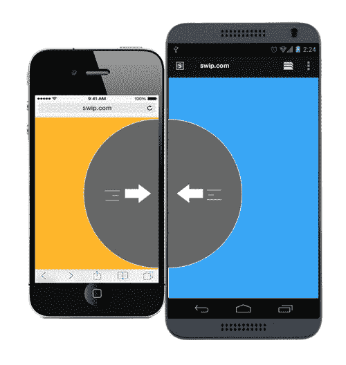
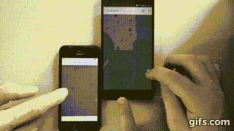
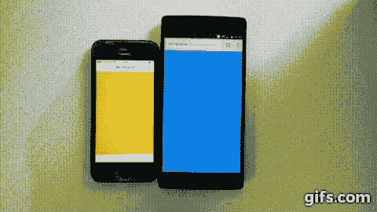

# 如果你所有的移动设备形成一个单一的屏幕会怎么样？

> 原文：<https://www.freecodecamp.org/news/what-if-all-your-mobile-devices-formed-a-single-screen-9c6ff01ed0c3/>

如果你所有的移动设备都是一个屏幕会怎么样？这可能不是你最常问自己的问题。

但是，请仔细想想。想想能够独立于操作系统组合任何类型的移动设备的所有可能性。Swip.js 就是这么做的。


Swip.js logo

这个想法很简单:将几个任意大小的设备放在一起，用手指在它们的边缘“滑动”(捏)，将独立的屏幕组合成一个大屏幕。



Just pinch the screens together

使用 Swip.js，您可以像这样构建复杂的多设备体验:

[https://www.youtube.com/embed/ZE0gxa-p8HY?feature=oembed](https://www.youtube.com/embed/ZE0gxa-p8HY?feature=oembed)

### 这个想法的起源

当我们在一次黑客马拉松上寻找一个想法时，Paul 想起了他不久前看到的一个噱头:


Siftables — [Check out the talk on YouTube](https://www.youtube.com/watch?v=JP0w9lZoLwU)

我们都喜欢拥有独立的“笨”东西的想法，我们可以将它们组合起来创建一个工作系统。我们考虑过用 RaspberryPi 做类似的东西。

但由于我们不是硬件人员，我们无法构建这样的东西。那时我们意识到几乎每个人的口袋里都有一台小型电脑(带网络浏览器)。一台强大到足以处理复杂任务的计算机。

我们知道我们选择的语言将是 **JavaScript** ，因为它完全独立于平台，并且可以在任何带有浏览器的设备上运行。


### Inno{Hacks}-Hackathon 上的原型制作

实际上，第一个想法是建立一个物理演示，手机可以像立方体一样“扔”到一个更大的设备(如 iPad)中，这个设备将包含物理环境。

这些想法很快升级，经过一些修补和编码，我们决定降低一点复杂性。在黑客马拉松结束时，我们有了一个工作演示。

我们的下一个想法是开发一个游戏，你把一个 iPad 放在桌子上，你必须用手机和它互动。


Concept of the idea

如果你看看这个概念，你会发现平板电脑应该作为“棋盘游戏”,与手机一起，你可以扩展棋盘来击败对手。这个想法是在你的手机上有不同的路径片段，你可以从中选择一个。球会移动，不断变得更快，目标要么比其他球员存活更长时间，要么到达目标位置。

过了一段时间，我们也放弃了这个想法(因为我们没有平板电脑)，并决定将显示器的融合作为我们宣传的主要特色，而不是一些很快就会变得无聊的噱头游戏。

就在那时，我们决定举两个简单的例子:经典的 **Pong** 游戏，以及为了展示这不仅仅是游戏的乐趣，一个小小的**照片分享**应用。

#### 这是在黑客马拉松上大约 20 小时的黑客攻击的结果:



Demos of the Hackathon

#### 这是什么巫术？

信不信由你，它只是 JavaScript、Canvas 和一种叫做 [WebSockets](https://www.html5rocks.com/en/tutorials/websockets/basics/) 的技术。

库对黑客马拉松来说总是一件好事，所以你不需要处理简单的 JavaScript。因此我们使用了[插座。IO](https://socket.io) 给我们一个更好的 API 来处理 Swip 中的 websockets。

> 去吧，看看【websockets 如何工作并试用 [Socket。IO](https://socket.io) ！你会被它们的强大和易用所震撼。

基本上，您可以将 websocket 连接想象成一条隧道，通过持久的双向实时连接来连接客户机和服务器。然后，双方可以简单地发送、接收和响应消息。

#### **一个使用套接字的简单例子。IO**

我们先从服务器说起。因为我们希望简单快捷，所以我们将使用 Express 来快速设置服务器。

```
const app = require('express')();
const http = require('http').Server(app);
const io = require('socket.io')(http);

app.get('/', (req, res) => {
  res.sendFile(__dirname + '/index.html');
});

io.on('connection', (socket) => {
  console.log('a user connected');
});

http.listen(3000);
```

serverSocket.js

这是您在服务器端开始所需的全部内容。

现在打开浏览器，前往`localhost:3000`，问问自己为什么它没有记录任何东西到控制台。你还需要做一件事。您还需要在客户端启动 websocket 连接。这将是您可以在服务器端的`app.get`函数中看到的`index.html`。

```
<script src="/socket.io/socket.io.js"></script>
<script>
  var socket = io();

  socket.emit('message', 'Hello');
</script>
```

socketClient.html

如果您现在转到`localhost:3000`并查看启动服务器的终端，您会在那里看到`a user connected`。

**插座**是你现在要重点关注的部分。在`index.html`我们做`socket.emit('message', 'Hello')`。我们**发出**一条新消息，其名称**`message`和数据**`Hello`**，并希望在服务器上对该消息做出反应。为此，我们需要使用调用`io.on('connection', (**socket**) => .`时得到的套接字..).因此，我们只需添加以下代码行。******

```
 **`io.on('connection', (socket) => {
  socket.on('message', (msg) => {
    console.log('message: ' + msg);

    socket.emit('messageBack', { message: 'Hello to you!'});
  });
});`**
```

****socketServerOnMessage.js****

****现在，每当有新的客户机加入服务器时，您都会看到`Hello`被打印到控制台。到目前为止，这并不太特别。但是我们也可以通过同一个套接字从服务器向客户机发送数据，甚至可以使用整个对象而不仅仅是字符串。客户端只需用`socket.on('messageBack', (data) => .`对发出的事件做出反应..)然后可以使用发送的数据。****

****如果你想了解更多关于 Socket 的知识。IO，看看他们的 [ChatApp 教程](https://socket.io/get-started/chat/)，在那里你可以快速构建一个基本的 Slack 克隆。****

****既然你现在对它背后的技术有了一点了解，你可能已经猜到它是如何工作的了。****

****我们只是一直发送元素的位置数据，并在每个客户端上渲染例如乒乓球。****

****这真的不是大规模的性能。但是我们了解到，在黑客马拉松上做原型时，你真的不应该担心性能。****

****那里的人们对此印象深刻，也不明白这是如何运作的，我们最终赢得了技术创新奖。他们甚至问我们是否考虑进一步研究这个问题。****

> ****总结:如果你不想用黑客马拉松的给定工具来构建东西，那就不要做。尝试，玩耍，最重要的是，享受乐趣！****

********

### ****传播消息，获得第一批 1000 颗 GitHub 星星****

****当我们完成第一个可用的 Swip.js 版本时，我们非常自豪它是一个如此有趣的项目。****

****我们想把它展示给更多的人，获得一些反馈，当然也想得到一些 GitHub 明星来增加我们的观众。我们选择的科技新闻来源是黑客新闻。它有一个特殊的部分来展示你的作品。****

****在[发布链接](https://news.ycombinator.com/item?id=12735665)半小时后，保罗给我发了一条信息，告诉我我们已经点击了 100 多个 GitHub 明星。从这一刻起，我每分钟都会查看一下[黑客新闻](https://news.ycombinator.com)上的评论。我们都不敢相信事情发展得这么快。****

****我开始向每一个我能想到的博客作者、JavaScript 专家和 Subreddit 发送带有回购链接的垃圾邮件。我们得到了一些非常棒的反馈。一个注意到这一点的人是昆西·拉森:****

> ****这看起来像魔术，但它只是 JavaScript。[https://t.co/1MgITJYxPX](https://t.co/1MgITJYxPX)****
> 
> ****— Quincy Larson (@ossia) [October 20, 2016](https://twitter.com/ossia/status/789148681194921984?ref_src=twsrc%5Etfw)****