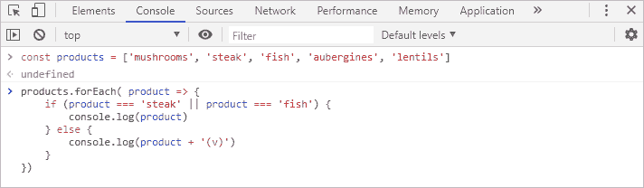
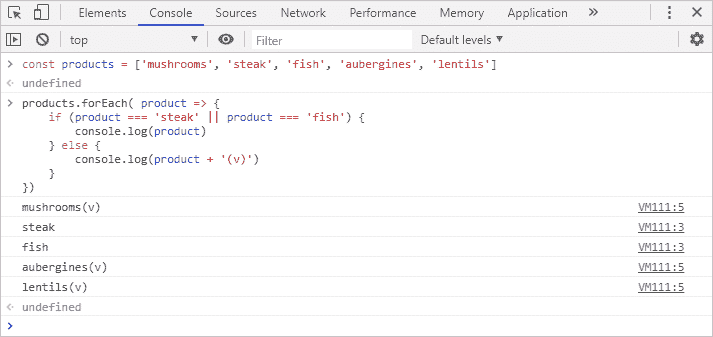

# JavaScript 条件到底是什么？

> 原文：<https://www.freecodecamp.org/news/what-in-the-world-is-a-javascript-conditional-for/>

本文是 JavaScript 条件句的初学者入门。它涵盖了我们为什么需要它们，以及它们如何适应前端环境。以及为什么你最终会经常使用它们。

## 介绍

我是从一条非传统的道路进入开发的。有一件事总是特别困难——能够超越一个新概念的语法，并把它放在一个有意义的上下文中。

条件句比其他概念更直观一点，但是我想向您展示大的画面。在本文中，我将解释为什么我们需要条件，以及作为前端开发人员如何使用它们。

在一个初学者友好的实际例子的帮助下，您将看到如何使用条件以不同的方式处理数据，以及为什么它们是开发中的一个基本工具。阅读这篇文章时，请随意跟随。

唯一的先决条件是对数组和循环有基本的了解。我在之前的两篇文章中已经讨论过了:

**数组**:[https://www . freecodecamp . org/news/what-in-the-world-is-a-JavaScript-array/](https://www.freecodecamp.org/news/what-in-the-world-is-a-javascript-array/)

**Loops**:[https://www . freecodecamp . org/news/what-in-the-world-is-a-JavaScript-loop-for/](https://www.freecodecamp.org/news/what-in-the-world-is-a-javascript-loop-for/)****

### 设置

让我们想象一下，我们正在一个在线平台上工作，这个平台允许我们从一个网站上购物。这是我们想在这里讨论的东西在现实世界中的应用。

看看我工作的地方罗拉市场(Lola Market)的例子。

在我们在前几篇文章中设置的例子中，我们取了一堆产品(蘑菇、牛排、鱼、茄子和扁豆)并把它们组织在一个数组中。然后，我们将该数组存储为一个变量，并使用一个`forEach`循环来遍历该列表。

我们假设这个产品列表现在显示在我们的网站上。我们的任务是在单子上的素食项目旁边加一个“(v)”。这正是我们在前端经常做的事情。

## 条件式

条件是编程的基本构件。它们是一种只有在满足了 T2 的某些条件 T4 的情况下才能做某事的方法。JavaScript 中最简单也是最常见的条件是`if`语句。看一个例子:

```
if (product === 'steak') {
    // do stuff
}
```

让我们先把这句话翻译成英语:“如果名为`product`的变量正是字符串‘steak’，那么执行其中的代码。”

这里有一个近距离的观察

*   这是条件句。
*   这是我们的条件。有很多方法可以构造条件。我们还不需要担心这个。现在，请记住，我们放在这里的任何东西都将被求值为`true`或`false`。
*   `// do stuff`:语句。这就是我们要运行的代码的位置。如果条件评估结果为`true`，则仅执行**。否则，它将被忽略。**

这段代码可以很好地独立工作，但是我们可以通过使用它的朋友`else if`和`else`来进行更详细的控制。`else if`添加另一个条件进行检查，并执行另一个单独的代码块，而`else`成为在没有一个条件得到满足时采取的默认动作。


Photo by [Jakub Dziubak](https://unsplash.com/@jckbck?utm_source=ghost&utm_medium=referral&utm_campaign=api-credit) / [Unsplash](https://unsplash.com/?utm_source=ghost&utm_medium=referral&utm_campaign=api-credit)

### 素食友好

让我们回到我们最初的目标，即在素食项目的名称旁边记录一个“(v)”。这是我们需要使用条件句的最好例子。我们要编写这样的代码，**如果数组**中的**是**素食者，打印它的名字并给它加上“(v)”。而且如果不是吃素的，要只印`product`的名字。

首先，我们需要确定素食项目。通常，这些信息将包含在我们从数据库中请求的数据中。但是由于我们使用的是一个简化的例子，我们将手动完成。我们知道牛排和鱼不是素食。

注意，我测试的条件是产品**不是**素食。这只是因为在这个清单上有更多的素食产品，我希望条件简单，有条件做最少的工作。我本可以很容易地检测素食项目。

往往有很多条件可以用来达到同样的目的。编写高效、易读的好条件是一项伴随实践而来的有用技能。

所以我们来写一下区分素食者和非素食者的条件。

```
if (product === 'steak' || product === 'fish') {
    console.log(product)
} else {
    console.log(product + '(v)')
}
```

根据我以前文章中的例子(上面有链接),我们想把条件放在循环中。这个循环让我们可以单独处理列表中的每个产品。这个条件块是我们现在为产品系列中的每个产品执行的代码。

刷新浏览器以启动新的控制台，然后输入以下内容:

*   变量`product`存储我们的产品数组。
*   `forEach`循环遍历数组。
*   以及我们内部的条件块。



The conditional block running inside of a loop

### 执行

如果我们阅读**简单英语**中的条件代码，它说:“**如果**当前选择的`product` **是**确切地说是‘牛排’**或**‘鱼’，那么将`product`记录到控制台。否则，在所有其他情况下，将`product`登录到控制台，但也要在它的末尾添加一个字符串“(v)”

快速注意，`===`操作符检查左和右表达式是否**完全**相同。而`||`运算符的意思是**或。**这里我们有两个条件要检查(牛排还是鱼)**。**如果两个条件中的**或**为真，它将执行其中的代码。

按回车键运行代码并查看结果。



The result of the loop with the conditionals

这就是了。每次循环运行时，它检查当前选择的元素`product`并遍历条件。

*   `product`到底是不是字符串‘牛排’？
*   否。请检查以下情况。
*   `product`到底是字符串‘鱼’吗？
*   不。如果不满足这个条件，里面的代码将不会执行。转到`else`块中指定的默认代码。
*   打印`product`并添加`(v)`到其中。
*   这个迭代就完成了。开始下一次迭代。

如果找到“牛排”或“鱼”，它将执行该条件下的代码，记录不带“(v)”的`product`名称。然后，循环完成该迭代，并开始下一次迭代，依此类推。对数组中的每个元素重复这个过程，直到全部完成，并且循环为每个元素记录了正确的消息。

## 结论

概括地说，**条件语句**设置了某些**条件。**当满足时(这意味着当条件评估为`true`时)，条件块**中指定的代码执行**。否则，它将被忽略并且不执行。

在我们的示例中，我们只将消息记录到控制台。但是我们可以用同样的想法操纵 DOM 来显示和修改网站上的内容。

这里有一些你需要进一步扩展你的知识和更深入理解这些概念的东西:

*   **条件句:**`if`语句是最常用的条件句之一。但是你需要学习其他的语句，比如`while`语句、`switch`语句或者非常有用的**三元运算符**。
*   **条件:**了解如何创造条件，如何评价条件。为此，你需要熟悉“**真实**”和“**虚假**”的概念。这是指没有明确指定为`true`或`false`的值被这样评估。例如，像`'mushrooms'`这样的字符串被认为是真的，而空字符串`''`总是被认为是假的。
*   **逻辑操作符和比较操作符:**我们在我们的条件中看到了这些。像“*和“*和“*或“*这样的逻辑运算符，写成`&&`和`||`。比较运算符如*“等于”*、*“大于”*，写成`===`、`>`。这些简单的概念是编写代码的基础。

### 关闭

感谢阅读。我希望你觉得这很有用。如果你喜欢它，分享给大家会非常感谢。如果您有任何问题或意见，我在 [Twitter](https://twitter.com/Syknapse) [@Syknapse](https://twitter.com/Syknapse) 上，我很乐意收到您的来信。


Photo by [Claudia](https://twitter.com/__Santaella)

我叫 Syk，是马德里 [Lola Market](https://twitter.com/Tech_LolaMarket) 的前端开发人员。我从一个不相关的领域转行到了网站开发，所以我试着为那些有类似经历的人创造内容。我的 DMs 总是向需要一些支持的有抱负的 web 开发人员开放。你也可以在[这篇文章](https://www.freecodecamp.org/news/how-i-switched-careers-and-got-a-developer-job-in-10-months-a-true-story-b8895e855a8b/)中读到我的转变。