# Git 中的分支是什么，我们如何使用它？

> 原文：<https://www.freecodecamp.org/news/what-is-a-branch-in-git-9bcd1a760ed3/>

注意:这是 Git 初学者系列的第七个视频。[在这里看第一个视频](https://zellwk.com/blog/setting-up-git)。

想象有平行世界。我们有:

1.  在这个世界里，我制作了这个视频，你们正在观看
2.  在这个世界里，我制作了这个视频，但是你没有在看
3.  一个我没有创作这个视频的世界。

在这个平行世界概念中，Git 分支就是一个平行世界。

你可以有一个分支在一个世界里保持不变。然后你进入一个不同的世界。一旦你完成了你的代码，你就可以通过合并改变来完成最初的世界。

### 如何创建分支

打开你的 Git 客户端。寻找您想要从中分支的分支。右键单击它并选择 create new branch。

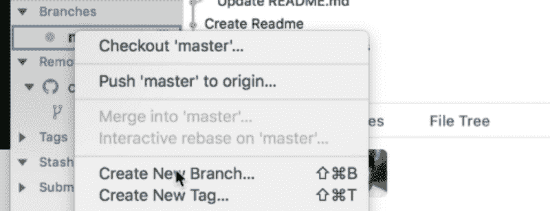

你可以给你的分公司起任何你想要的名字。

通常我们开发人员使用的第一个分支是开发分支。

一旦你命名了你的分支，点击“创建和结帐”。在这种情况下，Checkout 意味着转移到开发分支。

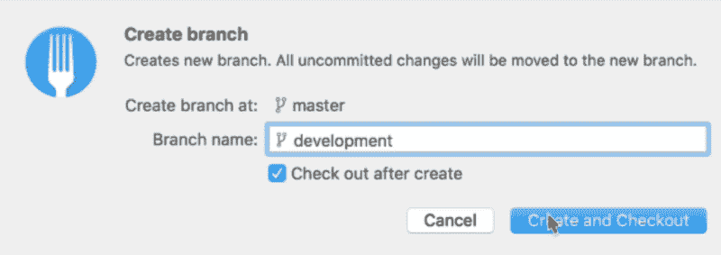

一旦您创建了开发分支，您可以在您的分支部分看到两个分支——主分支和开发分支。

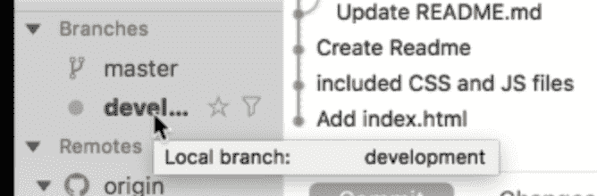

在 Git 历史中，您还可以看到一个名为`development`的新标签。这个`development`标签与`master`和`origin/master`在同一个提交上。

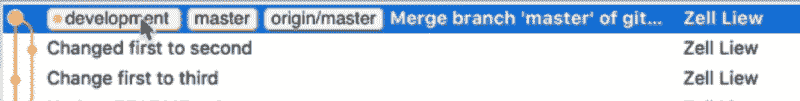

### 为什么要创建开发分支？

比方说，你有一个网站，人们可以看到。这个网站在 master 分支上。

如果你把代码提交给 master 分支，就意味着你直接改网站。如果您引入了任何错误，其他人可以立即看到您的错误。

我们是人类。我们会犯错。我们不想让人们看到我们的错误。

所以我们创建了一个新的分支，然后处理它。当我们完成时，当我们确定不再有 bug 时——至少我们试着确定！—我们将更改推回到主分支机构以更新网站。

这就是我们使用开发分支的原因。

在这种情况下，主分支也可以称为生产分支。

### 如何在新的分支上编码

当您创建一个新的分支时，您可以直接在分支本身上编码。您更改的任何代码都只会反映在该分支上。

假设我们想要创建一个名为`development.md`的新文件。在这个文件中，我们说“你好！这是发科犯的！”。

```
# development.md Hello! This is committed from the development branch!
```

如果您回到您的 Git 客户端，您可以将这个变更提交到开发分支。

当您创建提交时，确保您在开发分支上。在 Fork 中，你可以通过查看**加粗的分支**来判断你所在的分支。


将您的代码提交到开发分支。

现在，如果您查看 Git 历史，您可以看到开发分支比`origin/master`分支和本地`master`分支早一次提交。

这表明我们可以在`development`分支上尽可能多地编码，而不会影响其他分支。


### 将开发分支推入 Git 远程

您可以通过点击 push 按钮将开发分支推入 Git 远程。步骤将[类似于您第一次推主分支](https://zellwk.com/blog/pushing-to-a-git-remote)时的步骤。

一旦推送完成，您可以在同一个提交中看到与`development`标记相同的`origin/development`标记。

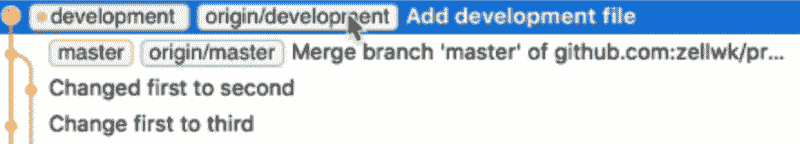

### 分支之间的切换

要在分支之间切换，您可以在边栏上双击所需的分支。如果您双击主文件，您将签出主文件。

**Checkout** 的意思是切换到你选择的分支。

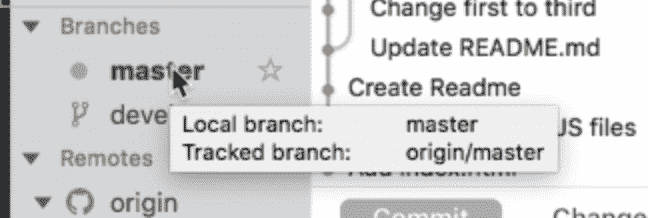

如果你现在看你的项目，你会发现`development.md`文件不见了。这再次证明，您可以在您的`development`分支上提交任意多的请求，而不会影响其他分支。

### 合并分支

您已经完成了开发过程，并且您已经准备好将分支合并回`master`。

要合并，首先签出要合并到的分支。这个应该是`master`。

然后，要将`development`分支合并到`master`分支中，在 Git 客户端中右键单击`development`分支，并选择“合并到‘主’分支”。

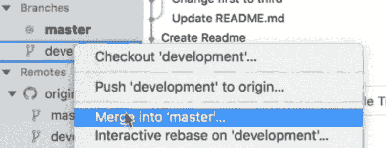

Fork 将询问您是否想要创建一个合并提交。有些客户端会自动为您完成这项工作。

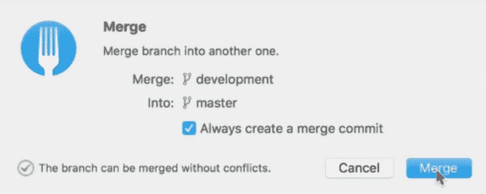

选择“合并”，合并将完成。

如果您现在查看 Git 历史，您会看到`master`分支在`development`和`origin/development`分支之前。

这是因为我们已经完成了合并提交。

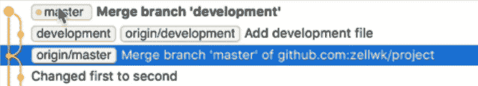

同时，`master`比`origin/master`分支提前两次提交。这就是为什么我们在侧边栏看到 2 了。

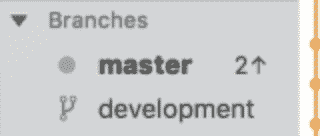

当您完成合并时，您可以通过点击按钮来更新 Git remote。


### 删除分支

要删除分支，请右键单击要删除的分支，然后选择“删除“[分支名称]”。

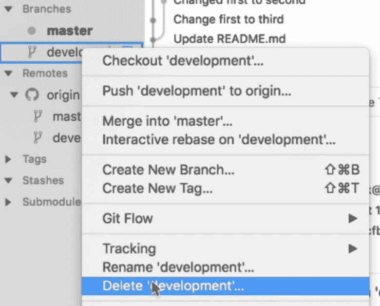

在 Fork 中，您还可以选择从远程删除分支。

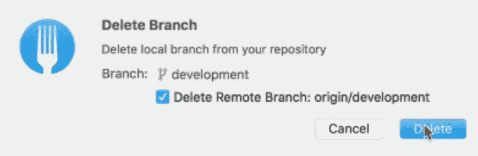

点击“删除”，Fork 会删除两个分支。

删除完成后，您可以查看一下 Git 历史。您会注意到`origin/development`和`development`标签都已经从历史中消失了。


### 包扎

分支就像一个平行的世界，在这里你可以创建提交，而不会在产品代码中引入错误。在将您的分支合并到产品代码之前，您总是可以修复 bug。

感谢阅读。这篇文章对你有什么帮助吗？如果你有，[我希望你能考虑分享它](http://twitter.com/share?text=What%20is%20a%20branch%20in%20Git%3F%20by%20@zellwk%20?%20&url=https://zellwk.com/blog/git-branch/&hashtags=)。你可能会帮助别人。谢谢大家！

本文原帖[我的博客](https://zellwk.com/blog/git-branch) *。*
如果你想要更多的文章来帮助你成为一个更好的前端开发者，注册我的[时事通讯](https://zellwk.com/)。