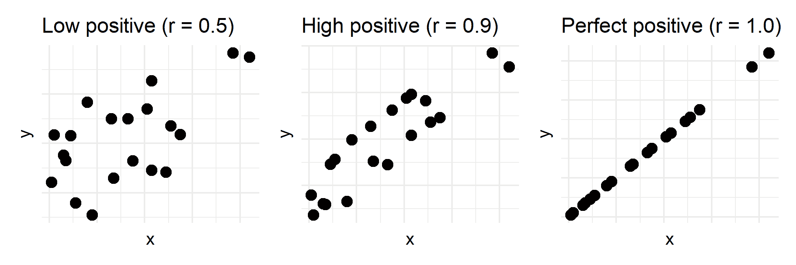
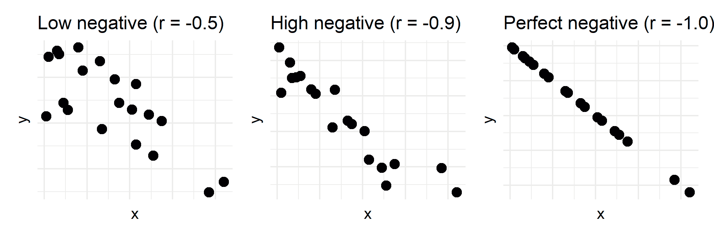

# 什么是相关系数？统计学中的 r 值解释

> 原文：<https://www.freecodecamp.org/news/what-is-a-correlation-coefficient-r-value-in-statistics-explains/>

相关性是了解一个事物如何随着另一个事物变化的重要工具。读完这篇文章后，你应该明白什么是相关性，如何在你自己的工作中考虑相关性，并编写一个最小实现来计算相关性。

## 相关性是关于两个事物如何相互变化的

相关性是一个抽象的数学概念，但是你可能已经知道它的意思了。以下是三种常见相关性的一些例子。

随着你吃的食物越来越多，你最终可能会感觉更饱。这是两个事物以同样的方式一起变化的情况。一个上去了(吃的多了)，然后另一个也上去了(有饱腹感)。**这是正相关**。


Positive correlation between food eaten and feeling full. More food is eaten, the more full you might feel (trend to the top right). [R code](https://gist.github.com/erictleung/d6bda6a61b8de03e76cb081257f183ee)

当你坐在一辆开得更快的车里，你可能会更快地到达目的地，你的总旅行时间也会更少。这是两个事物反向变化的例子(速度更快，但时间更短)。**这是负相关**。


Negative correlation between car speed and travel time. The faster the car, less travel time (trend to the bottom right). [R code](https://gist.github.com/erictleung/d6bda6a61b8de03e76cb081257f183ee)

还有第三种可能的方式，两个事物可以“改变”。或者说，不变。例如，如果你体重增加，然后观察你的考试成绩如何变化，你的考试成绩可能不会有任何一般的变化。这意味着没有相关性。


An exaggerated plot of no correlation between weight gain and test scores. [R code](https://gist.github.com/erictleung/d6bda6a61b8de03e76cb081257f183ee)

## 了解两个事物如何一起变化是预测的第一步

能够描述我们前面的例子中正在发生的事情是非常好的。但是这有什么意义呢？原因是以有意义的方式应用这些知识来帮助预测接下来会发生什么。

在我们的饮食例子中，我们可以记录下我们一整周吃了多少，然后记下我们之后的饱腹感。正如我们之前发现的那样，我们吃得越多，就越有饱腹感。

收集了所有这些信息后，我们可以问更多的问题，为什么会发生这种情况，以更好地理解这种关系。在这里，我们可能会开始问什么样的食物让我们更饱，或者一天中的时间是否也会影响我们的饱腹感。

类似的想法也适用于你的工作或生意。如果您注意到销售额或其他重要指标随着您业务的其他指标而上升或下降(换句话说，事情是正相关或负相关的)，那么探索和了解这种关系以改进您的业务可能是值得的。

## 相关性可以有不同的强度

我们已经讨论了一些一般的相关性

*   积极的，
*   否定的，或者
*   不存在的

虽然那些描述还可以，但是所有的正相关和负相关并不都一样。

这些描述也可以翻译成数字。相关值可以是介于负一和正一之间的任何十进制值。

\(-1\)和\(0\)之间的小数值是负相关的，比如\(-0.32\)。

\(0\)和\(+1\)之间的小数值是正相关的，如\(+0.63\)。

完美的零相关意味着没有相关性。

对于每种类型的相关性，都有一系列强相关性和弱相关性。更接近零的相关值**是较弱的相关性**，而更接近正或负的相关值**是较强的相关性**。

强相关性在数据中显示出更明显的趋势，而弱相关性看起来更混乱。例如，与较弱和较低的正相关相比，下面较强的高正相关看起来更像一条线。



Varying levels of positive correlations. [R code](https://gist.github.com/erictleung/d6bda6a61b8de03e76cb081257f183ee).

同样，强负相关比弱、低负相关有更明显的趋势。



Varying levels of negative correlations. [R code](https://gist.github.com/erictleung/d6bda6a61b8de03e76cb081257f183ee)

## *r* 值从何而来？它能取什么值？

“ *r* 值”是指示相关值的常用方式。更具体地说，它指的是(样本)皮尔逊相关性，或皮尔逊的 *r* 。“示例”说明是为了强调，您只能对您拥有的数据进行相关性声明，并且在做出超出您的数据的更大声明时必须谨慎。

下表总结了到目前为止我们所涉及的相关性。

| 皮尔逊 r 值 | 两件事之间的关联是... | 例子 |
| r = -1 | 完全否定 | 一天中的小时和一天中剩余的小时数 |
| r < 0 | 否定的；消极的；负面的；负的 | 更快的车速和更短的旅行时间 |
| r = 0 | 独立或不相关 | 体重增加和测试分数 |
| r > 0 | 积极的 | 吃的食物越多，感觉越饱 |
| r = 1 | 完全肯定 | 我年龄的增长和你年龄的增长 |

在接下来的几节中，我们将

*   分解数学方程来计算相关性
*   使用示例数字来使用这个相关方程
*   用 Python 和 JavaScript 编写数学公式

## 分解数学来计算相关性

提醒一下，相关性只能在\(-1\)和\(1\)之间。这是为什么呢？

简单的回答是，我们将两个变量的变化量调整到一个共同的范围。用更专业的术语来说，我们用两个变量各自的变化量来标准化这两个变量一起变化的量。

从[维基百科](https://en.wikipedia.org/wiki/Correlation_and_dependence#Sample_correlation_coefficient)中，我们可以获得皮尔逊相关系数的数学定义。看起来很复杂，但是我们一起来分解一下。

\[\ text color { lime } { r } _ { \ text color { # 4466 ff } { x } \ text color { fuchsia } { y } } = \ frac { \sum_{i=1}^{n}(x _ I-\ text color { green } { bar { x } }(y _ I-\ text color { olive } { bar { y } })} { \ sqrt { \sum_{i=1}^{n}(x _ I-\textcolor{green}{\bar{x}})^2 \sum_{i=1}^{n}(y _ I-\textcolor{olive}{\bar{y}})^2 } } \]

从这个等式中，要找到一个\(\ text color { lime } { \ text { correlation }}\)和一个\(\ text color { x variable }} \)之间的\(\ text color { fuchsia } { \ text { y variable } } \)，我们首先需要计算\(\ text color { green } { \ text {所有 x 值的平均值} } \)和\(\ text color { olive } { \ text {所有 y 值的平均值} }。

让我们把注意力集中在等式的顶端，也就是分子。对于\( x\)和\(y\)变量中的每一个，我们需要找出\(x\)值与\(x\)平均值之间的距离，然后用\(y\)做同样的减法。

直观地说，将所有这些值与平均值进行比较给了我们一个目标点，以查看其中一个变量有多少变化。

这可以在数学形式中看到，\(\textcolor{#800080}{\sum_{i=1}^{n}}(\textcolor{#000080}{x_i-\ overline { x } })\)，\(\ text color { # 800080 } { \ text { adds all } } \)\(\ text color { # 000080 } { text { differences between } } \)您的值与您的\(x\)变量的平均值。

在等式的底部，也称为分母，我们进行类似的计算。然而，在我们将距离我们的值和它们的平均值的所有距离相加之前，我们将它们本身相乘(这就是\((\ldots)^2\正在做的)。

这个分母“调整”相关性，使值介于\(-1\)和\(1\)之间。

## 在我们的方程式中使用数字来实现它

为了演示数学，让我们找出你和你的兄弟姐妹去年的年龄\([1，2，6]\)和你今年的年龄\([2，3，7]\)之间的相关性。注意这是一个小例子。通常情况下，您会希望三个以上的样本对您的相关性更有信心。

从数字上看，它们似乎增加了相同的数量。你可能还注意到它们是相同的数字序列，但是第二组数字加了一。这是我们能得到的最接近完美的关联。换句话说，我们应该得到一个\(r = 1\)。

首先我们需要计算每个的平均值。\([1，2，6]\)的平均值为\((1+2+6)/3 = 3\)，而\([2，3，7]\)的平均值为\((2+3+7)/3 = 4\)。代入我们的方程，我们得到

\[r _ { x y } = \ frac { \sum_{i=1}^{n}(x _ I-3)(y _ I-4)} { \sum_{i=1}^{n}(x _ I-3)^2 \sum_{i=1}^{n}(y _ I-4)^2 } } \]

看等式的顶部，我们需要找到\(x\)和\(y\)的成对差。记住，\(\sum\)是加法的符号。顶部就变成了

\[ (1-3)(2-4) + (2-3)(3-4) + (6-3)(7-4) \]

\[= (-2)(-2) + (-1)(-1) + (3)(3) \]

\[= 4 + 1 + 9 = 14\]

所以顶部变成了 14。

\[r _ { x y } = \ frac { 14 } { \sum_{i=1}^{n}(x _ I-3)^2 \sum_{i=1}^{n}(y _ I-4)^2 } } \]

在等式的底部，我们需要做一些非常类似的计算，除了在乘法之前分别关注于\(x\)和\(x\)。

让我们先把注意力集中在恰\( \sum_{i=1}^n (x_i - 3)^2 \)。记住，\(3\)这里是所有\(x\)值的平均值。这个数字会根据您的具体数据而变化。

\[ (1-3)^2 + (2-3)^2 + (6-3)^2 \]

\[= (-2)^2 + (-1)^2 + (3)^2 = 4 + 1 + 9 = 14 \]

现在来看看\(y\)值。

\[ (2-4)^2 + (3-4)^2 + (7-4)^2 \]

\[ (-2)^2 + (-1)^2 + (3)^2 = 4 + 1 + 9 = 14\]

我们把这些数字填好，我们可以把它们放回我们的方程，求出我们的相关性。

\[r _ { x y } = \ frac { 14 } } = \ frac { 14 } { 14^2}} = \ frac { 14 } { 14 } = 1 \]

我们已经成功地证实了我们得到了\(r = 1\)。

尽管这是一个简单的例子，但是最好还是使用简单的例子来进行演示。这表明我们的方程确实是有效的，这在下一节对它进行编码时是很重要的。

## 皮尔逊相关系数的 Python 和 JavaScript 代码

数学有时太抽象了，所以让我们编写代码让你去试验。提醒一下，这是我们要编码的等式。

\[r _ { x y } = \ frac { \sum_{i=1}^{n}(x _ I-\ bar { x })(y _ I-\ bar { y })} { \sum_{i=1}^{n}(x _ I-\bar{x})^2 \sum_{i=1}^{n}(y _ I-\bar{y})^2 } } \]

在经历了上面的数学运算和阅读了下面的代码之后，应该会对所有东西是如何一起工作的有一点清楚了。

下面是 Pearson 相关性的 Python 版本。

```
import math

def pearson(x, y):
    """
    Calculate Pearson correlation coefficent of arrays of equal length.
    Numerator is sum of the multiplication of (x - x_avg) and (y - y_avg).
    Denominator is the squart root of the product between the sum of 
    (x - x_avg)^2 and the sum of (y - y_avg)^2.
    """
    n = len(x)
    idx = range(n)

    # Averages
    avg_x = sum(x) / n
    avg_y = sum(y) / n

    numerator = sum([(x[i] - avg_x)*(y[i] - avg_y) for i in idx])

    denom_x = sum([(x[i] - avg_x)**2 for i in idx])
    denom_y = sum([(y[i] - avg_y)**2 for i in idx])
    denominator = math.sqrt(denom_x * denom_y)

    return numerator / denominator
```

Pearson correlation coefficient programmed in Python

这里有一个 Python 代码工作的例子，我们可以使用 SciPy 包中的 Pearson 相关函数来仔细检查我们的工作。

```
import numpy as np
import scipy.stats

# Create fake data
x = np.arange(5, 15)  # array([ 5,  6,  7,  8,  9, 10, 11, 12, 13, 14])
y = np.array([24, 0, 58, 26, 82, 89, 90, 90, 36, 56])

# Use a package to calculate Pearson's r
# Note: the p variable below is the p-value for the Pearson's r. This tests
#   how far away our correlation is from zero and has a trend.
r, p = scipy.stats.pearsonr(x, y)
r  # 0.506862548805646

# Use our own function
pearson(x, y)  # 0.506862548805646
```

下面是皮尔逊相关性的 JavaScript 版本。

```
function pearson(x, y) {
    let n = x.length;
    let idx = Array.from({length: n}, (x, i) => i);

    // Averages
    let avgX = x.reduce((a,b) => a + b) / n;
    let avgY = y.reduce((a,b) => a + b) / n;

    let numMult = idx.map(i => (x[i] - avg_x)*(y[i] - avg_y));
    let numerator = numMult.reduce((a, b) => a + b);

    let denomX = idx.map(i => Math.pow((x[i] - avgX), 2)).reduce((a, b) => a + b);
    let denomY = idx.map(i => Math.pow((y[i] - avgY), 2)).reduce((a, b) => a + b);
    let denominator = Math.sqrt(denomX * denomY);

    return numerator / denominator;
};
```

Pearson correlation coefficient programmed in JavaScript

这里有一个工作中的 JavaScript 代码的例子，用来仔细检查我们的工作。

```
x = Array.from({length: 10}, (x, i) => i + 5)
// Array(10) [ 5, 6, 7, 8, 9, 10, 11, 12, 13, 14 ]

y = [24, 0, 58, 26, 82, 89, 90, 90, 36, 56]

pearson(x, y)
// 0.506862548805646
```

请随意将公式翻译成 Python 或 JavaScript，以便更好地理解它的工作原理。

## 最后

相关性对于更好地理解任何两个数值度量之间的关系是一个有用且易于使用的工具。这可以被认为是预测问题的开始，或者只是更好地了解你的业务。

最常用的相关值是 Pearson 的 *r* ，范围从\(-1\)到\(+1\)，可以分为负相关(\(-1 \lt r \lt 0\)、正相关(\(0 \lt r \lt 1\))和无相关(\(r = 0\)。

## 对更大的相关性世界的一瞥

计算相关性的方法不止一种。这里我们已经谈到了两个变量以相同方式变化的情况。在其他情况下，一个变量可能以不同的速率变化，但仍然有明确的关系。这导致了所谓的[非线性关系](https://www.freecodecamp.org/news/how-machines-make-predictions-finding-correlations-in-complex-data-dfd9f0d87889/)。

注意，[关联并不意味着因果关系](https://www.freecodecamp.org/news/why-correlation-does-not-imply-causation-the-meaning-of-this-common-saying-in-statistics/)。如果你需要快速的例子来说明为什么，[不用再找了](http://tylervigen.com/spurious-correlations)。

下面是我看到的一些帮助我更好理解相关系数的文章。

*   如果你想探索一个伟大的交互式可视化的相关性，看看[这个简单而神奇的](https://rpsychologist.com/d3/correlation/)网站。
*   使用 Python，有多种方法实现关联，并且有多种类型的关联。这个[优秀的教程](https://realpython.com/numpy-scipy-pandas-correlation-python/)展示了 Python 代码的很好的例子供你自己试验。
*   Sabatian Sauer 的一篇[博客文章使用“平均偏差矩形”回顾了相关性，其中每个点使用平均值从每个点创建一个视觉矩形，并使用 R 编程语言来说明它。](https://sebastiansauer.github.io/correlation-intuition/)
*   对于那些非常好奇的人来说，请看一下这篇论文，这篇论文展示了 13 种查看相关系数的方法。

在 [Twitter](https://twitter.com/erictleung) 上关注我，并查看我的[个人博客](https://erictleung.com)，在那里我分享了一些关于编程、统计和机器学习的其他见解和有用资源。

感谢阅读！