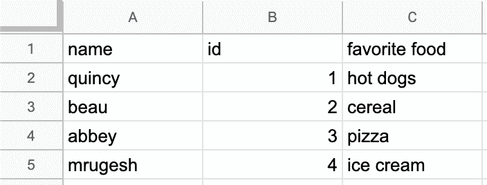
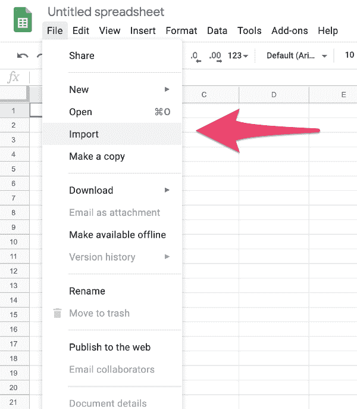
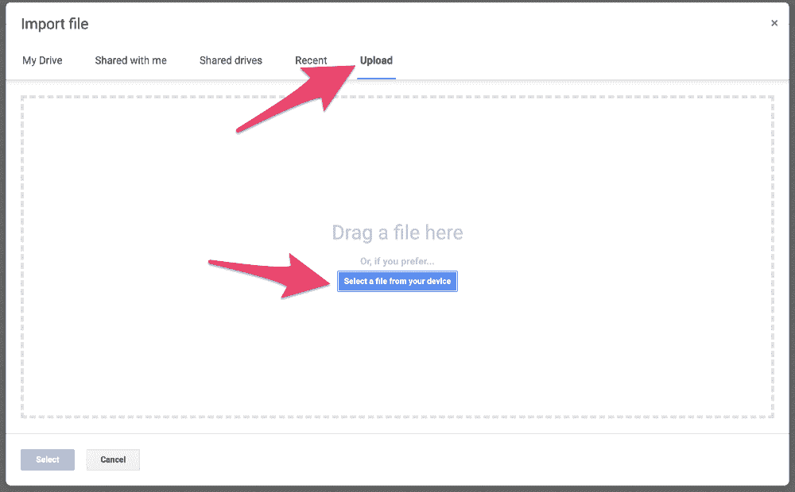
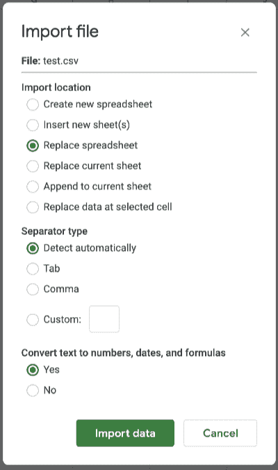
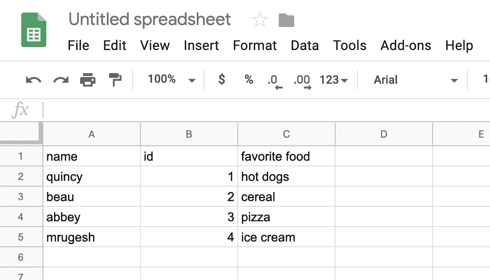

# 什么是 CSV 文件以及如何打开 CSV 文件格式

> 原文：<https://www.freecodecamp.org/news/what-is-a-csv-file-and-how-to-open-the-csv-file-format/>

什么是. csv 文件？CSV 代表逗号分隔值。CSV 文件是存储表格和电子表格信息的纯文本文件。内容通常是文本、数字或日期的表格。使用将数据存储在表格中的程序，可以很容易地导入和导出 CSV 文件。

## CSV 文件格式

通常 CSV 文件的第一行包含表格列标签。随后的每一行代表表中的一行。逗号分隔行中的每个单元格，这就是该名称的来源。

这是一个 CSV 文件的例子。该示例有三列，分别标记为“姓名”、“id”和“食物”。它有五行，包括标题行。

```
name, id, favorite food
quincy, 1, hot dogs
beau, 2, cereal
abbey, 3, pizza
mrugesh, 4, ice cream
```

这是该文件在电子表格中的样子。



由于 CSV 文件只是一个文本文件，您几乎可以在任何文本编辑器中创建一个。您还可以从几乎任何电子表格程序中导出 CSV 文件，例如 [Microsoft Word](https://products.office.com/en-us/excel) 、 [OpenOffice Calc](https://www.openoffice.org/product/calc.html) 或 [Google Sheets](https://sheets.google.com) 。

## 如何打开 CSV 文件

打开 CSV 文件比您想象的要简单。在几乎任何文本编辑器或电子表格程序中，只需选择**文件>打开**并选择 CSV 文件。

对于大多数人来说，最好使用电子表格程序。电子表格程序显示数据的方式比文本编辑器更容易阅读和操作。我们将更详细地介绍如何在 [Microsoft Excel](https://products.office.com/en-us/excel) 、 [OpenOffice Calc](https://www.openoffice.org/product/calc.html) 和 [Google Sheets](https://sheets.google.com) 中打开 CSV 文件。

### 打开一个 CSV 文件 Microsoft Excel

如果您已经安装了 Microsoft Excel，只需双击 CSV 文件即可在 Excel 中打开它。双击该文件后，您可能会看到一个提示，询问您要用哪个程序打开它。选择 Microsoft Excel。

如果已经在 Microsoft Excel 中，可以选择**文件>打开**并选择 CSV 文件。如果看不到要打开的文件，您可能需要将要打开的文件类型更改为“文本文件(*。prn，*。txt，*。csv)”。Excel 将在新工作簿中显示数据。

您也可以将 CSV 文件中的数据导入到现有工作表中。

1.  在 ****数据**** 选项卡上，在 ****获取&转换数据**** 组中，点击 ****从文本/CSV**** 。
2.  在 ****导入数据**** 对话框中，双击要导入的 CSV 文件，点击 ****导入**** 。

在预览对话框中，您有几个选项:

*   如果要将数据直接加载到新的工作表中，选择 ****加载**** 。
*   如果要将数据加载到表或现有工作表，请选择 ****加载到**** 。
*   如果要将数据加载到 Power Query，选择**转换数据**，并在将其导入 Excel 之前进行编辑。

### 打开 CSV 文件 OpenOffice Calc

如果您已经安装了 OpenOffice Calc，只需双击 CSV 文件将其打开。双击该文件后，您可能会看到一个提示，询问您要用哪个程序打开它。选择 OpenOffice Calc。

如果你已经在 OpenOffice Calc 中，你可以选择**文件>打开**并选择 CSV 文件。

### 打开一个 CSV 文件 Google Sheets

首先，在谷歌工作表中打开一个新的电子表格文件。最快的方法是去 [https://sheets.new](https://sheets.new) 。

接下来，选择**文件>导入**。



选择**上传**选项卡，然后将 CSV 文件拖到窗口上或从您的计算机中选择 CSV 文件。



您也许可以在**导入文件**窗口中保留默认值，但要仔细查看以确保无误。然后选择**导入数据**。



你完了！

