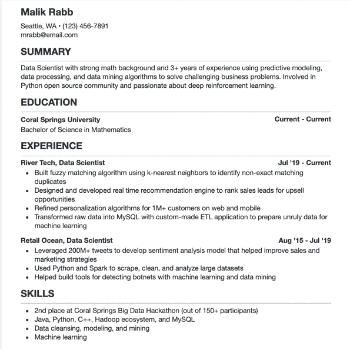

# 什么是简历？简历与履历+履历的含义

> 原文：<https://www.freecodecamp.org/news/what-is-a-cv-and-how-is-it-different-from-a-resume/>

根据你居住的地方和你所在的领域，你可能听说过“简历”和“履历”或“CV”这样的术语。你可能想知道——它们是一回事吗？这些术语可以互换吗？

嗯，答案不是简单的是或不是。事实证明，这基本上取决于你是否在学术界，可能还取决于你住在哪里。但下面会详细介绍。

如果你在找工作，或者只是想更新你的证书，你会想确保你手头有一份简历或履历。

让我们详细看一下每个文档。在本文中，你将了解什么是简历，它与简历有何不同(以及这种区别何时重要)，以及何时你可能需要每一份简历。

## 什么是简历？

一份简历，或者履历，实际上有两层意思，取决于你从事的领域。

但是首先，拉丁文“简历”实际上是什么意思？嗯，它的意思是“人生的历程”。这让它听起来像是一个史诗般的文件，取决于你有多少生活经验。

### 学术界的简历

如果你在学术界和/或申请一个学术职位，这是有意义的。在这种情况下，简历指的是一份详细的文件，详细解释你的教育和专业背景，你发表过的任何文章，你做过的研究等等。

如果你申请大额补助金或奖学金，申请医学和科学领域的某些工作，等等，你也会用到这种类型的简历。

### 行业工作中的简历

另一方面，在英式英语和美式英语中，CV 这个词可以用来指一份简短的文件，上面记录了你的教育背景、职业经历和技能。它通常不超过一页(最多是正面和背面)，提供你希望你的潜在雇主知道的最重要的亮点。

基本上，在这种情况下，简历就是你要发给你想为之工作的公司的东西，比如数据科学家、程序员、业务开发主管，以及其他类似的工作(“行业”工作)。这可能是雇主在考虑你的申请时看到的第一件事，他们可能会花大约 6 秒钟来审查它。

所以，总结一下:

*   在学术界，简历是指对个人和职业生活的深入总结，包括教育、职业经历、出版物以及其他职业成就和奖项。
*   在其他行业——比如科技或商业——CV 一词指的是你在求职申请中提交的简短的教育、职业和技能总结。

## 简历和履历的主要区别是什么？

较短的简历听起来可能很熟悉，因为它基本上可以和简历互换。在美国和其他地方，你可以用两个词(CV 和 resume)来指代你随工作申请一起提交的较短的文档。

那么学术简历和传统简历的主要区别是什么呢？让我们看一下每个文档的主要组件，以便更好地区分这两个文档。

### 学术简历应该包括什么

如上所述，一份面向学术界的简历比简历包含更多的细节和信息。一般来说，您会希望有以下几个部分:

*   你的职业资格——你可能拥有的任何证书
*   你的教育背景——你的学位，你写过的论文，你上过的其他课程
*   你的工作经历——你做过的工作，你做过的项目，你做过的实习，你做过的教学职位，你做过的研究
*   你的成就——你获得的任何奖励或荣誉，你获得的奖学金或助学金，你写的书或论文
*   你的活动——你可以包括志愿者工作、严肃的爱好、兼职项目
*   你有什么特殊的资格吗

### 简历/更短的简历应该包括什么

你可能听说过招聘人员或雇主可能花不超过 6 秒的时间来审阅你的简历——虽然这并不总是对的，但你必须想象它可能是对的。

所以你的简历需要重点突出，应该只突出你最近的经历和成就，以及你最强的技能。以下是要包括的内容:

*   您的姓名和联系信息——确保您包括电子邮件地址，如果您愿意，还可以添加您的社交媒体账号。
*   你可以附上一个总结——几句话，概述你迄今为止的职业经历(一个简短的“了解你”段落)。
*   你的教育背景——你在哪里获得的学位(如果你有学位的话)以及任何毕业后的工作。如果你没有上过大学，你可以列出你参加过的任何训练营或在线课程。
*   你的工作经验——如果你有很多工作，并且有相当多的经验，只要包括最近的和相关的。如果你是职场新人，包括任何项目、实习或其他相关经验。
*   你最擅长的技能——如果你申请的工作需要特定的技能，而你有这些技能，就把它们列出来。你也可以列出适用于该职位的一般技能。

这是您要包含的主要信息。你的简历不应该超过一页纸(如果你有很多经验/工作，也许两页)，但是如果你有更多的空间，你可以包括荣誉和奖励以及副业。

所以简而言之，学术简历要深入得多，覆盖面更广，能更完整地描述你的整个职业历史。

另一方面，较短的简历侧重于你的相关教育和工作经验，以及你所拥有的适用于你所申请工作的技能。

## 简历示例

这是一份令人印象深刻的简历。我会在这里附上第*页*的截图，不过有 10 页长。

Thank you to Dr. Tuba Yilmaz Abdolsaheb for [sharing this example](http://tubayilmaz.com/)!

## 简历示例

这里有一个简短的简历的例子，就像你参加行业工作面试时要带的东西。这个例子是给一个数据科学家的，整个例子有一页长。

Thanks to [Indeed](https://www.indeed.com/career-advice/resume-samples/information-technology-resumes/data-scientist) for the example.

就是这样！

希望现在你知道了学术简历和短简历或履历表之间的区别，并且知道当你申请工作时选择哪一个。