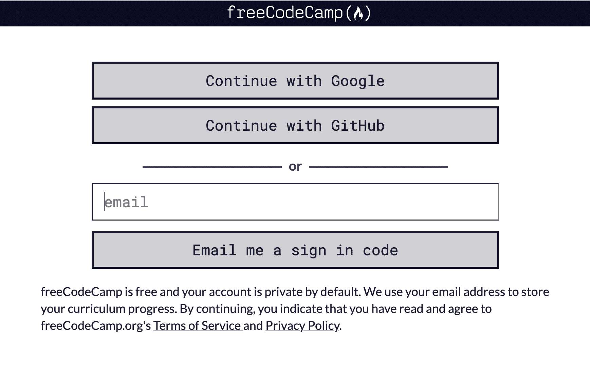
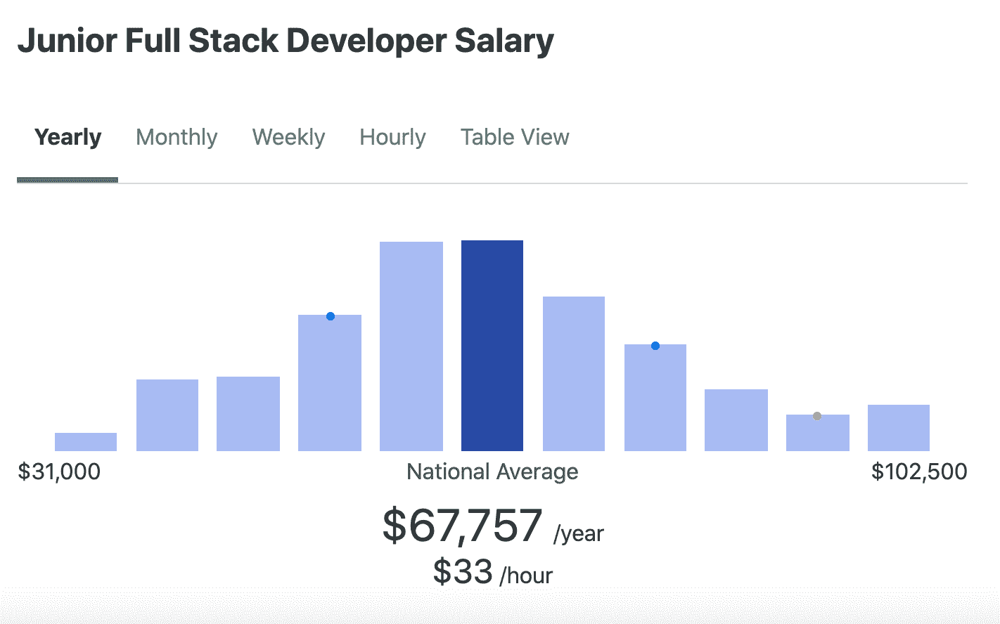
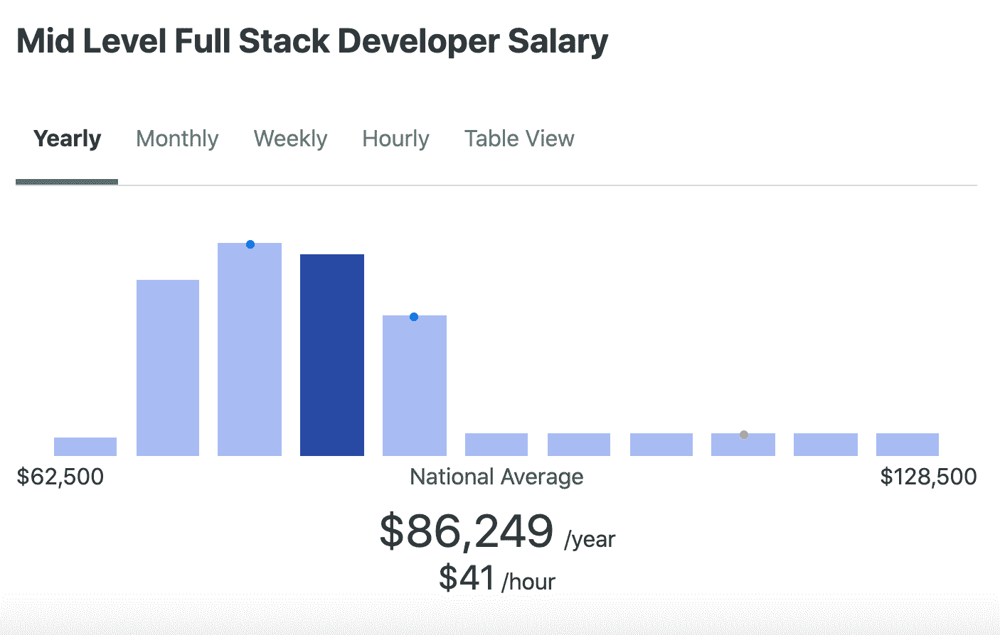
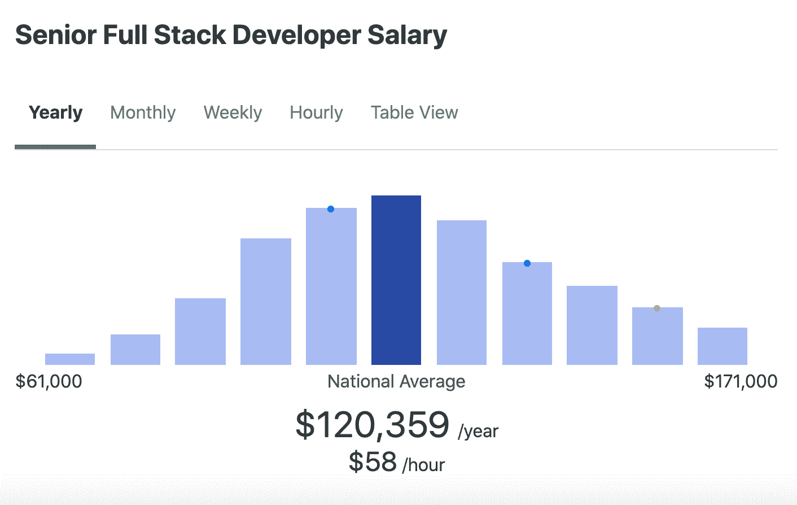

# 什么是全栈开发者？后端+前端=全栈工程师

> 原文：<https://www.freecodecamp.org/news/what-is-a-full-stack-developer-back-end-front-end-full-stack-engineer/>

如果你是科技行业的新手，你可能听说过全栈这个术语。但是这到底是什么意思呢？

在这篇文章中，我将解释什么是全栈开发，成为全栈开发人员需要什么技能，期望薪资，以及找到工作的技巧。

## 什么是全栈开发？

全栈开发人员是同时处理 web 应用程序前端和后端的人。前端负责网站的视觉观感，后端负责网站的幕后逻辑和基础设施。

让我们仔细看看前端和后端这两个术语。

### 前端开发(客户端)

网页上的一切，从徽标，到搜索栏，按钮，整体布局以及用户如何与页面交互，都是由前端开发人员创建的。前端开发者负责网站的外观和感觉。

前端开发人员还必须确保网站在所有设备(手机、平板电脑和电脑屏幕)上都看起来不错。这叫做[响应式网页设计](https://www.freecodecamp.org/news/responsive-web-design-modern-website-code-for-beginners/)。

### 后端开发(服务器端)

后端开发指的是用户看不到的应用程序部分。后端开发人员关注网站的逻辑，创建服务器，并使用数据库和 API(应用程序编程接口)。

例如，表单的内容和布局将在客户端创建，但是当用户提交他们的信息时，它在服务器端(后端)被处理。

## 真实世界的全堆栈应用程序示例

为了更好地理解全栈应用是什么样子，让我们来看看 [freeCodeCamp](https://www.freecodecamp.org/learn/) 网站。

你在页面上看到的一切都将被视为前端。所有的按钮，文本，颜色和布局是前端开发人员的工作。

当涉及到像用户凭证这样的事情时，这些都是由后端维护的。所有的登录过程和用户信息都是后端开发的例子。

如果你很好奇，想看一眼代码，可以在 [freeCodeCamp 开源页面](https://github.com/freeCodeCamp/)找到。

## 作为一个完整的网络开发者你需要的技能

让我们来看看成为全栈开发人员需要学习的技术和工具。

### **HTML**

HTML 代表超文本标记语言。HTML 显示页面上的内容，如按钮、链接、标题、段落和列表。

为了学习 HTML 的基础知识，freeCodeCamp 有一个针对初学者的 [HTML 速成班——网站教程](https://www.youtube.com/watch?v=916GWv2Qs08)。

### **CSS**

CSS 代表级联样式表。CSS 负责网页的风格，包括颜色、布局和动画。

freeCodeCamp 的响应式网页设计课程将教你 CSS、响应式设计和可访问性的基础知识。响应式设计对于创建在各种设备上都好看的网站至关重要。

可访问性是确保每个人都能轻松使用你的网站的实践。您不希望创建那些使用辅助技术(如屏幕阅读器)的人无法使用的网站。

### **JavaScript**

您可以将 JavaScript 与 HTML 和 CSS 结合使用来创建动态的交互式网页和移动应用程序。JavaScript 的例子包括动画、倒计时钟、下拉移动菜单，以及当用户点击页面上的元素时显示/隐藏信息。

要开始学习 JavaScript，可以上 [freeCodeCamp 的 JavaScript 算法和数据结构课程](https://www.freecodecamp.org/learn/javascript-algorithms-and-data-structures/)。从那里，您可以从我的 [40 个面向初学者的 JavaScript 项目](https://www.freecodecamp.org/news/javascript-projects-for-beginners/)文章开始构建项目。

### **CSS 框架、库和预处理程序**

创建这些工具是为了帮助加速开发过程。您可以在网页中使用框架的 CSS 类目录，而不是编写所有的自定义 CSS。

没有必要全部学会，但这里列出了几个选项:

*   [自举](https://getbootstrap.com/)
*   [顺风 CSS](https://tailwindcss.com/)
*   [布尔玛](https://bulma.io/)
*   [物化](https://materializecss.com/)
*   [语义界面](https://semantic-ui.com/)

像 [Sass](https://sass-lang.com/) 和 [Less](https://lesscss.org/) 这样的 CSS 预处理程序允许你给你的 CSS 添加逻辑和功能。这些工具使你的 CSS 变得简洁并且易于使用。

### **JavaScript 库和框架**

这些框架和库允许您节省时间，用更少的代码做更多的事情。

以下是一些受欢迎的选项:

*   [反应](https://reactjs.org/)
*   [角度](https://angular.io/)
*   视图

没有必要全部都学。你应该只研究哪种技术在你的领域中被使用，并开始很好地学习那种技术。

以下是一些建议的学习资源。

*   [freeCodeCamp 的 React YouTube 课程](https://www.youtube.com/watch?v=nTeuhbP7wdE)
*   [布拉德·特拉弗斯的棱角分明的 YouTube 课程](https://www.youtube.com/watch?v=Fdf5aTYRW0E)
*   [布拉德·特拉弗斯的 Vue YouTube 课程](https://www.youtube.com/watch?v=qZXt1Aom3Cs)

### **数据库**

对于全栈开发人员来说，知道如何使用数据库是很重要的。web 应用程序中的数据库是存储和组织项目数据的地方。

有许多类型的数据库需要学习，但这里有一些流行的选择。

*   [SQL](https://www.freecodecamp.org/news/sql-and-databases-full-course/)
*   [MySQL](https://www.freecodecamp.org/news/learn-to-use-the-mysql-database/) 的实现
*   [PostgreSQL](https://www.freecodecamp.org/news/postgresql-full-course/)
*   [MongoDB](https://www.freecodecamp.org/news/mongodb-full-course-nodejs-express-mongoose/)

### 后端语言

可以用于后端开发的语言包括 Java、Python、Node 和 PHP。没有必要学习所有这些语言，而是集中在一个开始。

以下是一些建议的学习资源。

*   [freeCodeCamp 的初学者学习 Python 课程](https://www.youtube.com/watch?v=rfscVS0vtbw)
*   [freeCodeCamp 的 PHP 课程](https://www.youtube.com/watch?v=OK_JCtrrv-c)
*   [用 Mosh 的 Java 课程编程](https://www.youtube.com/watch?v=eIrMbAQSU34)

前端和后端开发也有许多技术栈。下面是几个比较受欢迎的。

*   [平均栈](https://www.freecodecamp.org/news/cjn-understanding-mean-stack-through-diagrams/) (MongoDB，Express，Angular 和 Node)
*   [MERN 栈](https://www.freecodecamp.org/news/create-a-mern-stack-app-with-a-serverless-backend/) (MongoDB，Express，React 和 Node)
*   [节点 j](https://www.freecodecamp.org/learn/back-end-development-and-apis/)
*   [灯栈](https://www.freecodecamp.org/news/how-to-setup-a-lamp-server-on-a-local-ubuntu-linux-machine-or-vm/) (Linux、Apache、MySQL 和 PHP)

有更多的后端语言可供选择，但我建议研究一下你所在地区最常用的语言。

### **测试和调试技巧**

在开发应用程序时，代码中会有需要修复的错误。调试是识别那些错误(“bug”)并修复它们的行为。

测试是另一个需要学习的重要技能。为您的代码编写测试是确保您的代码做它应该做的事情的一种方式。

关于不同类型测试的更深入的解释，我建议阅读这篇文章。

### **版本控制**

版本控制是跟踪和管理项目代码更改的一种方式。Git 是一个流行的软件，你可以用它来跟踪你的代码。

如果你在代码中弄乱了很多东西，你可以使用 Git 回到代码的前一个版本，而不是手动重写所有东西。

学习 Git 还允许您与团队中的其他人协作，并从不同的位置对相同的代码库进行更改。

我建议开始学习 Git T1，并使用像 T2 GitHub T3 这样的服务来托管你的个人项目。

### **解决问题**

对于任何开发人员来说，最重要的技能是知道如何解决问题。公司和客户都在找你提供解决方案。

重要的是要学会如何解决一个问题，将它分解成更小的可管理的部分，并在这些 web 应用程序中解决问题。

## 我应该追求全栈开发吗？

如果您刚刚起步，不确定 full stack 是否适合您，那么不要在学习的早期就强调这一点。

我建议集中学习网络的三种核心语言，即 HTML、CSS 和 JavaScript。随着你在旅程中的进步，你可以决定哪条路适合你。

## 一个全栈开发者赚多少？

全栈工作的工资范围会根据你在世界上的位置而有所不同。我建议使用类似于 [Glassdoor](https://www.glassdoor.com/index.htm) 、[事实上](https://www.indeed.com/)和 [ZipRecruiter](https://www.ziprecruiter.com/) 这样的网站来查找你所在地区的薪水。

以下是美国的薪水示例。这个数据是由 ZipRecruiter 提供的，显示了全国平均水平。

我们先来看一个初级全栈开发者工资。初级开发人员是那些在该行业工作两年或两年以下的人。

接下来，我们来看看中级全栈工资。这些开发人员已经工作了大约 2-4 年。

最后，让我们看看高级全栈工资。这些开发人员已经在这个行业工作了几年，经常作为初级和中级开发人员的导师。

## 如何找到一份全栈开发人员的工作？

一旦你学会了全栈开发的技术方面，你就必须专注于把你的工作申请材料放在一起。有许多令人难以置信的资源可以帮助您了解如何获得一份完整的工作。

### **简历构建资源**

*   [如何获得你的第一份开发工作——从查看职业转换者的简历中得到的启示](https://www.freecodecamp.org/news/how-to-get-your-first-dev-job/)
*   [如何写一份招聘人员会看的开发人员简历](https://www.freecodecamp.org/news/how-to-write-a-developer-resume-recruiters-will-read/)
*   [如何用几个简单的步骤写出一份出色的初级开发人员简历](https://www.freecodecamp.org/news/how-to-write-an-awesome-junior-developer-resume-in-a-few-simple-steps-316010db80ec/)

### **技术面试资源**

*   如何准备技术面试
*   [如何回答任何技术面试问题–示例包括](https://www.freecodecamp.org/news/how-to-answer-any-technical-interview-question-with-example/)
*   [我在 30 天内做了 60 多次技术访谈后学到了什么](https://www.freecodecamp.org/news/what-i-learned-from-doing-60-technical-interviews-in-30-days/)
*   [技术编码面试准备最佳书籍](https://www.freecodecamp.org/news/is-this-the-best-book-for-coding-interview-preparation/)
*   [如何准备技术面试——帮助你发挥最佳水平的技巧和诀窍](https://www.freecodecamp.org/news/interviewing-prep-tips-and-tricks/)

### **找工作的小技巧**

*   [如何通过智能、真正的社交网络获得第一份开发人员工作](https://www.freecodecamp.org/news/networking-for-aspiring-developers/)
*   [2021 年求职技巧](https://www.youtube.com/watch?v=K3B5AltcCTY)
*   [如何掌握求职技巧](https://www.youtube.com/watch?v=KPzFCZ_u_sY)
*   [如何使用 LINKEDIN 作为一名开发人员获得一份技术领域的工作！如何联网！](https://www.youtube.com/watch?v=SG5Sb5WTV_g)

如果你对从事自由职业感兴趣，我还会提供一些如何开始自由职业的资源。

*   什么是自由职业者？如何在网上找到自由职业者和你所在城市的客户
*   [如何撰写赢得客户的自由职业建议书+免费模板](https://www.freecodecamp.org/news/free-web-design-proposal-template/)
*   [自由网络开发者指南:如何通过自由编程工作赚钱](https://www.freecodecamp.org/news/freelance-web-developer-guide/)

我希望您喜欢这篇文章，并祝您在成为全栈开发人员的道路上好运。