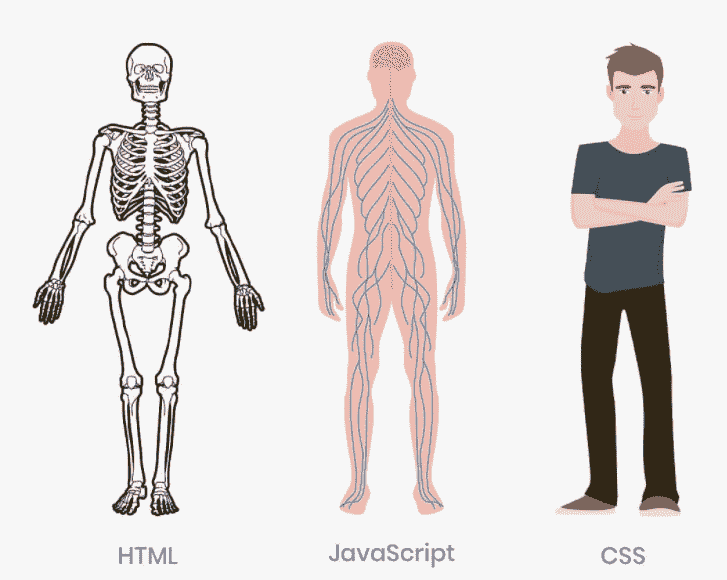

# 什么是全栈？如何成为全栈开发者

> 原文：<https://www.freecodecamp.org/news/what-is-a-fullstack-developer/>

如果你仔细阅读 LinkedIn、Github 和 Quora 等网站，甚至是求职网站，你可能会注意到许多开发人员的个人资料中有一些共同之处:他们称自己为“全栈开发人员”。

如果你是一个技术初学者，对这个领域了解不多，这可能是一个令人困惑的术语，会带来很多问题，比如:什么是全栈开发者？他们到底是做什么的？成为一名需要哪些技能？诸如此类。

现在，为了帮助您回答这个紧迫的问题，在本文中，我们将涵盖所有这些内容，包括帮助您成为全栈开发人员的资源和技巧。

让我们开始吧。

## “全栈”是什么意思？

就像任何其他初学者一样，当我开始学习编码时，我知道你要么是一名 web 开发人员，要么是一名移动开发人员——至少，我当时是这么想的。

有了这个想法，我选择一条赛道就容易多了。我决定先学习`Android development`，然后再过渡到`web development`。我知道，有了这些技能，我就做好了申请工作的准备。

经过一年的潜心学习，我已经开始申请工作了。在这段时间里，我试图找到一个与我的技能相符的角色，在所有的描述中有一点很突出:他们要么需要前端开发人员，后端开发人员，要么需要全栈开发人员。

有那么一会儿，我很困惑——我一直想成为一名网页开发者，或者至少我认为这是每个人的起点。

看到这些新术语让我感到困惑，有那么一会儿，我认为我选择了错误的道路。但是没有，这一切都是因为我刚出道的时候消息不灵通。我只需要学习更多关于不同术语/角色的知识，我已经准备好了。

同样值得指出的是，在过去的几年里，web 已经成长起来，并为拥有不同技能的开发人员提供了许多机会。所以不管你有什么技能，网络是多样化的，它总是能容纳我们所有人😊。

首先，让我们强调一下你可能会遇到的最常见的术语，根据你的技能，你总是会将自己归入这些角色。它们包括:

*   **——前端开发人员处理我们在网站中可以看到和互动的东西。**
*   ****——后端开发人员处理用户看不到的东西，他们创造向用户传递信息的途径。****
*   ********全栈开发者****——他们能够做前端和后端开发(适用于移动和 web)。****

**让我们更进一步，了解这些角色。我们还将了解成为前端、后端或全栈开发人员所需的技能和知识。**

## **什么是前端开发人员？**

****

**前端开发人员的主要作用是开发网站的可见部分，主要是用户可以看到和交互的部分。它也被称为客户端或面向客户的一面。**

**在现实世界的例子中，让我们以一个广为人知的迷因为例:你可以把前端想象成婚宴或派对中的完整设置:** 

****

**为了成为一名前端开发人员，你需要了解 web 开发的基础知识。在本例中是 HTMl、CSS 和 JavaScript。让我们稍微分解一下这些技能。为了更好地理解，我们将以我们的身体为例——很酷，对吗？**

### **前端开发所需的技能**

****

******HTML**** (超文本标记语言)——这就像是身体的骨架，因为它赋予了它一个网站结构。您访问的每个站点都是使用 HTML 构建的，HTML 处理站点的结构和内容。**

******CSS**** (层叠样式表)——把 CSS 想象成身体的美学和肌肉！CSS 使一个网站看起来既漂亮又有趣。就像你的身体中肌肉和皮肤让你变得美丽一样，CSS 对网站也是如此。它设置字体和颜色，添加图片，甚至有助于网站的响应。**

******JavaScript****——就像告诉万物如何运转的操作大脑。JS 是 web 开发的游戏规则改变者，因为它赋予了网站所有的功能。**

**仅凭这一技能，你就能开发静态网站作为你项目的一部分，并把它们用在你的简历中。为了以身作则，看一看我仅用这些技能制作的作品集。[我的投资组合](https://larymak.netlify.app/)。**

**正如我之前所说的，变化每天都在发生，我们必须接受它们。说到变化，JavaScript 已经发展并变得越来越好，增加了许多优秀的特性，使得开发人员更容易使用这种语言。**

**一些重要的改进包括引入 React、Angular、Node、Vue 等框架...这使得前端开发人员更容易构建项目。**

**就像任何其他角色一样，前端开发人员也有一些他们必须履行的职责。让我们看一下典型前端开发人员在日常活动中的职责:**

### **前端开发人员的职责**

**他们应该:**

1.  **确保网页设计能够在所有设备上响应和运行良好。**
2.  **与设计师和应用程序开发人员合作开发定制网站。**
3.  **与创意团队合作设计新功能，并维护旧功能。**
4.  **与后端开发人员协作，提高代码可用性。**
5.  **写一份详细的功能需求文档和指南，帮助你作为前端开发人员写一份好的文档，这份关于[前端文档](https://aviyel.com/post/1178/the-do-s-and-don-ts-of-front-end-documentation)的做与不做的指南会派上用场。**
6.  **跟上他们工作领域的最新趋势。**

### **如何开始前端开发**

**至此，您对前端开发人员的角色有了一个大致的了解，也许您想知道我如何获得开始学习所需的资源？嗯，不用担心，因为我已经创建了这个优秀资源的列表。**

**在那里，我们有一堆可能会让初学者有点困惑的平台，我们有付费和免费的资源，但这不是问题的关键，主要是让你得到你所学的东西，并将其用于你的利益。**

**我的热门推荐包括:
****适合学习******

*   **[FreeCodeCamp](https://www.freecodecamp.org/) 🆓**
*   **[Udacity](https://www.udacity.com/course/front-end-web-developer-nanodegree--nd0011) 🆓(免费&付费)**
*   **[代码学院](https://www.codecademy.com/)(已付费)**
*   **[技能分享](https://skillshare.eqcm.net/2z6nQ)(已支付)**
*   **[前端主机](https://frontendmasters.com/bootcamp/)🆓**

******进行挑战******

*   **[前端导师](https://www.frontendmentor.io/)**
*   **[CSSBattle](https://cssbattle.dev/)**
*   **[码字节](https://coderbyte.com/)**
*   **[Javascript30](https://javascript30.com/)**

******GitHub Repos 带学习资料******

*   **我整理了一个 repo，帮助新手入门前端开发——你可以在这里查看: [HTML，CSS & JS](https://github.com/larymak/Html-Css-Recap)**
*   **[前端清单](https://github.com/thedaviddias/Front-End-Checklist)**
*   **[前端路线图](https://github.com/helloroman/frontend-roadmap)**
*   **[前端开发者路线图](https://github.com/Z8264/frontend-developer-roadmap)**

**下一步怎么样🤷‍在学习了这么多之后，如果你能够通过以上的学习，你就有资格拥有这个头衔**，这意味着你现在已经准备好申请与这个角色相关的工作了。****

****根据 Glassdoor 的数据，给你申请工作的动力，与职位相关的平均年薪是 86，148 美元，这是一笔不错的收入。****

****然而，在学习的过程中，你需要练习来完善你的新技能。****

****对我来说，实践就是建立项目并在某个地方主持它们，这样你就可以向潜在的雇主展示你的工作。****

****以下是免费托管服务列表，您可以在其中托管您的前端项目:****

*   ****韦尔塞尔****
*   ****[网络化](https://www.netlify.com/)****
*   ****github pages****
*   ****[Heroku](https://www.heroku.com/)****
*   ****[燃烧基地](https://firebase.google.com/)****

## ****什么是后端开发人员？****

********

****后端开发人员处理网站中用户不直接交互或看不到的部分。他们的工作更多的是在幕后。它们主要是创造向用户传递信息的途径。主要是关于服务器和数据库。****

****参考我们之前的例子，现在我们将谈论所有好的员工背后的想法，客人喜欢，准备美味佳肴的人。**** 

********

****后端工作最常用的一些语言有****PHP********Ruby********Python****。如果你知道这些语言，你可以创建算法来处理从网站前端发送的数据。****

**后端开发人员与前端开发人员合作，使他们的项目正常运行。在工作列表中需要注意的一点是，他们通常不会直接提到后端开发是一项必备技能——相反，公司可能会寻找 Python 开发人员、PHP 开发人员等等。**

### **后端开发所需的技能**

**通过选择这条道路，它保证你熟悉几个，如果不是一个编程语言，这将有助于你沿着你的职业道路。**

**如果您选择这条道路，请记住以下几点:**

1.  **了解和理解你选择学习的语言的数据结构和算法的基础。**
2.  **学习一门你熟悉的编程语言，最常见的包括 Python、Java、PHP、Go、Ruby & Rails 等...**
3.  **你需要有数据库的知识，一些最流行的包括 MYSQL，MONGODB，POSTGRESQL，REDIS，OCACLES 等...**
4.  **找到一个与你正在学习的语言相关的框架并学习它，举个例子:如果你正在学习 Python，那么在 Flask 或 Django 之间做出选择。**
5.  **练习并开始创建项目。然后你可以向你未来的雇主炫耀那些项目。**

### **后端开发人员的职责**

1.  **数据库创建和管理。**
2.  **理解一个网站的目标，并创建有效的解决方案。**
3.  **研究和引进新的相关技术。**
4.  **备份和恢复网站的文件和数据。**
5.  **与设计师、前端开发人员和系统管理员团队协作。**
6.  **排除故障和调试应用程序。**

### **如何开始后端开发**

**公平地说，本节下的资源很可能是学习特定语言或其相关框架的资源。**

**我建议包括:**

*   **[开始 PHP](https://teamtreehouse.com/tracks/beginning-php)**
*   **[掌握后端](https://masteringbackend.com/posts/backend-development-the-ultimate-guide/)**
*   **FreeCodeCamp YouTube 频道有大量关于后端开发的资源—[只需访问该频道并搜索您想要学习的内容](https://www.youtube.com/channel/UC8butISFwT-Wl7EV0hUK0BQ)。**

******【github rest】******

*   **[后端最佳实践](https://github.com/futurice/backend-best-practices)**
*   **[后端开发教材](https://github.com/backend-development/backend-development-textbook)**
*   **[师友-后端](https://github.com/anitab-org/mentorship-backend)**

**就像我们在前端开发中托管项目一样，这同样适用于后端。您可以用来托管项目的一些平台包括:**

*   **[AWS](https://aws.amazon.com/)**
*   **[蔚蓝色](https://azure.microsoft.com/en-us/)**
*   **[数字海洋](https://www.digitalocean.com/solutions/website-hosting/)**
*   **里诺德**
*   **[谷歌云](https://cloud.google.com/)**

**现在，我们已经讨论了成为全栈开发人员所必需的前端和后端途径，我们终于可以讨论我们的主要话题了——什么是全栈开发人员？**

## **什么是全栈开发者？**

**简而言之，我们可以说一个全栈开发人员能够处理等式的两边，这意味着他们可以处理网站或应用程序的前端和后端。他们能够处理涉及构建用户界面和数据库的项目。**

**为了成为一名全栈开发者，你需要付出几年的努力，并获得一些行业经验。您需要学习前端和后端技术。**

### **成为全栈开发人员所需的技能**

**很明显，为了获得全栈开发者的头衔，你需要多种技能。简单回顾一下:**

******基本的 UI/UX 设计技巧****
这些技巧将帮助你开发一个视觉原型，让你了解并感受用户将如何与你的最终产品互动。**

**我们有很多资源和软件可以帮助设计模型，常见的有:AdobeXD，Invision 和 Figma。**

**有软件但不知道如何使用它们不会有任何帮助，对吗？为了帮助学习如何使用这些工具，我们有 Youtube 视频、在线课程和 UX 训练营，仅举几例:**

******前端开发基础——HTML、CSS、JavaScript。****
这些是你做网站开发所需要的基本技能，它们将帮助你为你的网站创造漂亮的界面。如果您想成为全栈开发人员，请确保在进入下一步之前，您已经清楚地了解了基础知识。还要找一个选择的前端框架，研究一下。**

******Java、Python、Ruby 或 PHP 之类的编程语言。****
在选择要学习的语言时，这一步可能会让你感到困惑或不知所措。你总是可以选择一个并学好它，一旦你掌握了基础知识，就可以进入另一个领域。选好语言后找一个对应的框架也掌握:
最常见:*Python 的 Django/Flask，PHP 的 Laravel，Java 的 Spring*等等...**

**在这一点上，还需要注意的是:**

> **在你开始寻找其他学习资源之前，先看看你想学的语言的主要文档。**

******了解开发框架。****
学习一个框架有助于让你的开发工作更容易。最好至少为前端和后端学习一个框架，因为:**

*   **它简化了应用程序和站点的调试和维护。**
*   **这是对代码重用的一个很好的利用。**
*   **它有助于减少代码的长度。**
*   **它提高了熟练程度并加强了安全性。**

**现在，为了帮助你正确地开始学习框架，这里有一些最常见的官方文档的快速链接:
****前端******

*   **[反应文件](https://reactjs.org/docs/getting-started.html)**
*   **[VueJS 文档](https://vuejs.org/v2/guide/)**
*   **[角型医生](https://docs.angularjs.org/guide)**
*   **[节点 j](https://nodejs.org/en/docs/)**

******后端******

*   **[Django 文档](https://www.djangoproject.com/)**
*   **拉勒维尔**

******了解数据库** s**
这是让网站/应用程序充满活力的大脑。您需要理解客户端和服务器端是如何通信的。数据库提供了一个接口，让用户以持久的方式将数据保存到内存中。这让我们可以在需要时随时检索数据。**

**根据您所从事的项目类型，您的数据库需求可能会有所不同。**

****学习**版本控制****
它被大多数开发者认为是一个非常重要的工具，这是因为它在开发领域发挥的优势作用。它的一些重要性包括:**

*   **它有助于跟踪项目进度**
*   **它使团队工作和协作变得更加容易。**
*   **它有助于在删除时恢复丢失的项目文件。**

**最常见和最广泛使用的版本控制是 Git。为了帮助您开始学习它，请查看官方的 [Git 文档](https://git-scm.com/doc)。**

******其他重要技能:******

*   **时间管理**
*   **创造力**
*   **良好的沟通**
*   **问题解决**

**这就是全部了。至此，您已经了解了全栈开发人员的概念以及所需的技能。伴随角色而来的责任是什么？**

### **全栈开发人员的责任**

1.  **具备前端知识和任何相关框架。**
2.  **具备后端设计和开发知识，包括至少一个与所选语言相关的框架。**
3.  **具备网站功能的数据库和服务器管理知识。**
4.  **确保项目在所有平台上顺利运行，如 Windows、MacOS 和 Linux。**
5.  **满足技术和消费者需求。**
6.  **设计和开发负责获取数据的 API。**

**选择成为一名全栈开发人员，意味着您将面临一项重大任务。这意味着我们将有一些与角色相关的优点和缺点。其中一些包括:**

### **成为全栈开发者的优势**

1.  **适应性——你精通前端和后端技术，这意味着你可以在需要时轻松切换项目。**
2.  **你可以完成各种各样的任务，因为你有不同的技能组合，可以从事不同类型的项目。**
3.  **它减少了项目沟通，因为在大多数情况下，您可以独立地实现变更。**

### **不足之处**

1.  **当您的公司/团队只依赖一两个全栈开发人员时，可能会出现生产力低下和时间管理问题。**
2.  **跟上潮流很难——因为你在不同的技术领域工作，所以跟上新兴潮流是一个挑战。**
3.  **平衡工作的问题，作为一个全栈开发人员，它往往会花费太多的时间。结果，你可能会忘记将你的工作量分成更小的任务，并对你在某个项目中的责任感到困惑。**

**人们学习和工作的一个主要原因是为了能够支付账单，所以你可能认为所有这些要求都应该有一份非常好的薪水，对吗？**

**这倒是真的——事实上，全栈开发人员的平均工资为 107，750 美元/年。**

### **如何开始全栈开发**

**为了学习我们在这里讨论的所有内容，你可能需要一些指导。幸运的是，您不必自己寻找资源，因为我已经为您做了。你所需要的就是选择一个并开始学习。**

******网络课程******

1.  **[全栈 Web 开发:HTML，CSS，React &节点(Udemy)](https://click.linksynergy.com/deeplink?id=vedj0cWlu2Y&mid=39197&u1=ddfullstack2&murl=https%3A%2F%2Fwww.udemy.com%2Fultimate-web%2F)**
2.  **[React(Coursera)全栈 Web 开发课程](https://click.linksynergy.com/deeplink?id=vedj0cWlu2Y&mid=40328&u1=ddfullstack1&murl=https%3A%2F%2Fwww.coursera.org%2Fspecializations%2Ffull-stack-react)**
3.  **[专业全栈开发者——纳米学位认证(Udacity)](http://www.anrdoezrs.net/links/7964208/type/dlg/sid/ddfullstacknano/https://www.udacity.com/course/full-stack-web-developer-nanodegree--nd004) 。**
4.  **[免费全栈开发培训(LinkedIn Learning–Lynda)](https://linkedin-learning.pxf.io/c/1238999/449670/8005?subId1=ddfullstack8&u=https%3A%2F%2Fwww.linkedin.com%2Flearning%2Flearning-full-stack-javascript-development-mongodb-node-and-react)**

******【github rest】******

1.  **[全栈开发者课程](https://github.com/lcdevelop/FullStackDeveloperCourse)**
2.  **[全栈 Web 开发者之路](https://github.com/shovanch/fullstack-web-developer-path)**

## **包裹**

**全栈开发人员几乎可以做任何事情。如果你喜欢创新和解决问题，并试图理解不同的事情如何一起工作，那么这是一条你可能想走的路。**

**虽然许多职位描述将计算机科学学位列为获得全栈开发人员的一项要求，但我倾向于不同意这一点。我相信你所需要的只是技能和项目，你可以通过构建项目来获得它们。**

**在最近的过去，我们已经进行了许多投票，看 CS 学位是否是被雇用为开发人员的必要条件，但是许多得到这份工作的人倾向于不同意。下面的推文证明了这一切。**

**我的最后一个问题是，你是哪种类型的开发人员，或者你的目标是成为哪种类型的开发人员？**

**我先来:我总是喜欢称自己为成长中的开发者，因为每天都有学习的空间。我真的不能确切地指定一个级别，因为我相信我几乎可以做任何事情。**

**如果你已经读到这里，我真的很感激。**

**与我联系:[Twitter](https://twitter.com/larymak1)|[LinkedIn](https://www.linkedin.com/in/hillary-nyakundi-3a64b11ab/)|[GitHub](https://github.com/larymak)|[YouTube](https://www.youtube.com/channel/UCrT1ARRZfLOuf6nc_97eXEg)。**

**享受编码❤.**