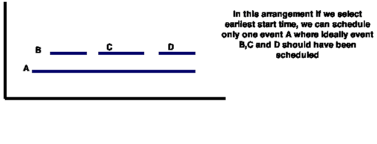
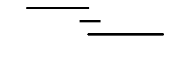
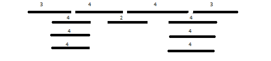

# 贪婪算法举例说明

> 原文：<https://www.freecodecamp.org/news/what-is-a-greedy-algorithm/>

## 什么是贪婪算法？

在浏览这里的一些文章时，你可能听说过很多算法设计技术。其中一些是:

*   蛮力
*   各个击破
*   贪婪编程
*   动态编程仅举几个例子。在本文中，您将了解什么是贪婪算法，以及如何使用这种技术来解决许多编程问题，否则这些问题看起来并不琐碎。

想象你要去徒步旅行，你的目标是尽可能到达最高峰。在开始之前，您已经有了地图，但是地图上显示了成千上万条可能的路径。你太懒了，根本没有时间去评价每一个。去他妈的地图！你用一个简单的策略开始徒步旅行——贪婪和短视。只需选择最向上倾斜的路径。这似乎是一个徒步旅行的好策略。但它总是最好的吗？

旅行结束后，你全身酸痛疲惫，你第一次看徒步地图。我的天啊。我应该穿过一条泥泞的河，而不是一直往上走。这意味着一个贪婪的算法挑选最好的直接选择，并且从不重新考虑它的选择。就优化一个解决方案而言，这仅仅意味着贪婪的解决方案将试图找到局部最优解——这可能很多——并且可能错过全局最优解。

## 形式定义

假设您有一个目标函数需要在给定点进行优化(最大化或最小化)。贪婪算法在每一步都做出贪婪的选择，以确保目标函数是最优的。贪婪算法只有一次机会来计算最优解，因此它永远不会返回并推翻决策。

### 贪婪算法有一些优点和缺点:

*   为一个问题想出一个贪婪算法(甚至多个贪婪算法)是相当容易的。分析贪婪算法的运行时间通常比其他技术(如分治法)要容易得多。对于分而治之技术，不清楚技术是快还是慢。这是因为在递归的每一级，的大小变小，子问题的数量增加。
*   困难之处在于，对于贪婪算法，你必须更加努力地理解正确性问题。即使有正确的算法，也很难证明它为什么是正确的。证明贪婪算法是正确的，与其说是一门科学，不如说是一门艺术。这需要很多创造力。通常，想出一个算法可能看起来微不足道，但证明它实际上是正确的，是一个完全不同的问题。

## 区间调度问题

让我们深入探讨一个你几乎在任何行业或任何行业都会遇到的有趣问题。该问题的一些实例如下:

*   在一所大学的一天里，你有一套 N 节课的时间表。特定讲座的时间表是(s *时间，f* 时间)的形式，其中 s *时间表示该讲座的开始时间，类似地，f* 时间表示结束时间。给定 N 个讲座时间表的列表，我们需要选择一天中举行的最大讲座集，以使**没有讲座相互重叠，即如果讲座 Li 和 Lj 包括在我们的选择中，则 j 的开始时间>= I 的结束时间，反之亦然**。
*   你的朋友是一名营辅导员，他负责为一组营员组织活动。他的计划之一是下面的迷你铁人三项运动:每个参赛者必须在游泳池里游 20 圈，然后骑自行车 10 英里，然后跑 3 英里。
*   该计划是通过以下规则，以交错的方式发送参赛者:参赛者必须一次使用一个游泳池。换句话说，首先一名选手游完 20 圈，下车，开始骑自行车。
*   第一个人一出泳池，第二个选手就开始游 20 圈；一旦他或她出来开始骑自行车，第三个参赛者开始游泳，等等。
*   每个参赛者都有一个预计的游泳时间、一个预计的骑自行车时间和一个预计的跑步时间。你的朋友想要决定铁人三项的时间表:参赛者起跑的顺序。
*   假设时间预测是准确的，那么让我们假设一个时间表的完成时间是所有参赛者完成铁人三项的所有三个赛程的最早时间。如果一个人想让整个比赛尽快结束，那么派出人的最佳顺序是什么？更准确地说，给出一个有效的算法，产生一个完工时间尽可能短的调度

### 讲座时间安排问题

让我们看看解决这个问题的各种方法。

**最早开始时间优先**，即选择开始时间最早的区间。看看下面这个打破这个解决方案的例子。这个解决方案失败了，因为可能有一个很早开始但很长的时间间隔。这意味着我们可以尝试的下一个策略是先查看更小的间隔。



**最小间隔优先**，也就是说，你最终选择讲座的顺序是它们的总间隔，而总间隔就是它们的`finish time - start time`。同样，这种解决方案是不正确的。看下面这个案例。



你可以清楚地看到，最短间隔的讲座是中间的那个，但那不是这里的最优解。让我们来看看这个问题的另一个解决方案，从这个解决方案中得到一些启示。

**冲突最少的区间优先**也就是说，您应该查看导致冲突最少的区间。我们又一次有了这种方法不能找到最优解的例子。



该图向我们展示了冲突最少的区间是中间的区间，只有两个冲突。在那之后，我们只能选择最末端的两个区间，每个区间有 3 个冲突。但是最佳解决方案是选择最顶层的 4 个区间。

**最早结束时间第一个**。这种方法总能给我们提供这个问题的最佳解决方案。我们从以前的方法中得到了很多启示，最终找到了这个方法。我们根据结束时间的递增顺序对区间进行排序，然后从最开始选择区间。为了更清楚起见，请看下面的伪代码。

```
function interval_scheduling_problem(requests)
    schedule \gets \{\}
    while requests is not yet empty
        choose a request i_r \in requests that has the lowest finishing time
        schedule \gets schedule \cup \{i_r\}
        delete all requests in requests that are not compatible with i_r
    end
    return schedule
end 
```

## 我们什么时候使用贪婪算法

贪婪算法可以帮助你找到很多看似棘手问题的解决方案。它们唯一的问题是，你可能想出了正确的解决方案，但你可能无法验证它是否是正确的。所有贪婪问题都有一个共同的性质，即局部最优最终会导致全局最小，而无需重新考虑已经考虑的选择集。

贪婪算法帮助我们解决许多不同类型的问题，比如:

## 最短路径问题:

[https://www.youtube.com/embed/gdmfOwyQlcI?feature=oembed](https://www.youtube.com/embed/gdmfOwyQlcI?feature=oembed)

## 图中的最小生成树问题

[https://www.youtube.com/embed/4ZlRH0eK-qQ?feature=oembed](https://www.youtube.com/embed/4ZlRH0eK-qQ?feature=oembed)

## 霍夫曼编码问题

[https://www.youtube.com/embed/dM6us854Jk0?feature=oembed](https://www.youtube.com/embed/dM6us854Jk0?feature=oembed)

## k 中心问题

[https://www.youtube.com/embed/dpYZojRuJEI?feature=oembed](https://www.youtube.com/embed/dpYZojRuJEI?feature=oembed)