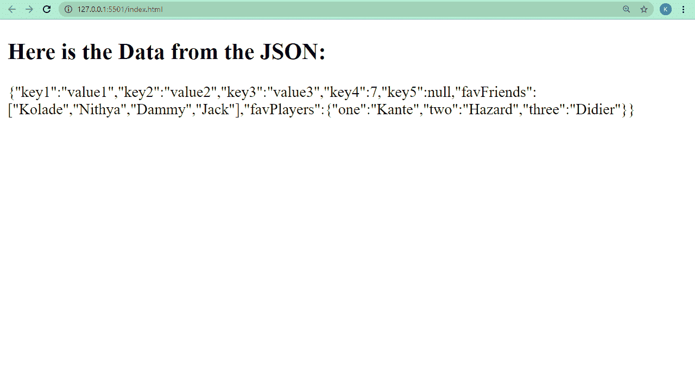
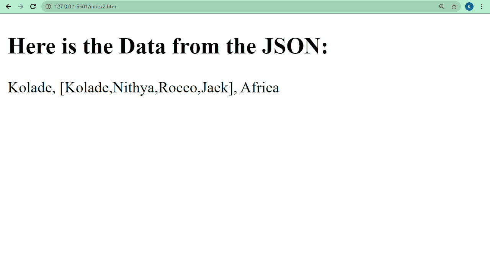

# 什么是 JSON 文件？JavaScript 代码示例

> 原文：<https://www.freecodecamp.org/news/what-is-a-json-file-example-javascript-code/>

JSON 代表 JavaScript 对象符号。一个 JSON 文件有。json 作为它的扩展，里面的数据用 key:value 对表示，就像传统的 JavaScript 对象一样。

不过，JSON 和 objects 并不完全相同。核心区别是 JSON 中的键必须在双引号中，除了 number 和 null 类型之外的值也必须在双引号中。

如果您在编程过程中使用过 API，您可能知道 JSON 是什么，因为现在许多 API 数据都是以 JSON 格式出现的。

如果您以前没有使用过 API，并且您是一个绝对的初学者，那么您并不孤单。

在本文中，我将带您了解 JSON 是什么，以及如何最好地利用它。

## 基本 JSON 语法

```
{
  "key1": "value1",
  "key2": "value2",
  "key3": "value3",
  "key4": 7,
  "key5": null,
  "favFriends": ["Kolade", "Nithya", "Dammy", "Jack"],
  "favPlayers": {"one": "Kante", "two": "Hazard", "three": "Didier"}
} 
```

## 接受的 JSON 数据类型

JSON 可以在一个对象或一个数组中定义，这可能需要几个对象。因此，对象和数组是 JSON 中自动接受的数据类型。它支持的其他数据类型有布尔值、空值和字符串。

JSON 不支持 undefined、function 和 date 等数据类型。

此外，JSON 还可以扩展成其他数据格式，这些格式可以接受原始 JSON 不接受的额外数据类型。

这种扩展的例子有 GeoJSON 和 BSON。GeoJSON 用于表示地理数据，而 BSON 则由流行的数据库服务提供商 MongoDB 使用。

例如，BSON 接受正则表达式、日期和时间戳作为数据类型，而 JSON 不接受。

## JSON 语法规则

JSON 对其支持的数据类型非常严格。如果您在代码编辑器中安装了 linter，它会在您输入不支持的数据类型或违反语法规则时立即让您知道有错误。

### 要知道的 JSON 语法规则:

*   如果你把文件表示为一个对象，那么文件中的所有数据都必须用花括号括起来，如果是一个数组，那么就用方括号括起来。
*   不允许使用单引号
*   每个 JSON 中的键必须是唯一的，并且必须用双引号括起来
*   数字不能用双引号括起来，否则将被视为字符串。
*   null 数据类型不能用双引号括起来。
*   布尔值只能为真或假。
*   除了最后一项，每个键:值对都必须以逗号结束
*   数组中的特定对象也必须以逗号结束。

## JSON 数据如何发送到客户机(浏览器)

JSON 的创建是出于实时地将数据从服务器(例如数据库)发送到客户机(浏览器)的需要。

但是 JSON 数据不能以原始键:值对的形式传输到浏览器，所以编程语言有操作 JSON 数据的方法。

例如，在 JavaScript 中，`JSON.parse()`将 JSON 数据转换为对象，`JSON.stringify()`将对象的 key:value 对转换为 JSON 数据。

Python 提供了一些方法，比如将现有字符串转换成 JSON 的`json.loads()`，以及将对象转换成 JSON 字符串的`json.dumps()`。

您可以使用 JavaScript 提供的两种方法将基本 JSON 语法中的数据发送到浏览器。

### 如何用 JavaScript 向客户端(浏览器)发送 JSON 数据

`JSON.stringify()`方法返回一个与 JavaScript 对象完全相同的 JSON 字符串。您可以将它与 DOM 操作方法结合使用，在浏览器中显示 JSON 数据，正如我在下面的代码片段中所做的那样:

```
<h2>Here is the Data from the JSON:</h2> 
<div id="json"></div> 
```

```
 const JSONData = {
    "key1": "value1",
    "key2": "value2",
    "key3": "value3",
    "key4": 7,
    "key5": null,
    "favFriends": ["Kolade", "Nithya", "Dammy", "Jack"],
    "favPlayers": {"one": "Kante", "two": "Hazard", "three": "Didier"}
}

const JSONString = JSON.stringify(JSONData)
const JSONDisplay = document.querySelector("#json")
JSONDisplay.innerHTML = JSONString 
```

在 JavaScript 代码中，我们将 JSON 数据声明为带有标识符(名称)`JSONData`的对象文字。我们使用 JavaScript 的`JSON.stringify()`方法将其转换为字符串，并使用 DOM 的查询选择器方法获取 HTML 中的空 div。这使得用`innerHTML` DOM 操作方法填充其中的 JSON 数据成为可能。



我们可以使用`JSON.parse()`方法将 JSON 数据转换成对象——下面是它的实际应用:

```
<h2>Here is the Data from the JSON:</h2>
<div id="json"></div> 
```

```
const JSONData =
     '{"name": "Kolade", "favFriends": ["Kolade", "Nithya", "Rocco", "Jack"], "from": "Africa"}';

   try {
     const JSONString = JSON.parse(JSONData);
     const JSONDisplay = document.querySelector("#json");
     JSONDisplay.innerHTML = JSONString.name + ", [" + JSONString.favFriends + "], " + JSONString.from;
   } catch (error) {
     console.log("Cannot parse the JSON Data");
   } 
```

浏览器中的结果输出如下:


## 结论

作为程序员，你离不开 JSON。现在大多数 API 都是用 JSON 而不是 XML 编写的。

JSON 最初是为 JavaScript 设计的，但是由于其独立于语言的特性，现在许多其他编程语言都支持它。因此，许多语言都有使用它的库。

我希望这篇教程已经给了你使用 JSON 所需要的洞察力，这样你就可以在遇到它的任何时候正确地使用它。

感谢阅读，继续编码。