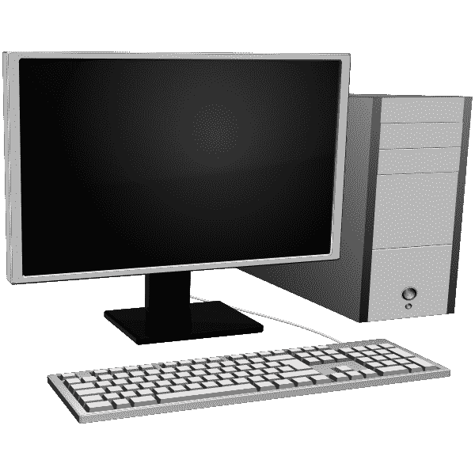
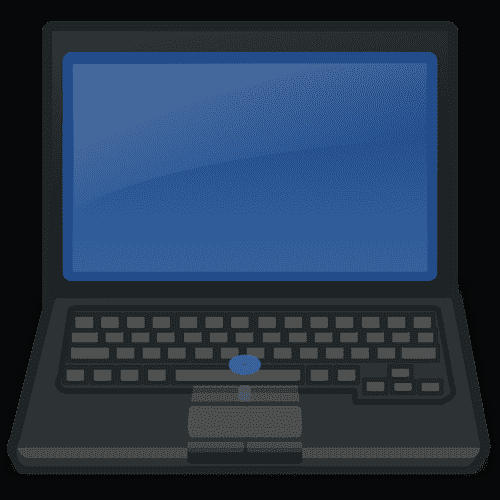

# 什么是个人电脑？初学者的计算机定义和计算机基础

> 原文：<https://www.freecodecamp.org/news/what-is-a-pc-computer-definition-and-computer-basics-for-beginners/>

计算机彻底改变了我们的生活。

它们帮助我们快速准确地完成重复性任务。他们不知疲倦，不怕复杂。

计算机能够以每秒数百万次的速度处理数据和进行运算。与人类完成相同任务的时间相比，他们可以更快地完成任务。

拥有一台个人电脑也让你有机会使用网上的大量信息和免费资源。这反过来可以帮助你学习新的技能，并可能提高你的生活质量和标准。

但是什么是计算机，确切地说，什么是个人电脑？

在这篇文章中，你将学习计算机的基础知识:它们是什么，可用的不同种类的计算机，以及它们是如何工作的。

## 什么是电脑？初学者的定义

我们大多数人每天都使用电脑。

您可以在工作中使用它们——当您想要编辑 word 文档、参加视频会议或发送重要电子邮件时。

你也可以将它们用于娱乐目的——比如浏览社交媒体或玩视频游戏。

现在比以往任何时候，许多人使用电脑来消费教育内容和获得新的技能。

它们在我们的日常生活中如此受欢迎，但是我们有没有停下来想一想它们到底是什么呢？或者它们是如何高速完成各种任务的？或者它们是由什么组成的？

计算机是一种工具，它接受一些输入，然后能容易地操作和处理它接收的不同种类的数据。它执行复杂的计算并产生一些输出。该输出也可以被存储以供以后检索和使用。

具体来说，计算机是一种电子设备或机器，它遵循特定的规则并完成一组标准功能，例如:

*   创建信息
*   从外部资源获取数据作为输入
*   把数据处理成有用的东西
*   将各种信息和指令存储到内存中，并在需要或请求时检索它们
*   产生某种输出

当我们试图定义什么是计算机以及它如何工作时，我们经常使用人脑的类比。

我们可以把我们的大脑想象成更先进、更精密的计算机。它们实际上能做的比计算机多得多，也复杂得多。

但是人类的思维过程和我们处理信息的方式有点类似于计算机处理信息的方式。我们的大脑也接收输入，传递信息，并根据接收到的输入产生输出。

## 电脑如何运作

每台计算机都由硬件和软件组成。

硬件是构成计算机的所有物理部件，也是计算机之所以成为计算机的原因。

硬件是你可以触摸到的物理组件，它们位于计算机的内部和外部。

这些也是执行所有操作和执行指令的部分。

软件是由所有的数字部件组成的——这些部件是你在电脑中*看不见或者摸不着的。*

软件是告诉硬件组件做什么和如何工作的程序的集合。它们为硬件提供指令，硬件需要执行这些指令来完成任务。

程序是一组 0 和 1 形式的指令(或二进制代码)。它们是需要按顺序、逻辑顺序执行的命令。

### 计算机的基本硬件和软件

你可以在电脑的外的*上找到的一些**硬件**组件有:*

*   计算机机箱，也称为机箱，它包含计算机内部的重要硬件部件。这个外部物理部件存储计算机的内部电路和数字结构。
*   输出设备，如:
    *   监视器，即屏幕，用于显示和输出视觉信息。
    *   一组扬声器，将数字信号转换为声音。
    *   在纸上输出信息的打印机。
*   输入设备，例如:
    *   用于键入文本和字符的键盘，主要用于输入任何书面信息。
    *   用于点击、指向和选择适当数据的鼠标。
    *   一个麦克风。

下面提到了一些最重要的*内部*硬件:

*   主板。它是连接所有重要硬件组件的主电路板。
*   CPU(中央处理器的缩写)。每台计算机都有一个中央处理器。它也被称为处理器，通常被称为计算机的“大脑”，因为它以高速处理大量信息。它执行算术和逻辑功能。
*   GPU(图形处理单元的缩写)。它渲染和操作图像、图形、视频和各种视觉数据。
*   RAM(随机存取存储器的缩写)或主存储器。这是一种易失性的短期存储器，只能在电脑通电时暂时存储信息。当您打开并正在使用应用程序或文件时，会用到它。当电源关闭时，您创建且未保存的任何文件或更新都将丢失，并且很难恢复。
*   HDD(硬盘驱动器的缩写)和 SSD(固态驱动器的缩写)是存储设备，并且是非易失性的。这意味着它们可以永久存储和保存数据，即使在计算机关闭且没有电源的情况下也是如此。
*   一种电源装置。所有部件都需要电力才能正常工作。电源连接到某种类型的电源，无论是电源插座还是电池。

一些重要的**软件**组件是包含文字和数字处理以及演示程序的软件包，如微软办公套件。

软件的其他例子是电子邮件程序，如谷歌的 Gmail，网络浏览器，如谷歌 Chrome，Mozilla Firefox 和苹果 Safari，以及生产力/笔记工具，如概念应用程序，等等。

然而，计算机最重要的软件是操作系统。

它控制计算机的所有功能，管理硬件和软件组件。

它是软件和硬件之间的接口——这两者相互通信的方式，以及你与计算机交互的方式。

如今最常用的操作系统是微软的 Windows 操作系统和苹果操作系统。Linux 也是非常受开发者欢迎的操作系统。

## 不同类型的计算机

上面提到的硬件和软件组件对所有计算机都是通用的。

尽管如此，还是有各种不同类型的计算机。

如今有如此多的设备可供选择——每一种都有不同的尺寸、使用案例、功率能力和便携性。

有智能手机、智能手表、智能电视、智能汽车、智能电器、自动取款机和强大的高性能网络服务器。

这些只是具有内置芯片或 CPU 的设备的一些例子，这使它们成为计算机。

然而，最受欢迎和最常见的计算机类型之一是个人电脑。PC 只是个人电脑的缩写。

## 什么是个人电脑？

个人电脑是一种包含 CPU(处理器)的小型多用途计算设备。

它被设计成仅供个人使用，一次只能供一个人使用。

我强调个人电脑的单一用途性质，因为它与大型主机形成对比，大型主机在计算的早期被广泛使用。

大型机是一种非常大而强大的超级计算机，能够占据整个房间。多个人，甚至多达数百人，可以在给定的时刻访问和使用它。

我们在办公室和家庭中使用个人电脑，每个办公室和家庭可以有多台个人电脑，这取决于有多少人在那里工作/生活。

有不同风格的个人电脑，它们可以在不同的操作系统上运行。

最流行的个人电脑使用 Windows 操作系统。

### 两种类型的个人电脑

根据电脑的大小和使用方式，电脑分为两大类。

有*固定式*或台式电脑，*便携式*或笔记本电脑。

固定式个人电脑是台式电脑。它们体型相对较大，停留在一个固定的地方。你可能在你的家庭办公室或办公室里有它。

如前所述，台式计算机的内部硬件封装在一个机箱(或塔)中。它们有独立的显示器、键盘、鼠标和一组扬声器。

固定式电脑是人们在提到“电脑”一词时通常会想到的那种电脑。

[An external monitor, keyboard, and the computer case all make up a 'traditional' PC](https://freesvg.org/personal-computer-configuration-vector-clip-art)

第二类个人电脑是便携式电脑，如笔记本电脑、平板电脑和智能手机。

它们的尺寸更小，重量更轻，所有重要的部件都内置于设备中，外壳、键盘和显示器并不是相互分离的，而是都封装在设备中。

[There is an attached monitor, keyboard, and a touchpad which is used instead of a separate mouse](https://publicdomainvectors.org/en/free-clipart/Vector-image-of-front-view-of-laptop/12973.html)

### 什么时候你会使用台式机还是笔记本电脑？

固定式或台式计算机通常速度很快，功能强大。它们通常比便携式电脑具有更高的性能和更好的功能。

此外，台式机通常成本更低，升级也更便宜。

用户可能更喜欢台式计算机，因为它们相对灵活和多功能。这意味着您可以根据自己的需求和品味进行定制。

台式机主要用于企业计算，你可以用它做任何工作。它们是你在家或在办公室工作时的首选电脑，因为你不能轻易移动它们。

台式机也是游戏、图形设计和视频编辑软件的热门选择。这是因为它们具有更高的处理能力，能够产生更高质量的图形。由于有独立的显示器，工作时屏幕上有更多的可用空间。

另一方面，便携式电脑或笔记本电脑是经常“移动”工作的用户或数字游牧者的首选电脑。

当你想在旅途中工作，或者只是想在咖啡店工作一天时，它们会很有帮助。

笔记本电脑和其他便携式个人电脑也是学生的好选择，他们可以把他们的工作从一个班带到另一个班。

笔记本电脑通常在最初和升级时都有较高的价格。它们也有点难以定制。但它们的主要卖点无疑是它们的便携性。

您可以在笔记本电脑上完成与台式机相同的工作，例如编辑文档和电子表格、玩游戏、编辑视频、创建引人注目的图形以及使用各种软件。请记住，它们的性能远远低于台式电脑。

## 结论

感谢阅读并坚持到文章结尾！

我们讨论了计算机的定义、不同类型的计算机以及所有计算机共有的部件。

最后，你学习了个人电脑的基础知识——当今最流行的电脑。