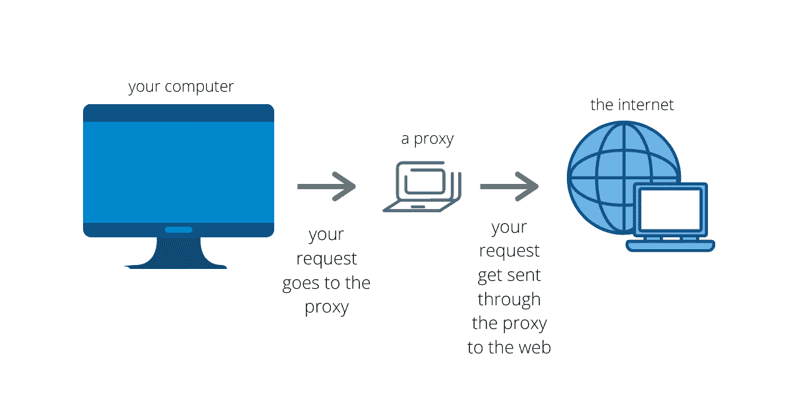
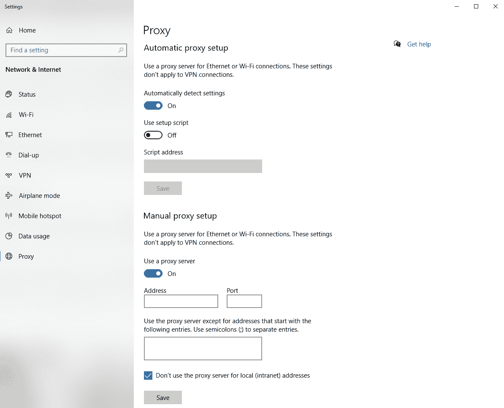
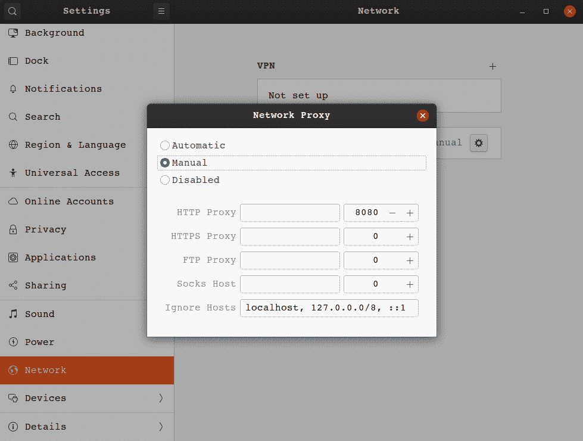

# 什么是代理服务器？请用英语。

> 原文：<https://www.freecodecamp.org/news/what-is-a-proxy-server-in-english-please/>

你有没有在旅行时，在 Hulu 上看不到你平时在家看的节目？或者，您是否注意到当您连接到不同的 Wi-Fi 网络时，一些网站被阻止或您无法访问某些服务？这可能是因为代理人的存在。

## 什么是代理服务器？

代理服务器，或简称为 proxy，就像是在进入真正的网站之前，你的互联网请求被发送到另一台计算机。这是一个服务器，它接收你发出的所有信息，比如在 H&M 购买新衬衫的请求，并通过不同的 IP 地址进行路由。

这就是代理如此强大的原因。他们可以让你所有的互联网活动看起来好像是来自一个完全不同的位置。

公司出于安全和网络性能目的使用它们，个人出于隐私考虑使用它们，当使用代理服务器浏览互联网时，还有一些很酷的功能可以利用，我们将在后面讨论。

代理在物理上可以位于任何地方。您可以在您的家庭计算机上设置一个代理，也可以将一个代理部署到云中。最重要的是代理拥有您想要的功能所需的配置。

请记住，代理就像一个奇特的 IP 地址过滤器。与过滤器类似，有不同种类的代理，它们都有自己特定的用途。

首先，让我们谈谈最常见的代理类型及其工作原理，即[转发代理](https://developer.mozilla.org/en-US/docs/Web/HTTP/Proxy_servers_and_tunneling)。

## 代理如何工作

当你听到或看到人们谈论代理时，他们很可能指的是远期代理。这些是最常见的代理类型，因为它们很容易处理大多数人需要的东西。转发代理充当您的请求和您试图连接的服务器之间的中间人。

代理的工作方式是，首先你提出一个请求，比如你试着去 GitHub。所以你输入网址，然后回车。有了代理，你的请求会被代理拦截，而不是用你电脑的 IP 地址直接连接到 GitHub。

然后代理接受您的请求，更新它，并从它自己的 IP 地址发送它。这可以从对 GitHub 服务器的请求中完全删除您的 IP 地址和识别信息。

代理处理更改请求的方法之一是直接在发送给服务器的请求头中。代理请求可以在原始请求中设置报头，如转发的*和通过*的和*，然后将消息发送到您试图从中获取信息的服务器。*

一旦代理从您的请求中更新了信息，它会将您重新格式化的请求发送到 GitHub 服务器。该服务器现在认为您的请求来自不同的位置，它将通过该位置发送回您想要的数据。

接下来，代理从 GitHub 服务器获取数据，并按照配置对数据进行检查。它可以检查任何恶意脚本或其他安全问题。然后，它最终将数据发送回您的计算机，并加载您的页面。

代理服务器不一定一次只限于一个用户。可以有多个人通过同一个代理发送请求，他们可以分享相同的好处。有很多原因可以让你使用代理，即使是共享代理。

## 为什么你会使用代理

既然您已经知道了什么是代理，那么最好了解一下它们的一些常见用例。

*   您可以通过加密请求来提高网络安全性
    ○防止黑客拦截敏感信息
    ○从您的真实网络中阻止恶意软件站点
*   您可以通过缓存站点来降低网络流量
    ○缓存网站，这样无论代理上有多少用户，都只有一个对站点的请求
*   您可以控制人们如何使用互联网
    ○阻止特定的域
    ○监控和记录所有的网络请求
*   您可以绕过公司和国家设置的屏蔽
    ○访问来自不同国家的内容
    ○绕过公司防火墙

这并不是您可以使用代理做的所有事情的完整列表，但是我还想包括一些不属于典型类别的其他好处。

*   你总是屏蔽饼干
*   你总是屏蔽广告
*   你可以访问深层网络
*   它会删除任何搜索裁剪或跟踪您以前的搜索
*   你可以收集数据
*   你可以研究你的竞争对手

## 不同类型的代理

有许多不同类型的代理可以覆盖你能想到的任何配置。在这里，我将向您简要介绍 14 种不同的代理类型。

### 透明代理

透明代理是最简单的一种代理。他们会传递你所有的信息，但是是用代理的 IP 地址。这些代理不提供任何形式的隐私保护。

它们告诉服务器你正在发送你的请求，请求是通过一个代理来的。这足以让你绕过简单的知识产权禁令。透明代理的一个常见用途是设置网站过滤，就像学校和公司一样。

### 匿名代理

匿名代理是一种常用的代理类型。他们从不把你的 IP 地址传给你正在浏览的网站，尽管他们会在请求中将自己标识为代理。这有助于保持你的浏览活动的私密性。

当你不希望有针对性的广告跟随你在互联网上，或者你不希望你的位置附加到你的请求，这些是一些标准的代理使用。这通常足以避开大多数目标活动，但您的信息仍有可能被泄露。

### 高匿名代理

这些代理是最安全的类型，因为它们不会传递您的 IP 地址和个人数据，并且在发出请求时不会将自己标识为代理。他们也偶尔改变他们用于请求的 IP 地址。这就是允许高匿名代理给你最大的网上隐私。

TOR 浏览器使用这种类型的代理。由于 IP 地址偶尔会改变，这使得服务器很难跟踪哪些流量属于哪个客户端。如果你不想被跟踪，这是最好的选择。

### 扭曲代理

扭曲代理的工作方式类似于匿名代理，只是它传递的是一个故意为假的 IP。它将自己标识为代理，并在请求中使用该假 IP 地址。当你想让自己看起来像是在一个特定的地点时，这非常有用。

当您想要避开特定的内容限制时，这很有用。这就像你可以选择你希望代理使用的 IP 地址。

### 住宅代理

住宅代理是使用真实 IP 地址的代理。这意味着它们是真实计算机的地址。这些是最好的代理类型，因为它们看起来像服务器的常规客户端。

到目前为止讨论的任何代理类型都可以是住宅代理。只要代理的 IP 地址与物理设备相关联，这些类型的代理往往是不可检测的，并且它们避开了其他代理类型所具有的一些地理问题。

### 数据中心代理

这些是住宅代理的对立面。数据中心代理拥有计算机生成的 IP 地址，这些地址不附属于真实设备。这就像在云中有一个代理。

这种代理的一个优点是速度快。通常云服务提供商有令人难以置信的互联网连接，给你提供你无法获得的速度。尽管它们共享相似的 IP 地址，但是一台服务器可以托管数百个数据中心代理。

### 公共代理

在所有代理类型中，这些是最不安全、最不可靠的代理。它们随时都可能崩溃，许多都是黑客为了窃取数据而设置的。人们仍然使用它们的唯一原因是因为它们是免费的。

虽然找到免费公共代理列表并不困难，但找到好的列表却是一个挑战。你永远不知道这些代理服务器是由谁托管的，通过它们发送你的任何敏感信息都是一场巨大的赌博。任何数量的用户都可以在任何时候使用公共代理，没有人监管谁使用它。

### 私人代理

私有代理的定义有些模糊，因为它们是由提供服务的提供商定义的。这可能意味着您的代理一次只能由一个客户端使用，或者您的代理需要认证才能使用。这些就像公共代理的更可靠的版本。

私有代理可以是透明的或高度匿名的，类似于上面的一些其他代理，如住宅或数据中心代理。这种代理类型更多的是与谁可以连接到它，而不是它如何处理您的请求。

### 专用代理

专用代理类似于特定类型的私有代理。这只是意味着代理不能同时被多个客户端共享。所以只有一个客户端可以连接和发送请求。

这有助于防止代理的 IP 地址被不同的网站和服务禁止。这是代理提供者可以控制谁可以访问代理以确保它不被滥用的方法之一。

### 共享代理

这些是一些最便宜的代理，它们的工作方式类似于共享服务器。客户端汇集在一起，分摊代理的成本，他们可以同时访问它。共享代理具有更复杂的体系结构，因为它们同时处理大量请求。

根据共享代理上资源的分配方式，请求可能比通过您自己的 IP 地址慢。因为它处理来自多个用户的多个请求，所以这些类型的代理的配置比其他类型的更重要。

### 旋转代理

旋转代理的工作方式与其他代理略有不同。每次客户端连接到代理时，都会为其创建一个新的 IP 地址。所以他们不会多次使用同一个 IP 地址。

每次客户端发送请求时，都会生成一个新的 IP 地址。这就是像 TOR 浏览器这样的代理如何保持你的匿名性。当与一些其他类型的代理结合使用时，旋转代理提供了高级别的安全性和保密性。

### SSL 代理

这些代理遵循与 HTTPS 请求相同的协议。“S”在 HTTPS 的意思是 SSL，这意味着你的网络请求在你的客户端和你试图访问的服务器之间是安全的。

这意味着您可以获得更高的安全性，因为您通过代理的所有请求都是加密的。默认情况下，大多数代理应该使用这个，但是您仍然有可能遇到一些使用 HTTP 的代理。

### 反向代理

反向代理完全不同于我们到目前为止讨论的所有内容。反向代理隐藏您试图向其发送请求的服务器的 IP 地址。当服务器需要客户端的安全性和隐私时，这种类型的代理就出现了。

如果您需要监控对服务器的访问，例如防止客户端不受监控地访问数据库，那么这些代理非常有用。它还可以传递缓存的信息，而不是每次都进行查询，从而有助于降低网络流量。

## 代理服务

如果你快速搜索过代理服务，你就会知道有很多选择。并不是所有的特性都是一样的，所以知道你想从代理服务中得到什么特性是很重要的。

大多数这些服务提供代理类型的组合。例如，你将能够找到住宅，高度匿名，SSL 代理纳入一个服务。有几个脱颖而出，所以这里有一个列表，但请确保您研究他们，看看他们是否满足您的需求。

*   [https://smartproxy.com/](https://smartproxy.com/)
*   [https://www.megaproxy.com/](https://www.megaproxy.com/)
*   [https://whoer.net/webproxy](https://whoer.net/webproxy)
*   [https://www.proxysite.com/](https://www.proxysite.com/)
*   [https://hide.me/en/proxy](https://hide.me/en/proxy)
*   [https://www.kproxy.com/](https://www.kproxy.com/)
*   [https://www.vpnbook.com/webproxy](https://www.vpnbook.com/webproxy)

## 代理服务器与 VPN

如果你熟悉 VPN(虚拟专用网络)，那么你可能想知道代理有什么不同。主要的区别是 VPN 保护你所有的网络流量，而代理只保护你的互联网流量。

VPN 保护代理不包括 FTP 上传或下载和后台操作系统进程，如更新。

代理和 VPN 的唯一共同点是它们让你的互联网流量看起来像来自不同的 IP 地址。这是他们所有的共同点。由于它们的用途不同，它们处理的方式也大相径庭。

代理只是传递你的互联网请求，就像一个中间人。另一方面，VPN 将你所有的网络活动都传送到操作系统层。代理通常由单个应用程序使用，如浏览器或 torrenting 客户端。

公司倾向于使用 VPN 让员工访问公司资源，而不用担心流量被 ISP(互联网服务提供商)截获或记录。这些通常托管在本地某处的物理计算机上。

VPN 的伟大之处在于它隐藏了你所做的一切。如果您的 ISP 获得您的使用历史，它只会看到您连接到 VPN。你的流量不会被看到。当您连接到公共 Wi-Fi 时，VPN 是最安全的选择。

尽管使用 VPN 有很多好处，但人们仍然有充分的理由选择代理。首先，VPN 通常比代理更贵。你还需要像样的计算机硬件来运行 VPN。连接速度通常比代理要慢。

很多时候，你不一定需要 VPN 提供的那种安全性。当您只想以较低的成本在单个应用程序上屏蔽您的活动时，代理可能值得考虑。

## 收益和风险

既然您已经了解了代理的一切，下面列出了使用代理的一些好处和风险。

### 利益

*   安全和私密的互联网浏览
*   绕过地理位置限制的能力
*   更好的网络性能
*   能够控制客户端可以访问的网站
*   多种类型可供选择，以满足特定需求

### 风险

*   你的请求可能会很慢地返回
*   不是所有的代理都会加密你的请求，所以你的信息仍然有可能泄露出去
*   黑客或政府机构可以建立免费或廉价的代理
*   代理人可以随时消失
*   你所有的请求和信息总是通过任何人都可能运行的第三方

使用任何类型的代理服务器都有更多的好处和风险。这就是为什么只连接到您信任的代理服务器很重要。当您连接到受信任的代理时，在配置中应该已经考虑到了风险，因此您不必太担心。

## 如何设置简单的代理服务器

创建你自己的私人代理听起来要比实际困难得多。你可以在家里用电脑做一个代理，它和你能买到的大多数代理一样安全。只需要一些耐心和一点好奇心。

在 Linux 服务器上，您可以安装 Squid 并为您想要创建的代理设置配置。你可以阻止特定的网站，或者在客户端连接到代理服务器之前要求验证。

这里有一个在 Linux 上设置 Squid 代理的很好的演示:[https://devopscube.com/setup-and-configure-proxy-server/](https://devopscube.com/setup-and-configure-proxy-server/)

在 Windows 和 Mac 上，你可以选择使用 Python 和 [Google App Engine](https://cloud.google.com/appengine) 来制作代理服务器。你将不得不为谷歌应用引擎服务付费，但他们让它变得相当实惠。

像这样设置代理比在 Linux 上稍微复杂一点，但是这里有一个很好的演示:[https://www.hongkiat.com/blog/proxy-with-google-app-engine/](https://www.hongkiat.com/blog/proxy-with-google-app-engine/)

## 如何连接到现有代理

一旦知道了代理的信息，比如 IP 地址和端口号，连接到代理通常是一个简单的过程。不管你使用什么操作系统，代理通常很快就能建立起来。

通常你会进入你的网络设置，找到你可以输入你的代理信息。然后，您应该能够连接，如果代理包含了身份验证步骤，可能会出现一个网页。这是它在 Windows 和 Ubuntu 上的样子。

setting up a proxy server though the Windows Settings

setting up a proxy server through the Ubuntu Network Settings

## 结论

现在您已经了解了关于代理服务器的一切，从它们是什么到如何为自己创建一个代理服务器！我在我的家庭网络上设置了一个小代理，当我不在家时，它确实使一些东西更容易访问。

我也写一些科技领域的其他随机的东西，比如机器学习和虚拟现实。你应该在推特上关注我，学习一些有时很酷的东西。另外[我有一个网站](https://flippedcoding.com)，在那里你可以查看我的其他文章，观看我从当前网站到闪亮新网站的缓慢转变。