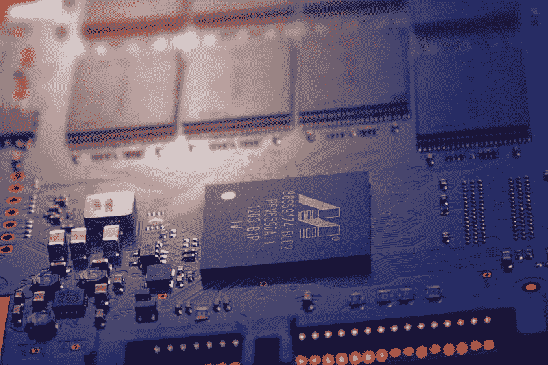

# 什么是量子计算机？用一个简单的例子来解释。

> 原文：<https://www.freecodecamp.org/news/what-is-a-quantum-computer-explained-with-a-simple-example-b8f602035365/>

作者 YK·杉

# 什么是量子计算机？用一个简单的例子来解释。

大家好！

前几天，我参观了加拿大温哥华的 D 波系统**。这是一家制造尖端量子计算机的公司。**

**我在那里学到了很多关于量子计算机的知识，所以我想在这篇文章中与你分享一些我在那里学到的东西。**

**本文的目标是通过一个简单的例子让你对量子计算机有一个准确的直觉。**

**这篇文章不需要你有量子物理学或计算机科学的先验知识来理解它。**

**好了，我们开始吧。**

*****编辑(2019 年 2 月 26 日):*** 我最近在[我的 YouTube 频道](https://www.youtube.com/csdojo)上发布了[一个关于同一话题](https://youtu.be/HdSmIUuGf-I)的视频。我建议在阅读本文之前或之后观看它([点击此处](https://youtu.be/HdSmIUuGf-I))，因为我在视频中添加了一些额外的、更微妙的论点。**

### **什么是量子计算机？**

**这里用一句话概括一下什么是量子计算机:**

> **量子计算机是一种使用量子力学的计算机，因此它可以比普通计算机更有效地执行某些类型的计算。**

**这句话里有很多东西需要解释，所以让我用一个简单的例子来告诉你到底是什么。**

**为了解释什么是量子计算机，我需要先解释一下常规(非量子)计算机。**

### **普通电脑如何储存信息**

**现在，一台普通的计算机用一系列的 0 和 1 来存储信息。**

**不同种类的信息，如数字、文本和图像都可以用这种方式表示。**

**这一系列 0 和 1 中的每一个单位称为一位。因此，一个位可以设置为 0 或 1。**

#### **那么，量子计算机呢？**

**量子计算机**不**使用比特来存储信息。相反，它使用一种叫做量子位的东西。**

**每个量子位不仅可以设置为 1 **或** 0，还可以设置为 1 **和** 0。但是这到底是什么意思呢？**

**让我用一个简单的例子来解释一下。这将是一个有些人为的例子。但是它仍然有助于理解量子计算机是如何工作的。**

### ****理解量子计算机如何工作的简单例子****

**现在，假设你正在经营一家旅行社，你需要将一群人从一个地方转移到另一个地方。**

**为了简单起见，假设您现在只需要移动 3 个人——Alice、Becky 和 Chris。**

**假设你为此预定了两辆出租车，你想知道谁上了哪辆出租车。**

**同样，假设你得到了关于谁是谁的朋友，谁是谁的敌人的信息。**

**在这里，让我们说:**

*   **爱丽丝和贝基是朋友**
*   **爱丽丝和克里斯是敌人**
*   **贝基和克里斯是敌人**

**假设您的目标是将这 3 个人分成两辆出租车，以实现以下两个目标:**

*   **最大化共享同一辆车的**对朋友**的数量**
*   **尽量减少共用同一辆车的**对敌人**的数量**

**好了，这就是这个问题的基本前提。让我们首先考虑如何使用普通计算机解决这个问题。**

#### ****用普通电脑解决这个问题****

**要用普通的非量子计算机解决这个问题，你首先需要弄清楚如何用比特存储相关信息。**

**让我们给这两辆出租车标上 1 号出租车和 0 号出租车。**

**然后，你可以用 3 位来表示谁上了哪辆车。**

**例如，我们可以将这三位设置为 **0** 、 **0** 、*和 **1** 来表示:***

*   **爱丽丝上了 0 号出租车**
*   **贝基上了 0 号出租车**
*   **克里斯上了 1 号出租车**

**既然每个人有两种选择，那么就有 2*2*2 = 8 种方法把这群人分成两辆车。**

**以下是所有可能配置的列表:**

**a | B | C
0 | 0 | 0
0 | 0 | 1
0 | 1 | 0
0 | 1 | 1
1 | 0 | 0
1 | 0 | 1
1 | 1 | 0
1 | 1 | 1**

**使用 3 位，您可以表示这些组合中的任何一个。**

#### **计算每个配置的分数**

**现在，使用普通计算机，我们如何确定哪种配置是最佳解决方案？**

**为此，让我们定义如何计算每个配置的分数。这个分数将代表每个解决方案实现我前面提到的两个目标的程度:**

*   **最大化共享同一辆车的**对朋友**的数量**
*   **尽量减少共用同一辆车的**对敌人**的数量**

**让我们简单地将我们的分数定义如下:**

**(给定配置的得分)= (#共乘一辆车的朋友对)- (#共乘一辆车的敌人对)**

**例如，假设爱丽丝、贝基和克里斯都上了 1 号出租车。用三个比特，这可以表示为 **111** 。**

**在这种情况下，只有**一对朋友**共享同一辆车——爱丽丝和贝基。**

**然而，有两个敌对的组合共用一辆车——爱丽丝和克里斯，贝基和克里斯。**

**所以，这个配置的总得分是 1-2 = -1。**

#### **解决问题**

**有了所有这些设置，我们终于可以着手解决这个问题了。**

**对于一台普通的电脑，要找到最佳配置，你需要仔细检查所有的配置，看看哪种配置得分最高。**

**因此，您可以考虑构建这样一个表:**

**a | B | C | Score
0 | 0 | 0 |-1
0 | 0 | 1 | 1<-最佳方案之一
0 | 1 | 0 |-1
0 | 1 | 1 |-1
1 | 0 | 0 |-1
1 | 0 | 1 |-1
1 | 1 | 0 | 1<-另一个最佳方案
1 | 1 | 1 | -1**

**如您所见，这里有两个正确的解— 001 和 110，都达到了 1 的分数。**

**这个问题相当简单。随着参与这个问题的人数增加，用普通的计算机很快就很难解决这个问题。**

**我们看到有 3 个人，我们需要经历 8 种可能的配置。**

**如果有 4 个人呢？在这种情况下，我们需要经历 2*2*2*2 = 16 种配置。**

**对于 n 个人，我们需要通过(2 的 n 次方)个配置来找到最佳解决方案。**

**因此，如果有 100 个人，我们需要通过:**

*   **2⁰⁰~ = 10⁰= 100 亿亿亿亿亿配置。**

**这是普通计算机根本无法解决的。**

#### **用量子计算机解决这个问题**

**我们如何用量子计算机解决这个问题？**

**为了思考这个问题，让我们回到把 3 个人分成两辆出租车的情况。**

**正如我们前面看到的，这个问题有 8 种可能的解决方案:**

**a | B | C
0 | 0 | 0
0 | 0 | 1
0 | 1 | 0
0 | 1 | 1
1 | 0 | 0
1 | 0 | 1
1 | 1 | 0
1 | 1 | 1**

**对于一台使用 3 位的普通计算机，我们一次只能表示其中一个解，例如 001。**

**然而，有了量子计算机，使用 3 个**量子位**，我们可以同时代表**所有 8 个解**。**

**关于它的确切含义还有争议，但我是这样想的。**

**首先，检查这 3 个量子位中的第一个量子位。当你把它设置为***0 和 1 时，有点像创造了两个平行世界。(是的，这很奇怪，但是就跟着这里走吧。)*****

*****在其中一个平行世界中，量子位被设定为 0。在另一个例子中，它被设置为 1。*****

*****现在，如果你把第二个量子位也设为 0 **和** 1 会怎么样？然后，这有点像创造 4 个平行世界。*****

*****在第一个世界中，两个量子位被设置为 00。第二张，他们是 01。在第三张照片中，他们是 10 岁。在第四部中，他们是 11 岁。*****

*****类似地，如果你将三个量子位都设为 0 和 1，你将会创造 8 个平行世界——000、001、010、011、100、101、110 和 111。*****

*****这是一种奇怪的思维方式，但这是解释量子位在现实世界中行为的正确方式之一。*****

*****现在，当你在这三个量子位上应用某种计算时，你实际上是同时在所有这八个平行世界中应用相同的计算。*****

*****因此，我们可以同时计算所有解决方案的得分，而不是依次遍历这些潜在的解决方案。*****

*****有了这个特殊的例子，理论上，你的量子计算机将能够在几毫秒内找到一个最佳解决方案。同样，这是我们之前看到的 001 或 110:*****

*****a | B | C | Score
0 | 0 | 0 |-1
**0 | 0 | 1 | 1<-最佳解之一**ons
0 | 1 | 0 |-1
0 | 1 | 1 |-1
1 | 0 | 0 |-1
1 | 0 | 1 |**-1****1 | 0 | 1<-另一个最佳解之所以** lution*****

*****实际上，要解决这个问题，你需要给你的量子计算机两件东西:*****

*   *****用量子位表示的所有可能的解决方案*****
*   *****将每个潜在解决方案转化为分数的函数。在这种情况下，这是计算共享同一辆车的朋友对和敌人对的数量的函数。*****

*****考虑到这两点，你的量子计算机会在几毫秒内吐出一个最好的解决方案。在这种情况下，这就是分数为 1 的 001 或 110。*****

*****现在，理论上，量子计算机每次运行时都能够找到最佳解决方案之一。*****

*****然而，在现实中，运行量子计算机时会出现错误。因此，它可能会找到第二好的解决方案、第三好的解决方案等等，而不是找到最佳解决方案。*****

*****随着问题变得越来越复杂，这些错误变得更加突出。*****

*****因此，在实践中，你可能会想在量子计算机上运行几十次或几百次相同的操作。然后从你得到的众多结果中挑选出最好的结果。*****

#### *****量子计算机如何扩展*****

*****即使有我提到的错误，量子计算机也没有普通计算机所遭受的缩放问题。*****

*****当有 3 个人我们需要分成两辆车时，我们需要在一台量子计算机上进行的运算次数是 1。这是因为量子计算机同时计算所有配置的得分。*****

*****4 人时，操作数仍为 1。*****

*****100 人的时候，操作数还是 1。只需一次操作，量子计算机就能同时计算出所有 **2 个⁰⁰** ~= **10 个⁰**=**10 亿亿亿亿亿亿个**个组态的分数。*****

*****正如我前面提到的，在实践中，最好是运行你的量子计算机几十次或几百次，并从你得到的许多结果中挑选出最好的结果。*****

*****然而，这仍然比在普通计算机上运行同样的问题，并且不得不重复同样的计算 10 亿亿亿亿次要好得多。*****

#### *****包扎*****

*****特别感谢 D-Wave Systems 的所有人耐心地向我解释了这一切。*****

*****D-Wave 最近推出了一个与量子计算机交互的云环境。*****

*****如果你是一名开发人员，并且真的想尝试使用量子计算机，这可能是最简单的方法。*****

*****它叫闰，在[https://cloud.dwavesys.com/leap](https://cloud.dwavesys.com/leap)。你可以免费使用它来解决成千上万的问题，一旦你注册，他们也有简单易懂的量子计算机入门教程。*****

*******脚注:*******

*   *****在本文中，我使用术语“常规计算机”来指代非量子计算机。但在量子计算行业，非量子计算机通常被称为经典计算机。*****