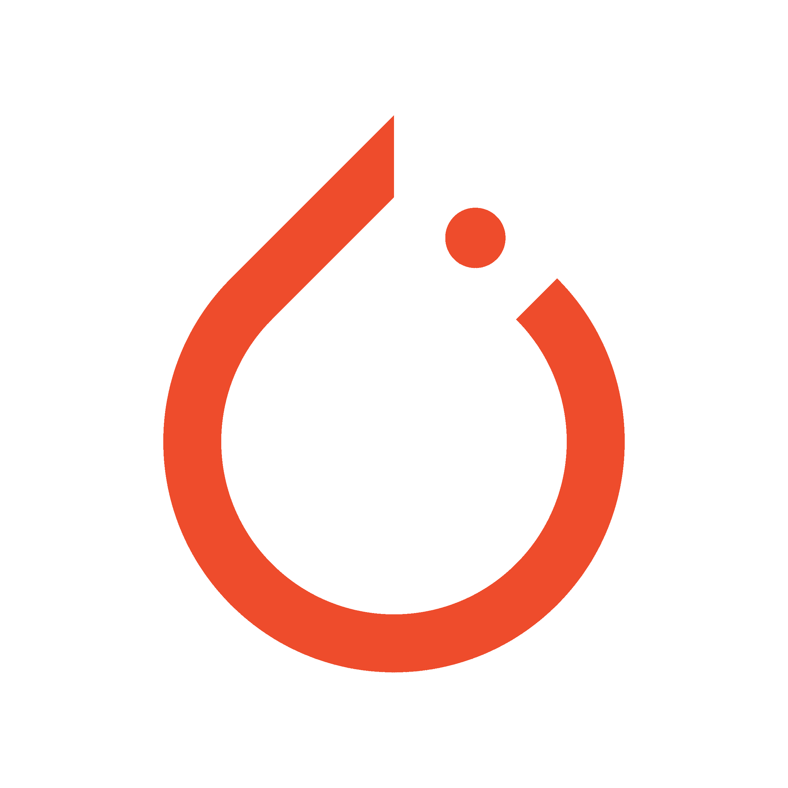
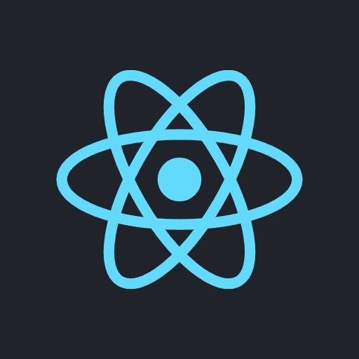
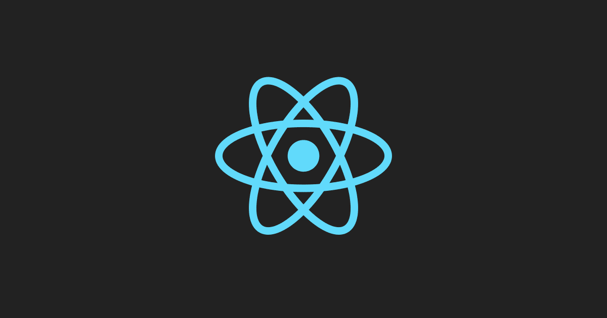

# 什么是软件框架？

> 原文：<https://www.freecodecamp.org/news/what-is-a-software-framework/>

如今，大大小小的公司都使用某种软件框架来建立自己的网站。

如果你想进入编码领域，学习和理解一些流行的框架是很重要的——不管你在行业中选择哪个领域。‌‌‌‌But 为什么？‌‌‌‌

框架可以帮助你轻松地创建新的应用程序和想法，而不需要你自己写那么多代码。

它们也有助于消除很多头痛，所以你可以把时间花在真正重要的事情上。

基本上，它们可以真正节省时间。

在本文中，我们将探索:

*   什么是框架？
*   什么是软件框架？
*   软件框架的例子
*   库和框架的区别

所以让我们开始吧！

## 什么是框架？

Photo by [**Ludvig Hedenborg**](https://www.pexels.com/@photolisious?utm_content=attributionCopyText&utm_medium=referral&utm_source=pexels) from [**Pexels**](https://www.pexels.com/photo/brown-and-black-axe-3433348/?utm_content=attributionCopyText&utm_medium=referral&utm_source=pexels)

想象一下，如果你愿意，一个叫约翰的人。

约翰需要砍倒一棵树来点燃他的壁炉，让他的家人温暖。

他走进树林，过了一段时间，他终于砍倒了一棵树。

然后，他需要把树切成小块，以便能放进他的壁炉里。

Photo by [**Ron Lach**](https://www.pexels.com/@ron-lach?utm_content=attributionCopyText&utm_medium=referral&utm_source=pexels) from [**Pexels**](https://www.pexels.com/photo/axe-stuck-in-trunk-10397927/?utm_content=attributionCopyText&utm_medium=referral&utm_source=pexels)

最后，约翰成功地砍下了合适尺寸的木头来温暖他的家人。

### 但是，如果约翰有一把电锯呢？

Photo by [**Karolina Grabowska**](https://www.pexels.com/@karolina-grabowska?utm_content=attributionCopyText&utm_medium=referral&utm_source=pexels) from [**Pexels**](https://www.pexels.com/photo/crop-lumberman-sawing-log-with-electric-power-saw-4205983/?utm_content=attributionCopyText&utm_medium=referral&utm_source=pexels)

‌If:如果他有一把电锯，工作会做得更快，而且他在为壁炉砍伐木材时会花费更少的时间和精力。

尤其是如果他需要砍倒很多树的话。

但是约翰喜欢用他的斧头，因为他说这样可以让他更好地控制他砍下的每一片木头。

用斧子他能砍小树枝，最好是劈木头。

所以，有了斧头，他可以更轻松地处理小事情。我们不需要像电锯这样的工具来做这件事。但是当我们砍伐许多大树时，使用电锯是个好主意，因为它省时省力。

这同样适用于编码。当我们编程时，我们只需要做简单的事情，最好是从头开始写我们自己的代码和/或得到一些库来帮助我们。

但是当我们需要处理许多大项目时，最好使用框架，因为项目很大，框架可以节省我们的时间。

根据类比:

*   用斧头砍树=从头开始编程
*   用电锯砍树=用框架编程

电锯让人们更容易砍树。

框架允许人们更容易地开发程序。

## 什么是软件框架？

就像链锯是一种更快更有效地工作的工具一样，软件框架也是一种“工具”，可以帮助程序员更快地工作，在更短的时间内完成更多的工作。

正如链锯有多种类型一样，软件框架也有多种类型。

### 软件框架的例子

现在我将分享在不同的编程领域如何以及在哪里使用不同的框架。

#### Web 开发框架

Web 开发框架使得与网站数据库的交互更加容易。

框架自动化了用于记录和检索用户输入数据的功能和枯燥的过程。

当你设计网站的前端时，这些框架也可以让你更容易的安排和组织元素。

Vue 是前端 web 开发框架的一个例子。

前端意味着它只是用户看到的部分——换句话说，就是 [表示层](https://www.freecodecamp.org/news/osi-model-networking-layers-explained-in-plain-english/)或 OSI 第 6 层。

作为一个 web 开发框架，Vue:

*   [能否扩展大型应用](https://vuejs.org/about/faq.html#does-vue-scale)
*   [支持打字稿](https://vuejs.org/about/faq.html#should-i-use-javascript-or-typescript-with-vue=)
*   [有自己的路由器](https://router.vuejs.org/)
*   [有一个状态管理库](https://vuex.vuejs.org/)

这是 web 开发行业中最常用的框架之一，另外两个是 T2 的 React 和 T4 的 Angular T5。

以下组织使用 Vue:

*   [向上工作](https://madewithvuejs.com/upwork)
*   [阿里巴巴](https://madewithvuejs.com/alibaba)
*   [E](https://madewithvuejs.com/euronews)[u 新闻](https://madewithvuejs.com/euronews)
*   [G](https://madewithvuejs.com/google-careers) [oogle 职业生涯](https://madewithvuejs.com/google-careers)平台

我推荐 Vue，因为我认为它比其他 web 开发框架更容易学习，如 [React](https://reactjs.org/) 和 [Angular](https://angularjs.org/) 。Vue 也越来越受欢迎。

通常，开发人员会根据他们的团队经验、他们从事的项目类型或项目的复杂性来选择他们要使用的框架。

这真的取决于你的情况。

你可以查看 [Vue 的官方网站](https://vuejs.org/)了解更多信息。

#### 机器学习框架

机器学习框架通过使在他们的程序中实现复杂的 ML 算法变得容易来帮助程序员。

你不必自己创建这些复杂的算法。已经有人帮你做了。

这使您的生活更加轻松，因为您只需获得数据集，优化要在机器学习模型中使用的数据，保存模型，然后运行您的分析。

全球最流行的机器学习框架[之一](https://www.statista.com/statistics/793840/worldwide-developer-survey-most-used-frameworks/)是 [PyTorch](https://pytorch.org/) 。

PyTorch 是基于 [torch](http://torch.ch/) 库的机器学习，由[脸书人工智能研究实验室](https://ai.facebook.com/research/)开发。

PyTorch 拥有:

*   开放式神经网络交换支持
*   混合前端
*   动态计算图形支持
*   数据并行性

PyTorch 已经用于一些很酷的项目，比如:

*   A [mazon 已经将推理成本降低了 71%,并使用 PyTorch、TorchServe 和 AWS 推理驱动了扩展。](https://pytorch.org/blog/amazon-ads-case-study/)
*   斯坦福 PyTorch 灵活高效地研究新的算法方法。
*   使用特斯拉汽车来检测交通灯、人行横道和路标...

从计算机视觉到自然语言处理应用，许多 GitHub 项目都使用这个框架。

我推荐 PyTorch，因为与其他机器学习框架相比，它很容易学习，它是用 Python 编写的，它有一个很大的社区，等等！

你也可以看看 [TensorFlow](https://www.tensorflow.org/) 和 [sci-kit-learn](https://scikit-learn.org/stable/index.html) ，因为它们也很受欢迎。

请记住，TensorFlow 和 sci-kit-learn 都是库，而不是框架。我们将在下面讨论更多的区别。

一般公司用 TensorFlow，机器学习研究者用 PyTorch。

这主要有三个原因:

*   与 TensorFlow 相比，Python 的 API 这些年来变化不大，所以几个月前的代码在 PyTorch 中几乎是一样的。在 Tensofrlow 中，可能不一样，甚至根本不运行。
*   Tensorflow API 有所变化，但文档变化不大，研究人员很难找到在线帮助。
*   大公司做的大多数研究都在 PyTorch。

所以，如果你正在阅读高级阶段的研究，你看到的大部分代码都是 PyTorch。

这有更多的原因，但这些只是一些例子。

这是 PyTorch 的网站:

[PyTorchAn open source machine learning framework that accelerates the path from research prototyping to production deployment.](https://pytorch.org/)

#### 移动开发框架

移动开发框架通过自动化许多任务给程序员带来很大帮助，否则维护项目会变得很麻烦。

例如，框架不需要使用 50 行代码来创建一个按钮或更好地导航屏幕空间，而是让您放入一些按钮代码，准备应用到您的应用程序中。

有了框架，很多工作已经为你完成了。

[React native](https://reactnative.dev/) 是一个基于 [React](https://reactjs.org/) 库的移动开发框架。

这个框架来自 React 的 web 版本。

这个移动框架是 2019 年到 2021 年全球最受欢迎的之一。

其主要特点是:

*   无缝跨平台开发
*   快速刷新
*   代码可重用性
*   改进的用户界面/UX
*   热重装

正如 PyTorch 一样，React Native 也被用于开发许多项目:

*   [Instagram](https://instagram-engineering.com/react-native-at-instagram-dd828a9a90c7)
*   [Airbnb](https://medium.com/airbnb-engineering/whats-next-for-mobile-at-airbnb-5e71618576ab)
*   [优步吃东西](https://eng.uber.com/ubereats-react-native/)
*   [Pinterest](https://medium.com/pinterest-engineering/supporting-react-native-at-pinterest-f8c2233f90e6)

我推荐 React Native，因为它基于 React。

如果你懂 JavaScript 并且反应良好，你可以很容易地开发跨平台的应用。

还有 [Flutter](https://flutter.dev/) 、 [kivy](https://kivy.org/#home) 、 [cordova](https://cordova.apache.org/) ，还有很多更多的移动开发框架。

与 React native 相比，flutter 使用 [Dart 编程语言](https://dart.dev/)，Kivy 使用 Python，Cordova 使用 HTML、CSS 和 JavaScript

有了所有这些框架，最佳选择就归结为你已经拥有的知识以及你的公司或团队对你的限制。

例如，如果你已经知道如何使用 Python，并且想开发一个小型的个人项目，也许最好的选择是 Kivy。

如果你加入一家公司，用 React 做前端工作，最好的选择可能是 React Native。

既然有很多选择，那就要看你的需求和项目了。

React Native 的网站如下:

[React Native · Learn once, write anywhereA framework for building native apps using ReactReact Native](https://reactnative.dev/)

这些只是你可以研究的三种框架。此外，请记住，有许多框架。我刚刚给你们看了一些。

## 库和框架有什么区别？

如果你是编码新手，你可能不知道库和框架之间的区别。但它们不是一回事。

库是某人为您的项目预先编写的文件集合中的代码。

比如用铲子。你可以用它来挖任何你想要的东西。

Photo by Anna Tarazevich: https://www.pexels.com/photo/a-shovel-on-brown-dirt-ground-7299923/

框架就像使用挖掘机。虽然你可以用挖掘机挖掘更多的泥土，但你只能将其用于特定的(大型)建筑项目。

Photo by Ilya: https://www.pexels.com/photo/construction-vehicles-at-work-5328418/

有了库，你就能控制代码。您可以使用该库添加新功能来帮助您的项目

有了框架，你就被它限制了。你只能在框架给你的“空间”内工作。这也有技术上的原因，你可以[在本文](https://www.freecodecamp.org/news/the-difference-between-a-framework-and-a-library-bd133054023f/)中了解更多。

### 我应该为我的项目使用框架还是库？

这取决于你的项目的复杂程度，谁或者什么团队来维护它，等等。

以此类推，想象约翰的爱好之一是木雕。

为此，他需要使用一套简单的工具来切割木头。他不能用他的斧头。

虽然它可以在项目的某个阶段有所帮助，但也可能意外地破坏项目。它不能足够精细地工作。

所以在这种情况下，最好的办法就是一切从零开始。这同样适用于编程。

如果你想做一个简单的项目，但需要使用你不知道如何创建的函数，你应该使用库。

如果你想做一个复杂的项目，其中有很多你目前不了解的东西，一个框架可能会帮助你开始。

还要记住，如果你在一家大公司工作，你可能根本不用任何框架来编写代码。这样程序员和工程师就有更多的空间去开发项目，没有任何限制。

在许多情况下，简单的编程项目对库的依赖越少越好。

总的来说，我相信你自己编写的项目越多，项目就越好。至少在大多数情况下是这样。:)

## 包扎

太好了！在本文中，您已经了解到:

*   什么是软件框架
*   3 种不同的软件框架以及如何了解它们
*   软件框架和软件库的区别