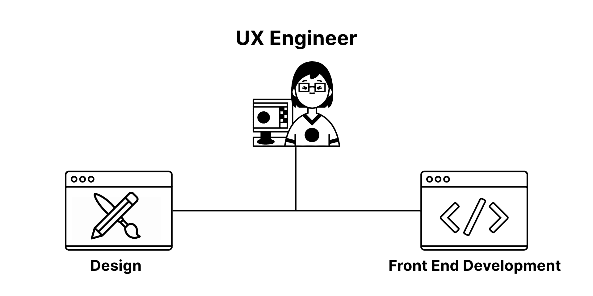

# 什么是 UX 工程师？用户体验工程师角色解释

> 原文：<https://www.freecodecamp.org/news/what-is-a-ux-engineer/>

我目前是 D2iQ 的用户体验或 UX 工程师。很多人问我 UX 工程师到底是什么。

这个问题来自设计师和开发者。所以，我想是时候写点东西来引起注意，揭开这个角色的神秘面纱了。

这篇文章将帮助你了解什么是 UX 工程师，他们的职责是什么，所需的技能，它甚至可以说服你自己成为一名工程师。

## 用户体验是什么意思？

在我们进入 UX 工程师的角色之前，让我们花一点时间来定义用户体验。

大多数人都熟悉 UI，它指的是用户界面。用户界面通常是用户与之交互的屏幕，例如网站或应用程序。

UX 涉及终端用户在使用产品或服务时的全方位体验，包括用户界面。

UX 的重要性是不可否认的。在*的用户体验团队之一*中，作者 Leah Buley 指出，

> “UX 是一股向善的力量。在一个日益科技化的世界里，设计产品时考虑到真实的人有助于我们确保科技以人性化的方式融入我们的生活。这是理性的声音，认为产品和技术可以支持甚至丰富我们的基本人性。”

## 谁是 UX 工程师？

UX 工程师(UXE)是设计和开发之间的桥梁。

Icon credit: Noun Project

### 工程师

UXE 首先是工程师，具有设计的工作知识。前端开发技能是一个先决条件。UXE 非常关心用户体验，并积极参与影响用户体验。

> “开发人员编写代码，构建系统，让体验变得真实。当一页纸上的平面概念变成一个工作的、起作用的、互动的东西时，就像创造生命一样。这是令人难以置信的回报。它还能让他们看到并理解最终用户的感受和功能。”–*一个用户体验团队*

### 设计师

未爆炸弹药在设计的概念化阶段特别有用。它们能够帮助设计师理解什么是可行的，以及需要多少工程努力才能实现。

一些 UXE 将提供原型、线框和设计模型。真正的设计工作量因公司而异。

UX 工程师在设计系统中工作是很常见的。例如，我在 D2iQ 的角色包括维护设计系统和组件库。

### 提倡者

UXE 需要对双方都有同理心，并能够倡导设计或开发。他们可能会被要求作为支持者反击任何一方。这就是为什么他们被认为是设计和开发之间的桥梁。

一名未爆炸弹药工作人员甚至可能需要在他们的组织内宣传 UX 教，以提高人们的认识，并争取对他们工作的支持。这可以通过建立一个点对点的学习社区，午餐和学习会议，以及其他分享和教育他人的方法来实现。

你可能会发现 UX 工程师的不同定义。UI 工程师、UX 工程师和设计技术专家之间的界限往往很模糊。这个角色很大程度上取决于公司以及他们想满足这个角色的什么需求。

如果你喜欢，你可以成为一名优秀的业余爱好者:

*   前端工程
*   专门使用 CSS 的样式
*   设计思维
*   偶尔展示一些设计技巧
*   参与 UX 研究
*   使用设计系统
*   创造性的余地

我们将深入探究作为一名 UXE 所需要的技能，这可能会澄清它到底需要什么。

### 前端内部的混乱

我想对 UI 工程师、UX 工程师和前端工程师之间的混淆做一个记录。这些通常被认为是相同的角色。情况可能是这样，也可能不是这样，这取决于工作描述中的内容。然而，有一些显著的差异。

UI 工程师最类似于前端工程师。从历史上看，它们并不完全相同，但两者之间的界限已经变得模糊。他们将从事构建用户界面的技术方面的工作。在 UI 上工作可以很容易地开始渗透到 UX 主题，因为它们是紧密耦合的，这可能是混乱产生的地方。

另一方面，UX 的工程师在设计方面比这两个人更前卫。UXE 是一个技术角色，本质上涉及用户的体验。他们应该考虑“用户如何与这个按钮交互？”“我如何才能完全清楚这个按钮是做什么的”，以及“我如何才能在使用这个按钮时为用户提供更好的体验？”

另一方面，UI 工程师通常会问自己如何最好地匹配设计来设计一个高效的按钮。

这当然掩盖了每个角色的深度。如果 UI 工程师有意识地去影响 UX，他们会变得更加投入。

UX 工程师的工作描述可能更符合你在设计技术专家或设计系统工程师中看到的内容。

总的来说，前端一词可以涵盖广泛的复杂主题和技能，这就是为什么我们开始看到在前端中定义更具体的角色的必要性。UX 工程师是基于此定义的最新职位之一。

## 用户体验工程师的必备技能

UXE 可能拥有的许多技能不仅限于前端开发和设计。同样，大部分角色可以由公司对角色和职责的定义来决定。

以下是一些最普遍适用且有用的关键技能。

### 技术

**前端开发。**这包括 HTML、CSS、JavaScript 的知识。你还应该知道流行的 JavaScript 库，比如 React。这可能还包括测试、调试、构建工具和依赖管理器。

CSS 专家。需要注意的是，该角色需要对 CSS 有深入的了解。这可能需要 CSS 架构或者使用 Sass 等预处理程序。有使用 CSS-in-JS 库的经验是有益的，比如样式组件和情感。

用户界面/UX 设计。这可能是设计相关技能的混合，从原型到 UX 原理再到线框。UXE 可能产生低保真度或高保真度的设计模型。有使用 Figma、Sketch 或 InVision 等设计工具的经验会有所帮助。设计系统也可以归为这一类。理解设计系统的好处，知道如何在 UI 中执行设计标准是很有价值的。

故事书。 Storybook 是帮助工程师构建、测试和显示 UI 组件的工具。使用 Storybook 需要额外的专门技术知识。如果你正在使用一个设计系统和组件库，文档可能会使用故事书。

**可达性。**要胜任这一角色，你需要了解可访问性指南。关心用户意味着包容性的设计。产品不应该限制用户类型。产品应该对所有用户负责。拥有测试和提高应用程序可访问性的技术技能将是非常有益的。

响应式设计。设计师可能只能模拟几种屏幕尺寸视图，如手机、平板电脑和桌面。你将实现那些设计。每个屏幕大小的模拟之间有差距，这将需要技术和决策技能，实现无缝过渡。这些是您将会遇到的问题类型，它们会影响用户体验。

### 较少的技术技能

**感同身受。**这是一个 UXE 的关键技能。他们需要了解用户，以改善他们的体验。这包括对理解人们思维方式的热情。深切关注你对用户体验的影响会让你在这个领域走得更远。

**沟通与协作。**uxe 需要做大量的跨职能沟通。他们可以与用户、设计者、开发者、产品所有者和利益相关者交流。他们负责设计和工程团队之间的翻译。有可能对使用书面交流技巧的文件做出贡献。这可能包括记录样式指南、组件或用户指南。

**创造力。**根据角色的设计因素，这显然是一项很好的技能。UXE 有机会找到创造性的解决方案，特别是当设计和开发需要在中间相遇的时候。

**用户体验原则和理论。**了解 UX 的心理层面将在设计决策时派上用场。学习心理启发式是必不可少的。UX 网站的[法律是这些的一个很好的概述。](https://lawsofux.com/)

## 摘要

随着设计和工程流程的成熟，需要像 UX 工程师、UX 研究员、UI/UX 设计师、UI 工程师等角色，每个人都有自己的高级技能。

通过协作，这些角色能够走到一起，为用户创造一流的体验。近年来，对这些角色的需求越来越多，尤其是随着组织内部对设计系统重要性的认识。

UX 的工程师填补了一个空白，有利于设计和开发之间的交接。随着这一角色的重要性得到进一步认可，我们将继续看到越来越多的 UX 工程角色浮出水面。

我喜欢我能够作为 UXE 日常使用的混合技能。如果你是一个有创造力的人，想要与设计团队更紧密地合作，这可能也是你的完美角色。

如果你想了解更多关于作为一名 UX 工程师的工作，请随时联系 Twitter。