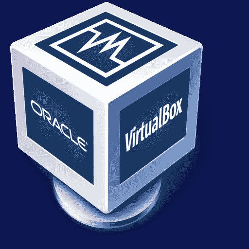
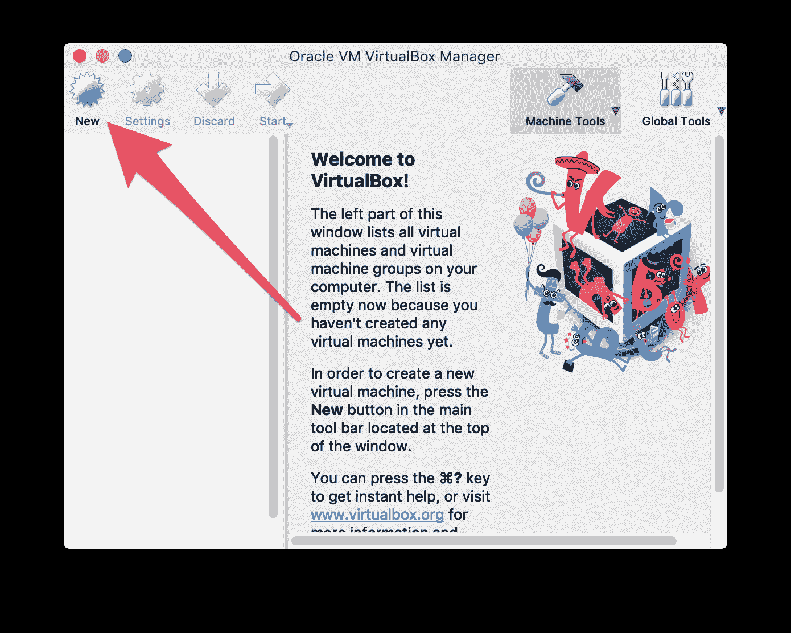
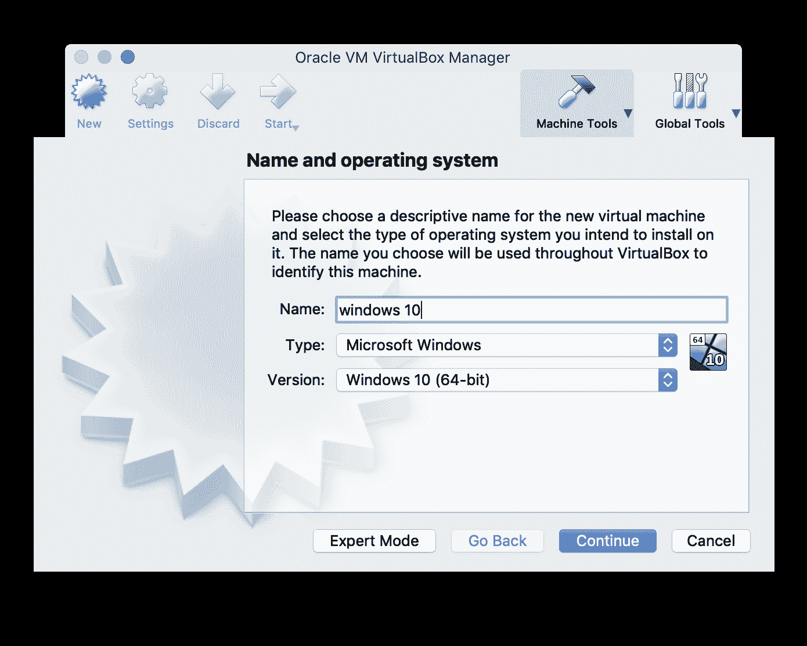
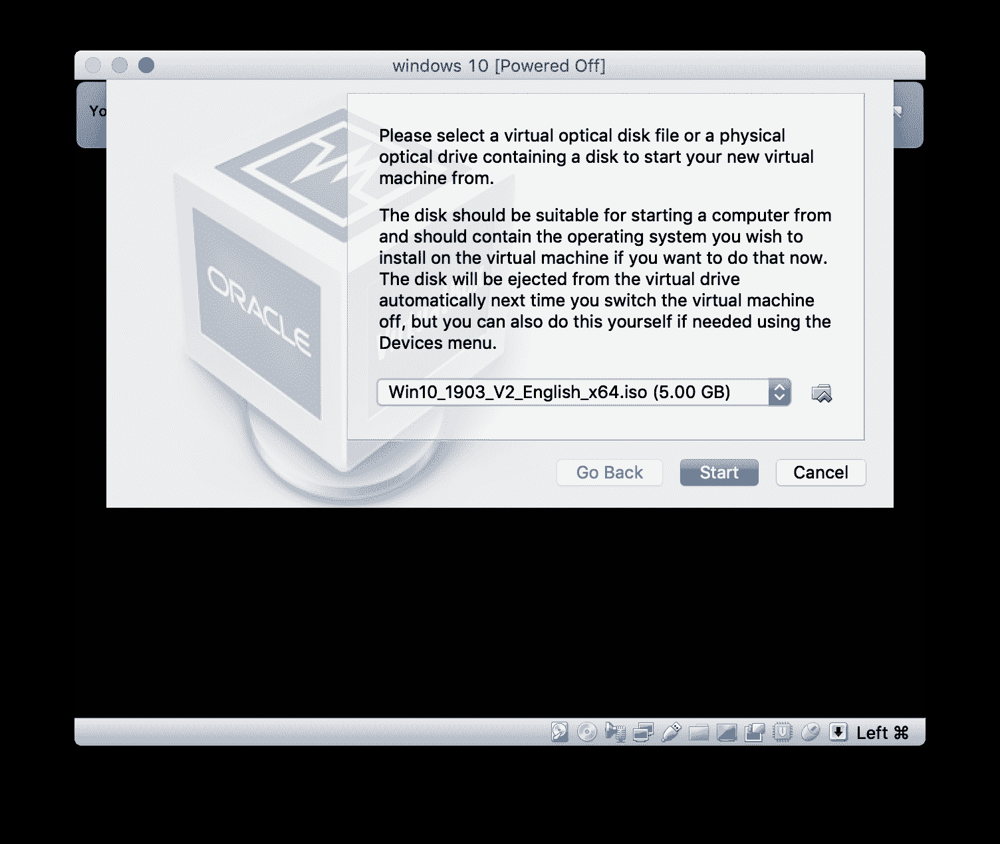
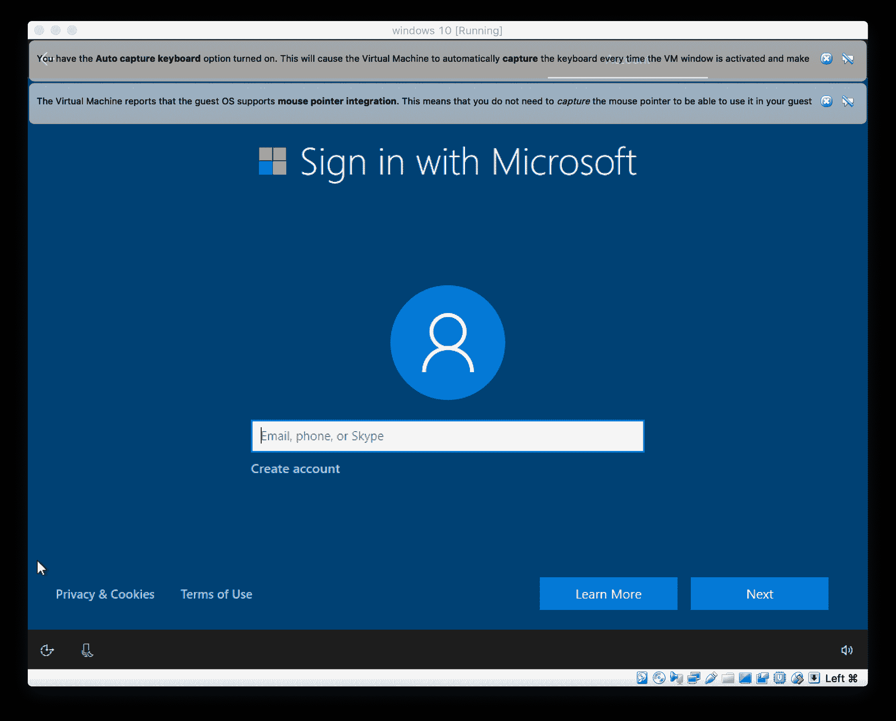

# 什么是虚拟机，以及如何在 Windows、Linux 和 Mac 上设置虚拟机

> 原文：<https://www.freecodecamp.org/news/what-is-a-virtual-machine-and-how-to-setup-a-vm-on-windows-linux-and-mac/>

虚拟机是一种在计算机上运行的程序，其行为就像是一台独立的计算机。这基本上是一种在计算机中创造计算机的方法。

虚拟机在主机上的窗口中运行，给用户带来与使用完全不同的计算机时相同的体验。虚拟机从主机计算机进入沙箱。这意味着虚拟机上运行的任何东西都不会影响主机。

虚拟机通常用于在操作系统上运行软件，而这些操作系统并不是软件的初衷。例如，如果您使用的是 Mac 电脑，您可以在 Mac 电脑上的 Windows 虚拟机中运行 Windows 程序。虚拟机还用于快速设置带有映像的软件，访问感染病毒的数据，以及测试其他操作系统。

一台物理计算机可以同时运行多个虚拟机。服务器通常会使用一个名为 hypervisor 的程序来管理同时运行的多个虚拟机。虚拟机有虚拟硬件，包括 CPU、内存、硬盘等等。每个虚拟硬件都映射到主机上的真实硬件。

虚拟机有一些缺点。由于硬件资源是间接的，它们不如物理计算机高效。此外，当许多虚拟机同时在一台计算机上运行时，性能可能会变得不稳定。

## 虚拟机程序

有许多不同的虚拟机程序可供您使用。一些选项是 VirtualBox (Windows、Linux、Mac OS X)、VMware Player (Windows、Linux)、VMware Fusion (Mac OS X)和 Parallels Desktop (Mac OS X)。

VirtualBox 是最受欢迎的虚拟机程序之一，因为它是免费的、开源的，可以在所有流行的操作系统上使用。我们将向您展示如何使用 VirtualBox 设置虚拟机。

## 设置虚拟机(VirtualBox)

VirtualBox 是来自 Oracle 的开源虚拟机程序。它允许用户在虚拟驱动器上虚拟安装许多操作系统，包括 Windows、BSD、Linux、Solaris 等。

由于 VirtualBox 运行在 Windows、Linux 和 Mac 上，因此在每个操作系统中设置虚拟机的过程几乎是相同的。

从下载安装 VirtualBox 开始。可以在这个链接下载: [VirtualBox 下载](https://www.virtualbox.org/wiki/Downloads)

您还需要下载一个。您希望在虚拟机中运行的操作系统的 iso 文件。例如，你可以下载一个 Windows 10。这里的 iso 文件:[https://www . Microsoft . com/en-us/software-download/windows 10 iso](https://www.microsoft.com/en-us/software-download/windows10ISO)

运行 VirtualBox 后，单击“新建”按钮

Create a new virtual machine.

接下来，您必须选择您计划安装的操作系统。在“名称”框中，键入要安装的操作系统的名称。VirtualBox 会根据您键入的名称猜测类型和版本，但如果需要，您可以更改这些设置。

Configure the virtual machine.

向导将根据您选择的操作系统类型和版本自动选择默认设置。在完成向导的过程中，您可以随时更改设置。只要一直点击“继续”和“创建”，直到你完成向导。使用默认值通常没问题。

接下来，通过单击“start”启动您刚刚创建的虚拟机。

Start the virtual machine.

一旦虚拟机启动，选择。您要使用的 iso 图像文件。

Install the operating system on the virtual machine.

您的虚拟机现在将加载您选择的操作系统。操作系统可能需要一些设置，但如果您将它安装在标准计算机上，它将是相同的设置。

Windows 10 is successfully running inside a virtual machine.

恭喜你！您已经在 VirtualBox 中运行了您的第一台虚拟机。