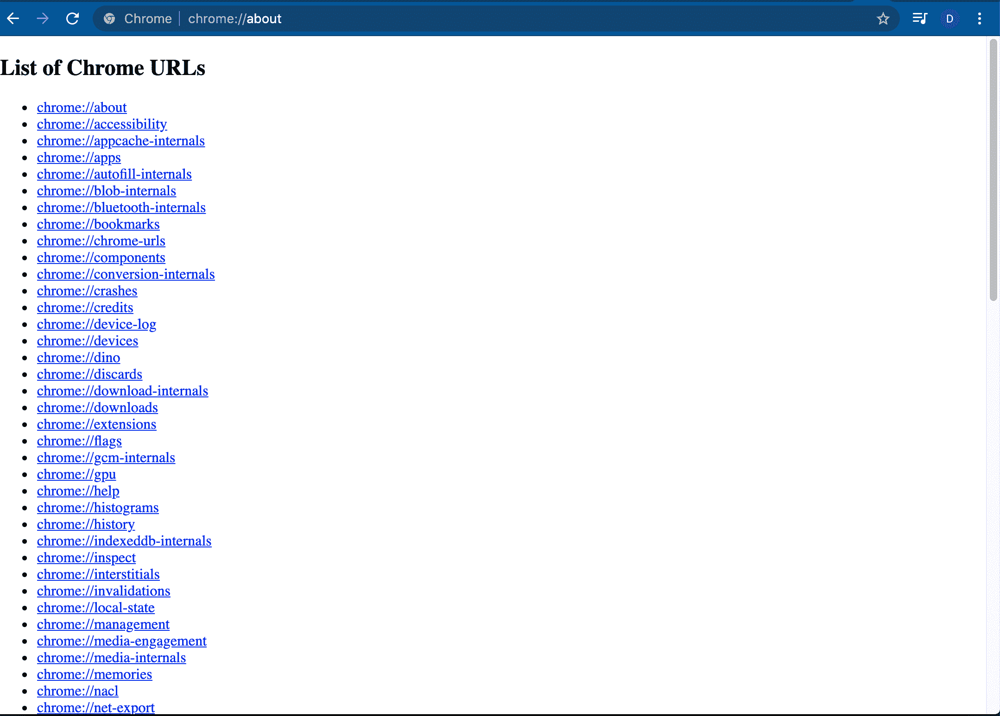
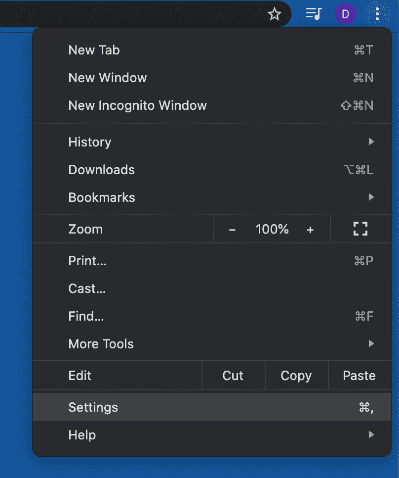
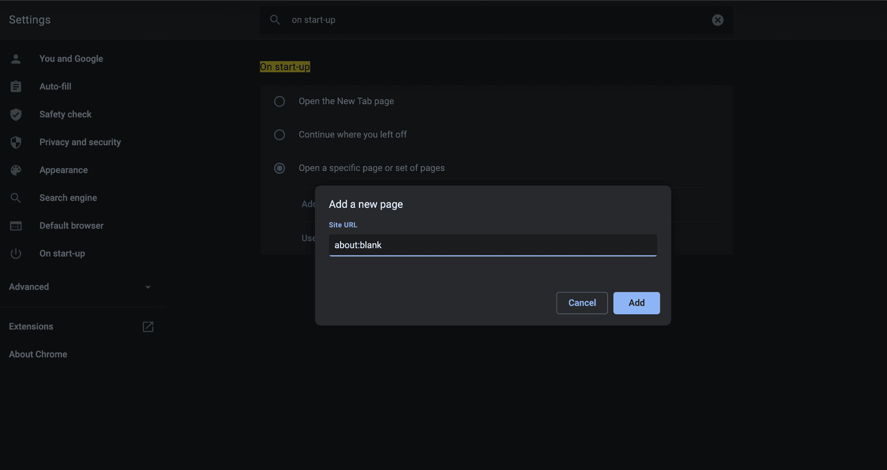

# 关于什么:空白？Chrome Blank 主页指南

> 原文：<https://www.freecodecamp.org/news/what-is-about-blank-chrome-blank-homepage-guide/>

你可能听说过 about:blank 但不明白是什么。或者当你第一次在 Chrome 浏览器中加载一个新的会话时，你会看到它出现——只是一个空白的白色页面，地址栏中显示 about:blank。

当你点击一个链接从网上下载一些东西，或者点击一个链接带你到另一个网页时，你甚至可以看到它。

你想知道为什么会出现空白吗？它到底是什么？让我们找出答案。

## 你应该担心:空白？

那么,《空白》就像它的名字所暗示的那样只是一张空白的纸，还是有比看上去更多的东西？

它有什么好处吗，或者说它是一个有用的特性吗？你应该保留它并使用它，还是应该摆脱它？

当 about:blank 出现时，人们会感到困惑并担心。他们看到一个空白页面，认为这是一个病毒——一些危险的恶意软件——或者这意味着他们的浏览器发生了一些事情。他们不明白这是什么，是什么造成的。

本文回答了以上问题。它涵盖了为什么这个页面会出现在你的浏览器 URL 字段，为什么你可能真的想保留它，如果不是，如何让它消失，并阻止它出现。

## 为什么你的浏览器显示关于:空白？

如果你看到一个地址为 about:blank 的空白页面，你确实看到了一个 Chrome 内置的空白页面。事实上，这在大多数现代网络浏览器中很常见，如 Mozilla Firefox、Apple Safari、Microsoft Edge、Internet Explorer 等。

当浏览器没有其他内容可显示时，默认情况下会加载此页面。

当用户第一次打开浏览器时没有指定要加载的特定网页，浏览器本身不知道要显示什么，所以它选择显示内置的特殊空白页面。

浏览器总是要显示一些东西，即使是空白的。

### 是关于:空白 a 病毒？

就其本身而言:空白不是恶意软件。它是无辜的。

总的来说，你不需要为此担心。

在一些非常罕见的情况下，空白可能是病毒的症状。

它可以表明您的计算机已经检测到一些危险的东西，并在遇到不良链接/URL 时阻止病毒/恶意软件。

它也可能在您删除恶意软件后出现。经过这样一个过程，浏览器就不知道要执行什么动作了。

在任何情况下，如果您担心您的计算机有病毒，最好进行调查并使用您选择的反恶意软件程序进行扫描。

## 关于什么:空白？

如前所述，这只是内置在浏览器中的一个页面。

那不是网页，那是来自互联网的页面。只不过是你的浏览器出现了一个黑屏。

具体来说，它是由各种不同的浏览器实现的“关于”URI 方案的一部分。

“关于”URI 方案是命名约定的一部分，它告诉浏览器显示其内部的内置页面。

除了 about:blank，还有一个很长的 Chrome 网址列表，包括下面的一些:

*   关于:下载查看 Chrome 的下载列表
*   关于:书签，查看您保存的书签
*   关于:可访问性显示浏览器中打开的每个选项卡的可访问性信息
*   关于:应用程序查看 Chrome 浏览器自带的应用程序和用户安装的应用程序

如果你输入 about:about，你就可以浏览所有的内容:

## 关于的好处:空白

这个页面是许多用户最喜欢的主页选择。这确保了他们的浏览器在第一次打开时会显示一个空白页面。

它使得主页速度惊人，因为它启动浏览器真的很快。浏览器不会因为在互联网上发出页面请求并等待响应而浪费时间。

因此，如果您的互联网连接速度较慢并且带宽有限，这可以帮助您减少数据使用量。您可以节省计算机和网络资源。

默认的空白页也可以帮助你保持专注，不会分心。你可以专注于搜索和访问你想看的网页。

## 如何着手:空白作为你的主页

如果您想让 about:blank 成为默认起始页，您需要配置浏览器的设置。

进入设置菜单，选择“设置”:

(你甚至可以键入:settings！)

*   在搜索栏中输入“启动”。
*   选择“打开特定页面或一组页面”。
*   点击“添加新页面”，输入“关于:空白”
    
*   最后，按“添加”

当你打开一个新标签，你会看到一个空白的页面。

## 如何停止显示:空白

这个页面不是你可以“摆脱”的东西，因为它是你浏览器内置的一个功能，它会一直在那里，在引擎盖下。

如果你的浏览器总是打开一个空白页，而你不喜欢它，你可以阻止它发生。它可能被设置为默认主页，您需要更改您的设置。

按照上一节提到的步骤，从“打开特定页面或一组页面”选项中删除“关于:空白”并选择您喜欢的网页。或者您可以选择“打开新标签页”。

## 结论

总的来说，about:blank 是一个安全的特性，不应该引起任何问题。

如果你不喜欢在打开浏览器时看到它，你可以在设置中更改它。