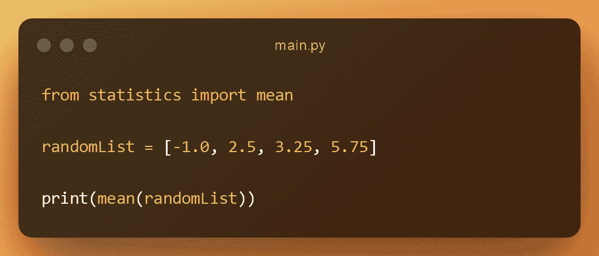
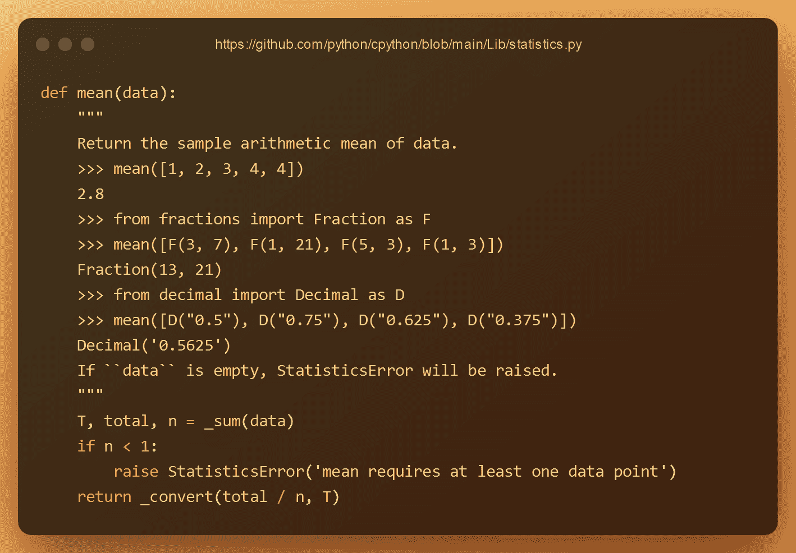
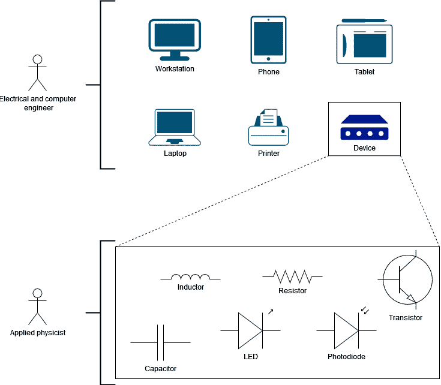
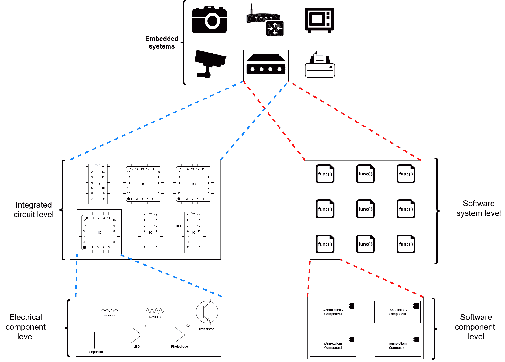

# 什么是编程中的抽象——为什么它有用？

> 原文：<https://www.freecodecamp.org/news/what-is-abstraction-in-programming/>

您知道抽象是任何软件工程师都应该知道的最重要的概念之一吗？

没错！

如果在开发新技术和新概念时不使用抽象，我们永远也不可能发明出大多数软件，甚至大多数东西。

所以，理解这个概念对于软件开发来说非常重要。

## 什么是编程中的抽象？

你已经在很多方面使用了抽象，但是你可能并不知道。

抽象思维是人类在很多领域都会做的事情之一:

*   哲学
*   艺术
*   数学
*   计算机科学
*   还有更多……

但它到底是什么？在本文中，您将了解到所有相关内容。

## 我们将涵盖的内容:

1.  抽象类比
2.  抽象的 Python 例子
3.  通用电子学抽象的例子
4.  嵌入式系统抽象的例子
5.  为什么理解抽象有用？

## 抽象类比


Photo by Torsten Dettlaff from Pexels: https://www.pexels.com/photo/black-coupes-70912/

假设你在驾校考驾照。

在学校里，你会学到汽车的主要部件是如何工作的:

*   刹车
*   传动装置ˌ[机]变速器
*   悬架系统
*   电池

你不需要在技术层面上理解每个组件来学习如何驾驶。

你只需要在脑海中想象一下当你踩下刹车时刹车是怎么做的。或者当你换挡的时候变速器里会发生什么...诸如此类。

你只需要一个你正在使用的组件的基本心理表征。

这意味着你只需要一个汽车组件的抽象。

我们使用抽象来学习和使用事物无处不在:

*   你不需要知道汽车的内部零件来驾驶它。但是了解它们的工作原理可以让你成为一名更好的司机。
*   你不需要了解自行车的内部零件就能知道如何骑自行车。但是知道这是如何运作的可以让你成为更好的骑手。
*   你不需要在编程中了解函数或框架的内部来使用它。但是知道这些东西是如何工作的可以让你成为一个更好的程序员。

## 抽象的 Python 例子


这是用 Python 写的代码。我们只是使用打印功能在屏幕上输出文本“Hello world”。

要做到这一点，你只需要知道如何使用打印功能。

你不需要理解它在引擎盖下是如何工作的。

但是，有时了解某个功能在后台是如何工作的，以便更有效地使用它，这是有好处的。

通过了解它的工作原理:

*   通过理解别人的代码，你会成为一名更好的程序员
*   你会更容易理解你使用的任何库中的错误
*   您可以从另一个项目中复制所需的代码，而不是导入整个库。依赖关系越少的项目越容易管理

例如，假设您想要使用 [Python 统计模块](https://docs.python.org/3/library/statistics.html)，这是 Python 中的一个内置模块。这意味着 Python 的库中已经有了这个模块。

不需要[用 PIP](https://www.freecodecamp.org/news/how-to-use-pip-install-in-python/) 导入。

假设我想使用[均值函数](https://docs.python.org/3/library/statistics.html#statistics.mean):

```
from statistics import mean 

randomList = [-1.0, 2.5, 3.25, 5.75]

print(mean(randomList))
```

main.py



如果没有数据，将引发 [Statistics.error](https://docs.python.org/3/library/statistics.html#statistics.StatisticsError) 。

这将打印出 2，625。

但是内部是如何工作的呢？

如果你去[https://github . com/python/cpython/blob/main/Lib/statistics . py](https://github.com/python/cpython/blob/main/Lib/statistics.py)，你会在第 414 行找到均值函数的代码:

```
def mean(data):
    """
    Return the sample arithmetic mean of data.
    >>> mean([1, 2, 3, 4, 4])
    2.8
    >>> from fractions import Fraction as F
    >>> mean([F(3, 7), F(1, 21), F(5, 3), F(1, 3)])
    Fraction(13, 21)
    >>> from decimal import Decimal as D
    >>> mean([D("0.5"), D("0.75"), D("0.625"), D("0.375")])
    Decimal('0.5625')
    If ``data`` is empty, StatisticsError will be raised.
    """
    T, total, n = _sum(data)
    if n < 1:
        raise StatisticsError('mean requires at least one data point')
    return _convert(total / n, T) 
```



这是当您使用 Python 提供的内置统计模块时运行的内部代码。

## 通用电子学抽象的例子

任何嵌入式系统或电子设备都需要电路。

电路由许多电线和元件组成。电子工程师设计这些设备。

在任何电气工程或相关项目中，大学生不仅要学习如何设计电路，还要学习构成电路的每个元件背后的实际物理原理。

大学毕业后，许多电气工程师在小电路上工作，为计算器、微波炉、打印机和其他设备开发电子产品。

当电气工程师在制造电路时，谁在制造元件呢？

嗯，一些电气工程师、材料工程师、应用物理学家等等。

在这个例子中，我们将使用应用物理学家——应用物理来解决技术难题的科学家。

一些应用物理学家专注于电路元件的研究和创造。

一些应用物理学家致力于开发将成为电路基础的材料，如:

*   发光二极管的
*   液晶显示器
*   电容器
*   光敏电阻器

电气工程师用这些元件开发电路和电子应用。

他们不像应用物理学那样关心这些成分的组成。

他们关心的是用这些材料解决电子产品的问题。

那是抽象！

应用物理学家关注的是抽象层次，在这个层次上，组件是用什么材料、用什么时间创建的...

电气工程师关注的是抽象层次，在这个层次上，组件被用来创建电路和设备。



***What each professional works in?***

## 嵌入式系统抽象的例子

嵌入式系统工程师(创建具有专用功能的小型计算机系统的工程师，如烤面包机、科学计算器、鼠标、键盘等)需要知道如何在硬件附近编码。

要做到这一点，他们需要很好地理解 C 和汇编语言，因为它们彼此密切相关。

例如，在关键嵌入式系统(处理数据和事件的实时应用程序，具有严格定义的时间限制)中，如:

*   医疗设备
*   飞机控制系统
*   导弹制导系统

工程师需要能够理解 C 代码和汇编。当纯汇编比编译的 C 代码运行得更好时，汇编通常用在非常特殊的函数中。



***Example of different levels of abstraction***

每个盒子都是不同层次的抽象。

应用物理学家、材料工程师和一些电气工程师制造和研究这些电气元件。

这些软件组件(函数、类)由嵌入式系统程序员使用和创建。

## 为什么理解抽象有用？

理解抽象将使你能够理解什么时候你需要知道一些技术上的东西或者仅仅是如何使用它。

理解抽象的另一个原因是当你开始学习工作领域之外的框架时。

当你第一次学习一个框架时，你学习如何使用它。当你学习框架如何工作时，你开始理解它的局限性。

因此，您将了解类和函数实际上是如何编写的。

通过深入了解库、框架和编程的其他方面，您将能够创建自己的库和框架。

这样，你将能够在你的职业生涯中进步，你甚至可以解决一些困难的工作问题。

减少项目中的依赖性是理解抽象的另一个原因。

当您使用外部库中的一些函数时，您可以看到代码是如何编写的，只需添加您自己的函数或类。

这样，您的项目具有较少的依赖性。这使得人们更容易运行您的代码，而不必安装其他依赖项。

## 包扎

感谢阅读！现在你知道了:

*   什么是抽象
*   三个抽象示例:Python、通用电子和嵌入式系统
*   为什么理解抽象是有用的